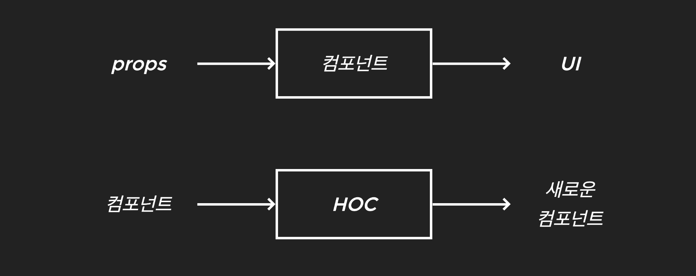

## 상태를 가지고 있는 엘리먼트

- input
- select
- textarea
  ...
  이 있다.

input 태그에 상태가 어디에 있나? value값이 어떻게 변하는지 상태를 가지고 있다. 특정 상태가 있다. (유저의 행동에 의해서 바뀐다.)

상태를 가지고 있는 특정 엘리먼트와 그 엘리먼트를 가지고 있는 컴포넌트의 관계가 Controlled && Uncontrolled 관계이다.

엘리먼트의 상태를 누가 관리하느냐?

- 엘리먼트를 가지고 잇는 컴포넌트가 관리: Controlled
- 엘리먼트의 상태를 관리하지 않고 엘리먼트의 참조만 컴포넌트가 소유: Uncontrolled

## Controlled Component && Uncontrolled Component

<input type="text"/>이 아이와 이 input에 갖고 있는 컴포넌트간사이의 관계이다.

만약 타이핑한걸 컴포넌트가 관리하는 걸 Controlled Component이고

어떤 특정 상태일때 얻어오고 싶을 때 (signin button)을 눌렸을때 현재 input태그 값을 가지고 쓰겠다가 Uncontrolled Component 이다.

만약 클래스에 초기값을 설정하면 렌더되면서 input에 value에 this.state.email 을 넣고 콘솔로 가면 onChange가 없다고 에러가 발생한다. 그러면 onChange를 써야한다.

## HOC

Higher- Order Components

react에서 과거에 한창 밀었던 스타일이다.

여러분의 컴포넌트를 재사용하는게 아니라 컴포넌트의 로직을 재사용 한다는 거다. 꺼꾸로 생각하면 A 컴포넌트를 작성하고 B 컴포넌트를 작성했는데 A를 복사해서 B로 논다음에 간단하게 고치고 있다 이게 뭐냐면 컴포넌트 로직이 비슷한데 이미지만 좀 다른 그런 케이스를 이야기 한다. 

그래서 이게 컴포넌트 로직을 동작을 비슷하지만 모습은 다를때 생각해 볼만한 테크닉이다.(좀 어려운 기술)

리엑트의 API를 사용하는 것이 아니다. 리엑트의 API랑 전혀 상관없다.

리엑트의 컴포지셔널한 본성이다. 그 것을 더욱 발전시키는 형태의 패턴이다. 

컴포지셔널한게 아닌건 빼빼로르 받고 빼빼로를 까고 빼뺴로의 초콜랫만 다 먹고 막대기만 남긴다. 그걸 다 모으고 다시 나한테 준다.

컴포지셔널한 방법은 빼뺴로를 받고 빼뺴로랑 몽쉘이랑 다른 선물 세트를 만들어서 다시 나한테 준다. 

컴포넌트를 받아서 다른 기능을 붙여서 선물 세트처럼 다시 준다. (그대로 보존한다. 내 구상의 조합으로 사용함) 이런 걸 리엑트에서 강조한다. 

Input 창에다가 색칠해서 email을 사용하기 위한 input창을 나한테 준다. 얘를 가지고 로그인 창을 만들 것이다. 나의 한 구성으로 쓰이는 것이다. 

인풋창을 받아서 파란색으로 바꾸고 이렇게 동작을 바꾸고 이런것은 컴포지셔널한 방법이 아니다.


만약에 버튼을 추가하고 싶다면 compositional하지 않은 방식은 컴포넌트를 상속받아서 그 안에서 버튼을 추가해서 누르면 동작을 하게 하는 거고 

compositional한 방식은 새로운 컴포넌트에다가 받은 컴포넌트를 넣고 버튼을 추가하고 돌려주면 받은 컴포넌트는 변환하지 않고 조합해서 줄 수 있다. 

즉 HOC는 <컴포넌트>를 징자로 받아 <새로운 컴포넌트> 리턴하는 함수이다.

```js
// hoc
HOC = function (컴포넌드) {
  return 새로운 컴포넌트;
}
```





대표적으로 어느 Hoc가 있을까? connect가 있다. 

이 함수는 Redux에서 사용하는 함수이고 Relay 라이브러리에서도 createFragmentContainer 함수도 있다.

내 컴포넌트에 그 로직을 공통적으로 적용하고 싶은게 우리의 이유이다. 그래서 라이브러리를 쓰는 것이다. 로직이 담겨 잇는 Hoc들은 컴포넌트에 연결시켜주는 hoc의 함수를 모두 가지고 있다. 

우리는 이미 알고 있다. withRouter이다. withRouter함수를 쓰면 props를 담아서 준다. 

```js
import React from "react";
import { withRouter } from "react-router-dom";

const LoginButton = props => {
  console.log(props);
  function login() {
    setTimeout(() => {
      props.history.push("/");
    }, 1000);
  }
  return <button onClick={login}>로그인하기</button>;
};

export default withRouter(LoginButton);
```

Props.history.push를 해서 라우팅을 바꿔주는 역할을 했었는데 원레는 page의 역할을 하는 route에 달려있는 컴포넌트만 라우트만 직접 프롭스로 history match location을 찔려 넣어 주었다. 그 밑에 줄려면 직접 프롭스를 찔려 넣어 주었다. 이 버튼이 만약에 page컴포넌트에 있는게 아니라 다른 컴포넌트에 만약에 갖고 잇는 로그인 버튼이 아이가 프롭스를 계속 전달해야하는 불필요한 상황이 일어난다.

그래서 withRouter함수를 LoginButton을 받아들이면 그 결과가 새로운 컴포넌트가 된다. 

export default한 아이는 LoginButton한 아이가 아니다

