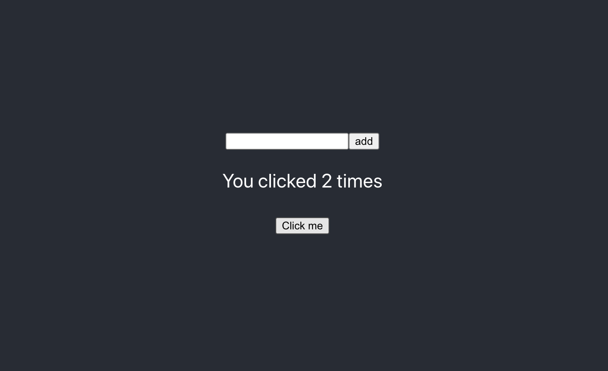
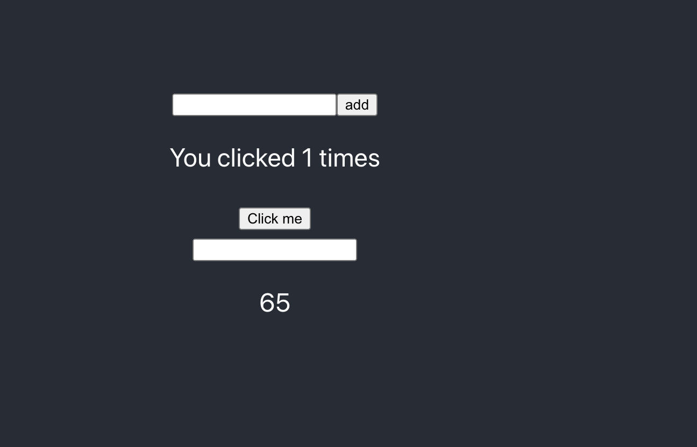
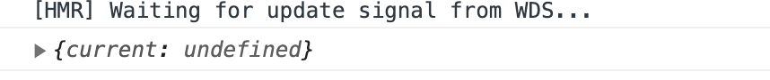
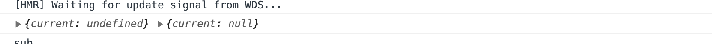
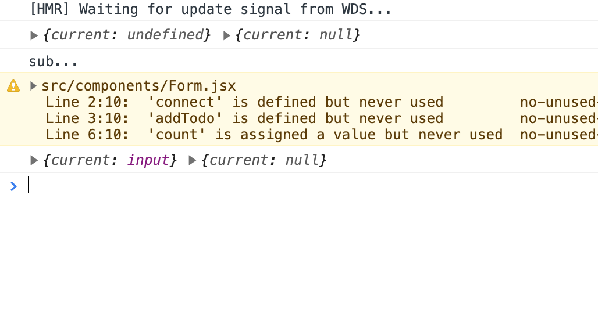

## Hooks & Context

Hooks NEW in React 16.8
컴포넌트 간 통신
Context API

## Basic Hooks

1. useState: 보통 class 컴포넌트에서 state를 쓰는 것 처럼 function 컴포넌트에서 쓸려고 나온 것
2. useEffect: 보통 함수에서는 라이프스타일을 사용할 수 없다. componentDidMount, componentDidUpdate를 처리할 수 없기 때문에 나온 것이다.
   하지만 100% 맞는 말이 아니다.

깊이 있게 사용하는 것은 어렵다.

react-create-app 을해서 새로운 프로젝트를 만들자.

컴포넌트 폴더를 만들고 Example1.jsx 컴포넌트를 만들자.

class로 만드는 컴포넌트를 만들자.

Example1.jsx

```react
import React from 'react';

export default class Example1 extends React.Component {
  state = {
    count: 0,
  }
  render() {
    const {count} = this.state
    return (
      <div>
        <p>You clicked {count} times</p>
        <button onClick={this.click}>Click me</button>
      </div>
    )
  }
  click = () => {
    this.setState({count} => ({count: count + 1}));
  }
}
```

App.js

```react
function App() {
	return <Example1 />;
}
```

추가한다.
이렇게 만든다.

함수 컴포넌트를 만들기 위해 Example2.jsx 를 만들자.

```react
import { useState } from "react";

export default function Example2() {
	const [count, setCount] = useState(0);

	return (
		<div>
			<p>You clicked {count} times</p>
			<button onClick={this.click}>Click me</button>
		</div>
	);
	function click() {
		// setState => 두 번째 배열 요소
		setCount(count + 1);
	}
}
```

App.js

```react
function App() {
	return (
		<>
			<Example1 />;
			<Example2 />;
		</>
	);
}
```

setCount가 불리면 어떻게 되냐? 새로운 count값을 바꾸고 그 count로 렌더를 다시 한다.
그래서 useState를 사용하면 setState처럼 사용할 수 있다.

그리고 useState는 배열로 준것이다. 왜 그러나? 그것은 이름을 자유롭게 쓰려고 배열상태로 준다.
그래서 여러개의 useState를 사용할 수 있다.

그런데 이렇게 단일 요소 하나만 관리하지 않고 객체로 관리를 하는 방법이 있다.

다시 새로운 Newfile 해서 Example3.jsx를 만들자.

```react
import { useState } from "react";

// state = { count: 0 }
export default function Example3() {
	const [state, setState] = useState({ count: 0 });

	return (
		<div>
			<p>You clicked {state.count} times</p>
			<button onClick={this.click}>Click me</button>
		</div>
	);
	function click() {
		// setState => 두 번째 배열 요소
		// setState({ count: state.count + 1 }); // 이렇게 도 사용할 수 있고 함수로도 사용가능하다.
		setState(({ count }) => ({ count: state.count + 1 }));
	}
}
```

```react
function App() {
	return (
		<>
			<Example1 />;
			<Example2 />;
			<Example3 />
		</>
	);
}
```

이런 식으로 만든다.

setState를 함수로 넣는 이유는 {count: state.count + 1} 이렇게 하지 않고 함수는 현재 state값을 가지고 그걸 조작해서 뭔가 데이터를 뭔가 조작해서 보통 함수를 넣는다.
static한 값이 바뀔 때는 객체로 넣는게 문법적으로 맞다.

const [스테이트 값, 스테이브 변경 함수] = useState(스테이트 초기값);

기존까지는 함수 컴포넌트라고 하면 Stateless Component 라고 했었다. 그래서 실제로 Stateless Functional Component (SFC)라고 이름이 불려 졌지만
훅이 나오고 나서 Functional Component(FC)가 되었다. 즉 Stateless 가 아니라 State를 사용할 수 있는 함수인 것이다.

왜 이런 일을 하나?

- 컴포넌트 사이에서 상태와 관련된 로직을 재사용하기 어려웠다. 기존에 클래스를 사용했던 상태만 따로 빼서 이식시키기 어려웠다.
- 컨테이너 방식 말고 상태와 관련된 로직
- 복잡한 컴포넌트들은 이해하기 어렵다.
- class는 사람과 기계를 혼동시킨디ㅏ.(컴파일 단계에서 코드를 최적화 하기 어렵게 만든다.)
- this.state 는 로직에서 레퍼런스를 공유하기 때문에 문제가 발생할 수 있다. (제일 중요)

지금 훅을 사용했던 코드는 count가 결국은 const이다. 그래서 이 코드가 의미하는 것은 사실은 count가 0일때는 항상 return 값이 되는 거고 새로 바뀌면 바뀐 count로 렌더를 다시 하는 것이다.

Example1에서 클래스에서 보면 this.state는 결국에는 이전상태에서도 state가 있고 바뀐 상태에서도 state가 있다. 클래스가 한번 객체화 하면은 state를 가지고 있어서 타이밍 차이가 있는 일에선 앞에상태와 뒤에 상태가 제대로 반영하지 못하는 단점이 있다.

이해가 안된다면

[useEffect관련자료](https://rinae.dev/posts/a-complete-guide-to-useeffect-ko)

```react
function Counter() {
	const [count, setCount] = useState(0);
	function handleAlertClick() {
		setTimeout(() => {
			alert("You clicked on: " + count);
		}, 3000);
	}
	return (
		<div>
			<p>You clicked {count} times</p>
			<button onClick={() => setCount(count + 1)}>Click me</button>
			<button onClick={handleAlertClick}>Show alert</button>
		</div>
	);
}
```

이 자료에서 보자. 클래스에서 만드는 카운트 버튼이 있다. 이것을 3번 누르고 show alert라는 settimeout을 걸어둔 버튼이 alert가 3초뒤에 나온다. 이것을 누르고 3초 사이에 다시 카운트를 다시 누르면 카운트가 올라간다. state가 갖고 있어서 그 이후에 값으로 뜰 뿐이고 하지만 함수 컴포넌트에서는 3번 누르고 alert를 누르고 다시 눌려도 안 바뀔 것이다.

함수는 함수기 때문에 한번 함수기 때문에 한번 실행하면 끝나는 것이다. 하지만 클래스에서의 스테이트는 객체가 만들어지면서 파괴하기 전까지 스테이트 값을 물고 있어서 그렇다.

이처럼 컨트롤 할 수 없는 상황에는 훅이 좋다인데 과연 좋은 것일까? function 컴포넌트에서 이를 5로 뛰울 수 있을까? 공유해야 할 상황에 대한 처리가 어려워진다.(물론 안되지는 않는다.) -> 일반적인 방법으로는 안된다.

- useState
- state를 대체 할 수 있지만 완벽히 같지는 않는다. 클래스 컴포넌트에서는 reference를 공유하고 함수 컴포넌트는 reference를 공유하지 않고 그 시점에 렌더를 하기 때문입니다.
- useEffect
- 라이프 사이클 훅을 대체 할 수 있다.
  - componentDidMount
  - componentDidUpdate
  - componentWillUnmount

componentDidMount, componentDidUpdate는 밑에와 같이 사용한다.

```react
import React from "react";

export default class Example4 extends React.Component {
	state = { count: 0 };
	componentDidMount() {
		console.log("componentDidMount", this.state.count);
	}

	componentDidUpdate() {
		console.log("componentDidUpdate", this.state.count);
	}

	render() {
		const { count } = this.state;
		return (
			<div>
				<p>You clicked {count} times</p>
				<button onClick={this.click}>Click me</button>
			</div>
		);
	}

	click = () => {
		this.setState({ count: this.state.count + 1 });
	};
}
```

클래스 컴포넌트에서 오버라이드 해서 사용을 한다. componentDidMount 시점에 API를 호출했었다. 이게 가장 필요한 아이이다.

useEffect를 가지고 이용해 보자.

Exampe5.jsx를 만들어 보자.

```react
import { useState } from "react";
// state = { count: 0 }
export default function Example5() {
	const [count, setCount] = useState(0);

	// 2개의 인자를 받는다. 하나는 함수
	useEffect(() => {
		console.log("componentDidMount & componentDidUpdate");
	});

	return (
		<div>
			<p>You clicked {state.count} times</p>
			<button onClick={this.click}>Click me</button>
		</div>
	);
	function click() {
		// setState => 두 번째 배열 요소
		// setState({ count: state.count + 1 }); // 이렇게 도 사용할 수 있고 함수로도 사용가능하다.
		setState(count + 1);
	}
}
```

이렇게 하면 useEffect 가 콘솔에 한번 뜬다. componentDidMount의 의미이다. 그리고 클릭을 하면 componentDidUpdate의 의미이다.
componentDidMount만 하고 싶으면

```react
import { useState } from "react";
// state = { count: 0 }
export default function Example5() {
	const [count, setCount] = useState(0);

	// 2개의 인자를 받는다. 하나는 함수 이 아이는 시점이 없다.
	useEffect(() => {
		console.log("componentDidMount & componentDidUpdate");
	}); // 시점을 지정하지 않으면 무조건 랜더 된 직후를 의미 한다.

	// 2번째 인자로 빈 배열을 넣으면 componentDidMount만 실행한다. 즉 함수는 실행되는 아이(한일?)를 의미하고 2번째 인자인 배열은 시점을 이야기 하는 것이다.(언제의 뜻?)
	useEffect(() => {
		console.log("componentDidMount");
	}, []); // 시점이 빈 배열이면 최초에 렌더 된 직후를 의미(의존성?)

	return (
		<div>
			<p>You clicked {state.count} times</p>
			<button onClick={this.click}>Click me</button>
		</div>
	);
	function click() {
		// setState => 두 번째 배열 요소
		// setState({ count: state.count + 1 }); // 이렇게 도 사용할 수 있고 함수로도 사용가능하다.
		setState(count + 1);
	}
}
```

완전히 LifeCycle이랑 다른 의미이다. 랜더가 일어난 화면에 그려진 직 후를 의미하는 건데 그게 언제 직후인지 의미하는 것을 두 번째 인자로 세분화 할 수 있다.
사실은 이것을 통해서 componentDidMount구현할 수 있지만 얘는 원레 이것을 하기위해 태어난 아이가 아니다.

그리고 componentWillUnmount를 할 것이다 즉 컴포넌트가 사라질때 componentWillUnmont가 한다.

```react
import { useState } from "react";
// state = { count: 0 }
export default function Example5() {
	const [count, setCount] = useState(0);

	// 2개의 인자를 받는다. 하나는 함수 이 아이는 시점이 없다.
	useEffect(() => {
		console.log("componentDidMount & componentDidUpdate");
	}); // 시점을 지정하지 않으면 무조건 랜더 된 직후를 의미 한다.

	// 2번째 인자로 빈 배열을 넣으면 componentDidMount만 실행한다. 즉 함수는 실행되는 아이(한일?)를 의미하고 2번째 인자인 배열은 시점을 이야기 하는 것이다.(언제의 뜻?)
	useEffect(() => {
		console.log("componentDidMount");

		return () => {
			console.log("componentWillUnmount");
		}; // 함수를 리턴을 한다. 함수를 반환하면 해당 함수는 다음 랜더를 하기 전에 실행한다.
	}, []); // 시점이 빈 배열이면 최초에 렌더 된 직후를 의미(의존성?)

	return (
		<div>
			<p>You clicked {state.count} times</p>
			<button onClick={this.click}>Click me</button>
		</div>
	);
	function click() {
		// setState => 두 번째 배열 요소
		// setState({ count: state.count + 1 }); // 이렇게 도 사용할 수 있고 함수로도 사용가능하다.
		setState(count + 1);
	}
}
```

최초로 랜더를 하면

```js
() => {
	console.log("componentDidMount");

	return () => {
		console.log("componentWillUnmount");
	};
};
```

이 함수가 호출 될 것이다. 호출한 결과를 return한 걸 들고 있는다 다음번에 위에를 실행할 렌더시점 직전에 return한 함수를 호출하고 다시

```js
() => {
	console.log("componentDidMount");

	return () => {
		console.log("componentWillUnmount");
	};
};
```

얘를 실행한다.

다시 가서 찍어도 이 시점을 다시 찍을 수 없다. 최초에 한번에만 실행되고 그 다음에는 실행이 안된다. 그 다음은 없어질때 실행한다. 없어질때도 랜더를 다시하는 것이니까

```js
import { useState } from "react";

// state = { count: 0 }
export default function Example5() {
	const [count, setCount] = useState(0);

	// 2개의 인자를 받는다. 하나는 함수 이 아이는 시점이 없다.
	useEffect(() => {
		console.log("componentDidMount & componentDidUpdate");
		return () => {
			console.log(`clean up`);
		};
	}); // 시점을 지정하지 않으면 무조건 랜더 된 직후를 의미 한다.

	// 2번째 인자로 빈 배열을 넣으면 componentDidMount만 실행한다. 즉 함수는 실행되는 아이(한일?)를 의미하고 2번째 인자인 배열은 시점을 이야기 하는 것이다.(언제의 뜻?)
	useEffect(() => {
		console.log("componentDidMount");

		return () => {
			console.log("componentWillUnmount");
		}; // 함수를 리턴을 한다. 함수를 반환하면 해당 함수는 다음 랜더를 하기 전에 실행한다.
	}, []); // 시점이 빈 배열이면 최초에 렌더 된 직후를 의미(의존성?)

	return (
		<div>
			<p>You clicked {state.count} times</p>
			<button onClick={this.click}>Click me</button>
		</div>
	);
	function click() {
		// setState => 두 번째 배열 요소
		// setState({ count: state.count + 1 }); // 이렇게 도 사용할 수 있고 함수로도 사용가능하다.
		setState(count + 1);
	}
}
```

clean up 을 해보자 click me를 누르면 count가 다시 될 것이다. 그러면 무조건

```js
// 2개의 인자를 받는다. 하나는 함수 이 아이는 시점이 없다.
useEffect(() => {
	console.log("componentDidMount & componentDidUpdate");
	return () => {
		console.log(`clean up`);
	};
}); // 시점을 지정하지 않으면 무조건 랜더 된 직후를 의미 한다.
```

얘를 실행하는데 전에 return한 함수를 가지고 있었기 때문에 그 return한 함수가 먼저 console.log(`clean up`); 실행 하고 console.log("componentDidMount & componentDidUpdate"); 될 것이다. 즉 다음번에 실행되기 전에 정리할 게 있으면 정리하려고 clean up이라는 말을 쓴다.

```js
import { useEffect, useState } from "react";

// state = { count: 0 }
export default function Example5() {
	const [count, setCount] = useState(0);
	const [name, setName] = useState("Mark");
	// 2개의 인자를 받는다. 하나는 함수 이 아이는 시점이 없다.
	useEffect(() => {
		console.log("componentDidMount & componentDidUpdate");
		return () => {
			console.log(`clean up`);
		};
	}); // 시점을 지정하지 않으면 무조건 랜더 된 직후를 의미 한다.

	// 2번째 인자로 빈 배열을 넣으면 componentDidMount만 실행한다. 즉 함수는 실행되는 아이(한일?)를 의미하고 2번째 인자인 배열은 시점을 이야기 하는 것이다.(언제의 뜻?)
	useEffect(() => {
		console.log("componentDidMount");

		return () => {
			console.log("componentWillUnmount");
		}; // 함수를 리턴을 한다. 함수를 반환하면 해당 함수는 다음 랜더를 하기 전에 실행한다.
	}, []); // 시점이 빈 배열이면 최초에 렌더 된 직후를 의미(의존성?)

	useEffect(() => {
		console.log("[name]");

		return () => {
			console.log("[name] - cleanup");
		};
	}, [name]);

	return (
		<div>
			<h2>{name}</h2>
			<p>You clicked {state.count} times</p>
			<button onClick={this.click}>Click me</button>
		</div>
	);
	function click() {
		// setState => 두 번째 배열 요소
		// setState({ count: state.count + 1 }); // 이렇게 도 사용할 수 있고 함수로도 사용가능하다.
		setState(count + 1);
	}
}
```

이러면 최초의 name이 뜰 것이다. 하지만 버튼을 눌려도 뜨지 않는다. 다시 렌더를 안하니까

```js
import { useEffect, useState } from "react";

// state = { count: 0 }
export default function Example5() {
	const [count, setCount] = useState(0);
	const [name, setName] = useState("Mark");
	// 2개의 인자를 받는다. 하나는 함수 이 아이는 시점이 없다.
	useEffect(() => {
		console.log("componentDidMount & componentDidUpdate");
		return () => {
			console.log(`clean up`);
		};
	}); // 시점을 지정하지 않으면 무조건 랜더 된 직후를 의미 한다.

	// 2번째 인자로 빈 배열을 넣으면 componentDidMount만 실행한다. 즉 함수는 실행되는 아이(한일?)를 의미하고 2번째 인자인 배열은 시점을 이야기 하는 것이다.(언제의 뜻?)
	useEffect(() => {
		console.log("componentDidMount");

		return () => {
			console.log("componentWillUnmount");
		}; // 함수를 리턴을 한다. 함수를 반환하면 해당 함수는 다음 랜더를 하기 전에 실행한다.
	}, []); // 시점이 빈 배열이면 최초에 렌더 된 직후를 의미(의존성?)

	useEffect(() => {
		console.log("[count]", count);

		return () => {
			console.log("[count] - cleanup", count);
		};
	}, [count]);

	return (
		<div>
			<h2>{name}</h2>
			<p>You clicked {state.count} times</p>
			<button onClick={this.click}>Click me</button>
		</div>
	);
	function click() {
		// setState => 두 번째 배열 요소
		// setState({ count: state.count + 1 }); // 이렇게 도 사용할 수 있고 함수로도 사용가능하다.
		setState(count + 1);
	}
}
```

하지만 count로 바꾸면 값이 바뀌면서 렌더가 다시 되니까 실행 될 것이다.

이때 한번더 누르면 [count]-cleanup 1이 찍히고 count 2가 찍 힐 것이다.

함수 컴포넌트에서 라이프사이클을 사용할 수 있다로 이해하지 말고 딱 3가지 요소를 기억하자

```js
useEffect(()=> {
	// 렌더 된 직 후에 실행
	return ... // 다시 변경이 일어났을때 cleanup이 실행된다.
} []) // 이 배열에 의해서 시점인지 기록

```

방금 했던걸 보면

첫번째 렌더링때 리엑트가 컴포넌트한테 state가 0일때의 UI를 준비하라고 하면 컴포넌트가 JSX로 리엑트한테 결과물로 주면서 useEffect안에 함수 실행하는 거 잊지 말라고 하고 리액트는 브라우저한테 말을 하고 브라우저는 응답을 한다. 그리고 화면에 그려준다. 다 그리고 나서 리액트는 useEffect를 실행한다.
다시 클릭 후 랜더링을 하면 브라우저의 클릭한 아이가 컴포넌트에서 지정한 함수로 지정하면서 setState를 1로 지정한 것을 호출할 것이다.
그러면 다시 리액트가 1로 할 거니까 컴포넌트한테 요청하고 1로 변한 jsx와 이팩트를 요청한다. 그리고 리액트가 받고 나서 브라우저에게 알려주고 다시 리액트가 useEffect를 실행 할 것이다.

## Custom Hooks (내가 만든 훅)

나만의 훅을 만들어 보자.

그래서 src에 hooks 폴더를 만들어 보자.
그리고 useWindowWidth.js파일을 만들자.

useWindowWidth.js

```js
export default function useWindowWidth() {
	const [width] = useState(window.innerWidth);

	return width;
}
```

훅의 특징은 다른 훅에서 사용할 수 있고 함수 컴포넌트에서 사용할 수 있다.
Example5.jsx로 돌아가서 만든 훅을 적용해보자.

Example5.jsx

```js
import { useEffect, useState } from "react";
import useWindowWidth from "../hooks/useWindowWidth";

// state = { count: 0 }
export default function Example5() {
	const [count, setCount] = useState(0);
	const [name, setName] = useState("Mark");

	const width = useWindowWidth();

	// 2개의 인자를 받는다. 하나는 함수 이 아이는 시점이 없다.
	useEffect(() => {
		console.log("componentDidMount & componentDidUpdate");
		return () => {
			console.log(`clean up`);
		};
	}); // 시점을 지정하지 않으면 무조건 랜더 된 직후를 의미 한다.

	// 2번째 인자로 빈 배열을 넣으면 componentDidMount만 실행한다. 즉 함수는 실행되는 아이(한일?)를 의미하고 2번째 인자인 배열은 시점을 이야기 하는 것이다.(언제의 뜻?)
	useEffect(() => {
		console.log("componentDidMount");

		return () => {
			console.log("componentWillUnmount");
		}; // 함수를 리턴을 한다. 함수를 반환하면 해당 함수는 다음 랜더를 하기 전에 실행한다.
	}, []); // 시점이 빈 배열이면 최초에 렌더 된 직후를 의미(의존성?)

	useEffect(() => {
		console.log("[count]", count);

		return () => {
			console.log("[count] - cleanup", count);
		};
	}, [count]);

	return (
		<div>
			<h2>
				{name} - {width}
			</h2>
			<p>You clicked {state.count} times</p>
			<button onClick={this.click}>Click me</button>
		</div>
	);
	function click() {
		// setState => 두 번째 배열 요소
		// setState({ count: state.count + 1 }); // 이렇게 도 사용할 수 있고 함수로도 사용가능하다.
		setState(count + 1);
	}
}
```

이렇게 하면 name 옆에 현재 가로값이 나올 것이다.
위에서 하고 싶었던 거는 가로값을 줄었다 늘렸다하면 가로 값이 화면에서 나오게 하는 훅을 만들고 싶은 거다.

그래서 다른 컴포넌트를 만들어서 해보자.
Example6.jsx 를 만들자.

```js
import { useState } from "react";
import useWindowWidth from "../hooks/useWindowWidth";

// state = { count: 0 }
export default function Example5() {
	const [count, setCount] = useState(0);
	const [name, setName] = useState("Mark");

	const width = useWindowWidth();

	return (
		<div>
			<h2>
				{name} - {width}
			</h2>
			<p>You clicked {state.count} times</p>
			<button onClick={this.click}>Click me</button>
		</div>
	);
	function click() {
		// setState => 두 번째 배열 요소
		// setState({ count: state.count + 1 }); // 이렇게 도 사용할 수 있고 함수로도 사용가능하다.
		setState(count + 1);
	}
}
```

커스텀 훅이 왜 나왔나? 상태에 대한 로직을 재사용하기 어렵다.
재사용을 위해서 따로 때어내는 행위를 하는 것이다.
useWindowWidth는 이렇게 사용할 수 있다.

```js
import { useEffect, useState } from "react";
import useWindowWidth from "../hooks/useWindowWidth";

// state = { count: 0 }
export default function Example5() {
	const [count, setCount] = useState(0);
	const [name, setName] = useState("Mark");

	const [width, setWidth] = useState(window.innderWidth);

	// 우리가 화면 크기를 줄이거나 늘릴때 알아차리는건 window객체이다. 즉 render 직후에 이벤트를 달아줘야한다.

	useEffect(() => {
		const resize = () => {
			setWidth(window.innerWidth);
		};
		window.addEventListener("resize", resize); // reference를 넣어야하기 때문에 함수를 만들어서 참조값을 갖고 있는 식별자를 넣는다.
		return () => {
			window.removeEventListener("resize", ㄱㄷ냨ㄷ);
		};
	}, []);

	return (
		<div>
			<h2>
				{name} - {width}
			</h2>
			<p>You clicked {state.count} times</p>
			<button onClick={this.click}>Click me</button>
		</div>
	);
	function click() {
		// setState => 두 번째 배열 요소
		// setState({ count: state.count + 1 }); // 이렇게 도 사용할 수 있고 함수로도 사용가능하다.
		setState(count + 1);
	}
}
```

이렇게 만들 수 있다.

```js
const [width, setWidth] = useState(window.innderWidth);

// 우리가 화면 크기를 줄이거나 늘릴때 알아차리는건 window객체이다. 즉 render 직후에 이벤트를 달아줘야한다.

useEffect(() => {
	const resize = () => {
		setWidth(window.innerWidth);
	};
	window.addEventListener("resize", resize); // reference를 넣어야하기 때문에 함수를 만들어서 참조값을 갖고 있는 식별자를 넣는다.
	return () => {
		window.removeEventListener("resize", ㄱㄷ냨ㄷ);
	};
}, []);
```

이 부분을 우리가 만든 useWindowWidth.js에 그대로 합치자

uswWindowWidth.js

```js
import { useEffect, useState } from "react";
export default function useWindowWidth() {
	const [width, setWidth] = useState(window.innderWidth);

	// 우리가 화면 크기를 줄이거나 늘릴때 알아차리는건 window객체이다. 즉 render 직후에 이벤트를 달아줘야한다.

	useEffect(() => {
		const resize = () => {
			setWidth(window.innerWidth);
		};
		window.addEventListener("resize", resize); // reference를 넣어야하기 때문에 함수를 만들어서 참조값을 갖고 있는 식별자를 넣는다.
		return () => {
			window.removeEventListener("resize", ㄱㄷ냨ㄷ);
		};
	}, []);
	return width;
}
```

이렇게 옮기고 Example6.jsx 에서

```js
import { useState } from "react";
import useWindowWidth from "../hooks/useWindowWidth";

// state = { count: 0 }
export default function Example5() {
	const [count, setCount] = useState(0);
	const [name, setName] = useState("Mark");

	const width = useWindowWidth();

	return (
		<div>
			<h2>
				{name} - {width}
			</h2>
			<p>You clicked {state.count} times</p>
			<button onClick={this.click}>Click me</button>
		</div>
	);
	function click() {
		// setState => 두 번째 배열 요소
		// setState({ count: state.count + 1 }); // 이렇게 도 사용할 수 있고 함수로도 사용가능하다.
		setState(count + 1);
	}
}
```

이렇게 간단한 윈도우의 가로값을 가져오는 훅을 만들었다.

훅은 다른 훅에서 사용하거나 함수 컴포넌트에서만 사용할 수 있다.

custom훅은 useState와 useEffect로 이루어 진다.

하나 더 만들어 보자.

hoc로 만든 withHasMounted와 훅으로 만든 useHasMounted를 만들어서 비교해 보자.

처음에는 HOC를 만들자.

폴더를 만들고 withHasMounted.js를 만들자.
그리고 hocks폴더 안에도 하나 만들자 useHasMounted.js를 하나 만들자.

withHasMounted.js

```js
import React from "react";
export default function withHasMounted(Component) {
	class C extends React.Component {
		state = {
			hasMounted: false,
		};

		render() {
			return <Component {...this.props} hasMounted={this.state.hasMounted} />;
		}
		componentDidMount() {
			this.setState({ hasMounted: true });
		}
	}

	return C;
}
```

Example6.jsx에서 써보자.

```js
import { useState } from "react";
import useWindowWidth from "../hooks/useWindowWidth";
import withHasMounted from "../hocks/withHasMounted";

function Example6(props) {
	const [count, setCount] = useState(0);
	const [name, setName] = useState("Mark");

	const width = useWindowWidth();

	return (
		<div>
			<h2>
				{name} - {width} - {props.hasMounted.toString()}
			</h2>
			<p>You clicked {state.count} times</p>
			<button onClick={this.click}>Click me</button>
		</div>
	);
	function click() {
		setState(count + 1);
	}
}
// state = { count: 0 }
export default withHasMounted(Example6);
```

이렇게 만든 아이를 훅으로 만들자.

useHasMounted.js

```js
export default function useHasMounted() {
	const [hasMounted, setHasMounted] = useState(false);

	useEffect(() => {
		setHasMounted(true);
	}, []);
	return hasMounted;
}
```

이렇게 하면 훅이 만들어 진다.

Example6.jsx

```js
import { useState } from "react";
import useWindowWidth from "../hooks/useWindowWidth";
import withHasMounted from "../hocks/withHasMounted";

function Example6(props) {
	const [count, setCount] = useState(0);
	const [name, setName] = useState("Mark");

	const width = useWindowWidth();
	const hasMounted = useHasMounted();

	return (
		<div>
			<h2>
				{name} - {width} - {props.hasMounted.toString()}
			</h2>
			<p>You clicked {state.count} times</p>
			<button onClick={this.click}>Click me</button>
		</div>
	);
	function click() {
		setState(count + 1);
	}
}
// state = { count: 0 }
export default withHasMounted(Example6);
```

이렇게 보면 차이점이 드러난다. hoc를 사용할 때마다 컴포넌트를 감싸서 하나의 컴포넌트를 만든다. 즉 많이 사용하면 컴포넌트가 계속 랩핑된다. 그래서 새로운 용어가 나왔다.
예전에 콜백 핼이라 불렸던 것 처럼 랩핑 핼이 나왔다.

이와 다르게 훅은 다르게 랩핑을 하는 일이 없이 하나의 state를 사용하는데 로직만 따로 분리를 해서 간편하게 useHasMounted에 옮겨 놓았다.
그래서 HOC를 떠나서 hooks로 오는 것이다.

> 왜 hoc보다 더 hooks를 더 선호하냐?

    HOC를 사용하면 변화되는 데이터를 프롭스로 관리하는데 그 프롭스를 위해서 계속 컴포넌트를 랩핑하는 과정이 생기는데 그 과정에서의 복잡조도 증가하고 불필요한 랩핑으로 인해서 디버깅도 힘들다.

## 컴포넌트 간 통신

컴포넌트를 많이 만들 예정이다. 컴포넌트 안에서의 로직을 만드는 것도 중요하지만 컴포넌트 간에 통신하는 것도 골머리를 아프게 된다.

### 하위 컴포넌트를 변경하기

만약 A의 버튼을 클릭해서 B안에 있는 C안에 있는 D안에 있는 E의 value를 바꾸고 싶으면

1. <A /> 컴포넌트에서 button 에 onClick이벤트를 만들고,
2. button 을 클릭하면, <A /> 의 state를 변경하여, <B />로 내려주는 props를 변경
3. <B />의 props 가 변경되면, <C />의 props에 전달
4. <C /> 의 props가 변경되면, <D />의 props로 전달
5. <D />의 props가 변경되면, <E />의 props로 전달

이렇게 주고 받고 주고 받으니 골머리를 때린다.

### 상위 컴포넌트를 변경하기

E의 button를 클릭하여 A의 p를 변경하려면

1. <A />에 함수를 만들고, 그 함수 안에 state를 변경하도록 구현, 그 변경으로 인해 p안의 내용을 변경
2. 만들어진 함수를 props에 넣어서, <B />로 전달.
3. <B />의 props의 함수를 <C />의 props로 전달
4. <C />의 porps의 함수를 <D />의 props로 전달.
5. <D />의 props의 함수를 <E />의 props 로 전달, <E />에서 클릭하면 props 로 받은 함수를 실행

```js
import React from "react";

class A extends React.Component {
	state = {
		value: "아직 안바뀜",
	};

	render() {
		// B에게 change props로 전달한다.
		console.log("A render");
		return (
			<div>
				<h3>{this.state.value}</h3>
				<B change={this.change} />
			</div>
		);
	}

	change = () => {
		this.setState({
			value: "A 의 값을 변경",
		});
	};
}

export default A;

const B = (props) => (
	<div>
		<p>여긴 B</p>
		<C {...props} />
	</div>
);

const C = (props) => (
	<div>
		<p>여긴 C</p>
		<D {...props} />
	</div>
);

const D = (props) => (
	<div>
		<p>여긴 D</p>
		<E {...props} />
	</div>
);

const E = (props) => {
	function click() {
		props.change(); // 받아서 실행을 한다.
	}
	return (
		<div>
			<p>여긴 E</p>
			<button onClick={click}>클릭</button>
		</div>
	);
};
```

E에서 받아서 실행하면 value값이 바뀌고 부모가 바뀌었으니 자식도 다시 바뀐다. 이게 계속 반복이 된다.

state는 최상단 부모한테 있어야지 컴포넌트 간에 커뮤니케이션이 활성화 된다.

관리하는데 너무 복잡해 진다.(찾기도 어렵다.)

그래서 나온게 Context API 이다. withRouter랑 비슷하다.

## Context API

Context API를 사용하면 위아래 관계에 없어도 점프할 수 있다. 그런 개념이다. 점프 할 수 있는 기능을 준다는 것만 기억하자.

데이터를 조작하거나 있는 곳은 가장 부모에서 하는 일이 모든 곳에 다 전파 되어야 하는 상황이다. 가장 부모와 해당 데이터를 변경하는 함수를 사용하는 아이가 저 멀리 어딘가 있고 저 멀리 어딘가에 있는 아이와 이 부모가 만든 메서드 데이터를 연결하는 행위가 힘들다 그래서 Context API는 가장 상위에 데이터와 그 데이터를 바꾸는 아이를 두는 것 이다.

그 아이를 다른 컨포넌트한테 주는 방법은 그 컨텍스트에서 가져와 하면 가져올 수 있다.
그래서 데이터를 Set하는 놈이 있어야 한다. (Provider) Set하는 놈은 최상단 부모이다. 최상단 부모에다가 Set을 하면 된다.
보통 ErrorBoundary 바로 밑에 있다. (Set하는 놈) 그 Set하는 놈을 프로바이더라고 한다. (주는 놈)

데이터를 GET 하는 놈

- 모든 하위 컴포넌트에서 접근 가능
- 컨슈머로 하는 방법 (컨슈머는 소비자 받아서 쓰는 놈)
  - 클래스 컴포넌트의 this.context 로 하는 방법
  - 펑셔널 컴포넌트의 useContext 로 하는 방법

사용하기 위해서 create-react-app을해서 새로운 프로젝트를 만들고 시작하자.

1단계로 컨텍스트를 생성한다.

폴더를 하나 만든다.

contexts폴더를 생성 그 안에다가 PersonContext.js를 만들자.

PersonContext.js

```js
import React from "react";

// context를 생성하는 API를 생성하자.

const PersonsContext = React.createContext(); // 이게 context이다.

//공유하기 위해 내보내자.
export default PersonContext;
```

PersonContext.Provider를 사용한다는 것이다. 이것을 어디서 사용할까?

데이터를 set하는 놈을 어디서 한다고 했죠? 그건 가장 상위 컴포넌트에 하는 것이다. (그래야 하위 컴포넌트에서 받아서 사용할 수 있기 때문에)

index.js로 가서 Provider를 감싸서 value를 설정하자.
index.js

```js
import React from "react";
import ReactDOM from "react-dom";
import "./index.css";
import App from "./App";
import reportWebVitals from "./reportWebVitals";
import PersonContext from "./contexts/PersonContext";

ReactDOM.render(
	<React.StricMode>
		<PersonContext.Provider>
			<App />
		</PersonContext.Provider>
	</React.StricMode>,
	document.getElementById("root")
);
```

위 처럼 넣어 준다. 그리고 이제 value를 setting해주자.(데이터를 setting)

```js
import React from "react";
import ReactDOM from "react-dom";
import "./index.css";
import App from "./App";
import reportWebVitals from "./reportWebVitals";
import PersonContext from "./contexts/PersonContext";

const persons = [
	{ id: 0, name: "Mark", age: 38 },
	{ id: 1, name: "Hanna", age: 27 },
];

ReactDOM.render(
	<React.StricMode>
		<PersonContext.Provider value={persons}>
			<App />
		</PersonContext.Provider>
	</React.StricMode>,
	document.getElementById("root")
);
```

이렇게 value를 넣자.
<PersonContext.Provider value={persons}> 이 부모 밑에 있는 아이들은 props를 안넣어도 value를 사용할 수 있다.

그러면 components폴더를 만들어서 Example1.jsx, Example2.jsx, Example3.jsx를 생성해 보자.

Example1.jsx

```js
import React from "react";
import PersonContext from "../contexts/PersonContext";

// 데이터를 GET하기 - 컨슈머 사용하기 class function 관계 없음

export default function Example1() {
	return (
		// 이 안에 함수를 넣자.
		<PersonContext.Consumer>
			{(value) => <p>{JSON.stringify(value)}</p>}
		</PersonContext.Consumer>
	);
}
```

이렇게 만들고 App.js 에서 가서 만들자.

App.js

```js
import Example1 from "./components/Example1";
import "./App.css";
function App() {
	return (
		<div className='App'>
			<header className='App-header'>
				<Example1 />
			</header>
		</div>
	);
}
```

이렇게 한다. 그러면 value에 대한 데이터가 화면에 나올것이다.

p태그를 ul로 바꿔 보자.

```js
import React from "react";
import PersonContext from "../contexts/PersonContext";

// 데이터를 GET하기 - 컨슈머 사용하기 class function 관계 없음

export default function Example1() {
	return (
		// 이 안에 함수를 넣자.
		<PersonContext.Consumer>
			{(value) => (
				<ul>
					{value.map((person) => (
						<li>{person.name}</li>
					))}
				</ul>
			)}
		</PersonContext.Consumer>
	);
}
```

하면 name이 화면에 나올 것이고 이걸 스타일을 적용하면 된다.

이렇게도 사용을 한다. personContext를 직접 들고오지 않고 PersonContext.Consumer를 다른 이름으로 붙어서 걔를 들고 올수 있다.

PersonContext.js 로 가서

```js
import React from "react";

// context를 생성하는 API를 생성하자.

const PersonsContext = React.createContext(); // 이게 context이다.

//공유하기 위해 내보내자.
export default PersonContext;

export const { Provider, Consumer } = PersonContext;
```

PersonContext.Provider를 않쓰고 Provider 가져다가 Provider하면 된다.

index.js

```js
import React from "react";
import ReactDOM from "react-dom";
import "./index.css";
import App from "./App";
import reportWebVitals from "./reportWebVitals";
import { Provider } from "./contexts/PersonContext";

const persons = [
	{ id: 0, name: "Mark", age: 38 },
	{ id: 1, name: "Hanna", age: 27 },
];

ReactDOM.render(
	<React.StricMode>
		<Provider value={persons}>
			<App />
		</Provider>
	</React.StricMode>,
	document.getElementById("root")
);
```

Example1.jsx

```js
import React from "react";
import { Consumer } from "../contexts/PersonContext";

// 데이터를 GET하기 - 컨슈머 사용하기 class function 관계 없음

export default function Example1() {
	return (
		<>
			<h1>Consumer 사용</h1>
			<Consumer>
				{/* 이 안에 함수를 넣자.*/}
				{(value) => (
					<ul>
						{value.map((person) => (
							<li>{person.name}</li>
						))}
					</ul>
				)}
			</Consumer>
		</>
	);
}
```

이런 식으로 사용할 수 있다.

보통 Consumer를 hoc나 훅으로 사용할 수 있다.

### 2번째 장법 class로 사용해서 get하는 방법

Example2.jsx로 가서 만들어 보자.
this.context를 사용해 보자,

Example2.jsx

```js
class Example2 extends React.Component {
	render() {
		<>
			<h1>this.context 사용</h1>
			<ul>
				{this.context.map((person) => (
					<li>{person.name}</li>
				))}
			</ul>
		</>;
	}
}

export default Example2;
```

App.js에서 2를 추가하자.

```js
import Example1 from "./components/Example1";
import Example2 from "./components/Example2";

import "./App.css";
function App() {
	return (
		<div className='App'>
			<header className='App-header'>
				<Example1 />
				<Example2 />
			</header>
		</div>
	);
}
```

이러면 Error가 발생할 것이다. this.context가 지정이 안되어 있어서 이다.
그래서 규명해 주는 방법인 첫번째가

```js
class Example2 extends React.Component {
	render() {
		<>
			<h1>this.context 사용</h1>
			<ul>
				{this.context.map((person) => (
					<li>{person.name}</li>
				))}
			</ul>
		</>;
	}
	static contextType = PersonContext; // 이렇게 규명해 준다.
}

export default Example2;
```

위 에서 문법적으로는 아래랑 똑같다.

```js
class Example2 extends React.Component {
	render() {
		<>
			<h1>this.context 사용</h1>
			<ul>
				{this.context.map((person) => (
					<li>{person.name}</li>
				))}
			</ul>
		</>;
	}
	// static contextType = PersonContext; // 이렇게 규명해 준다.
}

Example2.contextType = PersonContext;
// => 이렇게 쓰면 function 에서도 쓸 수 있다.

export default Example2;
```

이렇게 이야기 한거는 무슨 의미냐? class에서만 사용할 수 있는 방법이 아니고 class는
static contextType에 컨텍스트를 설정한다., this.context => value이다 이렇게만 쓸 수 밖에 없다.
왜냐면 1번으로도 쓸 수 있지만 결정적으로 3번째 방법은 사용할 수 없다.

Example2.contextType = PersonContext; 이렇게 쓴다는 것은 무엇이냐면 Example2에다가 contextType을 setting 한것이다. PersonContext를 set한것이다.

간과해선 안될 부분은 index.js에 Provider가 여러개일 수도 있다.(컨텍스트가 여러개 일 수도 있다.) 그 컨텍스트 중에서 Example2.contextType = PersonContext;얘는 클래스에서 하나만 쓴다는 것이다. 이렇게 쓸 필요가 없다. 함수 컨텍스트에서는 useContext를 쓰면 된다.

Exampe3번으로 가보자.
Example3은 hocks를 쓰는 방법이다. (useContext())

```js
import React from 'react';
import PersonContext from "../contexts/PersonContext";

export default function Example3() {
	const persons = useContext(PersonContext);
	return (
				<>
			<h1>useContext 사용</h1>
			<ul>
				{persons.map((person) => (
					<li>{person.name}</li>
				))}
			</ul>
		</>;
	)
}
```

즉 이 방법은 다른 context를 막 쓰더라도 상관이 없다. 이 방법이 좋은 방법이라 생각이 든다.
만약 persons에다 데이터를 추가하는 버튼을 만드려면 어떻게 해야할까? 어떤 데이터를 추가 삭제 해더라도 새로 랜더를 해야한다면 프롭아니면 스테이트다.
즉 이걸 어떻게 바꿔야 하나?

```js
import React from 'react';
import PersonContext from "../contexts/PersonContext";

export default function Example3() {
	const persons = useContext(PersonContext);
	return (
				<>
			<h1>useContext 사용</h1>
			<ul>
				{persons.map((person) => (
					<li>{person.name}</li>
				))}
			</ul>
			<button onClick={click}>추가</button>
		</button>;
		</>
	);
	function click() {

	}
}
```

index.js에서 value={이것을 객체로 넣자}

```js
import React from "react";
import ReactDOM from "react-dom";
import "./index.css";
import App from "./App";
import reportWebVitals from "./reportWebVitals";
import { Provider } from "./contexts/PersonContext";

const persons = [
	{ id: 0, name: "Mark", age: 38 },
	{ id: 1, name: "Hanna", age: 27 },
];

const add = () => {}; // 임시로 만든것

ReactDOM.render(
	<React.StricMode>
		<Provider value={{ persons, add }}>
			<App />
		</Provider>
	</React.StricMode>,
	document.getElementById("root")
);
```

이렇게 바꾸고 Example1,2,3도 바꿔야한다.

Example1.jsx

```js
import React from "react";
import { Consumer } from "../contexts/PersonContext";

// 데이터를 GET하기 - 컨슈머 사용하기 class function 관계 없음

export default function Example1() {
	return (
		<>
			<h1>Consumer 사용</h1>
			<Consumer>
				{/* 이 안에 함수를 넣자.*/}
				{({ persons }) => (
					<ul>
						{persons.map((person) => (
							<li>{person.name}</li>
						))}
					</ul>
				)}
			</Consumer>
		</>
	);
}
```

Example2.jsx

```js
class Example2 extends React.Component {
	render() {
		const { persons } = this.context;
		<>
			<h1>this.context 사용</h1>
			<ul>
				{persons.map((person) => (
					<li>{person.name}</li>
				))}
			</ul>
		</>;
	}
	// static contextType = PersonContext; // 이렇게 규명해 준다.
}

Example2.contextType = PersonContext;
// => 이렇게 쓰면 function 에서도 쓸 수 있다.

export default Example2;
```

Example3.jsx

```js
import React from 'react';
import PersonContext from "../contexts/PersonContext";

export default function Example3() {
	const {persons, add} = useContext(PersonContext);
	return (
				<>
			<h1>useContext 사용</h1>
			<ul>
				{persons.map((person) => (
					<li>{person.name}</li>
				))}
			</ul>
			<button onClick={click}>추가</button>
		</button>;
		</>
	);
	function click() {
		add();
	}
}
```

이렇게 변경을 하자. 이제 버튼을 클릭을 하면 add를 실행하자.
눌려도 아무 일도 일어나지 않는다.

다시 index.js로 가서

```js
import React from "react";
import ReactDOM from "react-dom";
import "./index.css";
import App from "./App";
import reportWebVitals from "./reportWebVitals";
import { Provider } from "./contexts/PersonContext";

const persons = [
	{ id: 0, name: "Mark", age: 38 },
	{ id: 1, name: "Hanna", age: 27 },
];

const add = () => {}; // add를 누르면 persons의 데이터가 바뀌면서 render가 다시 되도록 해야한다. 그래서 Provider를 App.js로 보내야한다.

ReactDOM.render(
	<React.StricMode>
		<Provider value={{ persons, add }}>
			<App />
		</Provider>
	</React.StricMode>,
	document.getElementById("root")
);
```

add를 누르면 persons의 데이터가 바뀌면서 render가 다시 되도록 해야한다. 이런식으로 하면 랜더를 다시 못하니 그래서 Provider를 App.js로 보내야한다.

index.js

```js
import React from "react";
import ReactDOM from "react-dom";
import "./index.css";
import App from "./App";
import reportWebVitals from "./reportWebVitals";

ReactDOM.render(
	<React.StricMode>
		<App />
	</React.StricMode>,
	document.getElementById("root")
);
```

이렇게 프로바이더를 빼고 App.js로 가서 붙여준다.

```js
import Example1 from "./components/Example1";
import Example2 from "./components/Example2";
import Example3 from "./components/Example3";
import { Provider } from "./contexts/PersonContext";
import "./App.css";

const persons = [
	{ id: 0, name: "Mark", age: 38 },
	{ id: 1, name: "Hanna", age: 27 },
];

const add = () => {}; // add를 누르면 persons의 데이터가 바뀌면서 render가 다시 되도록 해야한다. 그래서 Provider를 App.js로 보내야한다.

function App() {
	return (
		<Provider value={{ persons, add }}>
			<div className='App'>
				<header className='App-header'>
					<Example1 />
					<Example2 />
					<Example3 />
				</header>
			</div>
		</Provider>
	);
}
```

이렇게 하면 일단 나오기만 할 것이다. 그 다음에

```js
import Example1 from "./components/Example1";
import Example2 from "./components/Example2";
import Example3 from "./components/Example3";
import { Provider } from "./contexts/PersonContext";
import "./App.css";

function App() {
	const [persons, setPersons] = useState([
		{ id: 0, name: "Mark", age: 38 },
		{ id: 1, name: "Hanna", age: 27 },
	]);
	function add() {
		setPersons([...persons, { id: 2, name: "React", age: 10 }]);
	} // 이렇게 하면 버튼을 누르면 person data가 바뀌면서 Provider가 다시 되면서 랜더가 다시 된다.

	return (
		<Provider value={{ persons, add }}>
			<div className='App'>
				<header className='App-header'>
					<Example1 />
					<Example2 />
					<Example3 />
				</header>
			</div>
		</Provider>
	);
}
```

이렇게 훅을 사용하면 된다.

Redux부터 공부하고 Additional Hooks는 이 후에 공부하자.

## Additional Hooks (추가적인 훅)

- useReducer (이전 state와 새로 들어온 액션을 합쳐서 새로운 state로 만들어 주는 것)

- useCallback, useMemo (형제같은 아이들 주의 깊게 봐야한다.)

- useRef

redux-start 폴더에서 해보자


### useReducer

- 다수의 하윗값을 포함하는 복잡한 정적 로직을 만드는 경우
- 다음 s tate가 이전 state에 의존적인 경우(previousState와 새로운 action을 받았을 때 새로운 state가 발생하는 걸 의존적인거다. )
- Redux를 안다면 쉽다.

### *const [state, dispatch] = useReducer(reducer, initialState, init?)*

components 폴더에 Example8.jsx를 만들자.

사실은 useReducer라는 아이는 useState의 확장이다. (비슷한 일을 하는 것이다.)

```js
  const [state, dispatch] = useReducer(reducer);
```

- dispatch는 액션을 날려주는 아이
- reducer는 우리가 알고 있는 한 함수이다.

```js
const reducer = (previousState, action) => {
  return previousState;
}
```

얘같은 경우에는 state에 undefined이면 previousState를 해줄 필요 없는 이유가

useReducer(reducer)가 초기값이 생성될 때 넣어주는 것이다. 2번째 인자로 초기값을 넣는다.(initialState)

- Example8.jsx

```js
import React, { useReducer } from "react";

const reducer = (previousState, action) => {
  if (action.type === "PLUS") {
    return {
      count: previousState.count + 1,
    };
  }
  return previousState;
}

const Example8 = () => {
  const [state, dispatch] = useReducer(reducer, {count: 0});

  return (
    <div>
      <p>You clicked {state.count} times</p>
      <button onClick={click}>Click me</button>
    </div>
  );
  function click() {
    dispatch({ type: "PLUS" });
  }
}

export default Example8;
```


App.js에 가서 추가하면

```js
import './App.css';
import TodoListContainer from './containers/TodoListContainer';
import FormContainer from './containers/FormContainer';
import Example8 from './components/Example8';


function App() {
    return (
      <div className="App">
        <header className="App-header">
          <TodoListContainer/>
          <FormContainer />
          <Example8 />
        </header>
      </div>
    );
  }
  
  export default App;

```



이렇게 나온다.

리듀서 함수를 첫 번째 인자로 하고 두번째 함수로 초기값을 넣으면 배열이 나오는데 앞에는 state가 나오고 두번째는 dispatch 함수가 나온다. 어디서든 dispatch를 호출하면 state가 바뀌게 나오면서 랜더가 다시 된다.


이 다음에 이제 useMemo의 이야기로 가자


### useMemo

Example9.jsx 도 만들어 보자.

```js
import { useState } from "react";

const sum = (persons) => {
  console.log('sub...');
  return persons.map(person => person.age).reduce((l, r) => l + r, 0);
}

const Example9 = () => {
  const [value, setValue] = useState('');
  const [persons] = useState([{name: 'Mark', age: 38},{name: 'Hanna', age: 27}])

  function change(e) {
    setValue(e.target.value);
  }

  const count = sum(persons);

  return (
    <div>
    <Input value={value} onChange={change} />
    <p>{count}</p>
    </div>
  )
}

export default Example9;
```



이렇게 잘 나온다.

그런데 input을 타이핑을 하면 sum...이 계속 콘솔에 나올 것이다. 즉 Example9이 다시 랜더 되면서 계산을 다시 하고 있다. 근데 sum은 달라진게 없다 그래서 매번 똑같은 값을 준다. 그 똑같은 연산을 무의미 하게 한다.

그래서 이런 경우에는 persons가 변했을 때만 다시 계산하는게 있는게 좋다. 그래서 이럴 때 쓰는게 useMemo를 사용한다.

첫번째 인자로는 실행될 연산이 들어간다.

```js
const count = useMemo(() => {
  return sum(persons);
});
```

첫번째 결과로 얘를 한 결과를 얻겠다. 이렇게 하면 워닝이 뜰 꺼다 무시하고 똑같이 sum... 이 발생한다. 

그래서 디팬던시를 2번째 인자에 넣는다. 빈배열을 넣으면 최초에만 한번씩 실행하겠다는 뜻이다.

```js
const count = useMemo(() => {
  return sum(persons);
}, []);
```

이렇게 하면 잘 될 것이다. 하지만 이것은 워닝이다. persons를 넣어야한다. persons만 달라졌을 때만 이 것을 실행하라는 뜻이다.

```js
const count = useMemo(() => {
  return sum(persons);
}, [persons]);
```

이걸 잠깐 생각해 보면 이렇게 생각 할 수 있다. persons가 변하지 않았을 때는 기억한다. 이 말을 들으면 기억해야한다. 함수 컴포넌트에서 훅을 사용하면서 발생하는 문제가 useState같은 경우에도 state값을 서로 공유하지 않는 다는 점이다. 매 렌더마다 랜더 사이에 내용을 공유하지 않기 때문에 그것을 공유하게 하는 무언가를 많이 추가했다고 했었다.

앞 뒤가 공유 되는 것은 클래스 컴포넌트이다. 즉 함수 컴포넌트 앞 뒤가 공유되지 않기 때문에 앞 뒤 공유할 일이 생겼을 때 

위 에꺼가 공유할 일이 생긴것이다. persons가 변하지 않았을 때는 앞에꺼를 쓰겠다는 것이다. 

그래서 useMemo도 이런 맥락으로 생긴거다.

### useCallback

useCallback 같은 경우에도 useMemo를 이해했을때 쉽게 이해 할 수 있다.

왜냐하면 useMemo같은 경우 이 함수 안에 있는 연산의 결과를 count에 넣고 기다린다.

useCallback같은 경우에는 함수를 새로 작성하고 싶지 않을 때에 사용하는 것이다.

그게 무슨 경우냐면 함수가 랜더된 사이 input에 뭔가 change가 발생했을때 또 실행 되고 이 실행 될때 무슨 일이 일어난다면 

```js
  function change(e) {
    setValue(e.target.value);
  }
```

이 change라는 함수는 함수가 Example9함수가 실행 될 때마다 새로 생겨난다. 한번 생긴 아이가 계속 쓰이는게 아니다. 

이렇게 생각할 수도 있다. 매번 새로 생성되지 않아도 되는 함수는 기억을 하고 싶을 수도 있다. 예전에 만든 함수나 지금 만든 함수가 똑같은 경우가 있다. 그래서 useCallback이다. (굉장히 많이 쓰인다)

containers에 FormContainer.jsx에서 보자.

```js

const FormContainer = () => {
  const dispatch = useDispatch();
  function add(todo) {
    dispatch(addTodo(todo))
  }
  return <Form add={add} />
}
```

이 아이는 dispatch를 가져온 다음에 실행하는 아이이다. 이 add함수는 매번 add라는 이름으로 함수를 새로 생겨내서 Form으로 넣어줄  필요가 있을까? 없을까?  없다.. 이럴때 

```js
// import { connect } from "react-redux";
import { useCallback } from "react";
import { useDispatch } from "react-redux";
import { addTodo } from "../actions";
import Form from "../components/Form";

// Container
// const FormContainer = connect(null, (dispatch) => ({
//     add: (todo) => {
//       dispatch(addTodo(todo));
//   }, // props가 리턴된다.
// }))(Form);

const FormContainer = () => {
  const dispatch = useDispatch();
  // function add(todo) {
  //   dispatch(addTodo(todo))
  // }
  const add = useCallback((todo) => {
    dispatch(addTodo(todo))
  },[dispatch]);
  return <Form add={add} />
}

export default FormContainer;
```

이게 최적화랑 만나면 엄청난 힘을 일으키게 된다. 

만약 Form이라는 아이가 함수가 같은 경우에는 렌더가 다시 할 필요가 없다. add라는 함수가 같은 참조를 가지고 있지 않으면 Form은 다시 랜더가 될 것이다. 
그래서 항상 useCallback을 사용해서 함수를 넘기는 버릇을 길려야 한다. 

함수 컴포넌트에서 항상 혹시 내가 변하지 않는데 새로 만들어서 넣는 건 아닐까? 라는 의심을 해야한다.

마찬가지로 TodoListContainer.jsx에서 바꿔보자.

- TodoListContainer.jsx

```js
import TodoList from "../components/TodoList";
import { completeTodo } from '../actions';
import { useDispatch, useSelector } from "react-redux";
import { useCallback } from "react";

const TodoListContainer = () => {
  const todos = useSelector((state) => state.todos);
  const dispatch = useDispatch();

  const complete = useCallback((index) => {
    dispatch(completeTodo(index))
  }, [dispatch])
  
  return <TodoList todos={todos} complete={complete} />
}
  
export default TodoListContainer;
```


### useRef

그 전에는 함수에는 useRef쓰고 클래스에는 createRef를 쓰라고 했다. 

그 이유는 클래스 컴포넌트에서는 useRef를 사용할 수 없다 훅은 함수 컴포넌트하고 다른 훅 에서만 사용 가능하다.

클래스 컴포넌트는 그 두개에 해당하지 않아서 사용할 수 없다.

useRef도 useMemo랑 일맥상통하는 부분이 있다.

그것을 어떻게 확인할 수 있나면 Form.jsx에서 확인해 보자.

```js
import React, { useRef } from 'react';
import { connect } from 'react-redux';
import { addTodo } from "../actions";

function Form({add}) {
  const inputRef = useRef();
  
  console.log(inputRef);
  return (
    <div>
      <input type="text" ref={inputRef}/>
      <button onClick={click}>add</button>
    </div>
  )
  function click() {
    const todo = inputRef.current.value;
    add(todo);
    inputRef.current.value = "";
  }
}


export default Form;
```



이렇게 콘솔에 undefined가 나오는게 맞을 것이다.  왜냐하면 한번도 inputRef에 할당한 상태가 아니다. 그러니 처음에 undefined가 찍히는게 맞다. 그래서 하나 더 만들어서


```js
import React, { useRef } from 'react';
import { connect } from 'react-redux';
import { addTodo } from "../actions";

function Form({add}) {
  const inputUseRef = useRef();
  const inputCreateRef = React.createRef();
  
  console.log(inputUseRef, inputCreateRef);
  return (
    <div>
      <input type="text" ref={inputUseRef}/>
      <input type="text" ref={inputCreateRef}/>
      <button onClick={click}>add</button>
    </div>
  )
  function click() {
    const todo = inputUseRef.current.value;
    add(todo);
    inputUseRef.current.value = "";
  }
}


export default Form;
```

그러면 최초에 undefined와 null이 나온다.



이건 뭐 큰 차이가 없다 . null하고 싶으면 useRef에 인자로 null을 넣으면 된다.

만약에 input에 쓴다음에 add를 누르면 에러 발생... 그러면 이렇게 하자. 

```js
import React, { useRef, useState } from 'react';
import { connect } from 'react-redux';
import { addTodo } from "../actions";

function Form({add}) {
  const [count, setCount] = useState(0)
  const inputUseRef = useRef();
  const inputCreateRef = React.createRef();
  
  console.log(inputUseRef, inputCreateRef);
  return (
    <div>
      <input type="text" ref={inputUseRef}/>
      <input type="text" ref={inputCreateRef}/>
      <button onClick={click}>add</button>
      <p>count</p>
    </div>
  )
  function click() {
    // const todo = inputUseRef.current.value;
    // add(todo);
    // inputUseRef.current.value = "";
    setCount((count) => count + 1);
  }
}


export default Form;
```

이렇게 하고 add를 누르면 콘솔에는 



이렇게 나온다. 즉 훅은 상태를 기억해서 왼쪽 처럼 나오고 createRef는 새로 랜더 되어서 나와서 null로 나온다.

정리해 보면 useRef는 최초에 Form이 생성될때 undefined이다. 그 다음에 render되면서 current자리에 input이 들어온다. 이 폼이 새로 랜더 될때는 그것을 그대로 기억한다. createRef는 새로 reference 객체를 만든다 그래서 그 거에 null이 있는 거다.

그래서 return이 지나서 화면에 표현되면 input createRef에 current자리에 inputCreateRef가 들어가겠지만 새로 렌더가 되면서 새로 만들어진다. 그래서 useRef는 유지가 되지만 createRef는 유지가 않된다.
function 사이에서 계속 유지되는 값을 가지고 싶을때 useRef를 사용한다. useRef도 마찬가지로 데이터를 매 함수마다 사용하는 function에 성격때문에 그 사이의 역할로 만들어 진게 useRef이다. 

이래서 useRef를 사용하는 것이다.

그냥 앞뒤 렌더 사이에서 계속 유지하고 싶은 데이터가 있을 때만 사용을 한다. (함수 사이에서는 공유가 되지 않으니까 공유를 위해서 생겨났다 그 대표적인게 이 useRef이다. referenc를 계속 쓰겠다 하는 훅이기 때문에)