# React Advanced


## Optimizing Performance

필요할 때만 랜더한다.

기본 원칙이다. 뭔가 프로젝트할때 버벅인다 그러면 생각해 본다.

## Reconciliation (화해)

두 개의 레코드 세트가 일치하는지 확인하는 프로세스이다.


같으면 안해야하고 안 같으면 해야한다. 

대전제가 두 가지 있다.

- 서로 다른 타입의 두 엘리먼트는 서로 다른 트리를 만들어낸다.
- 개발자가 key prop을 통해 여러 렌더링 사이에서 어떤 자식 엘리먼트가 변경되지 않아야 할지 표시해 줄 수 있다.

### 엘리먼트 타입이 다른 경우

```js
class App extends React.Component {
  state = {
    count: 0
  };
  componentDidMount() {
    setInterval(() => {
      this.setState({
        count: this.state.count + 1
      });
    }, 1000);
  }
  render() {
    if (this.state.count % 2 === 0) {
      return (
        <div>
          <Foo />
        </div>
      );
    }
    return (
      <span>
        <Foo />
      </span>
    );
  }
}

class Foo extends React.Component {
  componentDidMount() {
    console.log("Foo componentDidMount");
  }

  componentWillUnmount() {
    console.log("Foo componentWillUnmount");
  }

  render() {
    return <p>Foo</p>;
  }
}
```


앱이라는 컴포넌트다 클래스 컴포넌트는 스테이트가 있는데 mount되자 마자 1초마다 setState로 한다. 랜더가 다시 호출 된다. state가 1씩 올라가면서 랜더가 다시 된다. 

한번은 

```js
  if (this.state.count % 2 === 0) {
      return (
        <div>
          <Foo />
        </div>
      );
    }
```

이렇게 되고 한번은

```js
    return (
      <span>
        <Foo />
      </span>
    );
```

이렇게 된다. (번갈아 가면서 1초마다 된다.)

차이점은 div가 foo위에 있고 밑에는 foo위에 span이 있다. 이 div> foo와 span > foo는 같다고 생각한다. 하지만 리엑트는 서로 다른 타입의 두 엘리먼트는 다른 트리를 만든다고 한다.(죽었다 깨어나도 같은 트리가 아니다. ) 왜냐하면 만약에 기계가 Foo를 계산할 수 있지만 연산이 쓸데없이 많이 걸린다. 항상 체크해야 하기 때문에 


이렇게 한다면 어떻게 되냐면 unmount 됬다가 mount됬다가 한다. 

- App.js

```js
import logo from './logo.svg';
import './App.css';
import React from 'react';


class Foo extends React.Component {
  componentDidMount() {
    console.log("Foo componentDidMount");
  }

  componentWillUnmount() {
    console.log("Foo componentWillUnmount");
  }

  render() {
    return <p>Foo</p>;
  }
}

class App extends React.Component {
  state = {
    count: 0
  };
  componentDidMount() {
    setInterval(() => {
      this.setState({
        count: this.state.count + 1
      });
    }, 1000);
  }
  render() {
    if (this.state.count % 2 === 0) {
      return (
        <div>
          <Foo />
        </div>
      );
    }
    return (
      <span>
        <Foo />
      </span>
    );
  }
}
export default App;

```


이렇게 하면 어떻게 되나면


이렇게 두개는 애초에 다른 컴포넌트이다. 서로 다른 인스턴스를 가진 컴포넌트다.


Foo입장은 부모가 다른 타입이다.


## DOM 엘리먼트의 타입이 같은 경우


```js
class App extends React.Component {
  state = {
    count: 0
  };
  componentDidMount() {
    setInterval(() => {
      this.setState({
        count: this.state.count + 1
      });
    }, 1000);
  }
  render() {
    if (this.state.count % 2 === 0) {
      return <div className="before" title="stuff" />;
    }
    return <div className="after" title="stuff" />;
  }
}
```

이 엘리먼트의 어트리뷰트만 바뀐다. 같은 경우에는 문제가 없다.


## DOM 엘리먼트의 타입이 같은데 들어있는 객체가 다를 경우

```js
class App extends React.Component {
  state = {
    count: 0
  };
  componentDidMount() {
    setInterval(() => {
      this.setState({
        count: this.state.count + 1
      });
    }, 1000);
  }
  render() {
    if (this.state.count % 2 === 0) {
      return <div style={{ color: "red", fontWeight: "bold" }} />;
    }
    return <div style={{ color: "green", fontWeight: "bold" }} />;
  }
}
```

이 style만 달라진다.

## 같은 타입의 컴포넌트 엘리먼트

- App.js

```js
class Foo extends React.Component {
  state = {};

  componentDidMount() {
    console.log("Foo componentDidMount");
  }

  componentWillUnmount() {
    console.log("Foo componentWillUnmount");
  }

  static getDerivedStateFromProps(nextProps, prevState) {
    console.log("Foo getDerivedStateFromProps", nextProps, prevState);
    return {};
  }

  render() {
    console.log("Foo render");
    return <p>Foo</p>;
  }
}

class App extends React.Component {
  state = {
    count: 0
  };
  componentDidMount() {
    setInterval(() => {
      this.setState({
        count: this.state.count + 1
      });
    }, 1000);
  }
  render() {
    if (this.state.count % 2 === 0) {
      return <Foo name="Mark" />;
    }
    return <Foo name="Anna" />;
  }
}
```


처음에 세팅된 Mark하고 랜더하고 componentDidMount 됐고 Anna로 바뀔때 getDrivedStateFromProps먼저 불리고 렌더 되고 이렇게 반복된다. 이게 무슨 의미인가 인스턴스가 파괴되었다가 새로 만들어지지는 않는다. 

아까처럼 상위 타입이 다를때 그냥 통째로 willunmount됬다가 mount되고 하지만  이거는 unmount는 전혀 안되고 같은 아이만 돌아가고 있다. render함수가 호출 됐기 때문에 호출했다는건 뭐에요? App이라는 Foo입장에서 봤을때는 부모 컴포넌트가 state가 변경되어서 랜더를 다시 되는 거다. 자식이 프롭스를 바꿔서 계속 랜더를 하는 거다. (같은 위치에 있어야지 unmount가 되지 않는다.)


## 자식에 대한 재귀적 처리(1)

```js
class App extends React.Component {
  state = {
    count: 0
  };
  componentDidMount() {
    setTimeout(() => {
      this.setState({
        count: this.state.count + 1
      });
    }, 3000);
  }
  render() {
    if (this.state.count % 2 === 0) {
      return (
        <ul>
          <Foo>first</Foo>
          <Foo>second</Foo>
        </ul>
      );
    }
    return (
      <ul>
        <Foo>first</Foo>
        <Foo>second</Foo>
        <Foo>third</Foo>
      </ul>
    );
  }
}
```

이 코드를 예상해보자.

한번은 

```js
    if (this.state.count % 2 === 0) {
      return (
        <ul>
          <Foo>first</Foo>
          <Foo>second</Foo>
        </ul>
      );
    }
```

이렇게 생기고 다른 한개는

```js
  return (
      <ul>
        <Foo>first</Foo>
        <Foo>second</Foo>
        <Foo>third</Foo>
      </ul>
    );
```

이렇게 생겼다. 우리생각엔 처음에 first,second가 didmount 될 것이고 third가 되겠죠? 다시 없어지면서 unmount가 불려지고 다시 third가 불려올 것이다.


이렇게 처음에 first 랜더 되고  second 랜더되고 둘다 Didmount되었다가  이제 두번째가 랜더 될때 first가 getDerivedStateFromProps로 들어와서 랜더 됬고 second가 똑같이 들어와서 랜더 되었고 세번째가 Didmount가 되었다.

그렇다면 이 두개는 이 전 Foo처럼 프롭스만 바뀌어서 랜더 된거고 3번째만 추가 한거다.


## 자식에 대한 재귀적 처리(1)

```js
import logo from './logo.svg';
import './App.css';
import React from 'react';
class Foo extends React.Component {
  state = {};

  componentDidMount() {
    console.log("Foo componentDidMount", this.props.children);
  }

  componentWillUnmount() {
    console.log("Foo componentWillUnmount");
  }

  static getDerivedStateFromProps(nextProps, prevState) {
    console.log("Foo getDerivedStateFromProps", nextProps, prevState);
    return {};
  }

  render() {
    console.log("Foo render", this.props.children);
    return <p>{this.props.children}</p>;
  }
}
class App extends React.Component {
  state = {
    count: 0
  };
  componentDidMount() {
    setTimeout(() => {
      this.setState({
        count: this.state.count + 1
      });
    }, 3000);
  }
  render() {
    if (this.state.count % 2 === 0) {
      return (
        <ul>
          <Foo>second</Foo>
          <Foo>third</Foo>
        </ul>
      );
    }
    return (
      <ul>
        <Foo>first</Foo>
        <Foo>second</Foo>
        <Foo>third</Foo>
      </ul>
    );
  }
}
export default App;

```

얘는 처음아이가 second가 첫번째 third가 두번째고 다시 랜더 되면 first가 앞으로 끼어들었다.

이러면 어떻게 될까? 


처음에 second와 third는 위에 1이랑 똑같다 하지만 2번째 렌더때 어떤일이 발생하는 거는 second자리에 first로 바뀌면서 update가 되고 third가 second로 바뀌면서 update되고 third가 새로 추가하면서 DidMount가 된다. 

인간이 봤을때 이걸 원한게 아니다. 컴퓨터가 봤을때는 순서만 본다.

 ```js
   <Foo>second</Foo>
 ```

얘랑

```js
 <Foo>first</Foo>
```

얘가 첫번째 순서에 있고 타입이 같아 그럼 어떻게 해줘? 그럼 달라진 children을 업데이트 해줘

세번째 원레 없네 third만들고 Didmount 호출해줘 이렇게 된다.

이럴때 어떻게 하나 이렇때 하는게 key를 다는거다.

## 자식에 대한 재귀적 처리 (3)

```js
import logo from './logo.svg';
import './App.css';
import React from 'react';

class Foo extends React.Component {
  state = {};

  componentDidMount() {
    console.log("Foo componentDidMount", this.props.children);
  }

  componentWillUnmount() {
    console.log("Foo componentWillUnmount");
  }

  static getDerivedStateFromProps(nextProps, prevState) {
    console.log("Foo getDerivedStateFromProps", nextProps, prevState);
    return {};
  }

  render() {
    console.log("Foo render", this.props.children);
    return <p>{this.props.children}</p>;
  }
}

class App extends React.Component {
  state = {
    count: 0
  };
  componentDidMount() {
    setTimeout(() => {
      this.setState({
        count: this.state.count + 1
      });
    }, 3000);
  }
  render() {
    if (this.state.count % 2 === 0) {
      return (
        <ul>
          <Foo key="2">second</Foo>
          <Foo key="3">third</Foo>
        </ul>
      );
    }
    return (
      <ul>
        <Foo key="1">first</Foo>
        <Foo key="2">second</Foo>
        <Foo key="3">third</Foo>
      </ul>
    );
  }
}
export default App;

```


아까와 다르게 마지막에 DidMount된것은 first가 마운트 되었다. 왜 그런거나? ul밑에 key가 같은게 있으면 

```js
      <Foo key="2">second</Foo>
```

얘를

```js
        <Foo key="2">second</Foo>
```

얘랑 변경한다 first의 키가 순서상 없으니 새로 만들어준다 이런거를 세팅해 줄수 있다 전제로.

최적화할때 필요하다.

근데 만약에 key를 넣으라 해서 index를 넣으면 어떻게 되나 key={0}, key={1}이렇게 된다. 그냥 안하는 것이 낫다. 그러면 아까와 같이 third가 DidMount된다. 

키로 구분을 안하면 그냥 순번으로 하는거다.

예를 들어서 

```js
class App extends React.Component {
  state = {
    count: 0
  };
  componentDidMount() {
    setTimeout(() => {
      this.setState({
        count: this.state.count + 1
      });
    }, 3000);
  }
  render() {
    if (this.state.count % 2 === 0) {
      return (
        <ul>
    ['second', 'third'].map((message,index) => <Foo key={index}>{{message}}</Foo>)
        </ul>
      );
    }
    return (
      <ul>
        <Foo key="1">first</Foo>
        <Foo key="2">second</Foo>
        <Foo key="3">third</Foo>
      </ul>
    );
  }
}
```

이렇게 하면 안하는거나 똑같은 거다. 망한 거다.

그러니 key를 고유한 값으로 해야한다. 

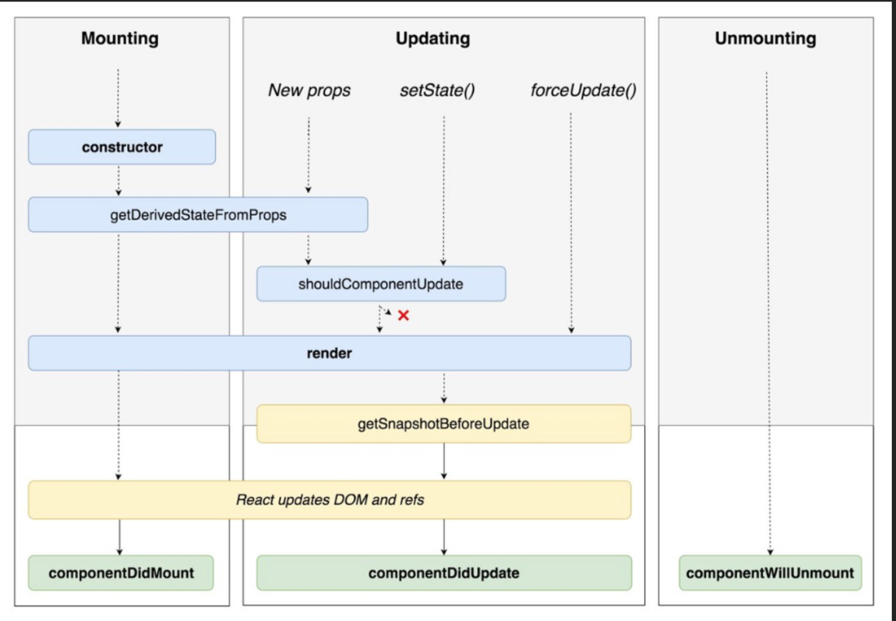

이렇게 잇는데 어디서 끊어야하나 shouldComponentUpdate에서 끊어 줘야한다. 

이걸 어떻게 끊어 주나 이게 최적화 부분이다.

## setState와 함께 일어나는 일

```js
import logo from './logo.svg';
import './App.css';
import React from 'react';

class Person extends React.Component {
  render() {
    console.log("Person render");

    const { name, age } = this.props;
    return (
      <ul>
        {name} / {age}
      </ul>
    );
  }
}

class App extends React.Component {
  state = {
    text: "",
    persons: [
      { id: 1, name: "Mark", age: 37 },
      { id: 2, name: "Anna", age: 26 },
    ]
  };
  render() {
    console.log("App render");
    const { text, persons } = this.state;
    return (
      <div>
        <input type="text" value={text} onChange={this._change} />
        <button onClick={this._click}>click</button>
        <ul>
          {persons.map(p => (
            <Person {...p} key={p.id} />
          ))}
        </ul>
      </div>
    );
  }

  _change = e => {
    this.setState({
      ...this.state,
      text: e.target.value
    });
  };

  _click = () => {
    console.log(this.state.text);
  };
}
export default App;

```

얘는 아무일도 안일어 났다. Person이라는 아이는 Props받아서 그냥 랜더를 한거다. 랜더를 불리면서 console이 찍힌다.

처음 두번 찍힌건 최초에 마운트 되면서 찍힌다.

text라는 아이가 있고 persons라는 아이가 있다 text는 input에 있는 컨트롤드 컴포넌트이다. 만약 인풋에 쓴다면 랜더가 된다. 

그리고 persons는 손대지도 않는다. 하지만 랜더 안에 persons가 있다 그래서 state가 변경되면 랜더가 다시 된다. 


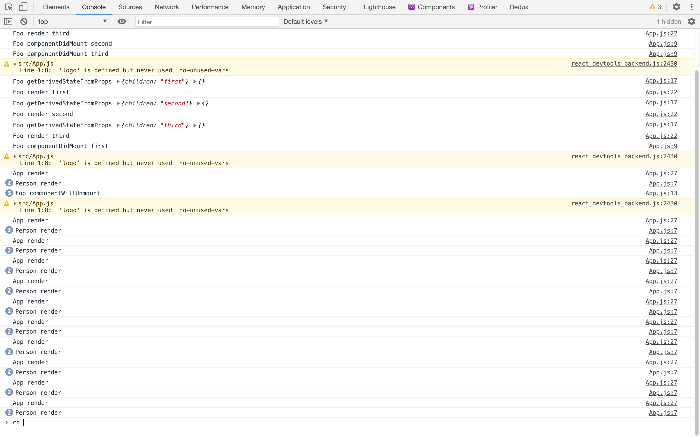

이런 일이 발생한다 이 랜더를 호출하면 return에 있는 아이를 다시 그릴려고 한다. 그래서 key에 의해서 만들었던 걸 똑같이 그려준다. 무조건..

그래서 대 전재로 삼았던게 뭐였나면 변하지 않은것을 그리지 말자는거다 App render가 되는 건 문제가 아니다. 얘는 어쨌든 state가 변했으니 바뀌는게 맞지만 처음에는 id가 1이 들어오고 또 바뀌었을때 또 들어오고 그럼 여기서 안 그려주면 된다. 안그려주기 위해서 shouldcomponentupdate를 사용할 것이다. 

shouldcomponentupdate는 return이 있어야 한다. 

```js
  shouldComponentUpdate() {
    return false;
  }

```

이렇게 하면 person render가 안불리지만 근데 실제 person이 변하면 문제가 된다. 그래서 어떻게 하나면 

```js
  shouldComponentUpdate(previousProps) {
    for (const key in this.props) {
      if (previousProps[key] !== this.props[key]) {
        return true;
      }
    }
    return false;
  }

```

현재 props를 돌면서 이전 props랑 비교해서 같지 않으면 랜더를 다시 하는 거다. 

우리는 배우고자 하는거는 이런 로직을 사용한다는 거지 실제 저렇게 코딩 하지 않다.

한참 유행했던건데 얘가 이런 로직으로 

```js
import logo from './logo.svg';
import './App.css';
import React from 'react';

class Person extends React.PureComponent {

  render() {
    console.log("Person render");

    const { name, age } = this.props;
    return (
      <ul>
        {name} / {age}
      </ul>
    );
  }
}

class App extends React.Component {
  state = {
    text: "",
    persons: [
      { id: 1, name: "Mark", age: 37 },
      { id: 2, name: "Anna", age: 26 },
    ]
  };
  render() {
    console.log("App render");
    const { text, persons } = this.state;
    return (
      <div>
        <input type="text" value={text} onChange={this._change} />
        <button onClick={this._click}>click</button>
        <ul>
          {persons.map(p => (
            <Person {...p} key={p.id} />
          ))}
        </ul>
      </div>
    );
  }

  _change = e => {
    this.setState({
      ...this.state,
      text: e.target.value
    });
  };

  _click = () => {
    console.log(this.state.text);
  };
}
export default App;

```

Pure component이다. 

Person한테 하나 더 주자.

```js
  return (
      <div>
        <input type="text" value={text} onChange={this._change} />
        <button onClick={this._click}>click</button>
        <ul>
          {persons.map(p => (
            <Person {...p} key={p.id} onClick={() => {}} />
          ))}
        </ul>
      </div>
    );
```

이렇게 하면 person이 랜더가 다시 되기 시작한다. 프롭스 각각에 같은지 보는 거다.  

// === 근데 이 () => {} 예는  이전과 이후  () => {} === () => {}

이렇게 보내면 다른 참조를 갖고 있어서 모양은 같지만 참조값은 다르다. 그래서 랜더가 다시 되는 거다.

그래서 변수에 할당해서 사용하자.

그리고 요즘은 무슨 시대에요? 함수 컴포넌트 시대이다.

그래서 함수로 바꾸면

```js
const Person = ({name, age}) => { 
  return (
    <ul>
      {name} / {age}
    </ul>
  );
}
```


이렇게 바꾸면 다시 랜더가 된다. 그래서 요럴때 사용할 수있는게 

```js
const Person = React.memo(({name, age}) => { 
  return (
    <ul>
      {name} / {age}
    </ul>
  );
})
```

이렇게 하는 거다. 


App 컴포넌트를 함수형으로 바꾸자.

```js
const App = () => {
  const [state, setState] = useState({
    text: "",
    persons: [
      { id: 1, name: "Mark", age: 37 },
      { id: 2, name: "Anna", age: 26 },
    ]
  });


  console.log("App render");
  const { text, persons } = state;

  const change = e => {
      setState({
      ...state,
      text: e.target.value
    });
  };

  const click = () => {
    console.log(this.state.text);
  };

  return (
    <div>
      <input type="text" value={text} onChange={change} />
      <button onClick={click}>click</button>
      <ul>
        {persons.map(p => (
          <Person {...p} key={p.id} />
        ))}
      </ul>
    </div>
  );

}
```

근데 만약 person에 onclick을 달아주면

```js
   <Person {...p} key={p.id} onClick={() => {}}/>
```

이러면 참조값이 달라서 계속 랜더가 발생할 것이다.

보통 이렇게 해결하려고 한다.

```js

const onClick = () => {};
  return (
    <div>
      <input type="text" value={text} onChange={change} />
      <button onClick={click}>click</button>
      <ul>
        {persons.map(p => (
          <Person {...p} key={p.id} onClick={onClick}/>
        ))}
      </ul>
    </div>
  );


```

하지만 해결이 안된다. 그래서 사용하는게 useCallback이다.

```js
const onClick = useCallback(() => {}, []);
  return (
    <div>
      <input type="text" value={text} onChange={change} />
      <button onClick={click}>click</button>
      <ul>
        {persons.map(p => (
          <Person {...p} key={p.id} onClick={onClick}/>
        ))}
      </ul>
    </div>
  );


```

이래야 useCallback얘는 이전이라 지금이랑 [] 에 의해서 변화가 없으면은 이 함수이다. 즉 같은 참조를 쓴다 이런거다 . 이 useCallback이 생긴 이유가 최적화랑 관련이 크다. 

다시 input에 쓰면 랜더가 일어나지 않는다.


## createPortal

My-books에서 이어서 해보자.

react 사이트에 가면은 Portals가 있다. 게임에서 포탈은 차원에서 요 차원으로 나오는 그거다. 

react의 순수한 API이다. public에 index.html에 보면

- Public/index.html

```js
<!DOCTYPE html>
<html lang="en">
  <head>
    <meta charset="utf-8" />
    <link rel="icon" href="%PUBLIC_URL%/favicon.ico" />
    <meta name="viewport" content="width=device-width, initial-scale=1" />
    <meta name="theme-color" content="#000000" />
    <meta
      name="description"
      content="Web site created using create-react-app"
    />
    <link rel="apple-touch-icon" href="%PUBLIC_URL%/logo192.png" />
    <!--
      manifest.json provides metadata used when your web app is installed on a
      user's mobile device or desktop. See https://developers.google.com/web/fundamentals/web-app-manifest/
    -->
    <link rel="manifest" href="%PUBLIC_URL%/manifest.json" />
    <!--
      Notice the use of %PUBLIC_URL% in the tags above.
      It will be replaced with the URL of the `public` folder during the build.
      Only files inside the `public` folder can be referenced from the HTML.

      Unlike "/favicon.ico" or "favicon.ico", "%PUBLIC_URL%/favicon.ico" will
      work correctly both with client-side routing and a non-root public URL.
      Learn how to configure a non-root public URL by running `npm run build`.
    -->
    <title>React App</title>
    <link
    href="https://fonts.googleapis.com/css?family=Roboto&display=swap"
    rel="stylesheet"
  />
  </head>
  <body>
    <noscript>You need to enable JavaScript to run this app.</noscript>
    <div id="root"></div>
    <!--
      This HTML file is a template.
      If you open it directly in the browser, you will see an empty page.

      You can add webfonts, meta tags, or analytics to this file.
      The build step will place the bundled scripts into the <body> tag.

      To begin the development, run `npm start` or `yarn start`.
      To create a production bundle, use `npm run build` or `yarn build`.
    -->
  </body>
</html>

```

실제로 배포되면 어떻게 되나

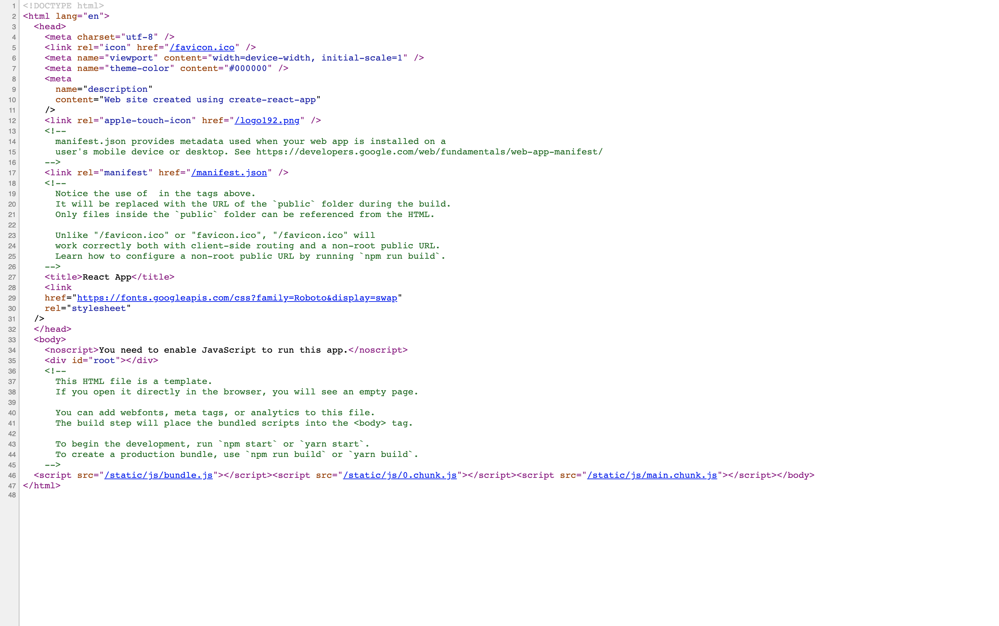

```html
<script src="/static/js/bundle.js"></script><script src="/static/js/0.chunk.js"></script><script src="/static/js/main.chunk.js"></script></body>
```

이게 생긴다. 이게 뭐냐면 react 소스이다. 우리가 만든 리엑트 프로젝트가 들어온다. html파일이 파싱을하면서 마지막으로 우리가 만든 리엑트를 실행하고 나서 div id가 root인 곳에 index.js에 잇는

- index.js

```js

ReactDOM.render(
  <React.StrictMode>
    <App />
  </React.StrictMode>,
  document.getElementById('root')
);
```

이 아이를 랜더하는 거다. index.html에다가 root인 아이 말고 modal인것을 추가해보자.

- Public/index.html

```js
<!DOCTYPE html>
<html lang="en">
  <head>
    <meta charset="utf-8" />
    <link rel="icon" href="%PUBLIC_URL%/favicon.ico" />
    <meta name="viewport" content="width=device-width, initial-scale=1" />
    <meta name="theme-color" content="#000000" />
    <meta
      name="description"
      content="Web site created using create-react-app"
    />
    <link rel="apple-touch-icon" href="%PUBLIC_URL%/logo192.png" />
    <!--
      manifest.json provides metadata used when your web app is installed on a
      user's mobile device or desktop. See https://developers.google.com/web/fundamentals/web-app-manifest/
    -->
    <link rel="manifest" href="%PUBLIC_URL%/manifest.json" />
    <!--
      Notice the use of %PUBLIC_URL% in the tags above.
      It will be replaced with the URL of the `public` folder during the build.
      Only files inside the `public` folder can be referenced from the HTML.

      Unlike "/favicon.ico" or "favicon.ico", "%PUBLIC_URL%/favicon.ico" will
      work correctly both with client-side routing and a non-root public URL.
      Learn how to configure a non-root public URL by running `npm run build`.
    -->
    <title>React App</title>
    <link
    href="https://fonts.googleapis.com/css?family=Roboto&display=swap"
    rel="stylesheet"
  />
  </head>
  <body>
    <noscript>You need to enable JavaScript to run this app.</noscript>
    <div id="root"></div>
    <div id="modal"></div>
    <!--
      This HTML file is a template.
      If you open it directly in the browser, you will see an empty page.

      You can add webfonts, meta tags, or analytics to this file.
      The build step will place the bundled scripts into the <body> tag.

      To begin the development, run `npm start` or `yarn start`.
      To create a production bundle, use `npm run build` or `yarn build`.
    -->
  </body>
</html>

```

하면 우리 앱에서 뜨게 될 것이다.

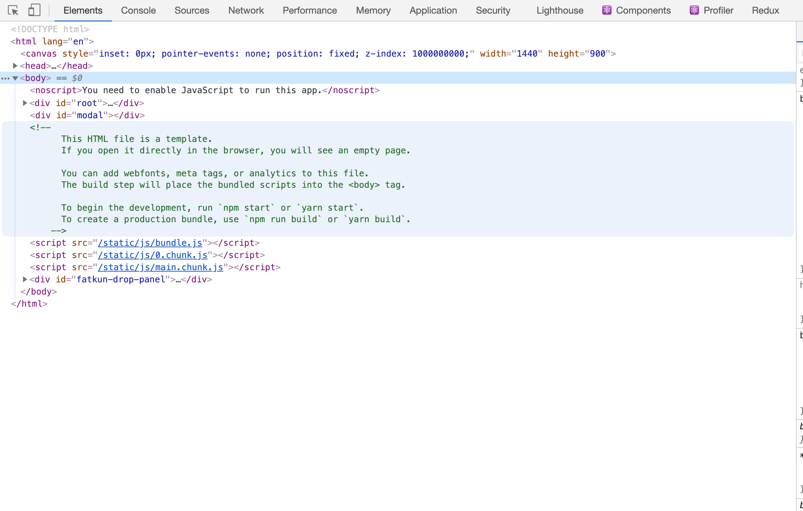

이걸 보면 modal이 밑에 들어가 있다. 

그래서 스타일을 매겨 줄 건데 src/index.css로 가서

```css
body {
  margin: 0;
  font-family: -apple-system, BlinkMacSystemFont, 'Roboto', sans-serif;
  -webkit-font-smoothing: antialiased;
  -moz-osx-font-smoothing: grayscale;
}

#modal {
  position: absolute;
  top: 0;
  left: 0;
}

```

이렇게 modal을 스타일을 적용하자. 

이제 components폴더에 Modal.jsx 컴포넌트를 만들자.

이 createfotal이라는 API는 react의 API가 아니라 ReactDOM의 API이다.

- Modal.jsx

```js
import ReactDOM from 'react-dom';

const Modal = ({children}) => ReactDOM.createPortal(children, document.querySelector('#modal'));

export default Modal;

// <Modal><div>모달</div></Modal>
```

이렇게 만들고 이 아이를 써보자

App.js에서

- App.js

```js
import { ErrorBoundary } from "react-error-boundary";
import { Switch, Route, Router } from "react-router-dom";

// Pages
import Error from './pages/Error';
import Signin from './pages/Signin';
import Home from './pages/Home';
import NotFound from './pages/NotFound';
import { Provider } from 'react-redux';

//redux

import create from "./redux/create";
import { createBrowserHistory } from "history"; // 이 history는 react-router-dom을 설치하면 자동으로 생긴다.
import { ConnectedRouter } from "connected-react-router";
import { useState } from "react";
import Modal from "antd/lib/modal/Modal";
// 1. 히스토리를 생성
const history = createBrowserHistory();

// 2. 스토어를 생성
const store = create(history);

function App() {
  const [visible, setVisible] = useState(false);
  const show = () => setVisible(true);
  const hide = () => setVisible(false);
  return (
   <ErrorBoundary FallbackComponent={Error}>
     <Modal><div>나는 모달이다.</div></Modal>
     <Provider store={store}>
      <ConnectedRouter history={history}>
        <Switch>
          <Route path="/signin" component={Signin}/>
          <Route path="/" exact component={Home}/>
          <Route component={NotFound}/>
        </Switch>
     </ConnectedRouter>
     </Provider>
   </ErrorBoundary>
  );
}

export default App;

```

이렇게 만들면 화면에 떠있기는 할 것이다.


이제 visible이 보일때만 나오게 바꾸자

- app.js

```js
import { ErrorBoundary } from "react-error-boundary";
import { Switch, Route, Router } from "react-router-dom";

// Pages
import Error from './pages/Error';
import Signin from './pages/Signin';
import Home from './pages/Home';
import NotFound from './pages/NotFound';
import { Provider } from 'react-redux';

//redux

import create from "./redux/create";
import { createBrowserHistory } from "history"; // 이 history는 react-router-dom을 설치하면 자동으로 생긴다.
import { ConnectedRouter } from "connected-react-router";
import { useState } from "react";
import Modal from "./components/Modal";

// 1. 히스토리를 생성
const history = createBrowserHistory();

// 2. 스토어를 생성
const store = create(history);

function App() {
  const [visible, setVisible] = useState(false);
  const show = () => setVisible(true);
  const hide = () => setVisible(false);
  return (
   <ErrorBoundary FallbackComponent={Error}>
     {visible && (<Modal><div style={{
       width: '100vw',
       height: '100vh',
       background: 'rgba(0,0,0,0.5)',
     }}
     onClick={hide}
     >나는 모달이다.</div></Modal>)}
     <button onClick={show}>모달 오픈</button>
     <Provider store={store}>
      <ConnectedRouter history={history}>
        <Switch>
          <Route path="/signin" component={Signin}/>
          <Route path="/" exact component={Home}/>
          <Route component={NotFound}/>
        </Switch>
     </ConnectedRouter>
     </Provider>
   </ErrorBoundary>
  );
}

export default App;

```

이렇게 바꾸면 누르면 모달이 나오고 다시 누르면 해제 된다.


우리는 맨처음에 어디서 랜더를 하고 있나면 root에서 랜더를 하고 있는데 App안에 Modal이라는 아이를 사용하고 있다. 이

```js
<div style={{
       width: '100vw',
       height: '100vh',
       background: 'rgba(0,0,0,0.5)',
     }}
     onClick={hide}
     >나는 모달이다.</div>
```

를 어디다  potal시키나? 요거를 id가 modal인 DOM으로 포탈 시킨다. 우린 분명히 modal에 있다.

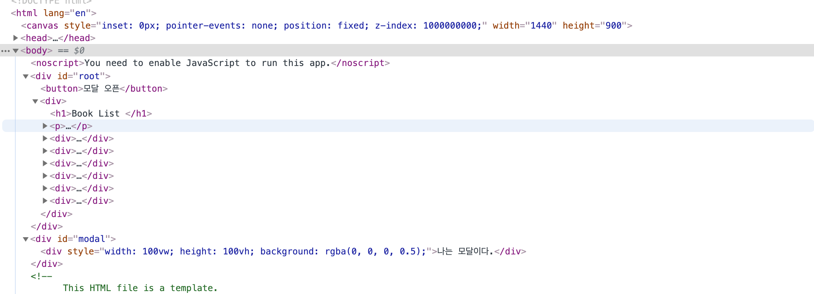

포탈이라는 걸 사용하면은 우리가 원하는 곳에 실제 리얼 돔에 selector를 얻어가지고 Potal시킬 수 있다. 심지어 어떤것도 가능하다.

이 포탈된 아이와 원레 있던 index.js에 있는 데이터가 공유되고 있다. 여기다 데이터를 보낼 수 있다. 

그러면 모달하는건 알겠는데 어디다가 쓸까 보통 이 포탈은 많이 쓰나 만약 회사에 입사했더니 사이트가 리엑트로 안되어 있다. 근데 리엑트로 바꿔달라고 하면 create-react-app을 만든 다음에 모든 프로젝트를 옮겨야한다. 엄청 복잡한 아이를 옮겨달라고 하면 어떻게 할까 그런걸 원하는게 아니라 점진적으로 리엑트로 전환하고 싶다면 기존 프로젝트에 리엑트를 연결한 다음에 그냥 적당한 div를 잡고 

앱이라는 이런 대표아이를 reactDom.render를 시키고 웹사이트 최상위 부모를 아이디를 단 다음에 그 아이를 나의 리엑트에서 createPotal로 운영한다. 여기 따로 만들고 따로 만들고 다 만들고 문제 없으면 합치면 점진적으로 변경되는데 도움이 된다. 

root쪽에 있는 DOM에 데이터를 내려줘도 Potal안에 있는 아이들도 똑같이 동작하고 변경도 되고 랜더도 다시 된다. 실제는 여기에 있는데 그림만 거기서 그리는 그런 모습이다.


## IMMUTABLE

일단 설치하자.

```bash
npm i immutable
```

App.js에서 계속 하자. 

### immutable-js 주요특징

- 한번 만들어지면 변하지 않는 데이터를 이뮤터블 데이터라 한다.

쉽게 이야기 하면 이런거다.

```js
const state1 = {name: "Mark", age: 39};
const state2 = state1;
state2.age++
console.log(state1,state2,state1 === state2);
```

이렇게 하면 아래처럼된다

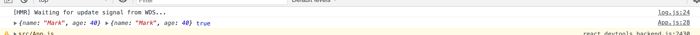

이거를ㄹ 뮤테이블한 데이터이다. 즉 값이 들어있는게 아니라 가리키는 주소값이 state로 들어가기 때문에 이 두개는 똑같은 데이터가 된다.

이렇게 하면 문제가 발생한다. 

state1을 이렇게 바꿨다고 하자.

```js
const state1 = { person: {name: "Mark", age: 39}};
```


만약 이거를 특정 컴포넌트에 

```js
<Child {...state1} />
```

이렇게 내려준다면 실제로는

```js
<Child person:{name:'Mark', age: 39} />
```

이렇게 하고 만약 state1.person.age++을 하면 다 age가 40으로 바뀐다. 그래서 받아쓰는 입장에서는 child에 입장에서는

```js
props.person = {name:'Mark', age: 39}
```

이렇게 되는 거다. 이 부분은 객체이다 그래서 person이라는 키로 들어가는 거다. 

가리키는 주소를 의미한다. 참조값을 person에 넣은거라서 props.person은 참조값이 들어간 거다.

Pure component와 memo를 기억해보면

```js
if(previousProps.person === props.person)
```

이렇게 하는데 이걸 shouldcomponentupdate에서 한건데 이걸 state2를 받으면 age는 40으로 바뀌었지만 true가 된다. 숫자를 바뀌었지만 새로 랜더하지 않을 것이다.  이런 형태가 있기 때문에 

그래서 결론적으로 렌더를 다시하려면 PureComponent 에서, 이뮤터블한 데이터 일때만 랜더를 다시 한다는 가정으로 사용한다.

state2를 어떻게 줘야하나 그러면

```js
const state2 = {...state1};
```

이렇게 해결이 되나? 쪼개서 들어가면

```js
const state2 = { person: state1.person }
```

이렇게 들어온다. 그래서  {name:'Mark', age: 39}이 참조값이 들어있어서 또 얘를 풀어야 한다.

```js
const state2 = { ...state1, person: {...state1.person} }
```

지금까지 deps는 이정도 구조이다. 근데 이 데이터 안에 또 객체가 있으면 계속 이렇게 해줘야한다. 그래서 나온 라이브러리가 immutable-js이다.(제일 처음 나왔음)

- 자바스크립트는 객체 내부의 값을 변경해도 같은 레퍼런스를 유지하기 때문에 객체 내부 값을 일일이 비교하지 않으면 정확히 모든 값이 같은지 알 수 없다.
- A라는 "이뮤터블 데이터"에서 특정 값을 수정하려면 기본적으로는 B라는 객체를 새로 만들고 A의 모든 값을 B로 복사해야한다.
  - 이 것은 비용이 많이 든다.
  - 그래서 나온 아이디어로 구현해낸 것이 immutable-js
- react의 어느 부분에서 사용하면 좋을까?
  - 첫번째 리덕스의 리듀서 부분 (데이터를 받아가는 입장)
  - 두번째 Pure 컴포넌트 (사용자 입장)

>  ...을 쓰는게 최근에 일이다. 요즘은 편한 함수를 제공해 준다. 
>
> 함수를 사용할때 스펙을 확인해 봐야한다.
>
> lodash

## 기본 사용법 (1) - Map

```js
	import { Map } from 'immutable';

	const obj = Map({name: 'Mark', age: 39});
  console.log(obj);
```

이렇게 하면 어떻게 생겼을까

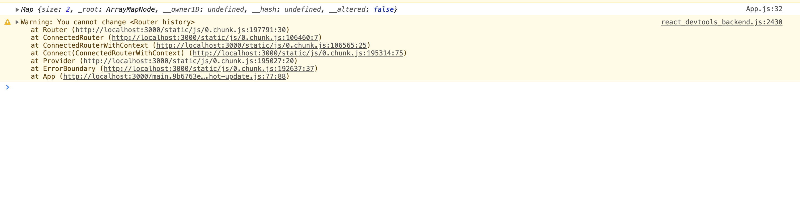

이렇게 생겼다. 

이 객체를 넣는데 

```js
console.log(obj.name); // undefined
```

이렇게 뽑을 수 없다. 그래서 무엇을 할 수 있나 Map이라는 아이를 조작하고 싶다. 

간단하게

```js
  const obj = Map({name: 'Mark', age: 39});
  console.log(obj);
  const obj2 = obj.set('age', 40);
  console.log(obj2)
```

​	이렇게 해주면

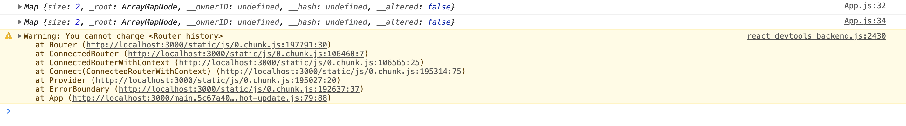

이렇게 나온다.

이게 어떻게 되나 앞으로는 자바스크립트 객체처럼 쓰는게 아니고 Map이 라고 하는 데이터구조를 이용하겠다는 거다. 만약 데이터를 바꾸겠다하면 obj.set에 있는 이 함수를 이용해서 키와 value를 직접 할당해서 넣었을때 그 결과가 obj2고 obj1과 obj2는 다르다 그래서 test하려면

```js
  const obj = Map({name: 'Mark', age: 39});
  console.log(obj.get('age'));
  const obj2 = obj.set('age', 40);
  console.log(obj2.get('age'), obj.get('age'));
```

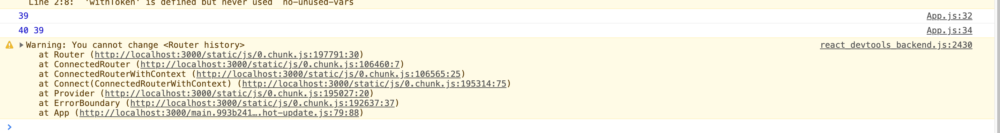

기존 데이터는 유지 되고 새로 바꾼 아이는 새로운 Map이라고 하는 형태에 데이터 타입으로 제공해 준다.

이것은 객체 였다. 이제 배열을 해보자.

```js
import { Map, List } from 'immutable';

const list = List(['a', 'b', 'c']);
console.log(list.get(0))
```

하면 a 가 나온다. 그러면 만약에 list안에 객체가 들어가면 어떻게 해야하나.

```js
 const list = List([Map({name: 'Mark', age: 39}),{name: 'Hanna', age: 29}]);
  console.log(list.get(0));
```

이 상태에서 mark의 나이만 올리고 싶으면 어떻게 해야하나 이렇게 한다.

```js
 const list = List([Map({name: 'Mark', age: 39}),{name: 'Hanna', age: 29}]);
  console.log(list.getIn([0, 'age'])); // 38
```

이제 바꾸려면 어떻게 해야할까? 

```js
 const list = List([Map({name: 'Mark', age: 39}),{name: 'Hanna', age: 29}]);
  console.log(list.getIn([0, 'age'])); // 38
const list2 = list.setIn([0, 'age'], 40); 
console.log((list.getIn([0, 'age']) ,list2.getIn([0, 'age'])) // 39, 40
```

이렇게 다르게 나온다. setIn을 하는데 값을 가져와야하는데  getIn을하고 setIn을 해야하는게 아니냐 라고 하면 그때 할 수 있는게 있다.

```js
 const list = List([Map({name: 'Mark', age: 39}),{name: 'Hanna', age: 29}]);
  console.log(list.getIn([0, 'age'])); // 38
const list2 = list.updateIn([0, 'age'], (age) => age + 5); 
console.log((list.getIn([0, 'age']) ,list2.getIn([0, 'age'])) // 39, 44
```

이렇게 할 수 있다 updateIn은 setIn하고 다르게 뒤에 함수를 넣을 수 있다. 

Immutable 철학을 보면 list, stack,Map, OrderedMap, Set, OrderedSet, Record 이 자료형을 제공하는데 이뮤터블하게 데이터를 조작할 수있는 함수를 가지고 있다. 실제 데이터를 랩핑하는 거다. (wrapper)한 레벨 추상화 한거다. 

List로 사용하는 속안에 내용은 실제 제공한 배열 데이터가 들어 있다. 배열 데이터를 만약 내가 List.push로 바꾸면 여기에는 내부적으로 새로운 데이터 set을 만들어서 거기에다 데이터 하나 추가하고 리턴해주는 아이다. 컨셉이 랩퍼 API로 생각하면 된다.

이해가 안되면 그전에 axios배웠을때 내부 구현은 XMLHttpReqeusts로 되어 있는데 이 아이를 사용하는 api를 wrapping해서 제공하는 그런 형태라고 공부한 적 있다. 사용법을 제공하는 랩퍼 api이다. 마찬가지로 Immutable도 그렇다.

만약 list를 쓴다고 하는데 어디까지 가져갈껀지가 중요하다. 프론트엔드에서는 실제 

```js
{name: 'Mark', age: 39}
```

이런 형태로 사용해야한다.

만약 Map과 List를 쓰려고 하면 getIn을 써야한다.

그럴때 데이터를 받아서 랩핑한다음에 자료구조로 데이터를 변경하고 마지막으로 돌려줄때 어떻게 돌려주나

그게 

```js
 const list = List([Map({name: 'Mark', age: 39}),{name: 'Hanna', age: 29}]);
  console.log(list.getIn([0, 'age'])); // 38
const list2 = list.updateIn([0, 'age'], (age) => age + 5); 
console.log((list.getIn([0, 'age']) ,list2.getIn([0, 'age'])) // 39, 44
console.log(list.toJS())
console.log(list2.toJS())
```

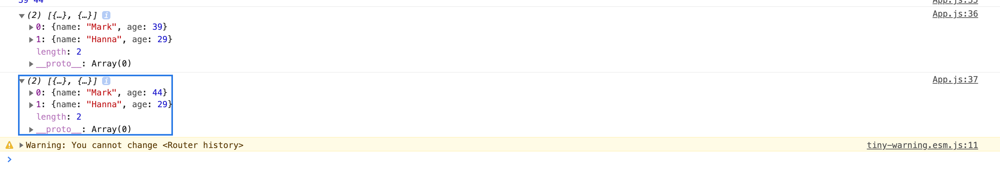

이렇게 나온다.  이거를 가지고 프레젠테이션 컴포넌트에서는 저걸 가지고 데이터를 보여주는게 쉽다. 그래서 선택을 해야한다.

1. Map, List를 initialState로 사용한다. 
2. reducer에서 받을때 전환한다. 돌려줄땐 JS 로
3. 돌려주는 것도 사용한다. 

## 불변의 데이터 구조 사용

불변성: 일단 생성되면 컬렉션은 다른 시점에서 변경될 수 없다.

지속성: 새로운 컬렉션은 이전 컬렉션과 set과 같은 변화로 부터 생성될 수 있다. 새 컬렉션이 만들어지고 나서도 유효하다.

구조적 공유: 가능한 한 원본의 컬렉션과 동일한 구조를 사용해서 새 컬렉션이 만들어 지므로 복사를 최소화해서 성능을 향상시킨다.

> 불변성은 변화를 추적하는 비용을 적게 만든다. 변경은 항상 새로운 객체를 생성하므로 객체에 대한 참조가 변경되었는지 여부만 확인하면 된다. 

새로 추가된 아이를 보면은 요즘은 이게 추세다.

Object.assign이나 object spread 를 써서 활용하거나 중첩이 많이 되어있는 객체 같은 경우에서 복잡하다고 느낄 수 있으니 Immer또는 immutability-helper를 쓰는게 좋다.

## IMMER

```bash
npm i immer
```

IMMER는 아래 사진을 기억하자.

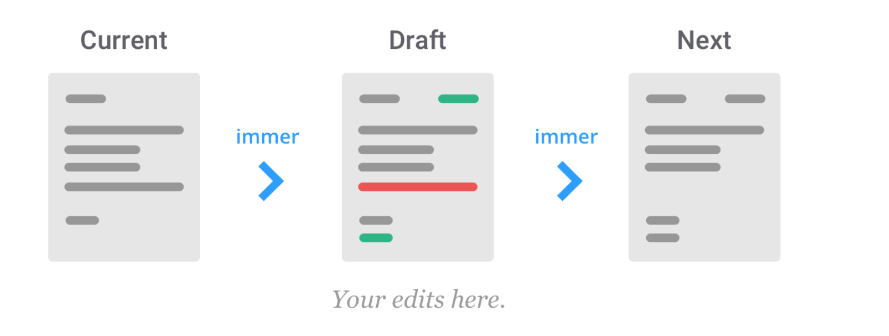

Immer의 영역을 들어가서 Immer의 영역이 끝나는 이 사이를 Draft라고 부른다. Draft에서 무엇을 사용하든 고치면 된다. 마무리를 하면 새로운 상태가 된다. 

```js
import produce from 'immer';
```

이렇게 가져온다.

### immer 주요 특징

- Produce(객체,함수)를 이용한 draft처리
- Produce(함수)를 이용한 setState(함수) 처리

사용해 보자.

```js

function App() {
  const state = {
    name: 'Mark',
    age: 39,
  }

 const newState = produce(객체, 함수);
```

이렇게 넣는다고 햇다.

```js
const state = {
    name: 'Mark',
    age: 39,
  }

  const newState = produce(state, (draft) => {
    draft.age++;
  });

  console.log(state, newState, state === newState);
```

이렇게 하면

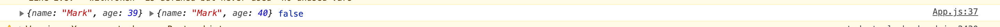

이렇게 나온다. state와 newState는 다르다. 

이정도는 쓸만한 라이브러리이다.

이제 제  state를

```js
const state = {
    name: 'Mark',
    age: 39,
  }


```

이렇게 말고 

```js

function App() {
  const state = {
    books: [
      {title: '책1', author: {
        name: 'Mark',
        age: 39
      },
     },
      {title: '책1', author: {
        name: 'Hanna',
        age: 28
      },
     },
    ]
  }

  const newState = produce(state, (draft) => {
    draft.books[0].author.age++;
  });

  console.log(state, newState, state === newState);
	console.log(state.books[1] === newState.books[1]); // 얘는 변하지 않았다.
```

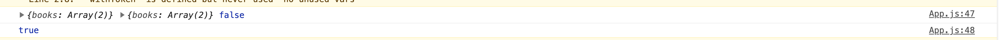

이렇게 나온다. w[A, B]이렇게 잇는데 W+`[A`+, B]이렇게 된다.

이전 Data는 나이 플러스 가 되어서 다시 그릴꺼고 나이 +가 안된거는 똑같네 하면 그대로 안그린다. (memo를 사용시)

어떤 포인터에서 써야된다는 거를 이해가 됄 것이다. 

첫번째 객체와 함수를 이용한 draft처리를 했다.

그래서 produce함수를 이용한 setState함수를 처리하자.

만약 

```js
const [state, setState ] = useState({
    books: [
      {title: '책1', author: {
        name: 'Mark',
        age: 39
      },
     },
      {title: '책1', author: {
        name: 'Hanna',
        age: 28
      },
     },
    ]
  })
  useEffect(() => {
    const newState = produce(state, (draft) => {
      draft.books[0].author.age++;
    });  
    setState(newState);
  }, [state]);
```

근데 최초에만 하고 싶을때 [state]를 뺀다. 이렇게 하지 말고 원레

```js
  useEffect(() => {
  
    setState(s => produce(s, (draft) => {
      draft.books[0].author.age++;
    }));
  }, []);
```

이렇게 하는데 s는 불필요 한다. 그래서 얘네가 이런걸 제공한다.

```js
  useEffect(() => {
      setState(produce((draft) => {
        draft.books[0].author.age++;
      }),
    );
  }, []);
```

이렇다는건 produce가 뭐라는 거에요? 얘가 결과가 함수이다. 이 함수는 인자를 state로 받는 함수이다. 이렇게 하면 필요없는 코딩을 할 필요가 없다.

이 디팬던시 문제가 있었다. setState에 함수로 넣는걸 제공했는데 produce도 굳이 state를 받을 필요가 없다.

실제로 보려면 state를 보자

```js
console.log(state);
```

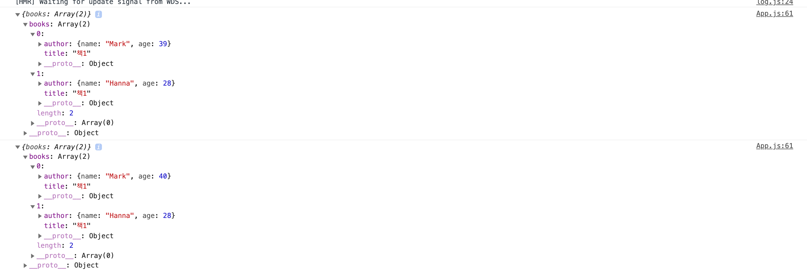

이렇게 잘 업데이트가 되었다. state를 어딘가 내려주어서 프롭스를 받아서 먼가 author를 계속 랜더를 똑같은 데이터면 그대로 냅두고 다르면 다시 author를 업데이트 하는 그런 로직이 된다.

이제 프로젝트 했던거를 몇가지 고칠 것이다.

## my-books 고치기

key props를 달아주자. BookItem.jsx로가자.

BookList로 가서 

- BookList.jsx

```js
return (
      <div>
        <h1>Book List {loading && <LoadingOutlined />}</h1>
        <p><button onClick={getBooks}>reload</button></p>
        {books.length === 0 && <p>데이터가 없습니다.</p>}
        {books.length !== 0 && books.map((book) => {
          return <BookItem {...book} key= {book.bookId}/>
        })}
      </div>
    );
```

key를 프롭스로 만들자.

하면 keyprops warning이 없어졌다.

그러면 콘솔에 components를 보면

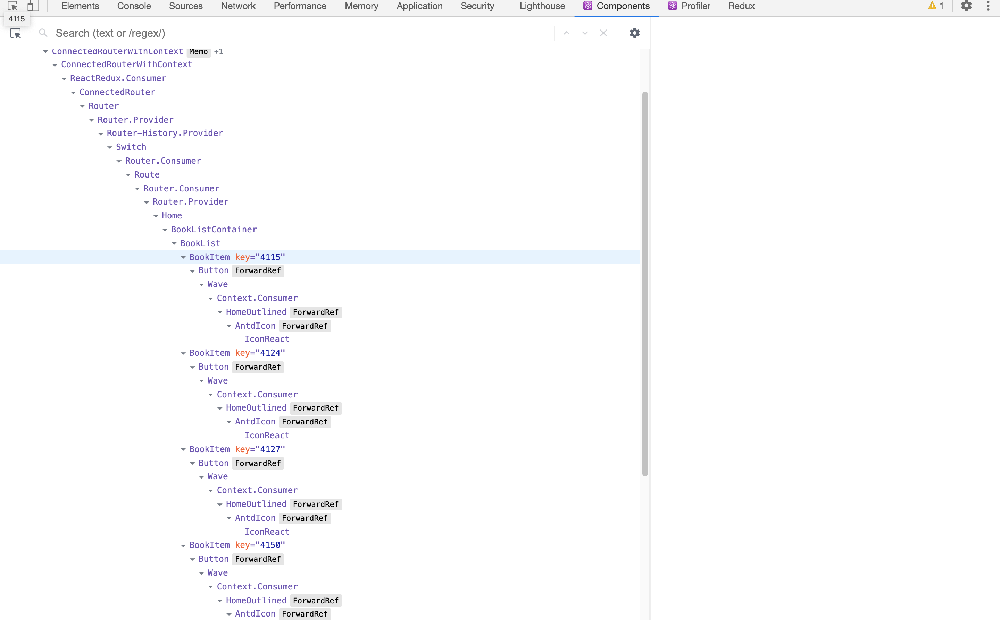

key가 4115이렇게 들어갔다. 다른 아이로 가지고 있다.

데이터가 변하면 다른 아이들은 안변하고 변한 아이만 변할 것이다. 그렇다면 이렇게 하려면 전제 조건이 BookItem이 뭐여야 하나면 어떤걸로 컴포넌트가 되어 있어야 하냐면 React.memo가 되어 있어야 한다.

- BookItem.jsx

```js
import React from 'react';
import { HomeOutlined } from "@ant-design/icons";
import { Button } from "antd";

const  BookItem = React.memo(({title,author,message, url}) => (<div>
  <h2>{title}{' '}
  <a href={url} target="_BLANK" rel="noreferrer">
  <Button icon={<HomeOutlined />} />
  </a>
  </h2>
  <h3>{author}</h3>
  <p>{message}</p>
</div>
));

export default BookItem;
```

이렇게 하면 잘 된다. 그리고 자기 위치를 기억해서 데이터 바뀐것만 바꿔주는 그렇게 되어 있다.

이제 새로운 책 추가 해보자. page를 만들자.

pages에 Add.jsx를 만들자.

- pages/Add.jsx

```js
import React from "react";

const Add = () => {
  return (<div>Add</div>)
}

export default Add;
```

이렇게 만들어 주고 페이지 만들걸 라우트로 만들어 줘야 한다.

-  App.js

```js
   <ErrorBoundary FallbackComponent={Error}>
     {visible && (<Modal><div style={{
       width: '100vw',
       height: '100vh',
       background: 'rgba(0,0,0,0.5)',
     }}
     onClick={hide}
     >나는 모달이다.</div></Modal>)}
     <button onClick={show}>모달 오픈</button>
     <Provider store={store}>
      <ConnectedRouter history={history}>
        <Switch>
          <Route path="/add" component={Add} />
          <Route path="/signin" component={Signin}/>
          <Route path="/" exact component={Home}/>
          <Route component={NotFound}/>
        </Switch>
     </ConnectedRouter>
     </Provider>
   </ErrorBoundary>
```


이렇게 추가하면 

- localhost:3000/add


이렇게 나와야 한다

- Add.jsx

```js
import React from "react";

const Add = () => {
  return (
  <div>
    <h1>Add Page</h1>
    <form>
      <p>
        Title: <input />
      </p>
      <p>
        Author: <input />
      </p>
      <p>
        url: <input />
      </p>
      <p>
        Message: <input />
      </p>
    </form>
  </div>
  )
}

export default Add;
```

이렇게 하고 언컨트롤드하고 컨트롤드 컴포넌트를 반반 하자.


- Add.jsx

```js
import React, { useCallback, useRef, useState } from "react";

const Add = () => {
  const [title, setTitle] = useState('');
  const [author, setAuthor] = useState('');

  const urlRef = useRef();
  const messageRef = useRef();

  const changeTitle = useCallback((e) => {
    setTitle(e.target.value);
  } ,[])

  const changeAuthor = useCallback((e) => {
    setAuthor(e.target.value);
  } ,[])
  
  return (
  <div>
    <h1>Add Page</h1>
    <form>
      <p>
        Title: <input  type="text" value={title} onChange={changeTitle}/>
      </p>
      <p>
        Author: <input type="text" value={author} onChange={changeAuthor}/>
      </p>
      <p>
        url: <input type="text" ref={urlRef}/>
      </p>
      <p>
        Message: <input type="text" ref={messageRef}/>
      </p>
    </form>
  </div>
  )
}

export default Add;
```

이렇게 하면 


이렇게 잘 나온다. 근데 이안에 value값을 쓰면 

```js
     url: <input type="text" ref={urlRef} value="https://"/>
```

이렇게 하면 무조건 렌더가 될때마다 value가 계속 바뀐다. 그래서 이렇게 안하고 처음에만 이 문자열이었으면 좋겠다 싶으면 defaultValue가 있다.

```js
url: <input type="text" ref={urlRef} defaultValue="https://"/>
```

그리고 value를 넣으면 꼭 onChange를 넣어줘야한다.

자 이제 밑에다가 버튼하나 만든다.

```js
import React, { useCallback, useRef, useState } from "react";

const Add = () => {
  const [title, setTitle] = useState('');
  const [author, setAuthor] = useState('');

  const urlRef = useRef();
  const messageRef = useRef();

  const changeTitle = useCallback((e) => {
    setTitle(e.target.value);
  } ,[])

  const changeAuthor = useCallback((e) => {
    setAuthor(e.target.value);
  } ,[])
  const create = useCallback(() => {
    console.log(
      title,
      author,
      urlRef.current.value,
      messageRef.current.value,
    );
  }, [author, title])

  return (
  <div>
    <h1>Add Page</h1>
      <p>
        Title: <input  type="text" value={title} onChange={changeTitle}/>
      </p>
      <p>
        Author: <input type="text" value={author} onChange={changeAuthor}/>
      </p>
      <p>
        url: <input type="text" ref={urlRef} defaultValue="https://"/>
      </p>
      <p>
        Message: <input type="text" ref={messageRef}/>
      </p>
      <p><button onClick={create}>생성</button></p>
  </div>
  )
}

export default Add;
```

이렇게 하고 인풋에 적고 누르면 콘솔에는 적은 글자가 나올 것이다.

- Add.jsx

```js
import React, { useCallback, useRef, useState } from "react";

const Add = () => {
  const [title, setTitle] = useState('');
  const [author, setAuthor] = useState('');

  const urlRef = useRef();
  const messageRef = useRef();

  const changeTitle = useCallback((e) => {
    setTitle(e.target.value);
  } ,[])

  const changeAuthor = useCallback((e) => {
    setAuthor(e.target.value);
  } ,[])
  const create = useCallback(() => {
    const url = urlRef.current.value;
    const message = messageRef.current.value;
    console.log(title, author, url, message);
    if (title === '' || author === '' || url === '' || message === '') return;

    //비동기 로직
  }, [author, title])

  return (
  <div>
    <h1>Add Page</h1>
      <p>
        Title: <input  type="text" value={title} onChange={changeTitle}/>
      </p>
      <p>
        Author: <input type="text" value={author} onChange={changeAuthor}/>
      </p>
      <p>
        url: <input type="text" ref={urlRef} defaultValue="https://"/>
      </p>
      <p>
        Message: <input type="text" ref={messageRef}/>
      </p>
      <p><button onClick={create}>생성</button></p>
  </div>
  )
}

export default Add;
```

이렇게 하고 이제 비동기 로직만 만들면 된다. 

그리고 이걸 따로 컴포넌트로 만들자.

components폴더에 AddForm.jsx를 만들고

- AddForm.jsx

```js
import React, { useCallback, useRef, useState } from "react";

const AddForm = () => {
  const [title, setTitle] = useState('');
  const [author, setAuthor] = useState('');

  const urlRef = useRef();
  const messageRef = useRef();

  const changeTitle = useCallback((e) => {
    setTitle(e.target.value);
  } ,[])

  const changeAuthor = useCallback((e) => {
    setAuthor(e.target.value);
  } ,[])
  const create = useCallback(() => {
    const url = urlRef.current.value;
    const message = messageRef.current.value;
    console.log(title, author, url, message);
    if (title === '' || author === '' || url === '' || message === '') return;

    //비동기 로직
  }, [author, title])

  return (
  <div>
    <h1>Add Page</h1>
      <p>
        Title: <input  type="text" value={title} onChange={changeTitle}/>
      </p>
      <p>
        Author: <input type="text" value={author} onChange={changeAuthor}/>
      </p>
      <p>
        url: <input type="text" ref={urlRef} defaultValue="https://"/>
      </p>
      <p>
        Message: <input type="text" ref={messageRef}/>
      </p>
      <p><button onClick={create}>생성</button></p>
  </div>
  )
}

export default AddForm;
```

그 다음에 containers폴더에 새로운 파일을 만들자.

AddFormContainer.jsx를 만들자.

- AddFormContainer.jsx

```js
import React from 'react';
import AddForm from '../components/AddForm';

const AddFormContainer = () => (<AddForm />);

export default AddFormContainer;
```

그리고 나서 AddFormContainer를  Add.jsx로 가서 

- Add.jsx

```js
import React from "react";
import { useSelector } from "react-redux";
import { Redirect } from "react-router-dom";
import AddFormContainer from "../containers/AddFormContainer";

const Add = () => {
  const token = useSelector(state => state.auth.token);

  if (token === null) {
    return <Redirect to="signin" /> 
  }

  return <AddFormContainer />
}

export default Add;
```

이렇게 하고 생셩하면 AddForm이 실행된다 그래서 AddForm에서 sideEffect를 추가하자. 얘를 하기 위해서 받아오자  {addBook}

- AddForm.jsx

```js
addBook({title,author, url, message})
```

얘를 객체화 해서 넣는 이유가 객체를 안하면 순서가 중요하지만 객체를 하면 순서는 중요하지 않는다. 순서보다 이름이 중요하다.

- AddForm.jsx

```js
import React, { useCallback, useRef, useState } from "react";

const AddForm = ({addBook}) => {
  const [title, setTitle] = useState('');
  const [author, setAuthor] = useState('');

  const urlRef = useRef();
  const messageRef = useRef();

  const changeTitle = useCallback((e) => {
    setTitle(e.target.value);
  } ,[])

  const changeAuthor = useCallback((e) => {
    setAuthor(e.target.value);
  } ,[])
  const create = useCallback(() => {
    const url = urlRef.current.value;
    const message = messageRef.current.value;
    console.log(title, author, url, message);
    if (title === '' || author === '' || url === '' || message === '') return;

    //비동기 로직
    addBook({title,author, url, message})
  }, [author, title, addBook])

  return (
  <div>
    <h1>Add Page</h1>
      <p>
        Title: <input  type="text" value={title} onChange={changeTitle}/>
      </p>
      <p>
        Author: <input type="text" value={author} onChange={changeAuthor}/>
      </p>
      <p>
        url: <input type="text" ref={urlRef} defaultValue="https://"/>
      </p>
      <p>
        Message: <input type="text" ref={messageRef}/>
      </p>
      <p><button onClick={create}>생성</button></p>
  </div>
  )
}

export default AddForm;
```

addBook을 누가 넣어주냐면 AddFormContainer.jsx에서 넣어줄 것이다.

- AddFormContainer.jsx

```js
import React, { useCallback } from 'react';
import { useDispatch } from 'react-redux';
import AddForm from '../components/AddForm';

const AddFormContainer = () => {
  const dispatch = useDispatch();
  const addBook = useCallback((book) => {
    dispatch(addBookSagaStart);
  }, [dispatch])
return <AddForm addBook={addBook} />
};

export default AddFormContainer;
```

자 이제 addBookSagaStart는 어디서 가져오나면 modules에 books.js에 만들면 된다.

```js
const ADD_BOOK_SAGA = prefix + '/ADD_BOOK_SAGA';
export const addBooksSagaStart = createAction(ADD_BOOK_SAGA);
```

이걸 추가해 준다.

- books.js

```js
import BookService from "../../services/BookService";
import { call, delay, put, select, takeEvery } from 'redux-saga/effects';
import { createAction, createActions, handleActions } from "redux-actions";

// namespace
const prefix = 'fds17-my-books/books';

const {start,success, fail} = createActions('START', 'SUCCESS', 'FAIL', { prefix });

// initial state
const initialState = {books: [], loading: false, error: null}; // 초기값 설정

// reducer
const books = handleActions({
  START: (state, action) => ({...state, loading: true, error: null}),
  SUCCESS: (state, action) => ({books: action.payload, loading: false, error: null}),
  FAIL: (state, action) => ({...state, loading: false, error: action.payload}),
}, initialState, {prefix})
export default books;


const BOOKS_SAGA = prefix + '/BOOKS_SAGA';
const ADD_BOOK_SAGA = prefix + '/ADD_BOOK_SAGA';

// saga
function* getBooksSaga() {
  // 로직
  try {
    yield put(start());
    // dispatch(bookStart()); // 로딩이 돌기 시작
    yield delay(2000);
    // await sleep(2000);
    // getState는 전체 스테이트
    
    // const books = await BookService.getBooks(getState().auth.token);
    const token = yield select(state => state.auth.token);
    const books = yield call(BookService.getBooks, token); 
    
    // dispatch(bookSuccess(books));
    yield put(success(books));

  }catch (error) {
    // dispatch(bookFail(error));
    yield put(fail(error));
  }
}

export const getBooksSagaStart = createAction(BOOKS_SAGA);
export const addBooksSagaStart = createAction(ADD_BOOK_SAGA);


export function* booksSaga() {
  yield takeEvery(BOOKS_SAGA, getBooksSaga);
}
```

그리고 이걸 AddFormContainer.jsx 여기로 가져간다.

- AddFormContainer.jsx

```js
import React, { useCallback } from 'react';
import { useDispatch } from 'react-redux';
import AddForm from '../components/AddForm';
import { addBookSagaStart } from '../redux/modules/books';

const AddFormContainer = () => {
  const dispatch = useDispatch();
  const addBook = useCallback((book) => {
    dispatch(addBookSagaStart(book));
  }, [dispatch])
return <AddForm addBook={addBook} />
};

export default AddFormContainer;
```

이렇게 하고 addBookSagaStart가서

- books.js

saga를 하나 만들어서 연결해 줘야하니까

```js
  yield put(success(produce(books, (draft) => {
      draft.push(book);
    })));
```

이렇게 하면 어떻게 되나면 새로운 아이가 push된 결과물이 newState죠 이걸 그대로 success에  액션생성자에 넣어서 

```js
// reducer
const books = handleActions({
  START: (state, action) => ({...state, loading: true, error: null}),
  SUCCESS: (state, action) => ({books: action.payload, loading: false, error: null}),
  FAIL: (state, action) => ({...state, loading: false, error: action.payload}),
}, initialState, {prefix})
export default books;
```

action에 payload로 들어간다. 


- books.js

```js
import BookService from "../../services/BookService";
import { call, delay, put, select, takeEvery } from 'redux-saga/effects';
import { createAction, createActions, handleActions } from "redux-actions";
import produce from "immer";
import {push} from 'connected-react-router';

// namespace
const prefix = 'fds17-my-books/books';

const {start,success, fail} = createActions('START', 'SUCCESS', 'FAIL', { prefix });

// initial state
const initialState = {books: [], loading: false, error: null}; // 초기값 설정

// reducer
const books = handleActions({
  START: (state, action) => ({...state, loading: true, error: null}),
  SUCCESS: (state, action) => ({books: action.payload, loading: false, error: null}),
  FAIL: (state, action) => ({...state, loading: false, error: action.payload}),
}, initialState, {prefix})
export default books;


const BOOKS_SAGA = prefix + '/BOOKS_SAGA';
const ADD_BOOK_SAGA = prefix + '/ADD_BOOK_SAGA';

// saga
function* getBooksSaga() {
  // 로직
  try {
    yield put(start());
    // dispatch(bookStart()); // 로딩이 돌기 시작
    yield delay(2000);
    // await sleep(2000);
    // getState는 전체 스테이트
    
    // const books = await BookService.getBooks(getState().auth.token);
    const token = yield select(state => state.auth.token);
    const books = yield call(BookService.getBooks, token); 
    
    // dispatch(bookSuccess(books));
    yield put(success(books));

  }catch (error) {
    // dispatch(bookFail(error));
    yield put(fail(error));
  }
}
// saga
function* addBookSaga(action) {
  // 로직
  try {
    const book = action.payload;
    const books = yield select(state => state.books.books); // []
    yield put(success(produce(books, (draft) => {
      draft.push(book);
    })));
    yield put(push('/'))
  }catch (error) {
    // dispatch(bookFail(error));
    yield put(fail(error));
  }
}

export const getBooksSagaStart = createAction(BOOKS_SAGA);
export const addBookSagaStart = createAction(ADD_BOOK_SAGA);


export function* booksSaga() {
  yield takeEvery(BOOKS_SAGA, getBooksSaga);
  yield takeEvery(ADD_BOOK_SAGA, addBookSaga)
}
```

그리고 다시 가서 새로운 데이터를 가져온 다음에 이 데이터를 보존한채 이것을 해야하기 때문에 BookList로 가서 하나더 만들어야 한다.

- BookList.jsx

```js
import React, { useEffect } from "react";
import { LoadingOutlined, ReloadOutlined } from "@ant-design/icons";
import { Button } from "antd";
import BookItem from "./BookItem";
import { Link } from "react-router-dom";

export default function BookList({ books, loading, error, getBooks }) {

  useEffect(() => {
    getBooks();
  }, [getBooks]);

    if (error !== null) {
    const errorType = error.response.data.error; // 찍으면 error객체가 data쪽에 들어있다.
    if (errorType === 'INVALID_TOKEN') {
      return (
        <div>
            <h1>Book List {loading && <LoadingOutlined />}</h1>
            <p>유효하지 않은 토큰 입니다.<Button shape="circle" icon={<ReloadOutlined onClick={getBooks}/>}/></p>
        </div>
      )
    }
    }
 
    return (
      <div>
        <h1>Book List {loading && <LoadingOutlined />}</h1>
        <p>
          <button onClick={getBooks}>reload</button>
          <Link to="/add">Add</Link>
        </p>
        {books.length === 0 && <p>데이터가 없습니다.</p>}
        {books.length !== 0 && books.map((book) => {
          return <BookItem {...book} key= {book.bookId}/>
        })}
      </div>
    );

}

```

Link를 하자. 처음 state는 


이렇게 들어있다.

요 상태에서 추가할 내용을 적어보자


이렇게 추가하고 생성을 누르면 추가되었다가 삭제가 된다.

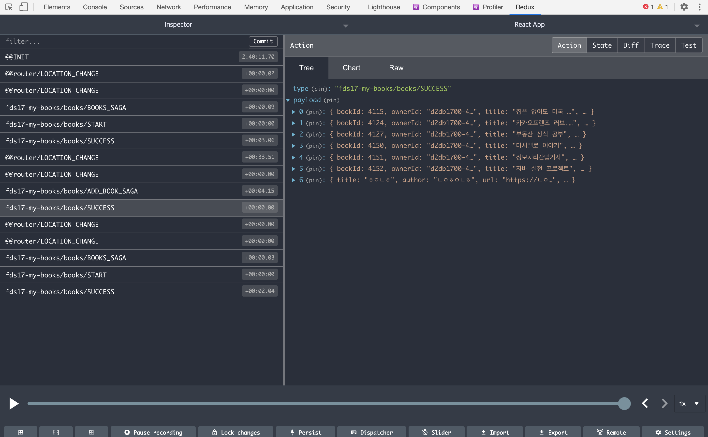

이렇게 액션에 payload에 들어와 있다. 하지만 금방 사라졌다. 왜 사라졌나면 BookList에 돌아왔더니

```js
  useEffect(() => {
    getBooks();
  }, [getBooks]);

```

이게 한번더 발동하면서 getBooks를 다시 호출하면서 BookS_SAGA가 실행 되면서 새로운 데이터를 서버에서 받아온거다.

여기서 두가지를 고민해 봐야한다. 

- 첫 번째 방법은 데이터가 있는 상태에서 페이지로 돌아오면 다시 서버에서 가져오지 않는다.

- 두 번째 방법은 Add페이지에서 데이터를 서버에 보내고 돌아와서 서버에서 가져온다. 

이렇게 두가지 방법이 있는데 둘 중에 첫번째 방법으로 하는게 요즘 트렌드이다. 

요즘 인스타그램을 쓰다가 만약 순간적으로 인터넷이 안 될때 뭘 작성하면 일단 작성된 글이 나의 클라이언트한테는 보이는데 서버에 연결이 안됬습니다. 라고 뜬다 나중에 추 후에 이 방식이 첫 번째 방식이다. 