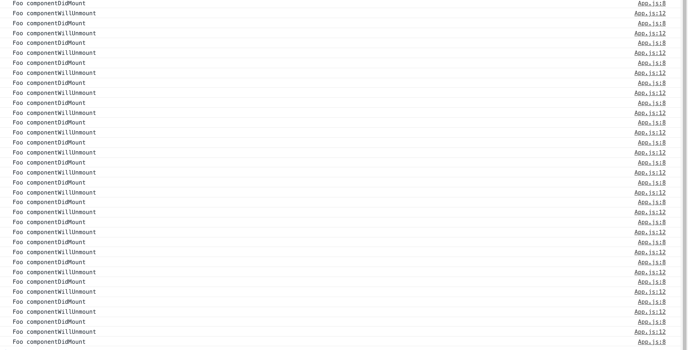
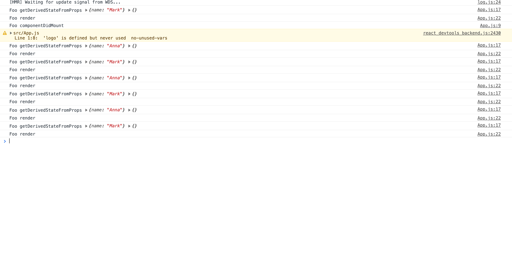
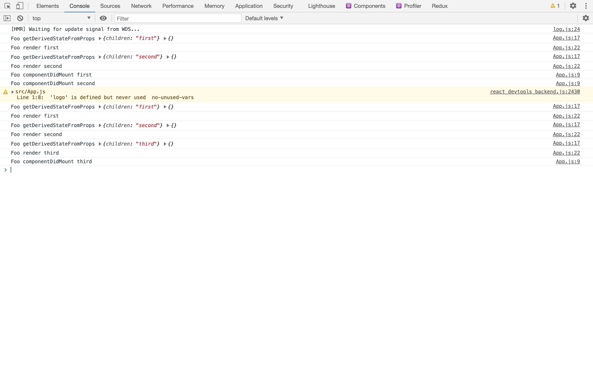
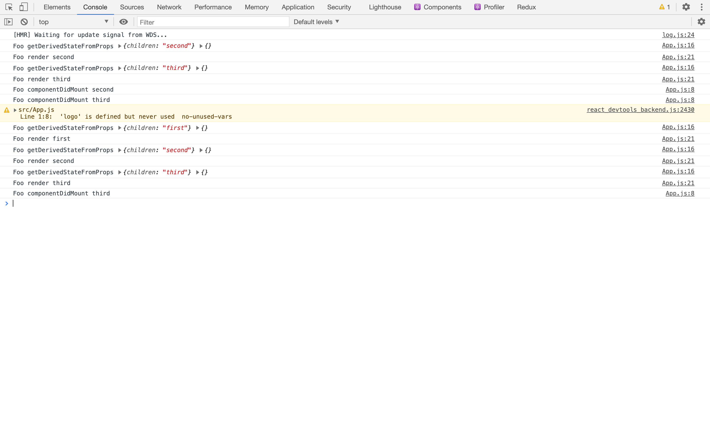
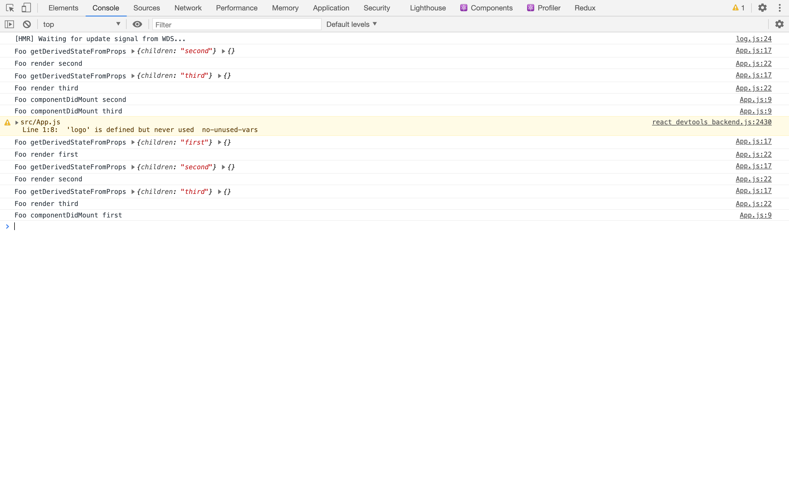

# React Advanced


## Optimizing Performance

필요할 때만 랜더한다.

기본 원칙이다. 뭔가 프로젝트할때 버벅인다 그러면 생각해 본다.

## Reconciliation (화해)

두 개의 레코드 세트가 일치하는지 확인하는 프로세스이다.


같으면 안해야하고 안 같으면 해야한다. 

대전제가 두 가지 있다.

- 서로 다른 타입의 두 엘리먼트는 서로 다른 트리를 만들어낸다.
- 개발자가 key prop을 통해 여러 렌더링 사이에서 어떤 자식 엘리먼트가 변경되지 않아야 할지 표시해 줄 수 있다.

### 엘리먼트 타입이 다른 경우

```js
class App extends React.Component {
  state = {
    count: 0
  };
  componentDidMount() {
    setInterval(() => {
      this.setState({
        count: this.state.count + 1
      });
    }, 1000);
  }
  render() {
    if (this.state.count % 2 === 0) {
      return (
        <div>
          <Foo />
        </div>
      );
    }
    return (
      <span>
        <Foo />
      </span>
    );
  }
}

class Foo extends React.Component {
  componentDidMount() {
    console.log("Foo componentDidMount");
  }

  componentWillUnmount() {
    console.log("Foo componentWillUnmount");
  }

  render() {
    return <p>Foo</p>;
  }
}
```


앱이라는 컴포넌트다 클래스 컴포넌트는 스테이트가 있는데 mount되자 마자 1초마다 setState로 한다. 랜더가 다시 호출 된다. state가 1씩 올라가면서 랜더가 다시 된다. 

한번은 

```js
  if (this.state.count % 2 === 0) {
      return (
        <div>
          <Foo />
        </div>
      );
    }
```

이렇게 되고 한번은

```js
    return (
      <span>
        <Foo />
      </span>
    );
```

이렇게 된다. (번갈아 가면서 1초마다 된다.)

차이점은 div가 foo위에 있고 밑에는 foo위에 span이 있다. 이 div> foo와 span > foo는 같다고 생각한다. 하지만 리엑트는 서로 다른 타입의 두 엘리먼트는 다른 트리를 만든다고 한다.(죽었다 깨어나도 같은 트리가 아니다. ) 왜냐하면 만약에 기계가 Foo를 계산할 수 있지만 연산이 쓸데없이 많이 걸린다. 항상 체크해야 하기 때문에 


이렇게 한다면 어떻게 되냐면 unmount 됬다가 mount됬다가 한다. 

- App.js

```js
import logo from './logo.svg';
import './App.css';
import React from 'react';


class Foo extends React.Component {
  componentDidMount() {
    console.log("Foo componentDidMount");
  }

  componentWillUnmount() {
    console.log("Foo componentWillUnmount");
  }

  render() {
    return <p>Foo</p>;
  }
}

class App extends React.Component {
  state = {
    count: 0
  };
  componentDidMount() {
    setInterval(() => {
      this.setState({
        count: this.state.count + 1
      });
    }, 1000);
  }
  render() {
    if (this.state.count % 2 === 0) {
      return (
        <div>
          <Foo />
        </div>
      );
    }
    return (
      <span>
        <Foo />
      </span>
    );
  }
}
export default App;

```


이렇게 하면 어떻게 되나면



이렇게 두개는 애초에 다른 컴포넌트이다. 서로 다른 인스턴스를 가진 컴포넌트다.


Foo입장은 부모가 다른 타입이다.


## DOM 엘리먼트의 타입이 같은 경우


```js
class App extends React.Component {
  state = {
    count: 0
  };
  componentDidMount() {
    setInterval(() => {
      this.setState({
        count: this.state.count + 1
      });
    }, 1000);
  }
  render() {
    if (this.state.count % 2 === 0) {
      return <div className="before" title="stuff" />;
    }
    return <div className="after" title="stuff" />;
  }
}
```

이 엘리먼트의 어트리뷰트만 바뀐다. 같은 경우에는 문제가 없다.


## DOM 엘리먼트의 타입이 같은데 들어있는 객체가 다를 경우

```js
class App extends React.Component {
  state = {
    count: 0
  };
  componentDidMount() {
    setInterval(() => {
      this.setState({
        count: this.state.count + 1
      });
    }, 1000);
  }
  render() {
    if (this.state.count % 2 === 0) {
      return <div style={{ color: "red", fontWeight: "bold" }} />;
    }
    return <div style={{ color: "green", fontWeight: "bold" }} />;
  }
}
```

이 style만 달라진다.

## 같은 타입의 컴포넌트 엘리먼트

- App.js

```js
class Foo extends React.Component {
  state = {};

  componentDidMount() {
    console.log("Foo componentDidMount");
  }

  componentWillUnmount() {
    console.log("Foo componentWillUnmount");
  }

  static getDerivedStateFromProps(nextProps, prevState) {
    console.log("Foo getDerivedStateFromProps", nextProps, prevState);
    return {};
  }

  render() {
    console.log("Foo render");
    return <p>Foo</p>;
  }
}

class App extends React.Component {
  state = {
    count: 0
  };
  componentDidMount() {
    setInterval(() => {
      this.setState({
        count: this.state.count + 1
      });
    }, 1000);
  }
  render() {
    if (this.state.count % 2 === 0) {
      return <Foo name="Mark" />;
    }
    return <Foo name="Anna" />;
  }
}
```



처음에 세팅된 Mark하고 랜더하고 componentDidMount 됐고 Anna로 바뀔때 getDrivedStateFromProps먼저 불리고 렌더 되고 이렇게 반복된다. 이게 무슨 의미인가 인스턴스가 파괴되었다가 새로 만들어지지는 않는다. 

아까처럼 상위 타입이 다를때 그냥 통째로 willunmount됬다가 mount되고 하지만  이거는 unmount는 전혀 안되고 같은 아이만 돌아가고 있다. render함수가 호출 됐기 때문에 호출했다는건 뭐에요? App이라는 Foo입장에서 봤을때는 부모 컴포넌트가 state가 변경되어서 랜더를 다시 되는 거다. 자식이 프롭스를 바꿔서 계속 랜더를 하는 거다. (같은 위치에 있어야지 unmount가 되지 않는다.)


## 자식에 대한 재귀적 처리(1)

```js
class App extends React.Component {
  state = {
    count: 0
  };
  componentDidMount() {
    setTimeout(() => {
      this.setState({
        count: this.state.count + 1
      });
    }, 3000);
  }
  render() {
    if (this.state.count % 2 === 0) {
      return (
        <ul>
          <Foo>first</Foo>
          <Foo>second</Foo>
        </ul>
      );
    }
    return (
      <ul>
        <Foo>first</Foo>
        <Foo>second</Foo>
        <Foo>third</Foo>
      </ul>
    );
  }
}
```

이 코드를 예상해보자.

한번은 

```js
    if (this.state.count % 2 === 0) {
      return (
        <ul>
          <Foo>first</Foo>
          <Foo>second</Foo>
        </ul>
      );
    }
```

이렇게 생기고 다른 한개는

```js
  return (
      <ul>
        <Foo>first</Foo>
        <Foo>second</Foo>
        <Foo>third</Foo>
      </ul>
    );
```

이렇게 생겼다. 우리생각엔 처음에 first,second가 didmount 될 것이고 third가 되겠죠? 다시 없어지면서 unmount가 불려지고 다시 third가 불려올 것이다.



이렇게 처음에 first 랜더 되고  second 랜더되고 둘다 Didmount되었다가  이제 두번째가 랜더 될때 first가 getDerivedStateFromProps로 들어와서 랜더 됬고 second가 똑같이 들어와서 랜더 되었고 세번째가 Didmount가 되었다.

그렇다면 이 두개는 이 전 Foo처럼 프롭스만 바뀌어서 랜더 된거고 3번째만 추가 한거다.


## 자식에 대한 재귀적 처리(1)

```js
import logo from './logo.svg';
import './App.css';
import React from 'react';
class Foo extends React.Component {
  state = {};

  componentDidMount() {
    console.log("Foo componentDidMount", this.props.children);
  }

  componentWillUnmount() {
    console.log("Foo componentWillUnmount");
  }

  static getDerivedStateFromProps(nextProps, prevState) {
    console.log("Foo getDerivedStateFromProps", nextProps, prevState);
    return {};
  }

  render() {
    console.log("Foo render", this.props.children);
    return <p>{this.props.children}</p>;
  }
}
class App extends React.Component {
  state = {
    count: 0
  };
  componentDidMount() {
    setTimeout(() => {
      this.setState({
        count: this.state.count + 1
      });
    }, 3000);
  }
  render() {
    if (this.state.count % 2 === 0) {
      return (
        <ul>
          <Foo>second</Foo>
          <Foo>third</Foo>
        </ul>
      );
    }
    return (
      <ul>
        <Foo>first</Foo>
        <Foo>second</Foo>
        <Foo>third</Foo>
      </ul>
    );
  }
}
export default App;

```

얘는 처음아이가 second가 첫번째 third가 두번째고 다시 랜더 되면 first가 앞으로 끼어들었다.

이러면 어떻게 될까? 



처음에 second와 third는 위에 1이랑 똑같다 하지만 2번째 렌더때 어떤일이 발생하는 거는 second자리에 first로 바뀌면서 update가 되고 third가 second로 바뀌면서 update되고 third가 새로 추가하면서 DidMount가 된다. 

인간이 봤을때 이걸 원한게 아니다. 컴퓨터가 봤을때는 순서만 본다.

 ```js
   <Foo>second</Foo>
 ```

얘랑

```js
 <Foo>first</Foo>
```

얘가 첫번째 순서에 있고 타입이 같아 그럼 어떻게 해줘? 그럼 달라진 children을 업데이트 해줘

세번째 원레 없네 third만들고 Didmount 호출해줘 이렇게 된다.

이럴때 어떻게 하나 이렇때 하는게 key를 다는거다.

## 자식에 대한 재귀적 처리 (3)

```js
import logo from './logo.svg';
import './App.css';
import React from 'react';

class Foo extends React.Component {
  state = {};

  componentDidMount() {
    console.log("Foo componentDidMount", this.props.children);
  }

  componentWillUnmount() {
    console.log("Foo componentWillUnmount");
  }

  static getDerivedStateFromProps(nextProps, prevState) {
    console.log("Foo getDerivedStateFromProps", nextProps, prevState);
    return {};
  }

  render() {
    console.log("Foo render", this.props.children);
    return <p>{this.props.children}</p>;
  }
}

class App extends React.Component {
  state = {
    count: 0
  };
  componentDidMount() {
    setTimeout(() => {
      this.setState({
        count: this.state.count + 1
      });
    }, 3000);
  }
  render() {
    if (this.state.count % 2 === 0) {
      return (
        <ul>
          <Foo key="2">second</Foo>
          <Foo key="3">third</Foo>
        </ul>
      );
    }
    return (
      <ul>
        <Foo key="1">first</Foo>
        <Foo key="2">second</Foo>
        <Foo key="3">third</Foo>
      </ul>
    );
  }
}
export default App;

```



아까와 다르게 마지막에 DidMount된것은 first가 마운트 되었다. 왜 그런거나? ul밑에 key가 같은게 있으면 

```js
      <Foo key="2">second</Foo>
```

얘를

```js
        <Foo key="2">second</Foo>
```

얘랑 변경한다 first의 키가 순서상 없으니 새로 만들어준다 이런거를 세팅해 줄수 있다 전제로.

최적화할때 필요하다.

근데 만약에 key를 넣으라 해서 index를 넣으면 어떻게 되나 key={0}, key={1}이렇게 된다. 그냥 안하는 것이 낫다. 그러면 아까와 같이 third가 DidMount된다. 

키로 구분을 안하면 그냥 순번으로 하는거다.

예를 들어서 