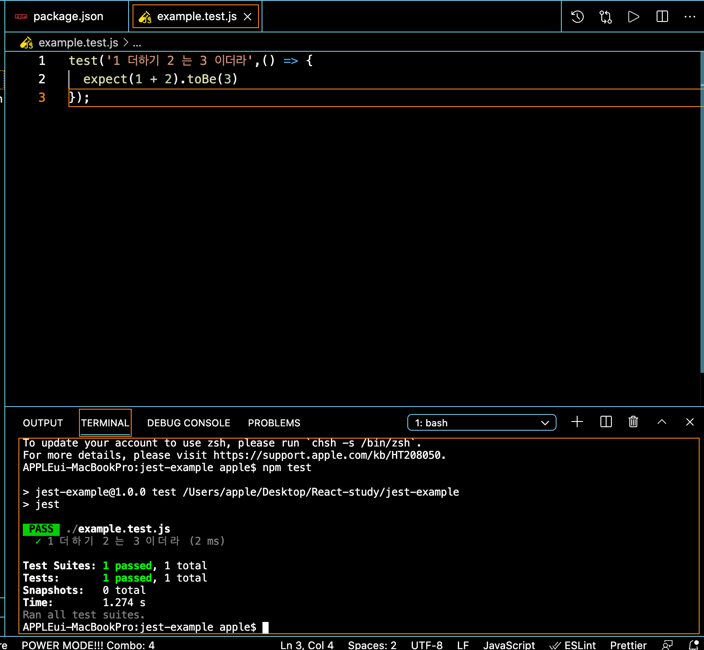
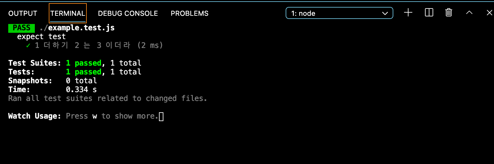
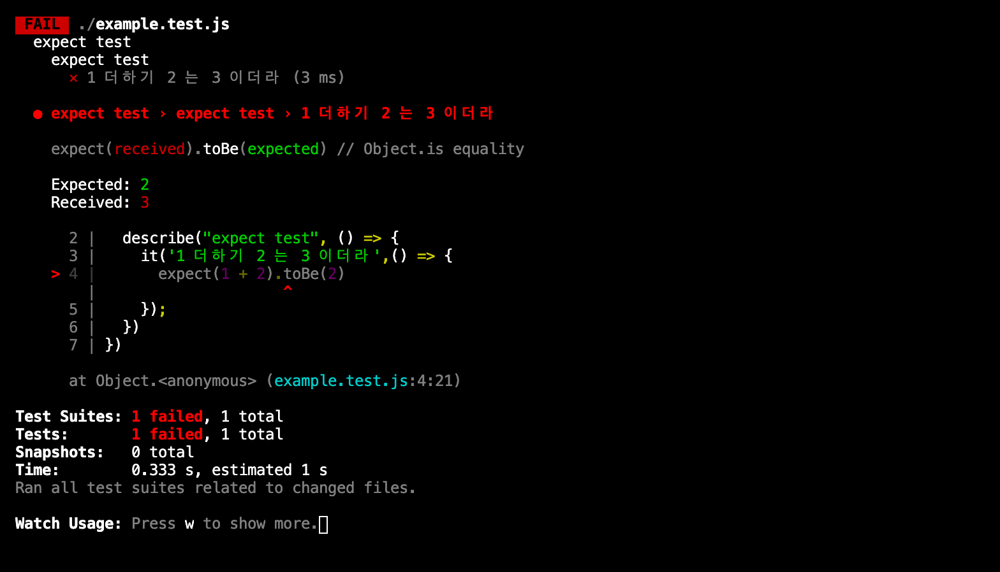

# React Testing


페이지가 잘 옮겨지네? 이건 테스트가 아니다. 코드로 테스트가 도는 거다. 우리의 코드를 믿을 수 있으려면 우리의 코드가 테스트 코드로서 잘 돌아가는 코드인가 확인하는 과정이 필요하고 그게 테스팅이다.

테스트를 잘하면 이걸 약간 수련같은 느낌이다.

## JavaScript Unit Test

테스트 코드는 하나만 짜여져 있는게 아니라 수십게 테스트 코드가 짜여 있고 코드를 고친거 외에 다른 부분에 문제가 없는지 지속적으로 코드가 확인을 해야한다.

1. 색깔이 빨간색이다.
2. 누르면 안녕 떠야한다.
3. 5초뒤에 사라져야한다.

이런 spec이 있으면 이 하나하나 테스트 코드가 되는거고 테스트 코드가 1번을 만들었을 때 눈으로 보고 2번을 만들었을 때 눈으로 보는데 1번을 안볼꺼다. 그래서 사람의 감으로 하는게 아니다.

통합테스트는 애플리케이션 전체에 유저 시나리오 같은 테스트를 수행하는 거에 비해서 쉽게 작성할 수 있다.

통합테스트를 진행하기 전에 문제를 찾아낼 수 있다. 

> 그렇다고 통합테스트가 성공하리란 보장은 없다.

테스트 코드는 살아있는 규칙이 되고 스펙 같은 걸 의미하게 된다. 

> 테스트를 읽고 어떻게 동작하는지도 예측 가능하다.


## jset

- 리엑트의 영향이 크겠지만 가장 핫한 테스트 두구이다.

설정이 쉽다.

- Instant Feedback

고친 파일만 빠르게 테스트 다시 해주는 기능

- Snapshot Testing

컴포넌트 테스트에 중요한 역할을 하는 스냅샷

> 스냅샷: 과거의 한 때 존재하고 유지시킨 컴퓨터 파일과 디렉터리의 모임

간단하게 해보자.

```bash
mkdir jest-example
cd jest-example
npm init -y
npm i jest -D
```

해보자.

그리고 package.json에서 test라는 스크립트에

```js
{
  "name": "jest-example",
  "version": "1.0.0",
  "description": "",
  "main": "index.js",
  "scripts": {
    "test": "jest"
  },
  "keywords": [],
  "author": "",
  "license": "ISC",
  "devDependencies": {
    "jest": "^26.6.3"
  }
}
```

이렇게 바꾼다. 그리고 파일을 하나 만들자.

example.test.js 파일을 만들자.

- example.test.js

```js
test('1 더하기 2 는 3 이더라',() => {
  expect(1 + 2).toBe(3)
});
```

이렇게 쓰고 터미널에서  npm test 쓰면 밑에서 테스트가 돈다.



일단 기본적인 문법을 보자. 

expect가 무엇이나

expect라는 함수를 이용해서 맞는지 아닌지 검사할 수 있도록 도와주는 테스트를 위한 함수이다. 이 expect 라는 아이가 있는건데 jest에는 기본적으로 expect를 지원한다. 

대표적으로 3가지 정도가 있다. 3가지 문법을 전부다 지원하게 도와주는 라이브러리 이름이 Chai 이다. 

1. should
2. expect
3. assert

가 있다. 

### Expect

```js
var expect = chai.expect;

expect(foo).to.be.a('string');
expect(foo).to.equal('bar');
expect(foo).to.have.lengthOf(3);
expect(tea).to.have.property('flavors')
  .with.lengthOf(3);
```

expect는 어떤 아이를 넣고 string이냐 bar랑 똑같은 말이냐 3글자냐 프로퍼티를 가지고 있나 요렇게 하는게 expect다.


should는 뭐나?

### Should

```js
chai.should();

foo.should.be.a('string');
foo.should.equal('bar');
foo.should.have.lengthOf(3);
tea.should.have.property('flavors')
  .with.lengthOf(3);
```

걔가 뭐여야 한다. foo가 bar여야 한다. foo가 3글자 여야 한다. 이런게 should이다.

### Assert

```js
var assert = chai.assert;

assert.typeOf(foo, 'string');
assert.equal(foo, 'bar');
assert.lengthOf(foo, 3)
assert.property(tea, 'flavors');
assert.lengthOf(tea.flavors, 3);
```

foo가 string인지 확인 foo가 bar인지 공격 이런것 이 Assert이다.

## it (= test), describe, expect

```js
it('1 더하기 2 는 3 이더라',() => {
  expect(1 + 2).toBe(3)
});
```


보통 계속 npm test가 귀찮으니

- package.json

```js
{
  "name": "jest-example",
  "version": "1.0.0",
  "description": "",
  "main": "index.js",
  "scripts": {
    "test": "jest",
    "test:watch": "jest --watch"
  },
  "keywords": [],
  "author": "",
  "license": "ISC",
  "devDependencies": {
    "jest": "^26.6.3"
  }
}

```

이렇게 달아준다. 그리고 npm run test:watch 로 실행한다.

보통 layer를 줄수 있다. 그게 describe('카테고리 이름' () => {}) 이렇게 준다.

```js
describe("expect test", () => {
  it('1 더하기 2 는 3 이더라',() => {
    expect(1 + 2).toBe(3)
  });
});
```



describe를 한 칸 더 줄 수 있다.

```js
describe("expect test", () => {
  describe("expect test", () => {
    it('1 더하기 2 는 3 이더라',() => {
      expect(1 + 2).toBe(3)
    });
  })
})
```

한번 틀려보자.

```js
describe("expect test", () => {
  describe("expect test", () => {
    it('1 더하기 2 는 3 이더라',() => {
      expect(1 + 2).toBe(2)
    });
  })
})
```



2가 되어야하는데 3이 들어왔다 이런이야기다.

Expected가 오른쪽이고 Received가 왼쪽이다. 보통 이렇게 쓴다.

```js
describe("expect test", () => {
  describe("expect test", () => {
    it('1 더하기 2 는 3 이더라',() => {
      const received = 1 + 2;
      const expected = 3;
      expect(received).toBe(expected)
    });
  })
})
```

그렇게하고 다음에 객체를 비교해 보자.


```js
describe("expect test", () => {
  describe("expect test", () => {
    it('1 더하기 2 는 3 이더라',() => {
      const received = 1 + 2;
      const expected = 3;
      expect(received).toBe(expected)
    });

    it('{name: "Mark"}는 {name: "Mark"}이더라',() => {
      const received = {name: "Mark"};
      const expected = {name: "Mark"};
      expect(received).toBe(expected)
    });
    
  })
})
```

이렇게 하면 틀리다고 나온다 이유는 참조값이 다르기 때문에 아래와 같이 toEqual 함수를 사용해야 한다.

```js
  describe("expect test", () => {
    describe("expect test", () => {
      it('1 더하기 2 는 3 이더라',() => {
        const received = 1 + 2;
        const expected = 3;
        expect(received).toBe(expected)
      });

      it('{name: "Mark"}는 {name: "Mark"}이더라',() => {
        const received = {name: "Mark"};
        const expected = {name: "Mark"};
        expect(received).toEqual(expected)
      });
      
    })
  })


```


## .to

```js
describe('.to~ test', () => {
  it('.toBe', () => {
    expect(37).toBe(37);
  });
  it('.toHaveLength', () => {
    expect('hello').toHaveLength(5);
  });
  it('.toHaveProperty', () => {
    expect({ name: 'Mark' }).toHaveProperty('name');
    expect({ name: 'Mark' }).toHaveProperty('name', 'Mark');
  });
  it('.toBeDefined', () => {
    expect({ name: 'Mark' }.name).toBeDefined();
  });
  it('.toBeFalsy', () => {
    expect(false).toBeFalsy();
    expect(0).toBeFalsy();
    expect('').toBeFalsy();
    expect(null).toBeFalsy();
    expect(undefined).toBeFalsy();
    expect(NaN).toBeFalsy();
  });
  it('.toBeGreaterThan', () => {
    expect(10).toBeGreaterThan(9);
  });
});

describe('.to~ test', () => {
  it('.toBeGreaterThanOrEqual', () => {
    expect(10).toBeGreaterThanOrEqual(10);
  });
  it('.toBeInstanceOf', () => {
    class Foo {}
    expect(new Foo()).toBeInstanceOf(Foo);
  });
  it('.toBeNull', () => {
    expect(null).toBeNull();
  });
  it('.toBeTruthy', () => {
    expect(true).toBeTruthy();
    expect(1).toBeTruthy();
    expect('hello').toBeTruthy();
    expect({}).toBeTruthy();
  });
  it('.toBeUndefined', () => {
    expect({ name: 'Mark' }.age).toBeUndefined();
  });
  it('.toBeNaN', () => {
    expect(NaN).toBeNaN();
  });
});
```


## .not.to~

```js
describe('.not.to~ test', () => {
  it('.not.toBe', () => {
    expect(37).not.toBe(36);
  });

  it('.not.toBeFalsy', () => {
    expect(true).not.toBeFalsy();
    expect(1).not.toBeFalsy();
    expect('hello').not.toBeFalsy();
    expect({}).not.toBeFalsy();
  });

  it('.not.toBeGreaterThan', () => {
    expect(10).not.toBeGreaterThan(10);
  });
});
```


toBeDefined는 not.toBeundefined랑 같다. 이게 아닌지를 확인 할 건지 맞는지 확인을 하건지는 다르다.

