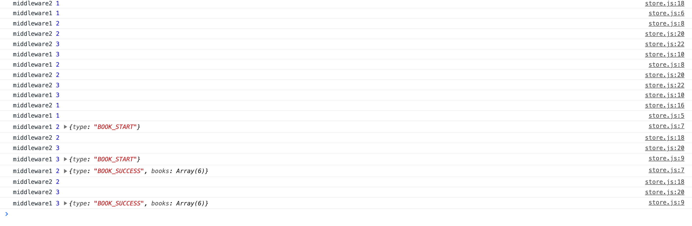

# Redux

## Redux Basic

1. 리덕스 개요
2. 리덕스 Action
3. 리덕스 Reducers
4. createStore, combineReducers
5. Context 로 연결하기
6. react-redux

이 리덕스는 난이도가 상당히 높다.

## Redux Basic

### Redux 개요

이전에 배웠던게 ContextApi를 배웠다. 리덕스는 context에 의해서 우리가 어떻게 하면 프로그램 복잡도를 최소한으로 하고 규칙화된 코드를 짤 것이냐에 집중을 하면 보면 된다.

하위 컴포넌트에서 최상위 컴포넌트에 있는 메서드를 이용해서 데이터를 set해서 렌더를 다시 하도록 유도를 한 것이다.
그래서 이 부분을 정확하게 쉽게 할 수 있냐에 집중을 하고 있는게 Redux이다.

예전에 컴포넌트간에 커뮤니케이션을 하려면 상위 컴포넌트에 데이터와 데이터를 바꾸는 아이가 있고 각자 하위 컴포넌트가 나눠가진 형태로 호출하고 그 데이터를 다시 그리는게 기본이었다.

;

위 그림에서 왼쪽 컴포넌트에서 오른쪽 컴포넌트로 갈때 상위 컴포넌트에서 데이터와 데이터를 바꾸는 함수를 사용해 오른쪽 컴포넌트의 상태를 바꿀 수 있었다.

그래서 state와 state를 바꾸는 함수가 최상위 컴포넌트에 있어야만 했다.

하지만 이제 바뀌었다. 가운데(최상위 컴포넌트)를 통하지 않은 것 처럼 보이지만 실은 통하지만 실제 보이는건 하위 컴포넌트에서 행동을 하게 되면 외부 상태가 변해서 가져다 쓰는 다른 컴포넌트가 렌더가 다시되도록 로직이 되어있다. 아래와 같은 그림처럼 되었다.

;

저 파란색 공은 어디에 있나? 그 파란색 공은 컨텍스트이다. 컨텍스트에 넣어주는 state와 state를 변경하는 로직이 들어 있는데 그 로직을 사용하는 방법이 리덕스 만의 방식으로 제공해 준다.

그 컨텍스트의 이름이 스토어 이다.

스토어라고 부르면 보통은 state와 state를 바꾸는 로직을 한꺼번에 담고 있는 아이라고 생각 하면 된다.

;

이런 그림이다. state와 state를 변경하는 로직이 Store에 있고 이제 하위 컴포넌트(초록색)이 뭔가를 하면 store에서 상태를 변경해 다른 컴포넌트에다 연결할 수 있다..(파란색)

연결하는 방식은 컨슈머라든가 useContext를 내부적으로 구현이 되어 있다. 갖다 쓰겠다 등록을 하면 파란색을 가지고 있는 아이는 다시 랜더를 할 것이다. 초록색 선을 하는 공은 파란색처럼 변경에 의해서 그림을 그리는 아이는 아니고 그냥 보라색 공은 변해라 얍 하면 되는 아이이다. 초록색 선은 변경하는 사람이로 파란색 선은 그 변경에 의해서 데이터 변화를 트랙킹 하다가 그림을 그리는 아이이다.

위처럼 이렇게 분리된 것 처럼 보이지만 실제로는 파란색만 있는 아이가 있고 초록색이 있는 아이가 있고 둘다 있는 아이가 있다.

### 리턱스를 배운다는 것..

1. 단일 스토어를 만드는 법(스토어를 만드는 법)
   - 가장 중요한 요소는 이 안에 state가 무엇이냐를 설정하는 것과 그 state를 어떻게 바꾸느냐를 담고 있는게 중요하다.
2. 리액트에서 스토어 사용하는 법
   - 위에서 트리들은 컴포넌트 트리이다. 컴포넌트 트리는 리엑트 컴포넌트로 되어 있는 거고 store에 연결해서 어떻게 사용하는지 익히는 것(만약 다른 것을 배운다 하면 vue컴포넌트에서 스토어를 사용하는 법도 있고 앵귤러에서 스토어에서 사용하는 법도 있다.)

- 단일 스토어다!!!

저 위에 그림에서 store는 우리의 앱에서는 하나이다. (하나가 아닌 것도 있나? 그게 mobx이다 하나가 아니고 여러개이다. )
리덕스는 단일 스토어이다. 2개의 처리 방식이 다를 수 도 있다.  
리덕스는 단일 스토어 이기 때문에 이 스토어 하나에 있는 단일 스테이트가 앱이 커질 수록 복잡해 진다. 단일 스토어이기 때문에 그 스테이트를 분리하게 합니다 그래서 분리하는 방법을 알려준다. mobx는 스토어가 분리가 되어 있기 때문에 하나로 합치려고 하지 않는다.

단일 스토어를 만드려면 리덕스를 사용한다. (단일 스토어를 만드는 법은 똑같다.)

- [만들기] 단일 스토어 사용하기

  - import redux

  - 액션을 정의하고,
  - 액션을 사용하는, 리듀서를 만들고,
  - 리듀서들을 합친다.
  - 최종 합쳐진 리듀서를 인자로, 단일 스토어를 만든다.


리덕스는 큰 장점이 있다. 누군가가 짜도 비슷할 것이다.
보통 리덕스를 사용하면 코드가 안정적이고 보수적으로 관리를 하게 된다. (내부적인 로직은 다를 수도 있다. 하지만 찾으려가면 꼭 거기로 찾으려 갈 수 밖에 없다.)

- [사용하기] 준비한 스토어를 리액트 컴포넌트에서 사용하기
  - inport react-redux
  - connect함수를 이용해서 컴포넌트에 연결

connect함수는 hoc함수이다. hoc는 한물 갔다. 훅이있다.(너무 좋다.)


```bash
npx create-react-app redux-start
```

해서 프로젝트를 하나 생성해 보자.

그리고 만든 폴더로 들어가서 

```bash
npm i redux
```

redux를 설치하자.


## Action

Action을 하기 전에 state가 구상되어 있어야 한다.

### 리덕스의 액션이란?

- 액션은 사실 그냥 객체 입니다.(플레인 객체)
- 두 가지 형태의 액션이 있습니다.
  - {type: 'TEST'} // payload 없는 액션
  - {type: 'TEST', params: 'hello'} // payload 있는 액션
- type만이 필수 프로퍼티이며 type은 문자열 이다.

> 문자열의 가장 큰 단점은 오타이다.


### 리덕스의  액션 생성자란?

```react
function 액션생성자(...args) { return 액션; }
```

- 액션을 생성하는 함수를 "액션 생성자 (Action Creator)" 라고 합니다. 액션을 리턴하는 함수이다.
- 함수를 통해 액션을 생성해서 액션 객체를 리턴해준다.
- createTest('hello'); // {type: 'TEST', params: 'hello'} 리턴

### 리덕스의 액션은 어떤 일을 하나요?

- 액션 생성자를 통해 액션을 만들어 낸다.
- 만들어낸 액션 객체를 리덕스 스토어에 보낸다.


초록색이 store로 날라간게 액션 객체이다. 

- 리덕스 스토어가 액션 객체를 받으면 스토어의 상태값이 변경된다.

액션을 보냈으면 파란색 아이들이 다 바꾸려고 랜더할려고 한다. 랜더를 하려고 하고 싶으면 액션을 만들어서 보내야 한다.

- 변경된 상태 값에 의해 상태를 이용하고 있는 컴포넌트가 변경된다.
- 액션은 스토어에 보내는 일종의 인풋이라 생각할 수 있다.


### 액션을 준비하기 위해서는?

- 액션의 타입을 정의하여 변수로 빼는 단계
  - 강제는 아니다.
  - 그냥 타입을 문자열로 넣기에는 실수를 유발할 가능성이 크다.
  - 미리 정의한 변수를 사용하면 스펠링에 주의를 덜 기울여도 된다.
- 액션 객체를 만들어 내는 함수를 만드는 단계 (actioncreator를 만든다.)
  - 하나의 액션 객체를 만들기 위해 하나의 함수를 만들어 낸다.
  - 액션의 타입은 미리 정의한 타입 변수로 부터 가져와서 사용한다.


### 액션 준비 코드

```js
// actions.js

// 액션의 type 정의
// 액션의 타입 => 액션 생성자 이름
// ADD_TODO => addTodo
export const ADD_TODO = 'ADD_TODO';

// 액션 생산자
// 액션의 타입은 미리 정의한 타입으로 부터 가져와서 사용하며,
// 사용자가 인자로 주지 않습니다.
export function addTodo(text) {
  return { type: ADD_TODO, text }; // { type: ADD_TODO, text: text }
}
```


actions.js를 만들자.


action을 만들기 전에 state를 구상해보자. 어떤 state를 줄지 생각해 보자. 
["장보기","산책하기"]; 이런 택스트들이 ADD_TODO라는 아이를 액션을 실행할 때 같이 들어가야 하는 단어기 때문에 이런 아이들이 있는 경우에는 페이로드를 넣어줘야한다. (페이로드란 화물이 도착하면 짐을 넣고 보내는 걸로 이해)

ADD_TODO할때 장보기를 넣고 실행하면 type이 ADD_TODO이고 text가 장보기인 액션 객체가 만들어 진다.

## Reducers - 리듀서

### 리덕스의 리듀서란 ?

- 액션을 주면, 그 액션이 적용되어 달라진(안달라질수도..) 결과를 만들어 줌

- 그냥 함수이다.
  - Pure Function (순수 함수)
  - Immutable
    - 왜?
      - 리듀서를 통해 스테이트가 달라졌음을 리덕스가 인지하는 방식


순수함수는 비순수함수와 다르게 부수효과가 일어나지 않고 같은 인풋을 넣으면 같은 결과를 만들어 주는 순수함수이다.

그리고 immutable이다. 리듀서를 통해서 스테이트가 달라졌음을 리덕스가 인지를 한다.

 ```js
function 리듀서(previousState, action) {
  return newState;
}
 ```

- 액션을 받아서 스테이트를 리턴하는 구조
- 인자로 들어오는 previousState와 리턴되는 newState는 다른 참조를 가지도록 해야합니다.

previousState: 이전의 상태값

action: 현재 들어온 액션


그림에서 보면 보라색이 액션을 던지면 store안에서 reducer함수가 실행된다. 어떻게 실행 되나? 초록색을 받았을 때의 현재 상태와 초록색 액션을 인자로 해서 바뀔 스테이트를 리턴해 내는 그런 함수를 실행하는 것 이다.

그래서 첫 번째 인자가 현재 스테이트(이전의 스테이즈) 2번째는 방금 받아들인 액션 리턴이 새로운 스테이트이다. 

받은 previousState를 새로 만들어서 보내야한다. (이뮤터블하게) setState할때와 같은 방식이다.

reducers.js로 만들자,

```js

// 언제 실행 되나?
// 1. 앱이 최초로 실행될 때 => 초기 state를 만들어서 할당한다. 이런 행동을 해야한다.
// 2. 액션이 날라왔을 때
function todoApp(previousState, action) { 
  // 앱이 최초로 실행됬을 때 타이밍을 알려면 최초에 previousState는 undefined가 들어온다.
  // 최초에 초기값 할당
  if (previousState === undefined) {
    return []; // 초기값
  }
  
  // 변경이 일어나는 로직
  
  // 변경이 안일어났을때
  return previousState;
}
```


변경이 일어날려면 밑에와 같이 해야한다.


```js

import { ADD_TODO } from "./actions";

// 언제 실행 되나?
// 1. 앱이 최초로 실행될 때 => 초기 state를 만들어서 할당한다. 이런 행동을 해야한다.
// 2. 액션이 날라왔을 때
function todoApp(previousState, action) { 
  // 앱이 최초로 실행됬을 때 타이밍을 알려면 최초에 previousState는 undefined가 들어온다.
  // 최초에 초기값 할당
  if (previousState === undefined) {
    return []; // 초기값
  }
  
  // 변경이 일어나는 로직
  if (action.type === ADD_TODO) {
    return [...previousState, action.text];
  }
  
  // 변경이 안일어났을때
  return previousState;
}
```


정리해 보면 todoApp을 실행하는데 현재값과 새로운 액션이 들어왔다. 근데 만약에 undefined면 최초이기 때문에 그때 state값을 빈배열로 초기값으로 할당하고 만약 다른 액션이 들어오거나 다른 일이 일어나면은 반응을 안한다.

```js
  if (action.type === ADD_TODO) {
    return [...previousState, action.text];
  }
```

이거에만 반응할 일으키꺼니까 ADD_TODO라는 타입에 액션을 발행한 것이기 때문에 그것에 변경하는 로직을 추가해 주고 이거 외에는 변경 안한다고 한다.

이때까지 놀라운건 지금까지 import redux를 한적이 없다.

액션에서 addTodo를 쓴 적이 없다. 지금까지 한번도 발생시킨적이 없기 때문이다. reducer를 만들때 발생하는게 아니라 누가 발생시키는 건가? 그것은 리엑트 컴포넌트가 클릭을 했을때  addTodo를 넣는다 이런 식이다.


## createStore

store가 중요하다. redux로 부터 import를 하는 함수이다.

```js
const store = createStore(리듀서);
```

우리가 만든 리유서인 todoApp이라는 리듀서이다. 그래서 todoApp이라는 리듀서를 인자로 넣고 createStore를 실행하면 그 결과로 Store가 나온다.

- createStore 아이는 이런 타입을 가지고 있다.

  - 첫번째 인자로 reducer: Reducer를 받고
  - 두번째 인자로 preloadedState를 받고
  - 세번째 인자로 enhancer?: StoreEnhancer을 받는다.

  지금은 두번째인자 세번째 인자는 사용을 안하고 Reducer만 가지고 실행을 할 것이다.

  enhancer는 나중에 자세히 공부 할 것이다.

  두번째 인자는 최초에 previousState가 undefined인데 2번째 인자를 뭔가를 넣으면 previousState가 undefined가 아니게 된다.


### 스토어 만들기

src에 store.js를 만들자.

- store.js

```js
import { createStore } from 'redux';

const store = createStore()
```

해서 createStore에 첫 번째 인자로 우리가 만든 리듀서를 넣는다. reducers.js에서 export해서 사용해 보자.


- reducers.js

```js

import { ADD_TODO } from "./actions";

// 언제 실행 되나?
// 1. 앱이 최초로 실행될 때 => 초기 state를 만들어서 할당한다. 이런 행동을 해야한다.
// 2. 액션이 날라왔을 때
export function todoApp(previousState, action) { 
  // 앱이 최초로 실행됬을 때 타이밍을 알려면 최초에 previousState는 undefined가 들어온다.
  // 최초에 초기값 할당
  if (previousState === undefined) {
    return []; // 초기값
  }
  
  // 변경이 일어나는 로직
  if (action.type === ADD_TODO) {
    return [...previousState, action.text];
  }
  
  // 변경이 안일어났을때
  return previousState;
}
```


store.js


```js
import { createStore } from 'redux';
import {todoApp} from './reducers';

const store = createStore(todoApp)

export default store;
```

이렇게 만들자.

store를 가져다 써보자 .


Index.js에서 써보자.


- Index.js

```js
import React from 'react';
import ReactDOM from 'react-dom';
import './index.css';
import App from './App';
import reportWebVitals from './reportWebVitals';
import store from './store';

console.log(store);

ReactDOM.render(
  <React.StrictMode>
    <App />
  </React.StrictMode>,
  document.getElementById('root')
);

// If you want to start measuring performance in your app, pass a function
// to log results (for example: reportWebVitals(console.log))
// or send to an analytics endpoint. Learn more: https://bit.ly/CRA-vitals
reportWebVitals();

```


콘솔에는 찍히는건 아래와 같다.


함수이름이 dispatch getState replaceReducer subscribe 4개밖에 없다.

redux라는 라이브러리는 엄청 일을 하는 라이브러리이다. 

### store

- Store.getState();
- Store.dispatch(액션); store.dispatch(액션생성자());
- const unsubscribe = store.subscribe(() => {});
  - 리턴이 unsubscribe 라는 점
  - Unsubscribe(); 하면 제거
- Store.replaceReducer(다른리듀서); // 얘는 쓸일이 별로 없다.(다른 리듀서로 교체 하는 아이다.)


- index.js

```js
import React from 'react';
import ReactDOM from 'react-dom';
import './index.css';
import App from './App';
import reportWebVitals from './reportWebVitals';
import store from './store';

console.log(store.getstate());

ReactDOM.render(
  <React.StrictMode>
    <App />
  </React.StrictMode>,
  document.getElementById('root')
);

// If you want to start measuring performance in your app, pass a function
// to log results (for example: reportWebVitals(console.log))
// or send to an analytics endpoint. Learn more: https://bit.ly/CRA-vitals
reportWebVitals();


```

콘솔에 찍히는 것은 빈 배열이다. 이 빈배열은 리듀서에 있는 초기 값이다. 


그 다음 할 일은 dispatch를 해보자.


action.js를 addTodo를 바꿔보자

- action.js

```js
export const ADD_TODO = 'ADD_TODO';


export const addTodo = (text) => (
   {type: ADD_TODO, text } // { type: ADD_TODO, text: text }
  )

// 최초의 상태값
// ["text"]

```

그리고 index.js에서 dispatch를 사용해 보자.


- index.js

```js
import React from 'react';
import ReactDOM from 'react-dom';
import './index.css';
import App from './App';
import reportWebVitals from './reportWebVitals';
import store from './store';
import { addTodo } from './actions';

console.log(store.getstate());
store.dispatch(addTodo('장보기'));
ReactDOM.render(
  <React.StrictMode>
    <App />
  </React.StrictMode>,
  document.getElementById('root')
);

// If you want to start measuring performance in your app, pass a function
// to log results (for example: reportWebVitals(console.log))
// or send to an analytics endpoint. Learn more: https://bit.ly/CRA-vitals
reportWebVitals();
```

아무일도 안생기지만 store.dispatch(addTodo('장보기')); 이 아이가 전에 위 그림에서 보면 초록색 아이이다.
dispatch를 하면 action이 store한테 도달 하는 것이다.

그러면 console을 다시 찍어 보자.

```js
import React from 'react';
import ReactDOM from 'react-dom';
import './index.css';
import App from './App';
import reportWebVitals from './reportWebVitals';
import store from './store';
import { addTodo } from './actions';

console.log(store.getstate());
store.dispatch(addTodo('장보기'));
console.log(store.getstate());

ReactDOM.render(
  <React.StrictMode>
    <App />
  </React.StrictMode>,
  document.getElementById('root')
);

// If you want to start measuring performance in your app, pass a function
// to log results (for example: reportWebVitals(console.log))
// or send to an analytics endpoint. Learn more: https://bit.ly/CRA-vitals
reportWebVitals();
```


다시 찍으면 ["장보기"]가 들어 있을 것이다.

이제 subscribe()를 써보자. 

subscribe는 구독이라는 의미이다. 어떤 것을 구독 하겠나요? store안에 있는 state가 변하면 새로 실행 되는 것이다. 

- Index.js

```js
import React from 'react';
import ReactDOM from 'react-dom';
import './index.css';
import App from './App';
import reportWebVitals from './reportWebVitals';
import store from './store';
import { addTodo } from './actions';

console.log(store.state());

store.subscribe(() => {
  console.log(store.state());
})

store.dispatch(addTodo('장보기'));

ReactDOM.render(
  <React.StrictMode>
    <App />
  </React.StrictMode>,
  document.getElementById('root')
);

// If you want to start measuring performance in your app, pass a function
// to log results (for example: reportWebVitals(console.log))
// or send to an analytics endpoint. Learn more: https://bit.ly/CRA-vitals
reportWebVitals();


```


하면 장보기가 들어온다. (일단 구독을 하고 dispatch를 해야한다. 이제 들어온다.)

subscribe는 최초에 설정될 때에는 할 수가 없다. 생성될때 빈배열로 세팅이 된다.

생성이 될때는 

- Store.js

```js
import { createStore } from 'redux';
import {todoApp} from './reducers';

const store = createStore(todoApp)

export default store;
```

이 때 이다.  이 store.js에다가 subscribe를 해봐야 초기값을 설정되는걸 여기서 볼수 없다.


이제 index.js에서 한거 지우자.

- index.js

  ```js
  import React from 'react';
  import ReactDOM from 'react-dom';
  import './index.css';
  import App from './App';
  import reportWebVitals from './reportWebVitals';
  import store from './store';
  
  
  ReactDOM.render(
    <React.StrictMode>
      <App store={store}/>
    </React.StrictMode>,
    document.getElementById('root')
  );
  
  // If you want to start measuring performance in your app, pass a function
  // to log results (for example: reportWebVitals(console.log))
  // or send to an analytics endpoint. Learn more: https://bit.ly/CRA-vitals
  reportWebVitals();
  
  
  ```

  그리고 App한테 store를 준다.

이제 App에서 store를 받을 수 있다.

- App.js

```js
import logo from './logo.svg';
import './App.css';

function App({ store }) {
  console.log(store.getState());
  return (
    <div className="App">
      <header className="App-header">
     
      </header>
    </div>
  );
}

export default App;

```


위에 처럼 하면 콘솔에 빈배열이 나온다.

화면에 출력해 보자.


- App.js

```js
import logo from './logo.svg';
import './App.css';

function App({ store }) {
const state = store.getState();
  return (
    <div className="App">
      <header className="App-header">
        {JSON.stringify(state)}
        <button>add</button>
      </header>
    </div>
  );
}

export default App;


```

화면에 나올 것이고 add를 누르면 새로운 아이를 추가할 것이다.


- App.js

```js
import './App.css';
import { addTodo } from './actions';


function App({ store }) {
  const state = store.getState();
    return (
      <div className="App">
        <header className="App-header">
          {JSON.stringify(state)}
          <button onClick={click}>add</button>
        </header>
      </div>
    );
    function click() {
      store.dispatch(addTodo('아무거나'))
    }
  }
  
  export default App;
  
```


이렇게 하고 버튼을 누르면 될까 안될까?? 

당연히 안된다. 왜 안될까? 얘를 눌렸다고 해서 return이 다시 실행 하는 건 아니다. 

조금 꼼수를 해서 실행하도록 하자. 

아래와 같이 useState를 사용을 하자.

- App.js

```js
import './App.css';
import { addTodo } from './actions';
import { useState } from 'react';


function App({ store }) {
  const [state, setState] = useState(store.getState());

    return (
      <div className="App">
        <header className="App-header">
          {JSON.stringify(state)}
          <button onClick={click}>add</button>
        </header>
      </div>
    );
    function click() {
      store.dispatch(addTodo('아무거나'))
    }
  }
  
  export default App;
```


그리고 클릭을 했을때 반응을 해야해서 useEffect()를 사용하자.


- App.js

```js
import './App.css';
import { addTodo } from './actions';
import { useEffect, useState } from 'react';


function App({ store }) {
  const [state, setState] = useState(store.getState());
    
  useEffect(() => {
      store.subscribe(() => {
        setState(store.getState());
      })
    },[store])


    return (
      <div className="App">
        <header className="App-header">
          {JSON.stringify(state)}
          <button onClick={click}>add</button>
        </header>
      </div>
    );
    function click() {
      store.dispatch(addTodo('아무거나'))
    }
  }
  
  export default App;
  
  

```


이렇게 하면 잘 돌아간다. 

위에서 한가지가 빠졌다. 

```js
  useEffect(() => {
      store.subscribe(() => {
        setState(store.getState());
      })
    },[store])


```

componentDidMount 시점이다. 그래서 componentWillUnmount에 항상 해지한게 있어야 한다.


- App.js

```js
import './App.css';
import { addTodo } from './actions';
import { useEffect, useState } from 'react';


function App({ store }) {
  const [state, setState] = useState(store.getState());
    
    useEffect(() => {
      const unsubscribe = store.subscribe(() => {
        setState(store.getState());
      })
      return () => {
        unsubscribe();
      }
    },[store])

    return (
      <div className="App">
        <header className="App-header">
          {JSON.stringify(state)}
          <button onClick={click}>add</button>
        </header>
      </div>
    );
    function click() {
      store.dispatch(addTodo('아무거나'))
    }
  }
  
  export default App;
  
  

```

이렇게 만든다.

어디서는 store만 있으면 dispatch에 반응할 수 있는 리엑트 컴포넌트가 되겠구나 라는 생각이 든다.

어디서는 store를 가져다 쓸 수 있는 상태를 하게해주는 contextAPI를 사용하면 된다.

Src/contexts폴더를 만들어서 ReduxContext.js파일을 생성하자.


- ReduxContext.js

```js
import React from "react";

const ReduxContext = React.createContext();

export default ReduxContext;
```


이게 끝이다 그리고 ReduxContext를 index.js에다가 

- index.js

```js
import React from 'react';
import ReactDOM from 'react-dom';
import './index.css';
import App from './App';
import reportWebVitals from './reportWebVitals';
import store from './store';
import ReduxContext from './contexts/ReduxContext';


ReactDOM.render(
  <React.StrictMode>
    <ReduxContext.Provider value={store}>
      <App />
    </ReduxContext.Provider>
  </React.StrictMode>,
  document.getElementById('root')
);

// If you want to start measuring performance in your app, pass a function
// to log results (for example: reportWebVitals(console.log))
// or send to an analytics endpoint. Learn more: https://bit.ly/CRA-vitals
reportWebVitals();


```

이렇게 Provider로 감싸고 App.js가서 

- App.js

```js
import './App.css';
import { addTodo } from './actions';
import { useContext, useEffect, useState } from 'react';
import ReduxContext from './contexts/ReduxContext';


function App() {
  const store = useContext(ReduxContext);

  const [state, setState] = useState(store.getState());
    
    useEffect(() => {
      const unsubscribe = store.subscribe(() => {
        setState(store.getState());
      })
      return () => {
        unsubscribe();
      }
    },[store])

    return (
      <div className="App">
        <header className="App-header">
          {JSON.stringify(state)}
          <button onClick={click}>add</button>
        </header>
      </div>
    );
    function click() {
      store.dispatch(addTodo('아무거나'))
    }
  }
  
  export default App;
  
  

  

```

이렇게 하면 잘 나올 것이다.


로직과 관계 없이 복잡한 내용들이 있다.

예를 들면 useEffect를 사용했던 거다.  어떤 컴포넌트든지 store랑 연결하면 100% 일어나야하는 일이다.

그래서 요런거를 빼서 hock을 만든다. 이것은 커스텀 훅인데 이 커스텀 훅을 누가 만들어서 주는 것일까? 그것은 리엑트 리덕스에서 만들어서 줄 것이다. 위에는 직접 만든 것이다. (알고 보면 저런 식으로 동작하는 코드이다.)

하나 더 말들자 src에 뉴 폴더해서 components 폴더 만들고 Form.jsx 파일와 todoList.jsx를 만들자.


- TodoList.jsx

```js
import React, { useContext, useEffect, useState } from 'react';
import ReduxContext from '../contexts/ReduxContext';

export default function TodoList() {
  const store = useContext(ReduxContext);
  const [todos, setTodos] = useState(store.getState());

  useEffect(() => {
    const unsubscribe = store.subscribe(() => {
      setTodos(store.getState());
    })
    return () => {
      unsubscribe();
    }
  }, [store])
  return (
  <div>
    <ul>
      {todos.map(todo => <li>{todo}</li>)}
    </ul>
  </div>
  )
}
```

이렇게 만든 후 App.js에서 사용해 보자.


- App.js

```js
import './App.css';
import { addTodo } from './actions';
import { useContext, useEffect, useState } from 'react';
import ReduxContext from './contexts/ReduxContext';
import TodoList from './components/TodoList';


function App() {
  const store = useContext(ReduxContext);

  const [state, setState] = useState(store.getState());
    
    useEffect(() => {
      const unsubscribe = store.subscribe(() => {
        setState(store.getState());
      })
      return () => {
        unsubscribe();
      }
    },[store])

    return (
      <div className="App">
        <header className="App-header">
          <TodoList />
          <button onClick={click}>add</button>
        </header>
      </div>
    );
    function click() {
      store.dispatch(addTodo('아무거나'))
    }
  }
  
  export default App;
```


잘 나올 것이다.


이제 Form.jsx를 넣어보자.

- Form.jsx

```js
import React from 'react';

export default function Form() {
  return (
    <div>
      <input type="text" />
      <button>add</button>
    </div>
  )
}
```


- App.js

```js
import './App.css';
import { addTodo } from './actions';
import { useContext, useEffect, useState } from 'react';
import ReduxContext from './contexts/ReduxContext';
import TodoList from './components/TodoList';
import Form from './components/Form';


function App() {
  const store = useContext(ReduxContext);

  const [state, setState] = useState(store.getState());
    
    useEffect(() => {
      const unsubscribe = store.subscribe(() => {
        setState(store.getState());
      })
      return () => {
        unsubscribe();
      }
    },[store])

    return (
      <div className="App">
        <header className="App-header">
          <TodoList />
          <Form />
        </header>
      </div>
    );
    function click() {
      store.dispatch(addTodo('아무거나'))
    }
  }
  
  export default App;
```

이렇게 하면 Form컴포넌트가 완성된다.

일단 Form가서 둘 중 하나이다. 컨트롤드, 언 컨트롤드 


언 컨트롤드로 해보자. (클래스 컴포넌트에서는 createRef를 써야했었고 함수는 useRef를 사용하자.)

- Form.jsx

```js
import React, { useRef } from 'react';

export default function Form() {
  const inputRef = useRef();
  return (
    <div>
      <input type="text" ref={inputRef}/>
      <button onClick={click}>add</button>
    </div>
  )
  function click() {
    console.log(inputRef);
  }
}
```

하면 콘솔에는 


이렇게 current에 input이 들어와 있을 것이다.


- Form.jsx

```js
import React, { useRef } from 'react';

export default function Form() {
  const inputRef = useRef();
  return (
    <div>
      <input type="text" ref={inputRef}/>
      <button onClick={click}>add</button>
    </div>
  )
  function click() {
    console.log(inputRef.current.value);
  }
}
```

하면 콘솔에 input태그에 쓴 value가 나올 것이다.

여기서 어떻게 해야 할까? 액션 생성자 함수로 액션을 생성하자.


- actions.js

```js
export const ADD_TODO = 'ADD_TODO';


export const addTodo = (text) => (
   {type: ADD_TODO, text } // { type: ADD_TODO, text: text }
  )

// 최초의 상태값
// ["text"]
```

이 액션에 addTodo를 Form.jsx에 가져오자.


- Form.jsx

```js
import React, { useRef } from 'react';
import { addTodo } from "../actions";

export default function Form() {
  const inputRef = useRef();
  return (
    <div>
      <input type="text" ref={inputRef}/>
      <button onClick={click}>add</button>
    </div>
  )
  function click() {
    const todo = inputRef.current.value;
    addTodo(todo);
    console.log(addTodo(todo))
  }
}
```

그러면 add 버튼을 누르면 아래와 같이 콘솔에 찍힌다.


얘를 치고 나서 빈칸으로 만들고 싶으면 

- Form.jsx

```js
import React, { useRef } from 'react';
import { addTodo } from "../actions";

export default function Form() {
  const inputRef = useRef();
  return (
    <div>
      <input type="text" ref={inputRef}/>
      <button onClick={click}>add</button>
    </div>
  )
  function click() {
    const todo = inputRef.current.value;
    addTodo(todo);
    console.log(addTodo(todo))
    inputRef.current.value = "";
  }
}
```

이렇게 하고 이제 dispatch를 하면 된다.


- ReduxContext.js

```js
import React from "react";

const ReduxContext = React.createContext();

export default ReduxContext;
```

이전에 만든 createContext를 가지고 dispatch를 하면 된다.


- Form.js

```js
import React, { useContext, useRef } from 'react';
import { addTodo } from "../actions";
import ReduxContext from '../contexts/ReduxContext';

export default function Form() {
  const store = useContext(ReduxContext);

  const inputRef = useRef();
  return (
    <div>
      <input type="text" ref={inputRef}/>
      <button onClick={click}>add</button>
    </div>
  )
  function click() {
    const todo = inputRef.current.value;
    addTodo(todo);
    store.dispatch(addTodo(todo))
    inputRef.current.value = "";
  }
}
```

그러면 아래와 같이 인풋에 작성하고 add를 누르면 화면에 그려질 것이다.


얘는 subscribe 할 필요가 없다. 왜냐하면 받아서 그림 그릴게 없으니까

그래서 지금 index.js에서 Provider에서 넣어준 아이를 TodoList.jsx에서는 보여주는 용도로 쓰고 있고 Form.jsx에서는 액션을 날려주는 아이로 쓰고 있다.


## 로직을 추가하기

- action을 정의하고 action 생성자를 만들고, reducer를 수정하면 된다.

새로 추가될 로직

```js
// actions.js

// 액션의 type 정의
// 액션의 타입 => 액션 생성자 이름
// ADD_TODO => addTodo
export const ADD_TODO = 'ADD_TODO';
export const COMPLETE_TODO = 'COMPLETE_TODO';

// 액션 생산자
// 액션의 타입은 미리 정의한 타입으로 부터 가져와서 사용하며,
// 사용자가 인자로 주지 않습니다.
export function addTodo(text) {
  return { type: ADD_TODO, text }; // { type: ADD_TODO, text: text }
}
```

```js
// actions.js

// 액션의 type 정의
// 액션의 타입 => 액션 생성자 이름
// ADD_TODO => addTodo
export const ADD_TODO = 'ADD_TODO';
export const COMPLETE_TODO = 'COMPLETE_TODO';

// 액션 생산자
// 액션의 타입은 미리 정의한 타입으로 부터 가져와서 사용하며,
// 사용자가 인자로 주지 않습니다.
export function addTodo(text) {
  return { type: ADD_TODO, text }; // { type: ADD_TODO, text: text }
}

export function completeTodo(index) {
  return { type: COMPLETE_TODO, index }; // { type: COMPLETE_TODO, index: index}
}
```

COMPLETE_TODO라고 하는걸 할 것이다. COMPLETE_TODO를 하려면 만약에 ADD_TODO로 들어간 아이가 할일이 끝나면 COMPLETE_TODO를 누르면은 ADD_TODO들어와 있던 데이터가 complete됐다고 떠야 한다.


action.js로 가서 addTodo를 실행할 때 거기가 reducers.js이다.


- reducers.js

새로 추가될 아이가 그냥 text가 아니고 객체 형태로 추가해야한다.

```js

// 언제 실행 되나?
// 1. 앱이 최초로 실행될 때 => 초기 state를 만들어서 할당한다. 이런 행동을 해야한다.

import { ADD_TODO } from "./actions";

// 2. 액션이 날라왔을 때
export function todoApp(previousState, action) { 
  // 앱이 최초로 실행됬을 때 타이밍을 알려면 최초에 previousState는 undefined가 들어온다.
  // 최초에 초기값 할당
  if (previousState === undefined) {
    return []; // 초기값
  }
  
  // 변경이 일어나는 로직
  if (action.type === ADD_TODO) {
    return [...previousState, {text: action.text, done: false}];
  }
  
  // 변경이 안일어났을때
  return previousState;
}
```

변경이 일어나는 로직에서 변경을 한다.

이런 데이터가 들어온다는 사실을 알게 되었으니 TodoList.jsx에서 

- TodoList.jsx

```js
import React, { useContext, useEffect, useState } from 'react';
import ReduxContext from '../contexts/ReduxContext';

export default function TodoList() {
  const store = useContext(ReduxContext);
  const [todos, setTodos] = useState(store.getState());

  useEffect(() => {
    const unsubscribe = store.subscribe(() => {
      setTodos(store.getState());
    })
    return () => {
      unsubscribe();
    }
  }, [store])
  return (
  <div>
     <ul>
      {todos.map(todo => <li>{todo.text}</li>)}
    </ul>
  </div>
  )
}
```


이렇게 바꿔주면 잘 나올 것이다.


그리고 이 아이 옆에다가 버튼을 추가하자.


```js
import React, { useContext, useEffect, useState } from 'react';
import ReduxContext from '../contexts/ReduxContext';

export default function TodoList() {
  const store = useContext(ReduxContext);
  const [todos, setTodos] = useState(store.getState());

  useEffect(() => {
    const unsubscribe = store.subscribe(() => {
      setTodos(store.getState());
    })
    return () => {
      unsubscribe();
    }
  }, [store])
  return (
  <div>
    <ul>
      {todos.map(todo => (<li>{todo.text}<button onClick={click}>done</button></li>))}
		</ul>
  </div>
  )
  function click() {
    
  }
}
```

이 버튼을 누르면 됐다고 변경을 할 것이다.


이제 리덕스 쪽을 바꾸러 가자.

이 done을 누르면 complete 형식의 dispatch가 날라 갈 것 인데 맨 처음에 하는 일은 actions.js에서 type을 만들어 줘야한다.

눌렸을 때 어느 건지를 알아내야하는데 보통은 이렇게 하면 안돼는데 지금은 빠르게 하기 위해서 생각 없이 인덱스라는 것을 줘야한다.

- actions.js

```js
export const ADD_TODO = 'ADD_TODO';
export const COMPLETE_TODO = 'COMPLETE_TODO';

export const addTodo = (text) => (
   {type: ADD_TODO, text } // { type: ADD_TODO, text: text }
);

export const completeTodo = (index) => ({
  type: COMPLETE_TODO,
  index,
});

// 최초의 상태값
// ["text"]
```


reducers.js에서는 이제

```js
// 2. 액션이 날라왔을 때
export function todoApp(previousState, action) { 
  // 앱이 최초로 실행됬을 때 타이밍을 알려면 최초에 previousState는 undefined가 들어온다.
  // 최초에 초기값 할당
  if (previousState === undefined) {
    return []; // 초기값
  }
 
```

얘랑

```js
  // 변경이 안일어났을때
  return previousState;
}
```

얘는 변동이 없다.

여기서 만약에 action.type === COMPLETE_TODO면 새로운 배열을 리턴해야하는데 그 아이를 빼고 리턴해야 한다.

여기서 가장 쉬운 방법 for문을 돌면 된다. 


- reducers.js

```js

// 언제 실행 되나?
// 1. 앱이 최초로 실행될 때 => 초기 state를 만들어서 할당한다. 이런 행동을 해야한다.

import { ADD_TODO, COMPLETE_TODO } from "./actions";

// 2. 액션이 날라왔을 때
export function todoApp(previousState, action) { 
  // 앱이 최초로 실행됬을 때 타이밍을 알려면 최초에 previousState는 undefined가 들어온다.
  // 최초에 초기값 할당
  if (previousState === undefined) {
    return []; // 초기값
  }
  
  // 변경이 일어나는 로직
  if (action.type === ADD_TODO) {
    return [...previousState, {text: action.text, done: false}];
  }
  if (action.type === COMPLETE_TODO) {
    const newState = [];
    for (let i = 0; i < previousState.length; i++) {
      const todo = previousState[i]
      if (i === action.index) {
        todo.done = true;
        newState.push({...todo});
      }
      newState.push({ ...todo })
    }
    return newState;
  }
  // 변경이 안일어났을때
  return previousState;
}
```

이렇게 짜니까 너무 복잡하다...(쉬운데 코드가 긴 방법이다.)

이거보다 간단한 방법은 아래 방법이다.

- reducers.js

```js

// 언제 실행 되나?
// 1. 앱이 최초로 실행될 때 => 초기 state를 만들어서 할당한다. 이런 행동을 해야한다.

import { ADD_TODO, COMPLETE_TODO } from "./actions";

// 2. 액션이 날라왔을 때
export function todoApp(previousState, action) { 
  // 앱이 최초로 실행됬을 때 타이밍을 알려면 최초에 previousState는 undefined가 들어온다.
  // 최초에 초기값 할당
  if (previousState === undefined) {
    return []; // 초기값
  }
  
  // 변경이 일어나는 로직
  if (action.type === ADD_TODO) {
    return [...previousState, {text: action.text, done: false}];
  }
  if (action.type === COMPLETE_TODO) {
    const newState = [...previousState];
    newState[action.index].done = true;
    return newState;
  }
  // 변경이 안일어났을때
  return previousState;
}
```

이렇게 엄청 간단해 진다. 


이제 로직은 다 됬으니 dispatch를 날려주면 된다.


- TodoList.jsx

```js
import React, { useContext, useEffect, useState } from 'react';
import { completeTodo } from '../actions';
import ReduxContext from '../contexts/ReduxContext';

export default function TodoList() {
  const store = useContext(ReduxContext);
  const [todos, setTodos] = useState(store.getState());

  useEffect(() => {
    const unsubscribe = store.subscribe(() => {
      setTodos(store.getState());
    })
    return () => {
      unsubscribe();
    }
  }, [store]);

  return (
  <div>
    <ul>
      {todos.map((todo,index) => {
        function click() {
          store.dispatch(completeTodo(index));
        }
        if (todo.done) {
          return  <li style={{textDecoration: "line-through"}}>{todo.text}</li>
        }
      return ( 
        <li>{todo.text}
        <button onClick={click}>done</button>
        </li>
      )
    })}
      </ul>
  </div>
  )
}
```

이렇게 하자. map안에 click이밴트함수를 넣은 이유는 Index를 받기 위함이다.


이렇게 완성을 하면 done 버튼을 누르면 가운데 선이 그려질 것이다.


## 정리

로직을 추가할 때  action을  정의하고, action 생성자를 만들고, reducer를 수정해야한다 빠진게 있다 그건 맨 앞에 state를 구상해야 한다. (세로 변경하는 state)


## 애플리케이션이 커지면 state 가 복잡해 진다.

이전에는 

```js
[
  {
    tdxt: 'Hello',
    completede: false
  }
]
```

근데 이제 애플리케이션이 복잡해 져서 그래서

```js
{
  todos: [
    {
      text: "Hello",
      completed: false
    }
  ],
    filter: "SHOW_ALL"
}
```

이렇게 todos도 만들고 filter도 만들고 더 많이 생긴다.

- 리듀서를 크게 만들고 state를 변경하는 모든 로직을 담을 수도 있다.

예를들어서 리턴해줄때 어떻게 리턴 해줬나면 

- reducers.js

```js
return [...previousState, {text: action.text, done: false}];
```

이렇게 todo만 리턴했다. 

이렇게 리턴하는게 아니라 아예 초기 값이 이런 형태가 아니라 변경을 하는 거다.

일단 변경 state를 구상해보자.

```js
{todos: [{text: "장보기", done: false},{text: "장보기", done: false}], filter: 'SHOW_ALL'}
```

이런걸 추가했다고 보자.

이제 최초의 상태값이 바뀌겠다.

```js
// 기존 초기값
[] => []
// 이후 초기값
[] => {todos:[], filter: 'SHOW_ALL'}
```

이렇게 바뀌면 이렇게 해당하게 reducers.js 도 바꿔줘야한다.

- reducers.js

```js

// 언제 실행 되나?
// 1. 앱이 최초로 실행될 때 => 초기 state를 만들어서 할당한다. 이런 행동을 해야한다.

import { ADD_TODO, COMPLETE_TODO } from "./actions";

// 2. 액션이 날라왔을 때
export function todoApp(previousState, action) { 
  // 앱이 최초로 실행됬을 때 타이밍을 알려면 최초에 previousState는 undefined가 들어온다.
  // 최초에 초기값 할당
  if (previousState === undefined) {
    return []; // 초기값 이것도 달라지고
  }
  
  // 변경이 일어나는 로직
  if (action.type === ADD_TODO) {
    return [...previousState, {text: action.text, done: false}];
  } // 이것도 달라지고
  
  if (action.type === COMPLETE_TODO) {
    const newState = [...previousState];
    newState[action.index].done = true;
    return newState;
  } // 이것도 달라진다
  
  // 변경이 안일어났을때 이때만 달라지지 않는다.
  return previousState;
}
```

그래서 달라진다고 말을 했던건 리듀서를 크게 만드는 것이다. 시간이 갈 수록 복잡해 질 것이다.

그래서 리덕스는 저걸 쪼개는 방법을 알려준다. (쪼개는 방법을 모르는 상태에서 이걸 하면 복잡해질 수 밖에 없다.)

mobX같은 경우 2개를 다른 스토어로 사용하겠다. (todos에 대한 store를 따로두고 filter 스토어를 따로 만든다.)

- 리듀서를 분할해서 만들고 합치는 방법을 사용할 수 있다.
  - todos만 변경하는 액션을을 처리하는 A라는 리듀서 함수를 만들고
  - filter만을 변경하는 액션을들 처리하는 B라는 리듀서 함수를 만들고
  - A와 B를 합침

### 한번에 다하는 리듀서

- reducers.js

```js
import { ADD_TODO, COMPLETE_TODO } from "./actions";

// 2. 액션이 날라왔을 때
export function todoApp(previousState, action) { 
  // 앱이 최초로 실행됬을 때 타이밍을 알려면 최초에 previousState는 undefined가 들어온다.
  // 최초에 초기값 할당
  if (previousState === undefined) {
    return {todos: [], filter: 'SHOW_ALL'}; // 초기값
  }
  
  // 변경이 일어나는 로직
  if (action.type === ADD_TODO) {
    return {
      ...previousState, // 변하지 않은 아이(filter)
      todos:[...previousState.todos, {text: action.text, done: false}]
    };
  }
  if (action.type === COMPLETE_TODO) {
    const newTodos = [...previousState.todos];
    newTodos[action.index].done = true;
    return {...previousState, todos: newTodos }};
  }

  // 변경이 안일어났을때
  return previousState;
}
```


filter를 바꾸는 action을 추가해 보자

- Actions.js

```js
export const ADD_TODO = 'ADD_TODO';
export const COMPLETE_TODO = 'COMPLETE_TODO';

export const SHOW_DONE = "SHOW_DONE";
export const SHOW_ALL = "SHOW_ALL";

export const addTodo = (text) => (
   {type: ADD_TODO, text } // { type: ADD_TODO, text: text }
);

export const completeTodo = (index) => ({
  type: COMPLETE_TODO,
  index,
});

export const showDone = () => ({
  type: COMPLETE_TODO,
}); // 페이로드가 필요 없다.

export const showAll = () => ({
  type: SHOW_ALL
});
// 최초의 상태값
// ["text"]
```


이렇게 바꾸고 얘를 받는 reducers.js를 처리하자.

- reducers.js

```js


// 언제 실행 되나?
// 1. 앱이 최초로 실행될 때 => 초기 state를 만들어서 할당한다. 이런 행동을 해야한다.

import { ADD_TODO, COMPLETE_TODO, SHOW_ALL, SHOW_DONE } from "./actions";

// 2. 액션이 날라왔을 때
export function todoApp(previousState, action) { 
  // 앱이 최초로 실행됬을 때 타이밍을 알려면 최초에 previousState는 undefined가 들어온다.
  // 최초에 초기값 할당
  if (previousState === undefined) {
    return {todos: [], filter: 'SHOW_ALL'}; // 초기값
  }
  
  
  // todos
  // 변경이 일어나는 로직
  if (action.type === ADD_TODO) {
    return [...previousState, {text: action.text, done: false}];
  } // 이것도 달라지고
  
  if (action.type === COMPLETE_TODO) {
    const newTodos = [...previousState.todos];
    newTodos[action.index].done = true;
    return {...previousState, todos: newTodos};
  } // 이것도 달라진다
  
  // filter
  if (action.type === SHOW_DONE) {
    return {...previousState, filter: "SHOW_DONE"};
  }
  
 	if (action.type === SHOW_ALL) {
    return {...previousState, filter: "SHOW_ALL"};
  }
  
  // 변경이 안일어났을때 이때만 달라지지 않는다.
  return previousState;
}
```

이렇게 바뀔 것이다. 

생각을 해보면 ADD_TODO와 COMPLETE_TODO는 todos에 관련된 아이들이고 그 밑에 SHOW_DONE과 SHOW_ALL은 filter에 관련된 것이다.


분리하는 기준은 지금 위와 같이 filter만 바뀌고 다른 아이는 안 건든다. 이렇게 나뉠 경우 분리한다는 생각이 들어야 한다.

컴포넌트 쪽도 바꾸자.

- TodoList.jsx

```js
import React, { useContext, useEffect, useState } from 'react';
import { completeTodo } from '../actions';
import ReduxContext from '../contexts/ReduxContext';

export default function TodoList() {
  const store = useContext(ReduxContext);
  const [todos, setTodos] = useState(store.getState().todos); // todos와 filter를 둘다 가지고 있는 state다

  useEffect(() => {
    const unsubscribe = store.subscribe(() => {
      setTodos(store.getState().todos);
    })
    return () => {
      unsubscribe();
    }
  }, [store]);

  return (
  <div>
    <ul>
      {todos.map((todo,index) => {
        function click() {
          store.dispatch(completeTodo(index));
        }
        if (todo.done) {
          return  <li style={{textDecoration: "line-through"}}>{todo.text}</li>
        }
      return ( 
        <li>{todo.text}
        <button onClick={click}>done</button>
        </li>
      )
    })}
      </ul>
  </div>
  )
}
```


### 리듀서 분리 - 중요

지금 할 거는 

첫번째 방법 리듀서 분리 후 수동으로 합치기

두번째 방법 리듀서 분리 후 redux 함수로 합치기


### 첫번째 방법 수동으로 합치기


- reducers.js

```js

import { ADD_TODO, COMPLETE_TODO, SHOW_ALL, SHOW_DONE } from "./actions";

// 리듀서 분리 후 수동으로 합치기
function todos(previousState, action) { 
  if (previousState === undefined) {
    return []; // 초기값
  }
  
  
  // todos
  // 변경이 일어나는 로직
  if (action.type === ADD_TODO) {
    return [...previousState, {text: action.text, done: false}];
  }
  
  if (action.type === COMPLETE_TODO) {
    const newTodos = [...previousState];
    newTodos[action.index].done = true;
    return newTodos;
  } 


  return previousState;
}


function filter(previousState, action) { 
  // 최초에 초기값 할당
  if (previousState === undefined) {
    return 'SHOW_ALL'; // 초기값
  }

  // filter
  if (action.type === SHOW_DONE) {
    return "SHOW_DONE";
  }
  
 	if (action.type === SHOW_ALL) {
    return  "SHOW_ALL";
  }
  
  // 변경이 안일어났을때 이때만 달라지지 않는다.
  return previousState;
}
```

이해가 되나요? 오로지 필터라는 프로퍼티 안에 있는 아이만 신경 쓰자

이제 합쳐보자.

- reducers.js

```js
import { ADD_TODO, COMPLETE_TODO, SHOW_ALL, SHOW_DONE } from "./actions";

// 리듀서 분리 후 수동으로 합치기
function todos(previousState, action) { 
  if (previousState === undefined) {
    return []; // 초기값
  }
  
  
  // todos
  // 변경이 일어나는 로직
  if (action.type === ADD_TODO) {
    return [...previousState, {text: action.text, done: false}];
  }
  
  if (action.type === COMPLETE_TODO) {
    const newTodos = [...previousState];
    newTodos[action.index].done = true;
    return newTodos;
  } 


  return previousState;
}


function filter(previousState, action) { 
  // 최초에 초기값 할당
  if (previousState === undefined) {
    return 'SHOW_ALL'; // 초기값
  }

  // filter
  if (action.type === SHOW_DONE) {
    return "SHOW_DONE";
  }
  
 	if (action.type === SHOW_ALL) {
    return  "SHOW_ALL";
  }
  
  // 변경이 안일어났을때 이때만 달라지지 않는다.
  return previousState;
}

export function todoApp(previousState, action) {
  return {
    todos: todos(previousState.todos, action),
    filter: filter(previousState.filter, action),
  }; // state형태
}
```

이렇게 하면 에러가 난다. 요 상태에서 보면 previousState의 초기값 todoApp에 들어오는 previousState의 초기값이 undefined이다.

그래서 undefined.todos이다. 그래서 에러가 발생한다. 그래서 

```js
import { ADD_TODO, COMPLETE_TODO, SHOW_ALL, SHOW_DONE } from "./actions";

// 리듀서 분리 후 수동으로 합치기
function todos(previousState, action) { 
  if (previousState === undefined) {
    return []; // 초기값
  }
  
  
  // todos
  // 변경이 일어나는 로직
  if (action.type === ADD_TODO) {
    return [...previousState, {text: action.text, done: false}];
  }
  
  if (action.type === COMPLETE_TODO) {
    const newTodos = [...previousState];
    newTodos[action.index].done = true;
    return newTodos;
  } 


  return previousState;
}


function filter(previousState, action) { 
  // 최초에 초기값 할당
  if (previousState === undefined) {
    return 'SHOW_ALL'; // 초기값
  }

  // filter
  if (action.type === SHOW_DONE) {
    return "SHOW_DONE";
  }
  
 	if (action.type === SHOW_ALL) {
    return  "SHOW_ALL";
  }
  
  // 변경이 안일어났을때 이때만 달라지지 않는다.
  return previousState;
}

export function todoApp(previousState = {}, action) {
  return {
    todos: todos(previousState.todos, action),
    filter: filter(previousState.filter, action),
  }; // state형태
}
```

이렇게 만든다. 그러면 잘 동작한다.

그래서 이 다음에는 todos랑 filter를 파일을 따로 만들어서 관리를 한다.


### 리듀서 분리 후 redux 함수로 합치기

리듀서를 분리하고 redux에 있는 함수로 합치는 것이다.

이게 뭐냐? combineReducers이다. 이 함수를 사용하면 합쳐진다.

```js
import { combineReducers } from 'redux';

const todoApp = combineReducers({
  todos,
  filter,
})
```

그냥 기존 사용했던 todos와 filter를 사용한다.


- reducers.js

```js
import { combineReducers } from "redux";
import { ADD_TODO, COMPLETE_TODO, SHOW_ALL, SHOW_DONE } from "./actions";

// 리듀서 분리 후 수동으로 합치기
function todos(previousState, action) { 
  if (previousState === undefined) {
    return []; // 초기값
  }
  
  
  // todos
  // 변경이 일어나는 로직
  if (action.type === ADD_TODO) {
    return [...previousState, {text: action.text, done: false}];
  }
  
  if (action.type === COMPLETE_TODO) {
    const newTodos = [...previousState];
    newTodos[action.index].done = true;
    return newTodos;
  } 


  return previousState;
}


function filter(previousState, action) { 
  // 최초에 초기값 할당
  if (previousState === undefined) {
    return 'SHOW_ALL'; // 초기값
  }

  // filter
  if (action.type === SHOW_DONE) {
    return "SHOW_DONE";
  }
  
 	if (action.type === SHOW_ALL) {
    return  "SHOW_ALL";
  }
  
  // 변경이 안일어났을때 이때만 달라지지 않는다.
  return previousState;
}

// export function todoApp(previousState = {}, action) {
//   return {
//     todos: todos(previousState.todos, action),
//     filter: filter(previousState.filter, action),
//   }; // state형태
// }

// 리듀서 분리 후 redux 함수로 합치기

export const todoApp = combineReducers({
  todos,
  filter,
})
```

이제 파일도 분리하자.


reducers 폴더를 만들자. 그리고 reducers.js를 reducers폴더로 넣고 이름을 index.js로 바꾸자.


그래서 밖에서 볼때는 reducers를 import하면 index.js를 본다.

지금 파일을 이동하고 이름을 변경해서 정상적으로 안 보일 것이니 서버를 내렸다가 올리면 된다.

store.js에서 todoApp을 reducers라는 얘한테 가져오는건데 파일이 없으니 폴더에 index.js에서 가져온다.

그리고 reducers 폴더에 todos.js 파일을 추가해 보자.

그리고 index.js에 있는 

- index.js

```js
function todos(previousState, action) { 
  if (previousState === undefined) {
    return []; // 초기값
  }
  
  
  // todos
  // 변경이 일어나는 로직
  if (action.type === ADD_TODO) {
    return [...previousState, {text: action.text, done: false}];
  }
  
  if (action.type === COMPLETE_TODO) {
    const newTodos = [...previousState];
    newTodos[action.index].done = true;
    return newTodos;
  } 


  return previousState;
}

```

이 아이를 todos.js 로 옮기고 조금 수정을 하자.

- todos.js

```js
import { ADD_TODO, COMPLETE_TODO } from "../actions";

export default function todos(previousState, action) { 
  if (previousState === undefined) {
    return []; // 초기값
  }
  
  
  // todos
  // 변경이 일어나는 로직
  if (action.type === ADD_TODO) {
    return [...previousState, {text: action.text, done: false}];
  }
  
  if (action.type === COMPLETE_TODO) {
    const newTodos = [...previousState];
    newTodos[action.index].done = true;
    return newTodos;
  } 


  return previousState;
}
```

그리고 reducers폴더에  filter.js파일을 추가하자.

index.js에서 위와 똑같이 filter 부분을 옮겨서 filter.js에서 수정하자.

- filter.js

```js
import { SHOW_ALL, SHOW_DONE } from "../actions";

export default function filter(previousState, action) { 
  // 최초에 초기값 할당
  if (previousState === undefined) {
    return 'SHOW_ALL'; // 초기값
  }

  // filter
  if (action.type === SHOW_DONE) {
    return "SHOW_DONE";
  }
  
 	if (action.type === SHOW_ALL) {
    return  "SHOW_ALL";
  }
  
  // 변경이 안일어났을때 이때만 달라지지 않는다.
  return previousState;
}
```


그리고 index.js에서 filter와 todos를 추가하자.

- index.js

```js
import { combineReducers } from "redux";
import todos from "./todos";
import filter from "./filter";

export const todoApp = combineReducers({
  todos,
  filter,
})
```

이렇게 간단하게 되었다.

관심사대로 분리해야한다.

mobx는 Provider가 스토어 별로 생길 수 있다. 


이런 폴더 구조 요즘은 이런 스타일로 안한다. 

이건 대게 기초 단계이다. 


Redux를 안쓰고 연결 한것이다.

1. 단일 store를 만들고

2. subscribe와 getState를 이용하여

3. 변경되는 state데이터를 얻어,

4. props로 계속 아래로 전달.

- componentDidMount - subscribe
- componentWillUnmount - unsubscribe

TodoList로 가면 state로 todos라는 아이를 두고 이 아이를 subscribe연결해서 setTodos해주는 방식으로 state가 변경하면 렌더가 다시하는 이런 방식으로 처리를 했었는데 클래스에서는 componentDidMount에 subscribe 연결하고 componentWillUnmount에 unsubscribe를 연결해서 subscribe를 하면서 getState 해서 그 아이를 하위의 프롭스로 전달해주는 방식으로 되어 있었다.

이런 스타일은 이 문구를 읽자마자 한가지 떠올려야 한다. 단일 스토어를 만들고 subscibe getstate를 이용해서 변경된 state데이터를 얻어서 프롭스를 계속 아래로 전달 이런거 보면 뭐가 생각날까? 그것은 hoc 이다. hoc는 무언가를 만들어서 props로 전달한다.

hock으로 하는 방식은 props를 안쓰고 있다.

useEffect와 useState를 쓰고 있다. 2개의 차이점을 알아야 한다. 위 에 hoc는 옛날 방식이다.


## Redux를 React에 연결

- React-redux 쓰고 연결

### react-redux

- Provider 컴포넌트를 제공해준다.

이 Provider 컴포넌트가 뭐냐? 우리고 사용했던 ReduxContext에 있는 .Provider 컴포넌트이다.

그 컴포넌트를 react-redux가 직접 준다. 가장 상위에 store를 세팅해준다.

컨슈머가 필요하다.

- connect 함수를 통해 "컨테이너"를 만들어 준다.
  - 컨테이너는 스토어의 state와 dispatch를 연결한 컴포넌트에 props로 넣어주는 역할을 한다.
- 그렇다면 필요한 것은?
  - 어떤 state를 어떤 props에 연결할 것인지에 대한 정의
  - 어떤 dispatch(액션)을 어떤 props에 연결할 것인지에 대한 정의
  - 그 props를 보낼 컴포넌트를 정의(그 props를 특정 컴포넌트를 보내는 것이다.)

같이 하자.

```bash
npm i react-redux
```

기존에 index.js를 보자.


- index.js

```js
import React from 'react';
import ReactDOM from 'react-dom';
import './index.css';
import App from './App';
import reportWebVitals from './reportWebVitals';
import store from './store';
import ReduxContext from './contexts/ReduxContext';


ReactDOM.render(
  <React.StrictMode>
    <ReduxContext.Provider value={store}>
      <App />
    </ReduxContext.Provider>
  </React.StrictMode>,
  document.getElementById('root')
);

// If you want to start measuring performance in your app, pass a function
// to log results (for example: reportWebVitals(console.log))
// or send to an analytics endpoint. Learn more: https://bit.ly/CRA-vitals
reportWebVitals();
```

index.js에 Provider에 value를 넣었다. value를 넣고 store를 넣었따.

import ReduxContext from './contexts/ReduxContext'; 이걸 지우고 

- Index.js

```js
import React from 'react';
import ReactDOM from 'react-dom';
import './index.css';
import App from './App';
import reportWebVitals from './reportWebVitals';
import store from './store';
import {Provider} from "react-redux"


ReactDOM.render(
  <React.StrictMode>
    <Provider store={store}>
      <App />
    </Provider>
  </React.StrictMode>,
  document.getElementById('root')
);

// If you want to start measuring performance in your app, pass a function
// to log results (for example: reportWebVitals(console.log))
// or send to an analytics endpoint. Learn more: https://bit.ly/CRA-vitals
reportWebVitals();
```

이렇게 명확하게 바뀐다. (setting의 전부이다.)

사용하는 쪽을 가보자.

- App.js

```js
import './App.css';
import TodoList from './components/TodoList';
import Form from './components/Form';


function App() {
    return (
      <div className="App">
        <header className="App-header">
          <TodoList />
          <Form />
        </header>
      </div>
    );
  }
  
  export default App;
```

이렇게 해주고 TodoList.jsx로 가서 전부 주석처리하고 진행하자.

기존 TodoList.jsx

- TodoList.jsx

```js
import React, { useContext, useEffect, useState } from 'react';
import { completeTodo } from '../actions';
import ReduxContext from '../contexts/ReduxContext';

export default function TodoList() {
  const store = useContext(ReduxContext);
  const [todos, setTodos] = useState(store.getState().todos); // todos와 filter를 둘다 가지고 있는 state다

  useEffect(() => {
    const unsubscribe = store.subscribe(() => {
      setTodos(store.getState().todos);
    })
    return () => {
      unsubscribe();
    }
  }, [store]);

  return (
  <div>
    <ul>
      {todos.map((todo,index) => {
        function click() {
          store.dispatch(completeTodo(index));
        }
        if (todo.done) {
          return  <li style={{textDecoration: "line-through"}}>{todo.text}</li>
        }
      return ( 
        <li>{todo.text}
        <button onClick={click}>done</button>
        </li>
      )
    })}
      </ul>
  </div>
  )
}
```


바뀐 TodoList.jsx에서 connect hoc를 가져오자((react-redux에 있는))

```js
const TodoListContainer = connect(/* 설정 */)(todoList);
export default TodoListContainer;
```


- TodoList.jsx

```js
import React from 'react';
import { connect } from "react-redux";
// import { completeTodo } from '../actions';

function TodoList() {
  const todos = [];
  return (
  <div>
    <ul>
      {todos.map((todo,index) => {
        function click() {
          // store.dispatch(completeTodo(index));
        }
        if (todo.done) {
          return  <li style={{textDecoration: "line-through"}}>{todo.text}</li>
        }
      return ( 
        <li>{todo.text}
        <button onClick={click}>done</button>
        </li>
      )
    })}
      </ul>
  </div>
  )
}

const mapStateToProps = () => {};
const mapDispatchToProps = () => {};

const TodoListContainer = connect(
    mapStateToProps,
    mapDispatchToProps
  )(TodoList);
export default TodoListContainer;
```

이렇게 초기 작성을 한다.

mapStateToProps에 인자로 들어오는게 state이다.

state가 들어와서 아래와 같이 todos로 들어오게 하고 싶다.

```js
function TodoList({todos}) {
  const todos = [];
  return (
  <div>
    <ul>
      {todos.map((todo,index) => {
        function click() {
          // store.dispatch(completeTodo(index));
        }
        if (todo.done) {
          return  <li style={{textDecoration: "line-through"}}>{todo.text}</li>
        }
      return ( 
        <li>{todo.text}
        <button onClick={click}>done</button>
        </li>
      )
    })}
      </ul>
  </div>
  )
}
```

그러면 어떻게 하나면

```js
const mapStateToProps = (state) => {
  return {
    todos: state.todos,
  }
};
```

이렇게 들어오게 한다.


전체 TodoList.jsx

```js
import React from 'react';
import { connect } from "react-redux";
// import { completeTodo } from '../actions';

function TodoList() {
  const todos = [];
  return (
  <div>
    <ul>
      {todos.map((todo,index) => {
        function click() {
          // store.dispatch(completeTodo(index));
        }
        if (todo.done) {
          return  <li style={{textDecoration: "line-through"}}>{todo.text}</li>
        }
      return ( 
        <li>{todo.text}
        <button onClick={click}>done</button>
        </li>
      )
    })}
      </ul>
  </div>
  )
}

const mapStateToProps = (state) => {
  return {
    todos: state.todos,
  }
};
const mapDispatchToProps = () => {};

const TodoListContainer = connect(
    mapStateToProps,
    mapDispatchToProps
  )(TodoList);
export default TodoListContainer;
```


이제 Form.jsx로 넘어가서

기존 Form.jsx

```js
import React, { useContext, useRef } from 'react';
import { addTodo } from "../actions";
import ReduxContext from '../contexts/ReduxContext';

export default function Form() {
  const store = useContext(ReduxContext);

  const inputRef = useRef();
  return (
    <div>
      <input type="text" ref={inputRef}/>
      <button onClick={click}>add</button>
    </div>
  )
  function click() {
    const todo = inputRef.current.value;
    store.dispatch(addTodo(todo))
    inputRef.current.value = "";
  }
}
```


바뀐 Form.jsx

```js
import React, { useRef } from 'react';
import { connect } from 'react-redux';
import { addTodo } from "../actions";

function Form({add}) {
  const inputRef = useRef();
  return (
    <div>
      <input type="text" ref={inputRef}/>
      <button onClick={click}>add</button>
    </div>
  )
  function click() {
    const todo = inputRef.current.value;
    add(todo);
    inputRef.current.value = "";
  }
}


const FormContainer = connect(null, (dispatch) => {
  return {
    add: (todo) => {
      dispatch(addTodo(todo));
    }
  }; // props가 리턴된다.
})(Form);

export default FormContainer;
```

이렇게 바뀐다.

Form.jsx에서 action을 보내는 것 밖에 없다. 그래서 mapStateToProps를 Null로 넣어도 상관없다.

click입장에서는 add라는 함수를 호출 한 것 뿐이다.

이때부터 유행하던 패턴이 뭐냐면 Form 함수가 가리키는 거는 사실은 redux와 관련된 로직이 없다. 부모가 준 함수를 호출하는 것 밖에 없다. 

오히려 form 컨테이너에서 리덕스와의 연결을 다 쳐리 한다.

```js

const FormContainer = connect(null, (dispatch) => {
  return {
    add: (todo) => {
      dispatch(addTodo(todo));
    }
  }; // props가 리턴된다.
})(Form);

export default FormContainer;
```

그래서 컨테이너 컴포넌트를 따로 분리하는 패턴이 나왔다.

containers 폴더를 만들자. 그리고 그 폴더안에 FormContainer.jsx 와 TodoListContainer.jsx파일을 만들자

그리고 폼에서 사용한 위에 꺼를 FormContainer.jsx로 가져가자.

- FormContainer.jsx

```js
import { connect } from "react-redux";
import { addTodo } from "../actions";
import Form from "../components/Form";

const FormContainer = connect(null, (dispatch) => {
  return {
    add: (todo) => {
      dispatch(addTodo(todo));
    }
  }; // props가 리턴된다.
})(Form);

export default FormContainer;
```

이렇게 하나의 컨테이너가 완성이 된다.

컴포넌트 입장에서는 Form.js 에서 export default Form을 하고 

```js
import { connect } from 'react-redux';
import { addTodo } from "../actions";
```

이게 필요 없어졌다. 리엑트 밖에 없다.

```js
import React, { useRef } from 'react';
import { connect } from 'react-redux';
import { addTodo } from "../actions";

function Form({add}) {
  const inputRef = useRef();
  return (
    <div>
      <input type="text" ref={inputRef}/>
      <button onClick={click}>add</button>
    </div>
  )
  function click() {
    const todo = inputRef.current.value;
    add(todo);
    inputRef.current.value = "";
  }
}

export default Form;
```

리엑트만 의존해서 리턴해주는 함수를 위에서 받아서 호출하는 역할만 한다. 

(이런 멍청한 컴포넌트 같으냐라구..)

그래서 이를 부를때는 Dumb Component 혹은 Presentational Component 라고 부른다.

그래서 이 아이는 컴포넌트는 어떻게 작성하는 거냐? 뷰에만 더 집중하는 컴포넌트가 되는 거고 

비지니스 로직이나 리덕스 로직을 담당하는 아이를 container라고 부른다. 

이런 로직을 연겨하는 아이를 만든 것이다.

이제 TodoList를 한번 container화 하는 작업을 하자.

왜 나눈 것 일까? 이렇게 생각하자 저렇게 뷰에 관련된 폼이라는 프레젠테이션 컴포넌트같은 경우 저런걸 보통 디자인 시스템화 시킨다.

그리고 관리를 잘 한다. 테스트하기에 용의하고 의존성이 없기 때문에 test를 어떻게 하나? text를 입력하고 add를 눌렸을때 add라는 함수가 호출 했는지만 체크하면 된다.

다 합쳐진거로 테스트 하면 복잡하다. 

뷰를 관리하는 사람은 뷰만 집중하고 유지보수 면에서도 좋다.

TodoList로 넘어가보자

- TodoList.jsx

```js
import React from 'react';
// import { completeTodo } from '../actions';

export default function TodoList({todos}) {
  
  return (
  <div>
    <ul>
      {todos.map((todo,index) => {
        function click() {
          // store.dispatch(completeTodo(index));
        }
        if (todo.done) {
          return  <li style={{textDecoration: "line-through"}}>{todo.text}</li>
        }
      return ( 
        <li>{todo.text}
        <button onClick={click}>done</button>
        </li>
      )
    })}
      </ul>
  </div>
  )
}


```


```js
const TodoListContainer = connect(
  (state) => ({
    todos: state.todos,
  }),
  (dispatch) => ({})
  )(TodoList);
export default TodoListContainer;
```

얘를 TodoListContainer.jsx로 옮기자

- TodoListContainer.jsx

```js
import { connect } from "react-redux";
import TodoList from "../components/TodoList"
const TodoListContainer = connect(
  (state) => ({
    todos: state.todos,
  }
  ),
  (dispatch) => ({})
  )(TodoList);
  
  export default TodoListContainer;
```

그리고 App.js에서 <TodoList />를 그대로 사용하는게 아니라     <TodoListContainer/>,  <FormContainer />를 사용해야한다.

```js
import './App.css';
import TodoListContainer from './containers/TodoListContainer';
import FormContainer from './containers/FormContainer';


function App() {
    return (
      <div className="App">
        <header className="App-header">
          <TodoListContainer/>
          <FormContainer />
        </header>
      </div>
    );
  }
  
  export default App;
```


왜냐하면 기존에는 Form을 썼다 connect를 안 탔으니까 todo가 undefined라고 떴을텐데 이제 container를 타야지만 TodoList한테 undefined가 아니라 그 데이터를 넣어줄 테니까 사용하는 입장에서는 컴포넌트를 사용하는게 아니라 컨테이너를 사용해야 한다.

TodoList.jsx를 바꿔보자.

- TodoList.jsx

```js
import React from 'react';


export default function TodoList({todos, complete}) {
  
  return (
  <div>
    <ul>
      {todos.map((todo,index) => {
        function click() {
          complete(index);
        }
        if (todo.done) {
          return  <li style={{textDecoration: "line-through"}}>{todo.text}</li>
        }
      return ( 
        <li>{todo.text}
        <button onClick={click}>done</button>
        </li>
      )
    })}
      </ul>
  </div>
  )
}
```

TodoListContainer.jsx의 connect 2번째 인자를 고치자.

```js
import { connect } from "react-redux";
import TodoList from "../components/TodoList";
import { completeTodo } from '../actions';

const TodoListContainer = connect(
  (state) => ({
    todos: state.todos,
  }),
  (dispatch) => ({
    complete: (index) => {
      dispatch(completeTodo(index));
    },
  })
  )(TodoList);
  
export default TodoListContainer;
```


자 지금까지 사용했던 connect 함수는 hoc이다. 

하지만 hoc 시대는 갔다. 앞으로는 container를 이런 식으로 잘 쓰지는 않는다.

이제 hocks로 하는 방법을 사용해 보자.

useSelector라는 훅이 있다. react-redux에서 오는 훅이다.

이것은 함수인데 함수를 넣는다. useSelector(() => {})

첫 번째 인자를 state를 넣는다.

TodoListContainer.jsx를 바꾸자.

- TodoListContainer.jsx

```js
import TodoList from "../components/TodoList";
import { completeTodo } from '../actions';
import { useDispatch, useSelector } from "react-redux";

const TodoListContainer = () => {
  const todos = useSelector((state) => state.todos);
  const dispatch = useDispatch();

  function complete(index) {
    dispatch(completeTodo(index))
  }
  return <TodoList todos={todos} complete={complete} />
}
  
export default TodoListContainer;
```

이렇게 컴포넌트를 만들듯이 만들어서 훅을 사용하고 훅에서 나온 자료를 가지고 넣어주는 역할을 한다.


이제 Form 컨테이너를 바꿔보자.

- Form.jsx

```js
import { useCallback } from "react";
import { useDispatch } from "react-redux";
import { addTodo } from "../actions";
import Form from "../components/Form";

const FormContainer = () => {
  const dispatch = useDispatch();
  // function add(todo) {
  //   dispatch(addTodo(todo))
  // }
  const add = useCallback((todo) => { // add는 매번 생겨나서 2번째 인수로 넣는다.
    dispatch(addTodo(todo));
  }, [dispatch]
  ); // 같은 참조를 가진 같은 함수다.

  return <Form add={add}/>
}

export default FormContainer;
```

여기까지가 기본 리덕스이다.

보통 기본 대로 하지 않는다

# Redux Advanced(1)


Redux에서 어떻게 비동기를 사용 할 것인지? Redux middle웨어를 사용해보자.

일단 Redux는 비동기를 사용할 수 없다. Redux는 순수 함수여야 하고 side Effect 즉 부수효과가 없어야 한다.

비동기도 side Effect를 발생 시킨다. 그러면 어떻게 비동기를 사용할 것인지 Redux middle웨어를 사용해 보자.

Redux-thunk, redux-promise-middleware를 배우고 service를 분리하는 것 까지 배워보자.

전에 했던 projectBook에서 이어서 가보자. 아직 안 봤으면 보고 오면 됀다. 이 링크에서 [projectBook](./projectBook.md)

봐라.

```bash
npm i redux react-redux
```

이걸 설치하자.

src에 폴더를 하나 만들자.

redux라는 폴더를 만들자. 그리고 그 안에 파일로 actions.js 파일을 만들자. 우리가 하고 싶은것은 로그인 후에 home 화면에 뜰 수 있도록 리덕스로 작업을 할 것이다. 우리가 어떻게 했었는지 BookList.jsx 를 보자.

- BookList.jsx

```js
  import axios from 'axios';
  import React from "react";
  import { sleep } from "../utils";
  import { LoadingOutlined, ReloadOutlined } from "@ant-design/icons";
  import { Button } from "antd";
  import BookItem from "./BookItem";

  export default class BookList extends React.Component {
    state = {
      books: [],
      loading: false,
      error: null,
    }
    render() {
      const {books, loading, error} = this.state;
      if (error !== null) {
      const errorType = error.response.data.error; // 찍으면 error객체가 data쪽에 들어있다.
      if (errorType === 'INVALID_TOKEN') {
        return (
          <div>
              <h1>Book List {loading && <LoadingOutlined />}</h1>
              <p>유효하지 않은 토큰 입니다.<Button shape="circle" icon={<ReloadOutlined onClick={this.reload}/>}/></p>
          </div>
        )
      }
      }
      console.log(error)
      return (
        <div>
          <h1>Book List {loading && <LoadingOutlined />}</h1>
          {books.length === 0 && <p>데이터가 없습니다.</p>}
          {books.length !== 0 && books.map((book) => {
            return <BookItem {...book} />
          })}
        </div>
      )
    }
    getBooks = async () => {
      try {
        // 서버에 책 리스트 다오.
        this.setState({loading: true});
        const response = await axios.get('https://api.marktube.tv/v1/book', {
          headers: {
            Authorization: `Bearer ${this.props.token}`,
          }
        });
        await sleep(2000);
        console.log(response.data);
        this.setState({books: response.data, loading: true})
      }catch (error) {
      this.setState({loading: false, error})
      }
    }

    async componentDidMount() {
    await this.getBooks();
    }

    reload = async  () => {
      this.setState({error: null})
    await this.getBooks();
    }
  }

```

이 중에 

```js
 getBooks = async () => {
      try {
        // 서버에 책 리스트 다오.
        this.setState({loading: true});
        const response = await axios.get('https://api.marktube.tv/v1/book', {
          headers: {
            Authorization: `Bearer ${this.props.token}`,
          }
        });
        await sleep(2000);
        console.log(response.data);
        this.setState({books: response.data, loading: true})
      }catch (error) {
      this.setState({loading: false, error})
      }
    }

    async componentDidMount() {
    await this.getBooks();
    }

    reload = async  () => {
      this.setState({error: null})
    await this.getBooks();
    }
  }
```

이 부분  componentDidMount()하면 getBooks()한 거하고 에러나면 reload 한 작업을 기억 할 것이다.

이 했던 걸 어렴풋이 기억이 날 것이다. 구조를 한번 생각을 하자.

초기값을 

```js
// {books: {books: [], auth: {}, }} => books하나 만들고 auth를 만들고 combineReducer하는 거다.
```

일단 이런 모습을 생각해 보자. 

일단 books부터 해보자.

일단 action type을 만들어야한다.

- redux, actions.js

```js
export const BOOK_SUCCESS = 'BOOK_SUCCESS';
```

이 BOOK_SUCCESS의 의미는 책을 요청해서 성공한 책 데이터를 books: [ ] 이 배열에 넣는거다. 그래서 책 데이터가 아래 bookSuccess함수에 넣어야한다.


```js
// action creators
export const bookSuccess = (books) => ({
  type: BOOK_SUCCESS,
  books,
})
```


이제 book에 관련된 reducer를 만들 것이다. 

redux안에 뉴 파일해서 리듀서의 이름을 그대로 쓰자. books.js 를 만들자.

- books.js

```js
export default function books(state, action) {
	// 초기값 셋팅
  
  // 별일 없으면
  return state;
}
```

인자로 previousState인데 state로 쓰자, 2번째 인자는 액션이 들어온다.

```js
  if (state === undefined) {
    return {books: []};
  }
```

이 초기값을 줄여서 쓸 수 있다.

```js
const initialState = {books: []}; // 초기값 설정
```

얘를 어떻게 쓰나면 만약에 undefined면 자동으로 initialState를 써라 의미로

```js
const initialState = {books: []}; // 초기값 설정

export default function books(state = initialState, action) {
	
  // 별일 없으면
  return state;
}
```

이렇게 사용할 수 있다. 


그 전에 이렇게 썼었다.

```js
if ( action.type === BOOK_SUCCESS){
  return {books: [...state.books, ...action.books]}
}
```

이런 식이면 기존에 있던 책에다가 새로운 책을 추가하는 방식이다. 이거는 API가 어떠냐에 따라 다르다. 

그래서 이렇게 안하고 books를 엎어치는 방식으로 하자.

```js
import { BOOK_SUCCESS } from "./actions";

const initialState = {books: []}; // 초기값 설정

export default function books(state = initialState, action) {
	if ( action.type === BOOK_SUCCESS){
    return {books: action.books};
  }
  // 별일 없으면
  return state;
}
```

보통 새로운 액션이 들어오면

```js
import { BOOK_SUCCESS } from "./actions";

const initialState = {books: []}; // 초기값 설정

export default function books(state = initialState, action) {
	if ( action.type === BOOK_SUCCESS){
    return {books: action.books};
  }
  	if ( action.type === BOOK_SUCCESS){
    return {books: action.books};
  }
  // 별일 없으면
  return state;
}
```

이런식으로 추가가 된다.

그래서 이걸 언뜻 보면 switch문으로 사용하면 편하겠다는 생각이 든다.

그래서 스위치문으로 바꾸자.

```js
import { BOOK_SUCCESS } from "./actions";

const initialState = {books: []}; // 초기값 설정

export default function books(state = initialState, action) {
  switch (action.type) {
    case BOOK_SUCCESS:
        return {books: action.books};
      default:
        return state;
  }
}
```

이렇게 바꾸자. 이게 하나의 리듀서 이다.

이렇게 리듀서를 만들어줫기때문에 합쳐야 한다. 하나밖에 없지만 combineReducer를 해줘야 한다. 그래야 이 books가 하위에 들어가니까이다. 

이 리듀서를 본체 리듀서로 합체 시켜야한다. 그래서 redux폴더에  reducer.js 파일을 만들자.

- reducer.js

```js
import {combineReducers} from 'redux';
import books from './books';

const reducer = combineReducers({
  books,
});

export default reducer;
```

이렇게 만든 리듀서 books를 합친다.

자 이제 store를 만들어야한다. redux폴더에서 store.js파일을 생성하자.

```js
const store = createStore(reducer, )
```

createStore는 2번째 인수는 initialState가 오고 3번째 인수는 Enhancer가 온다. 이 3번째 인수가 메인이다. (middle ware가 있어서 redux를 쓰는 거다 만약 없다면 useReducer로 하겠다.)

그만큼 redux는 좋다.

```js
import { createStore } from "redux";
import reducer from './reducer';

const store = createStore(reducer);

export default store;
```


그러면 이제 뭐 하겠어요? store를 가져다가 최상위 컴포넌트에다가 Provider로 감싸고 props에 store를 넣어야한다.

index.js에 해도 되고 App.js에 ErrorBoundary밑에 해도 상관 없다. 

App.js 에서 하도록 하자.

- App.js

```js
import { ErrorBoundary } from "react-error-boundary";
import { BrowserRouter, Switch, Route } from "react-router-dom";

// Pages
import Error from './pages/Error';
import Signin from './pages/Signin';
import Home from './pages/Home';
import NotFound from './pages/NotFound';
import { Provider } from 'react-redux';

//redux

import store from "./redux/store";

function App() {
  return (
   <ErrorBoundary FallbackComponent={Error}>
     <Provider store={store}>
      <BrowserRouter>
        <Switch>
          <Route path="/signin" component={Signin}/>
          <Route path="/" exact component={Home}/>
          <Route component={NotFound}/>
        </Switch>
     </BrowserRouter>
     </Provider>
   </ErrorBoundary>
  );
}

export default App;

```

이렇게 Provider로 감싸 주자.

우리는 이제 컨테이너와 컴포넌트의 관계를 배웟다. 컨테이너를 만들어서 BookList를 땡겨 온다음에 BookList를 컨테이너에서 컴포넌트의 props로 넣어서 주자.

Home으로 가야하는데 페이지는 건들지 말자. Home.jsx에서 사용하는게 BookList 컴포넌트다. 그 컴포넌트에 있는 데이터를 컨테이너로 연결할 것이다.

- 과거 Home.jsx

```js
import { Redirect } from "react-router-dom";
import withToken from "../hocs/withToken";
import BookList from "../components/BookList";
function Home({token}) {
  if (token === null) {
    return <Redirect to="/signin" />
  }
  return (<BookList token={token}/>)
}

export default withToken(Home);
```

- 컨테이너로 한 Home.jsx

```js
import { Redirect } from "react-router-dom";
import withToken from "../hocs/withToken";
import BookListContainer from '../containers/BookListContainer';

function Home({token}) {
  if (token === null) {
    return <Redirect to="/signin" />
  }
  return (<BookListContainer token={token}/>)
}

export default withToken(Home);
```

이렇게 만들고 src에 새로운 폴더인 containers를 만들고  BookListContainer.jsx를 만들자

- BookListContainer.jsx

```js
import BookList from "../components/BookList";

export default function BookListContainer({ token }) {
  return <BookList token={token}/>
}
```

여기서 인자로 들어오는게 token이 들어온다. => Home에서 props로 넘겨주고 있음 

redux랑 관계 없이 BookList라는 아이를 바로 연결하지 않고 BookListContainer를 사용해서 그 안에서 BookList를 연결 한 것 뿐이다. 

> 이때 컨테이너를 왜 사용할까? 컨테이너 컴포넌와 일반 컴포넌를 분리하는 이유는 코드를 재사용하기 위함입니다.

자 그러면 여기서 컨테이너에서 뭘 만들어서 컴포넌트한테 보내 줄까요? 

```js
import { useSelector } from "react-redux";
import BookList from "../components/BookList";

export default function BookListContainer({ token }) {
  // redux 와의 연결고리
  const books = useSelector((state) => state.books.books); // useSelector를 가지고 가져올 수 있다.
  return <BookList token={token} books={books} />
}
```

이렇게 books를 보내자.

```js
  // redux 와의 연결고리
  const books = useSelector((state) => state.books.books); // useSelector를 가지고 가져올 수 있다.
```

리덕스를 받아 와서 BookList에 보내준다.

BookList.jsx로 가서 보면 기존에 state라는 것을 두고 books를 사용했는데 이제는 state의 books를 사용하지 않겠다는 거다.

- BookList.jsx

```js
   state = {
      books: [],
      loading: false,
      error: null,
    }
```

이 중 books를 사용하지 않는 다는 것이다.

```js
  state = {
      loading: false,
      error: null,
    }
    render() {
      const { loading, error} = this.state;
      const { books } = this.props;
      
```

이렇게 this.props에서 오는 books를 사용할 것이다. 그리고 아직 데이터가 안온다. 그 이유는 state에 books를 넣어 주고 있다. 

그래서 state한테 books를 넣어주는 아이를 빼주자.

```js
 try {
        // 서버에 책 리스트 다오.
        this.setState({loading: true});
        const response = await axios.get('https://api.marktube.tv/v1/book', {
          header: {
            Authorization: `Bearer ${this.props.token}`,
          }
        });
        await sleep(2000);
        console.log(response.data);
        this.setState({ /* books: response.data,*/ loading: true})
 	   // 리덕스한테 books: reponse.data, 를 넣어주기를 해야한다.
      }catch (error) {
      this.setState({loading: false, error})
      }
    }
```


이제 state한테 관리하던 아이를 redux의 state받아서 쓰기 때문에 api호출한 결과를 받아서 redux한테 넣어줘야한다.

redux한테 넣어주기 위해  어디서 넣어줄까? redux를 넣어주는 함수를 만들어 주고 걔를  아래에서 호출해야한다.

```js
        console.log(response.data);
        this.setState({ /* books: response.data,*/ loading: true})
 	   // 리덕스한테 books: reponse.data, 를 넣어주기를 해야한다.
 			// redux넣어주는 함수
      }catch (error) {
      this.setState({loading: false, error})
```


BookListContainer.jsx에 있는 연결고리에서

- BookListContainer.jsx

```js
import { useCallback } from "react";
import { useDispatch, useSelector } from "react-redux";
import BookList from "../components/BookList";
import { bookSuccess } from "../redux/actions";

export default function BookListContainer({ token }) {
  // redux 와의 연결고리
  const books = useSelector((state) => state.books.books); // useSelector를 가지고 가져올 수 있다.

  const dispatch = useDispatch();

  // request에서 받아온 books를 넣어야한다.
  const setBooks = useCallback((books) => {
    dispatch(bookSuccess(books));
  }, [dispatch])

  return <BookList token={token} books={books} setBooks={setBooks} />
}
```

이렇게 보낸다. 연결고리 첫번째는 getBooks이다 데이터를 가져온다.

```js
const books = useSelector((state) => state.books.books); // useSelector를 가지고 가져올 수 있다.
```


그 밑에 있는건 setBooks이다. 데이터를 세팅 해준다.

```js
  const dispatch = useDispatch();

  // request에서 받아온 books를 넣어야한다.
  const setBooks = useCallback((books) => {
    dispatch(bookSuccess(books));
  }, [dispatch])
```


이렇게 바꿔줫으니 BookList.jsx에 가서 redux한테 books에 response.data를 넣어주자.

- BookList.jsx

```js
      try {
        // 서버에 책 리스트 다오.
        this.setState({loading: true});
        const response = await axios.get('https://api.marktube.tv/v1/book', {
          header: {
            Authorization: `Bearer ${this.props.token}`,
          }
        });
        await sleep(2000);
        console.log(response.data);
        this.setState({ /* books: response.data, */loading: true})
        // 리덕스한테 books: reponse.data, 를 넣어주기를 해야한다.
         // redux넣어주는 함수
         this.props.setBooks(response.data);
      }catch (error) {
      this.setState({loading: false, error})
      }
```


자 이제 다시보면 BookList 사용하던 state의 books를 빼서 리덕스에 state로 넣어준 것이다. 이제 리덕스에서 관리해야지 이런 것이다.

근데 API를 호출할때 에러와 로딩이 BookList state로 동작하고 있다. 그래서 

```js
  state = {
      loading: false,
      error: null,
    }
```

얘네도 redux를 관리하게 된다. 

그래서 state의 모양이 바뀔 것이다 actions.js로 가서

```js
// {books: {books: [], loading: false, error: null }, auth: {},}
```

이런 상태일것이다. redux로 관리를 할 것이다.

> 프롭스와 스테이트에 따라서 UI의 모습이 다르다.
>
> 프롭스로 결정하지 않고 스테이트로 모습을 결정한다. 외부에서 북 리스트를 사용하는 사람의 입장에서는 어떤 모습으로 띌지 이 아이가 스테이트에서 보이게 되지 프롭스에 따라 보이는건 아니다.

storybook이라는 걸 쓰게 된다. 보통 스토리북에는 멍청한 컴포넌트가 가득 차게 된다.  이 컴포넌트가 로딩 중일때 컴포넌트의 책이 몇 권있는지 테스트 할 수 있다. 

지금 우리는 

- BookList.jsx

```js
   try {
        // 서버에 책 리스트 다오.
        this.setState({loading: true});
        const response = await axios.get('https://api.marktube.tv/v1/book', {
          header: {
            Authorization: `Bearer ${this.props.token}`,
          }
        });
        await sleep(2000);
        console.log(response.data);
        this.setState({ /* books: response.data, */loading: true})
        // 리덕스한테 books: reponse.data, 를 넣어주기를 해야한다.
         // redux넣어주는 함수
         this.props.setBooks(response.data);
      }catch (error) {
      this.setState({loading: false, error})
      }
```

이 중에 

```js
this.props.setBooks(response.data);
```

이거만 리덕스로 바꿨다. 

근데 이제 달라질 것이다. loading과 error도 

```js
  state = {
      loading: false,
      error: null,
    }
```

여기서 얻어오는게 아니고

```js
const { books, loading, error } = this.props;
```

여기서 얻어오겠다는 거다.

- 전체 BookList.jsx

```js
  import axios from 'axios';
  import React from "react";
  import { sleep } from "../utils";
  import { LoadingOutlined, ReloadOutlined } from "@ant-design/icons";
  import { Button } from "antd";
  import BookItem from "./BookItem";

  export default class BookList extends React.Component {

    render() {
      const { books, loading, error } = this.props;

      if (error !== null) {
      const errorType = error.response.data.error; // 찍으면 error객체가 data쪽에 들어있다.
      if (errorType === 'INVALID_TOKEN') {
        return (
          <div>
              <h1>Book List {loading && <LoadingOutlined />}</h1>
              <p>유효하지 않은 토큰 입니다.<Button shape="circle" icon={<ReloadOutlined onClick={this.reload}/>}/></p>
          </div>
        )
      }
      }
      console.log(error)
      return (
        <div>
          <h1>Book List {loading && <LoadingOutlined />}</h1>
          {books.length === 0 && <p>데이터가 없습니다.</p>}
          {books.length !== 0 && books.map((book) => {
            return <BookItem {...book} />
          })}
        </div>
      )
    }
    getBooks = async () => {
      try {
        // 서버에 책 리스트 다오.
        this.setState({loading: true});
        const response = await axios.get('https://api.marktube.tv/v1/book', {
          header: {
            Authorization: `Bearer ${this.props.token}`,
          }
        });
        await sleep(2000);
        console.log(response.data);
        this.setState({ /* books: response.data, */loading: true})
        // 리덕스한테 books: reponse.data, 를 넣어주기를 해야한다.
         // redux넣어주는 함수
         this.props.setBooks(response.data);
      }catch (error) {
      this.setState({loading: false, error})
      }
    }

    async componentDidMount() {
    await this.getBooks();
    }

    reload = async  () => {
      this.setState({error: null})
    await this.getBooks();
    }
  }

```

이제 BookListContainer.jsx에서 얻어오자 

연결고리가 늘어난다.

- BookListContainer.jsx

```js
import { useCallback } from "react";
import { useDispatch, useSelector } from "react-redux";
import BookList from "../components/BookList";
import { bookSuccess } from "../redux/actions";

export default function BookListContainer({ token }) {
  // redux 와의 연결고리
  const books = useSelector((state) => state.books.books); // useSelector를 가지고 가져올 수 있다.
  const loading = useSelector((state) => state.books.loading); 
  const error = useSelector((state) => state.books.error);

  const dispatch = useDispatch();

  // request에서 받아온 books를 넣어야한다.
  const setBooks = useCallback((books) => {
    dispatch(bookSuccess(books));
  }, [dispatch])

  return <BookList token={token} books={books} loading={loading} error={error} setBooks={setBooks} />
}
```

이 다음에 BookList.jsx에서 확인하자.

BookList에 try부분에  시작을 보자. 새로 가져오는 행위를 하는데 시작한다 액션을 발생시켜야 하고 않끈나면 않끝난 액션을 뱔생하려고 리덕스로 처리해야한다.

> 리덕스는 비동기 작업을 지원하지 않는다. 왜 안될까? 리듀서는 순수 함수여서 그렇다. 즉 비동기도 side Effect가 발생한다.

프로미스 같이 시작한다 하는 액션 끝났다는 액션 에러났다는 액션을 해야한다.

액션을 추가해줘야하니 actions.js로 가자.

- actions.js

```js
// {books: {books: [], loading: false, error: null }, auth: {},}
// => books하나 만들고 auth를 만들고 combineReducer하는 거다.

// action types

export const BOOK_SUCCESS = 'BOOK_SUCCESS';
export const BOOK_START = 'BOOK_START';
export const BOOK_FAIL = 'BOOK_FAIL';

// action creators
export const bookSuccess = (books) => ({
  type: BOOK_SUCCESS,
  books,
})

// action creators
export const bookStart = () => ({ // start할때는 없을 것이다.
  type: BOOK_START,
})

// action creators
export const bookFail = (error) => ({
  type: BOOK_FAIL,
  error,
})
```


이제 reducer도 이에 대응하는 아이로 바뀌어야 한다.

- Books.js

```js
import { BOOK_FAIL } from "./actions";
import { BOOK_START } from "./actions";
import { BOOK_SUCCESS } from "./actions";

const initialState = {books: [], loading: false, error: null}; // 초기값 설정

export default function books(state = initialState, action) {
  switch (action.type) {
    case BOOK_SUCCESS:
        return {books: action.books, loading: false, error: null};
    case BOOK_START:
        return { ...state, loading: true, error: null };
    case BOOK_FAIL:
        return { ...state, loading: false, error: action.error };
      default:
        return state;
  }
}
```

books.js 에서 성공하면 books를 받아오고 시작을 하면 기존 books.를 그대로 두고 loading만 true 실패하면 error는 action.error로 바꿔 주겠다는 것이다.

이제 다 정리 했으니 BookListContainer.jsx에서 

```js
  const setBooks = useCallback((books) => {
    dispatch(bookSuccess(books));
  }, [dispatch])
```

이 부분도 action을 하나하나 생성하는 함수를 만들어야 한다.

- BookListContainer.jsx

```js
import { useCallback } from "react";
import { useDispatch, useSelector } from "react-redux";
import BookList from "../components/BookList";
import { bookFail, bookStart, bookSuccess } from "../redux/actions";

export default function BookListContainer({ token }) {
  // redux 와의 연결고리
  const books = useSelector((state) => state.books.books); // useSelector를 가지고 가져올 수 있다.
  const loading = useSelector((state) => state.books.loading); 
  const error = useSelector((state) => state.books.error);

  const dispatch = useDispatch();

  // request에서 받아온 books를 넣어야한다.
  const successBooks = useCallback((books) => {
    dispatch(bookSuccess(books));
  }, [dispatch])

  const startBooks = useCallback(() => {
    dispatch(bookStart());
  }, [dispatch])

  const failBooks = useCallback((error) => {
    dispatch(bookFail(error));
  }, [dispatch])
  return <BookList 
            token={token} 
            books={books} 
            loading={loading} 
            error={error} 
            successBooks={successBooks}
            startBooks={startBooks}
            failBooks={failBooks} />
}
```

이렇게 점점 컨테이너가 커지고 있다.

이렇게 하면 state없이 

```js
<BookList 
            token={token} 
            books={books} 
            loading={loading} 
            error={error} 
            successBooks={successBooks}
            startBooks={startBooks}
            failBooks={failBooks} />
```

이런 아이들을 가져다가 보여주고 이런얘들을 발생시켜서 리덕스의 스테이트를 바꿔주는 그런 아이이다. 

자 이번에는 얘네를 받아서 쓰는 아이들을 바꿔 보자.

- BookList.jsx

```js
import axios from 'axios';
import React from "react";
import { sleep } from "../utils";
import { LoadingOutlined, ReloadOutlined } from "@ant-design/icons";
import { Button } from "antd";
import BookItem from "./BookItem";

export default class BookList extends React.Component {

  render() {
    const { books, loading, error } = this.props;

    if (error !== null) {
    const errorType = error.response.data.error; // 찍으면 error객체가 data쪽에 들어있다.
    if (errorType === 'INVALID_TOKEN') {
      return (
        <div>
            <h1>Book List {loading && <LoadingOutlined />}</h1>
            <p>유효하지 않은 토큰 입니다.<Button shape="circle" icon={<ReloadOutlined onClick={this.getBooks}/>}/></p>
        </div>
      )
    }
    }
 
    return (
      <div>
        <h1>Book List {loading && <LoadingOutlined />}</h1>
        {books.length === 0 && <p>데이터가 없습니다.</p>}
        {books.length !== 0 && books.map((book) => {
          return <BookItem {...book} />
        })}
      </div>
    )
  }

  getBooks = async () => {
    try {
      // 서버에 책 리스트 다오.
      // this.setState({loading: true});
      this.props.startBooks(); // 로딩이 돌기 시작

      await sleep(2000);

      const response = await axios.get('https://api.marktube.tv/v1/book', {
        headers: {
          Authorization: `Bearer ${this.props.token}`,
        },
      });
    
       this.props.successBooks(response.data);
    }catch (error) {
      this.props.failBooks(error);
    }
  }

  async componentDidMount() {
  await this.getBooks();
  }


}

```

BookList 함수형 컴포넌트로 바꾸자.

- BookList.jsx

```js
import axios from 'axios';
import React, { useEffect } from "react";
import { sleep } from "../utils";
import { LoadingOutlined, ReloadOutlined } from "@ant-design/icons";
import { Button } from "antd";
import BookItem from "./BookItem";

export default function BookList({ books, loading, error,startBooks, successBooks, failBooks, token }) {

  useEffect(() => {
    async function getBooks() {
      try {
        // 서버에 책 리스트 다오.
        // this.setState({loading: true});
        startBooks(); // 로딩이 돌기 시작
  
        await sleep(2000);
  
        const response = await axios.get('https://api.marktube.tv/v1/book', {
          headers: {
            Authorization: `Bearer ${token}`,
          },
        });
      
          successBooks(response.data);
      }catch (error) {
          failBooks(error);
      }
    }
    getBooks();
  }, [failBooks, startBooks, successBooks, token]);

    if (error !== null) {
    const errorType = error.response.data.error; // 찍으면 error객체가 data쪽에 들어있다.
    if (errorType === 'INVALID_TOKEN') {
      return (
        <div>
            <h1>Book List {loading && <LoadingOutlined />}</h1>
            <p>유효하지 않은 토큰 입니다.<Button shape="circle" icon={<ReloadOutlined onClick={this.getBooks}/>}/></p>
        </div>
      )
    }
    }
 
    return (
      <div>
        <h1>Book List {loading && <LoadingOutlined />}</h1>
        {books.length === 0 && <p>데이터가 없습니다.</p>}
        {books.length !== 0 && books.map((book) => {
          return <BookItem {...book} />
        })}
      </div>
    );


}

```

훅에 콜백함수로는 async함수를 쓸 수 없다고 한다.

failBooks, startBooks, successBooks는 언제 바뀌는 건가? 함수를 새로 만들어 줬을 때만 바뀐다. 미리 BookListContainer에서 useCallback을 사용했다. dispatch가 안바뀌면 안바뀌니까 최초에만 돈다. 이 의미가 잘못 된거가 아니고 이 아이가 만약 useCallback에 놓으면 매번 계속 도는 불행한 사태가 된다.


우리가 지금 하고 있는 부분이 redux의 액션을 이용해서 비동기 로직을 하고 있다.

가장 첫번째로 한 로직은 우리가 직접 생성자 함수로 다 호출하는 dispatch하는 함수로 만들어서 일일이 다 보내는 방식으로 했다.

BookList의 아이가 결국은 컴포넌트이다. 그래서 이 컴포넌트를 한눈에 읽힐 수 있게 그냥 보면 그렇구나 싶게 불필요한 데이터를 넣지 않는 방법을 사용하자.

Books,loading,error만 데이터로 뷰가 보이고 있다. 그 4가지는 redux의 상태를 바꾸기 위해 불필요하게 BookList에 넣어서 확인을 하고 있다.

```js
 async function getBooks() {
      try {
        // 서버에 책 리스트 다오.
        // this.setState({loading: true});
        startBooks(); // 로딩이 돌기 시작
  
        await sleep(2000);
  
        const response = await axios.get('https://api.marktube.tv/v1/book', {
          headers: {
            Authorization: `Bearer ${token}`,
          },
        });
      
          successBooks(response.data);
      }catch (error) {
          failBooks(error);
      }
    }
    getBooks();
```

 그래서 위에를 과감하게 한단계 올리도록하자.


이 아이를 컨테이너로 옮기자.

- BookListContainer.jsx

```js
import { useCallback } from "react";
import { useDispatch, useSelector } from "react-redux";
import BookList from "../components/BookList";
import { bookFail, bookStart, bookSuccess } from "../redux/actions";

export default function BookListContainer({ token }) {
  // redux 와의 연결고리
  const books = useSelector((state) => state.books.books); // useSelector를 가지고 가져올 수 있다.
  const loading = useSelector((state) => state.books.loading); 
  const error = useSelector((state) => state.books.error);

  const dispatch = useDispatch();

  // request에서 받아온 books를 넣어야한다.
  const successBooks = useCallback((books) => {
    dispatch(bookSuccess(books));
  }, [dispatch])

  const startBooks = useCallback(() => {
    dispatch(bookStart());
  }, [dispatch])

  const failBooks = useCallback((error) => {
    dispatch(bookFail(error));
  }, [dispatch])

  async function getBooks() {
    try {
      // 서버에 책 리스트 다오.
      // this.setState({loading: true});
      startBooks(); // 로딩이 돌기 시작

      await sleep(2000);

      const response = await axios.get('https://api.marktube.tv/v1/book', {
        headers: {
          Authorization: `Bearer ${token}`,
        },
      });
    
        successBooks(response.data);
    }catch (error) {
        failBooks(error);
    }
  }
  
  return <BookList 
            books={books} 
            loading={loading} 
            error={error} 
            getBooks={getBooks}
          />
}
```


이렇게 하고 BookList.jsx 에서는 

```js
startBooks, successBooks, failBooks, token
```

이게 필요 없으니 지우자.

- BookList.jsx

```js
import React, { useEffect } from "react";
import { LoadingOutlined, ReloadOutlined } from "@ant-design/icons";
import { Button } from "antd";
import BookItem from "./BookItem";

export default function BookList({ books, loading, error, getBooks }) {

  useEffect(() => {
    getBooks();
  }, [getBooks]);

    if (error !== null) {
    const errorType = error.response.data.error; // 찍으면 error객체가 data쪽에 들어있다.
    if (errorType === 'INVALID_TOKEN') {
      return (
        <div>
            <h1>Book List {loading && <LoadingOutlined />}</h1>
            <p>유효하지 않은 토큰 입니다.<Button shape="circle" icon={<ReloadOutlined onClick={this.getBooks}/>}/></p>
        </div>
      )
    }
    }
 
    return (
      <div>
        <h1>Book List {loading && <LoadingOutlined />}</h1>
        {books.length === 0 && <p>데이터가 없습니다.</p>}
        {books.length !== 0 && books.map((book) => {
          return <BookItem {...book} />
        })}
      </div>
    );
}
```


이제 getBooks를 호출할 뿐이다. 나머지는 보여지는 것만 있다.

이제 BookListContainer.jsx 가서 이쁘게 고치자.

- BookListContainer.jsx

```js
import axios from "axios";
import { useCallback } from "react";
import { useDispatch, useSelector } from "react-redux";
import BookList from "../components/BookList";
import { bookFail, bookStart, bookSuccess } from "../redux/actions";
import { sleep } from "../utils";

export default function BookListContainer({ token }) {
  // redux 와의 연결고리
  const books = useSelector((state) => state.books.books); // useSelector를 가지고 가져올 수 있다.
  const loading = useSelector((state) => state.books.loading); 
  const error = useSelector((state) => state.books.error);

  const dispatch = useDispatch();

  // // request에서 받아온 books를 넣어야한다.
  // const successBooks = useCallback((books) => {
  //   dispatch(bookSuccess(books));
  // }, [dispatch])

  // const startBooks = useCallback(() => {
  //   dispatch(bookStart());
  // }, [dispatch])

  // const failBooks = useCallback((error) => {
  //   dispatch(bookFail(error));
  // }, [dispatch])

  const  getBooks = useCallback(async () => {
    try {
      // 서버에 책 리스트 다오.
      // this.setState({loading: true});
      dispatch(bookStart()); // 로딩이 돌기 시작

      await sleep(2000);

      const response = await axios.get('https://api.marktube.tv/v1/book', {
        headers: {
          Authorization: `Bearer ${token}`,
        },
      });
      dispatch(bookSuccess(response.data));

    }catch (error) {
      dispatch(bookFail(error));
    }
  }, [dispatch, token])

  
  return <BookList 
            books={books} 
            loading={loading} 
            error={error} 
            getBooks={getBooks}
          />
}
```

이렇게 바뀌었다. 점점 코드가 깔끔해 지는 걸 보고 있다.

이제 어떻게 테스트해야 할까? 생각을 해보자. 

books랑 loading이랑 error 적절히 넣어서 테스트 하면 되고 호출 되자마자 getBooks가 잘 돌아가는지 테스트 하면 된다. 


여기까지 정리

## Acync Action with Redux

### 비동기 작업을 어디서 하느냐?  

처음에는 컴포넌트에서 했었다. 

- 액션을 분리 한다.
  - Start
  - Success
  - Fail
  - ...등등
- dispatch를 할때 해준다.
  - 당연히 리듀서는 동기적이다. (순수 함수)
  - dispatch도 동기적이다.

### 비동기 처리가 컴포넌트에 있는 경우

```js
// src/components/Books.jsx
import React, { useEffect } from 'react';
import axios from 'axios';
import { withRouter } from 'react-router-dom';
import Book from './Book';

const Books = ({ token, books, loading, error, booksStart, booksSuccess, booksFail }) => {
  useEffect(() => {
    if (error === null) return;
  }, [error]);

  useEffect(() => {
    async function getBooks() {
      booksStart();
      await sleep(1000);
      try {
        const res = await axios.get('https://api.marktube.tv/v1/book', {
          headers: {
            Authorization: `Bearer ${token}`,
          },
        });
        booksSuccess(res.data);
      } catch (error) {
        booksFail(error);
      }
    }

    getBooks();
  }, [token, booksStart, booksSuccess, booksFail]);

  return (
    <>
      {books.map((book) => (
        <Book key={book.bookId} {...book} />
      ))}
    </>
  );
};

export default Books;
```

이런게 있었다. 준다음에 아무것도 안해서 container로 옮겼다.

```js
import React from 'react';
import Books from '../components/Books';
import { useDispatch, useSelector } from 'react-redux';
import { booksStartAction, booksSuccessAction, booksFailAction } from '../redux/actions';
import axios from 'axios';

const BooksContainer = ({ token }) => {
  //   const token = useSelector((state) => state.auth.token);
  const books = useSelector((state) => state.books.books);
  const loading = useSelector((state) => state.books.loading);
  const error = useSelector((state) => state.books.error);
  const dispatch = useDispatch();
  const booksStart = dispatch(booksStartAction());
  const booksSuccess = (books) => dispatch(booksSuccessAction(books));
  const booksFail = (error) => dispatch(booksFailAction(error));
  async function getBooks() {
    booksStart();
    await sleep(1000);
    try {
      const res = await axios.get('https://api.marktube.tv/v1/book', {
        headers: {
          Authorization: `Bearer ${token}`,
        },
      });
      booksSuccess(res.data);
    } catch (error) {
      booksFail(error);
    }
  }
  return (
    <Books books={books} loading={loading} error={error} getBooks={getBooks} />
  );
};

export default BooksContainer;
```


## 리덕스 미들웨어

미들웨어는 Redux에 카테고리로 있다. 

- 미들웨어가 디스패치의 앞뒤에 코드를 추가할 수 있게 해준다. (뭔가 디스패치 전과 앞에 뭔가 하고 싶을때)
- 미들웨어가 여러개면 미들웨어가 순차적으로 실행된다.
- 두 단계가 있습니다.
  - 스토어를 만들때 미들웨어를 설저하는 부분
    - {createStore, applyMiddleware} from redux
  - 디스패리가 호출될때 실제로 미들웨어를 통과한다.
- dispatch메소드를 통해 store로 가고 있는 액션을 가로채는 코드

```js
function middleware1(store) {
  return next => {
    console.log('middleware1', 1);
    return action => {
      console.log('middleware1', 2);
      const returnValue = next(action);
      console.log('middleware1', 3);
      return returnValue;
    };
  };
}

function middleware2(store) {
  return next => {
    console.log('middleware2', 1);
    return action => {
      console.log('middleware2', 2);
      const returnValue = next(action);
      console.log('middleware2', 3);
      return returnValue;
    };
  };
}
```

이걸 복사해서 store.js 로 넣자.


사용할 때는 

```js
const store - createStore(reducer , applyMiddleware())
```

createStore의 두번째 인자로 인핸서가 들어가는 자리에 applyMiddleware라는 리덕스에서 가져온다. 이 함수를 실행한다.

그 인자로 middleware1, middleware2를 넣자.

```js
import { applyMiddleware, createStore } from "redux";
import reducer from './reducer';

function middleware1(store) {
  return next => {
    console.log('middleware1', 1);
    return action => {
      console.log('middleware1', 2);
      const returnValue = next(action);
      console.log('middleware1', 3);
      return returnValue;
    };
  };
}

function middleware2(store) {
  return next => {
    console.log('middleware2', 1);
    return action => {
      console.log('middleware2', 2);
      const returnValue = next(action);
      console.log('middleware2', 3);
      return returnValue;
    };
  };
}

const store = createStore(reducer, applyMiddleware(middleware1, middleware2));

export default store;
```

그러면 아래와 같이 콘솔이 찍힌다.


이 함수가 이렇게 생겼다.

```js
function middleware1(store) {
  return next => {
    console.log('middleware1', 1);
    return action => {
      console.log('middleware1', 2);
      const returnValue = next(action);
      console.log('middleware1', 3);
      return returnValue;
    };
  };
}
```

얘를 화살표 함수를 바꾸면

```js
const middleware1 = (store) => (next) => {
    console.log('middleware1', 1);
    return action => {
      console.log('middleware1', 2);
      const returnValue = next(action);
      console.log('middleware1', 3);
      return returnValue;
    };
  
}
```

함수를 리턴한다. 이 함수는 뭘 리턴하나 또 함수를 리턴한다. 생긴게 좀 그렇다. 

middleware1은 새로 고침할때 생성이 된다. createStore할때 생성이 되는 거고 

```js
    return action => {
      console.log('middleware1', 2);
      const returnValue = next(action);
      console.log('middleware1', 3);
      return returnValue;
    };
```

얘는 action이 dispatch가 될때 실행이 된다. 

action을 reducer(next)로 실행하는 거고  returnValue는 뉴 스테이트이다. 즉 2번이 dispatch전 3번이 dispatch 이후이다.

진짜로 먼가 미들웨어를 만들고 쓰고 싶으면 여기다 넣고 사용하면 된다.

실제로 해보자.

```js
const middleware1 = (store) => (next) => {
    console.log('middleware1', 1);
    return action => {
      console.log('middleware1', 2, action);
      const returnValue = next(action);
      console.log('middleware1', 3, action);
      return returnValue;
    };
  
}
```

이렇게 하면 아래와 같이 나온다.



마음껏 먼가를 할 수 있다는 거다.

일단 액션이 있으니 액션을 변조할 수 있다. 액션 타입을 바꿔서 보내고 페이로드도 조작 할 수 도 있고 store가 있으니 store.getState, store.dispatch, store.subscribe 도 할 수 있다. 우리가 직접 미들웨어를 직접 조작할 일이 거의 없다.

우리가 만든 미들웨어를 쓰는게 아니라 유명한 사람이 쓴 미들웨어를 쓰는 거다.

이걸 공부한 이유는 어떻게 작동하는지 알려고 공부한 것이다.

대표적인 미들웨어는 redux-thunk가 있다. 그 전에 redux-devtools를 설치 해 보자.

우리 프로젝트에 

```bash
npm install -D redux-devtools-extension
```

을 설치하자.

미들웨어에서 

```js
import { createStore, applyMiddleware } from "redux";
import reducers from "./reducers";
import { composeWithDevTools } from "redux-devtools-extension";

const store = createStore(reducers, composeWithDevTools(applyMiddleware()));

export default store;
```

이걸 쓰자.

```js
import { applyMiddleware, createStore } from "redux";
import reducer from './reducer';
import { composeWithDevTools } from "redux-devtools-extension";
const middleware1 = (store) => (next) => {
  console.log('middleware1', 1);
  return action => {
    console.log('middleware1', 2, action);
    const returnValue = next(action);
    console.log('middleware1', 3, action);
    return returnValue;
  };

}
function middleware2(store) {
  return next => {
    console.log('middleware2', 1);
    return action => {
      console.log('middleware2', 2);
      const returnValue = next(action);
      console.log('middleware2', 3);
      return returnValue;
    };
  };
}

const store = createStore(
          reducer, 
          composeWithDevTools(applyMiddleware(middleware1, middleware2)));

export default store;
```

이렇게 composeWithDevTools를 사용할 것이다.

그리고 chrome에 redux DevTools를 설치하자.

콘솔에 리덕스라는 패널이 뜬다.


위에 같이 뜬다. 액션도 날릴 수도 있고 state도 볼수 있다.

우선은 위에 middleware1,2를 지우자.

## redux-thunk

*https://github.com/reduxjs/redux-thunk*

일단 설치하자.

```bash
npm install redux-thunk
```

설치를 하였으니 사용을 해보자.

```js
import { applyMiddleware, createStore } from "redux";
import reducer from './reducer';
import { composeWithDevTools } from "redux-devtools-extension";
import thunk from "redux-thunk";


const store = createStore(
          reducer, 
          composeWithDevTools(applyMiddleware(thunk)));

export default store;
```

이렇게 하면 세팅 끝이다.

코드가 짧다. 

redux-thunk github을 보면 코드가

```js
function createThunkMiddleware(extraArgument) {
  return ({ dispatch, getState }) => (next) => (action) => {
    if (typeof action === 'function') {
      return action(dispatch, getState, extraArgument);
    }

    return next(action);
  };
}

const thunk = createThunkMiddleware();
thunk.withExtraArgument = createThunkMiddleware;

export default thunk;
```

이렇게 짧다.

아까 사용했던 미들웨어를 보면 

```js
export default thunk;
```

이 아이는 

```js
const thunk = createThunkMiddleware();
```

이걸 실행한 아이이다.

실행을 하면 결과가 

```js
({ dispatch, getState }) => (next) => (action) => {
    if (typeof action === 'function') {
      return action(dispatch, getState, extraArgument);
    }

    return next(action);
  };
```

얘다.


```js

const middleware = ({ dispatch, getState }) => (next) => (action) => {
    if (typeof action === 'function') {
      return action(dispatch, getState, extraArgument);
    }

    return next(action);
  };

const middleware1 = (store) => (next) => {
  console.log('middleware1', 1);
  return action => {
    console.log('middleware1', 2, action);
    const returnValue = next(action);
    console.log('middleware1', 3, action);
    return returnValue;
  };

}

```

두개 함수를 비교하면 action타입이 객체가 나와야하는데 함수로 나온다.

action이 타입이 함수면 action을 실행하고 아니면 원래 action을 리턴하겠다.


코드가 이게 전부이다.

BookListContainer.jsx에서 함수를 실행해서 dispatch하고 있다.

이제는 이 bookStart()함수가 실행된 결과물이 액션 객체가 아니고 함수이면 아까 

```js
 if (typeof action === 'function') {
      return action(dispatch, getState, extraArgument);
    }
```

dispatch와 getState를 넣어서 실행 해 준다는 거다.

actions.js로 와서

- actions.js

```js
// {books: {books: [], loading: false, error: null }, auth: {},}
// => books하나 만들고 auth를 만들고 combineReducer하는 거다.

// action types

export const BOOK_SUCCESS = 'BOOK_SUCCESS';
export const BOOK_START = 'BOOK_START';
export const BOOK_FAIL = 'BOOK_FAIL';

// action creators
export const bookSuccess = (books) => ({
  type: BOOK_SUCCESS,
  books,
})

// action creators
export const bookStart = () => ({ // start할때는 없을 것이다.
  type: BOOK_START,
})

// action creators
export const bookFail = (error) => ({
  type: BOOK_FAIL,
  error,
})

// thunk
export const getBooksThunk = () => (dispatch, getState) => {
  // dispatch를 할 수 있다.
}
```

dispatch를 할 수 있으니 BookListContainer.jsx에서 

```js
  try {
      // 서버에 책 리스트 다오.
      // this.setState({loading: true});
      dispatch(bookStart()); // 로딩이 돌기 시작

      await sleep(2000);

      const response = await axios.get('https://api.marktube.tv/v1/book', {
        headers: {
          Authorization: `Bearer ${token}`,
        },
      });
      dispatch(bookSuccess(response.data));

    }catch (error) {
      dispatch(bookFail(error));
    }
```

이로직을 그대로 복사해서 actions.js로 가져온다.

- actions.js

```js
// {books: {books: [], loading: false, error: null }, auth: {},}
// => books하나 만들고 auth를 만들고 combineReducer하는 거다.

import axios from "axios";
import { sleep } from "../utils";

// action types

export const BOOK_SUCCESS = 'BOOK_SUCCESS';
export const BOOK_START = 'BOOK_START';
export const BOOK_FAIL = 'BOOK_FAIL';

// action creators
const bookSuccess = (books) => ({
  type: BOOK_SUCCESS,
  books,
})

// action creators
const bookStart = () => ({ // start할때는 없을 것이다.
  type: BOOK_START,
})

// action creators
const bookFail = (error) => ({
  type: BOOK_FAIL,
  error,
})

// thunk
export const getBooksThunk = (token) => async (dispatch, getState) => {
  // dispatch를 할 수 있다.
  try {
    // 서버에 책 리스트 다오.
    // this.setState({loading: true});
    dispatch(bookStart()); // 로딩이 돌기 시작

    await sleep(2000);

    const response = await axios.get('https://api.marktube.tv/v1/book', {
      headers: {
        Authorization: `Bearer ${token}`,
      },
    });
    dispatch(bookSuccess(response.data));

  }catch (error) {
    dispatch(bookFail(error));
  }
}
```

이렇게 할 수 있다. 이제 BookListContainer.js에서

- BookListContainer.js

```js

import { useCallback } from "react";
import { useDispatch, useSelector } from "react-redux";
import BookList from "../components/BookList";
import { getBooksThunk } from "../redux/actions";


export default function BookListContainer({ token }) {
  // redux 와의 연결고리
  const books = useSelector((state) => state.books.books); // useSelector를 가지고 가져올 수 있다.
  const loading = useSelector((state) => state.books.loading); 
  const error = useSelector((state) => state.books.error);

  const dispatch = useDispatch();

  const  getBooks = useCallback(async () => {
    dispatch(getBooksThunk(token))
  }, [dispatch, token])

  
  return <BookList 
            books={books} 
            loading={loading} 
            error={error} 
            getBooks={getBooks}
          />
}
```

이렇게 하면 끝이 났다.

다시 로직을 점검해보면 

BookList컴포넌트에서 

- BookList.jsx

```js
  useEffect(() => {
    getBooks();
  }, [getBooks]);
```

이 컴포넌트가 생성되면 getBooks를 호출할 것인데 이 getBooks는 BookListContainer.jsx에서 

- BookListContainer.jsx

```js

  const  getBooks = useCallback(async () => {
    dispatch(getBooksThunk(token))
  }, [dispatch, token])

```

dispatch할 것인데 getBooksThunk를 토큰을 넣어서 실행하면 함수가 나온다. 

그 함수는 actions.js 에 thunk에 있다.

```js

// thunk
export const getBooksThunk = (token) => async (dispatch, getState) => {
  // dispatch를 할 수 있다.
  try {
    // 서버에 책 리스트 다오.
    // this.setState({loading: true});
    dispatch(bookStart()); // 로딩이 돌기 시작

    await sleep(2000);

    const response = await axios.get('https://api.marktube.tv/v1/book', {
      headers: {
        Authorization: `Bearer ${token}`,
      },
    });
    dispatch(bookSuccess(response.data));

  }catch (error) {
    dispatch(bookFail(error));
  }
}
```

이렇게 생긴 함수이다.

이 함수를 받아가면 미들웨어가 store.js 로 가서

```js
const middleware = ({ dispatch, getState }) => (next) => (action) => {
    if (typeof action === 'function') {
      return action(dispatch, getState, extraArgument);
    }

    return next(action);
  };
```

미들웨어가 이렇게 실행된다.

action이 함수니까 그 액션을 dispatch와 getState를 인자로 해서 그것을 리턴을 하는 것이다.

그래서 비동기 작업이 된다. 

비동기 작업이 이제 container에 있지 않고 리덕스로 왔다. 이게 thunk만의 방식이다.

thunk는 비동기 작업을 위해서 쓰는 것만이 아니라 액션 객체가 아니라 액션을 함수형태로 보내서 dispatch를 여러단계로 나눠서 하고 싶을때 사용하는 미들웨어이다. 

모든 부수 효과는 actions에 몰려있다.

조금 더 줄기를 한 방향으로 몰기 위해서 의존 관계를 한 레이어를 분리할 것인데 

api를 호출 하면서 긴 코드를 

```js
  // dispatch를 할 수 있다.
  try {
    // 서버에 책 리스트 다오.
    // this.setState({loading: true});
    dispatch(bookStart()); // 로딩이 돌기 시작

    await sleep(2000);

    const response = await axios.get('https://api.marktube.tv/v1/book', {
      headers: {
        Authorization: `Bearer ${token}`,
      },
    });
    dispatch(bookSuccess(response.data));

  }catch (error) {
    dispatch(bookFail(error));
  }
```

매번 써야하는 게 복잡하다. 그래서 요런 코드들을 모아두는 역할을 분리하자.

src에 services 폴더를 만들어서 BookService.js로 만들자.

이 BookService에서 뭐 할 꺼냐면 BookAPI를 호출해서 데이털르 가져오거나  작성할때 그런일을 할 때 통하는 유일한 통로로 사용할 것이다.

한번 만들어 보자. 만드는 방식은 사람마다 다르다.

- BookService.js

```js
import axios from "axios";

export default class BookService {
  static async getBooks(token) {
    const response = await axios.get('https://api.marktube.tv/v1/book', {
      headers: {
        Authorization: `Bearer ${token}`,
      },
    });
    return response.data;
  }
}
```

이거의 결과물은 book이다. (response.data니까)

actions.js에서 일일이 axion를 안써도 된다.

- actions.js

```js
// {books: {books: [], loading: false, error: null }, auth: {},}
// => books하나 만들고 auth를 만들고 combineReducer하는 거다.

import BookService from "../services/BookService";
import { sleep } from "../utils";

// action types

export const BOOK_SUCCESS = 'BOOK_SUCCESS';
export const BOOK_START = 'BOOK_START';
export const BOOK_FAIL = 'BOOK_FAIL';

// action creators
const bookSuccess = (books) => ({
  type: BOOK_SUCCESS,
  books,
})

// action creators
const bookStart = () => ({ // start할때는 없을 것이다.
  type: BOOK_START,
})

// action creators
const bookFail = (error) => ({
  type: BOOK_FAIL,
  error,
})

// thunk
export const getBooksThunk = (token) => async (dispatch, getState) => {
  // dispatch를 할 수 있다.
  try {
    // 서버에 책 리스트 다오.
    // this.setState({loading: true});
    dispatch(bookStart()); // 로딩이 돌기 시작

    await sleep(2000);

    const books = await BookService.getBooks(token);
    dispatch(bookSuccess(books));

  }catch (error) {
    dispatch(bookFail(error));
  }
}
```

이게 서비스의 분리의 기본이다. api호출에는 모든 관련된 내용을 BookService로 모을수 있다.

그리고 이런 것도 할 수 있다.

- BookService.js

```js
import axios from "axios";
const BOOK_API_URL = 'https://api.marktube.tv/v1/book/';
export default class BookService {
  static async getBooks(token) {
    const response = await axios.get(BOOK_API_URL, {
      headers: {
        Authorization: `Bearer ${token}`,
      },
    });
    return response.data;
  }
  
  static async getBook(token, bookId) {
    const response = await axios.get(`${BOOK_API_URL}/${bookId}`, 
     {
      headers: {
          Authorization: `Bearer ${token}`,
        },
      },
    );
    return response.data;
  }
}
```

이렇게 만들 수 있다.

사용하는 쪽은 함수만 써서 사용할 수 있게 할 수 있다.


## redux-promise-middleware

 그냥 이런 것도 있구나 생각하면 된다.

일단 설치를 해보자.

```bash
npm i redux-promise-middleware
```

세팅을 하자.

Store.js에서

```js
import { applyMiddleware, createStore } from "redux";
import reducer from './reducer';
import { composeWithDevTools } from "redux-devtools-extension";
import thunk from "redux-thunk";
import promise from 'redux-promise-middleware';


const store = createStore(
          reducer, 
          composeWithDevTools(applyMiddleware(thunk, promise)));

export default store;
```


세팅은 끝났고 BookListContainer에서 

```js
  const getBooks = useCallback(async () => {
    dispatch(getBooksThunk(token))
  }, [dispatch, token])

```


getBooksThunk를 dispatch하고 있는데 이걸 dispatch 하는게 아니고 actions.js에서


- actions.js

```js

export const getBooksPromise = (token) => async (dispatch, getState) => {
  // dispatch를 할 수 있다.
  try {
    // 서버에 책 리스트 다오.
    // this.setState({loading: true});
    dispatch(bookStart()); // 로딩이 돌기 시작

    await sleep(2000);

    const books = await BookService.getBooks(token);
    dispatch(bookSuccess(books));

  }catch (error) {
    dispatch(bookFail(error));
  }
}
```

추가 한 후에 BookListContainer.jsx에서 

```js

import { useCallback } from "react";
import { useDispatch, useSelector } from "react-redux";
import BookList from "../components/BookList";
import { getBooksPromise, getBooksThunk } from "../redux/actions";


export default function BookListContainer({ token }) {
  // redux 와의 연결고리
  const books = useSelector((state) => state.books.books); // useSelector를 가지고 가져올 수 있다.
  const loading = useSelector((state) => state.books.loading); 
  const error = useSelector((state) => state.books.error);

  const dispatch = useDispatch();

  const getBooks = useCallback(async () => {
    dispatch(getBooksPromise(token))
  }, [dispatch, token])

  
  return <BookList 
            books={books} 
            loading={loading} 
            error={error} 
            getBooks={getBooks}
          />
}
```

이렇게 사용하겠다. 일단 똑같이 돌아가긴 한다.

다시 actions.js에서 함수로 주지 않고 객체로 준다는 것이다.

- actions.js

```js

export const BOOKS = 'BOOKS'
export const getBooksPromise = (token) => ({
  type: BOOKS,
  payload: BookService.getBooks(token),
})
```

이렇게 하면 BOOKS_PENDING 액션이 발행되고 BOOKS_FULFILLED라는 액션이 발행 되었고 타입은 BOOKS_FULFILLED이고 payload인 books가 왔다. getbooks의 결과물인 payload로 왔다. 만약 에러가 발생하면

BOOKS_PENDING 을 지나고 ,BOOKS_REJECTED로온다. 


이게 자동으로 BOOKS_PENDING으로 날라오고 

```js

export const BOOKS = 'BOOKS';
export const BOOKS_PENDING = 'BOOKS_PENDING';
export const BOOKS_FULFILLED = 'BOOKS_FULFILLED';
export const BOOKS_REJECTED = ' BOOKS_REJECTED';

export const getBooksPromise = (token) => ({
  type: BOOKS,
  payload: BookService.getBooks(token),
})
```

BOOKS라는 이름 타입으로 액션 객체로 만들어서 날렸더니 페이로드에 프로미스가 있는 경우에 BOOS_PENDING을 호출해 주고 FULFILLED와 REJECTED를 프로미스 동작에 맞춰서 자동으로 발행시킨다. 이렇게 만들어놓으면 얘네를 대응하는 아이를 

books.js에서 매칭해 줘야한다.

```js
import { BOOKS_FULFILLED, BOOKS_PENDING, BOOKS_REJECTED, BOOK_FAIL } from "./actions";
import { BOOK_START } from "./actions";
import { BOOK_SUCCESS } from "./actions";

const initialState = {books: [], loading: false, error: null}; // 초기값 설정

export default function books(state = initialState, action) {
  switch (action.type) {
    case BOOK_SUCCESS:
      return {books: action.books, loading: false, error: null};
      case BOOKS_FULFILLED:
        return {books: action.payload, loading: false, error: null};
    case BOOK_START:
      case BOOKS_PENDING:
        return { ...state, loading: true, error: null };
    case BOOK_FAIL:
      case BOOKS_REJECTED:
        return { ...state, loading: false, error: action.error };
      default:
        return state;
  }
}
```

이렇게 만들어 논다.

자동으로 액션 이름이 자동으로 붙어서 자동으로 형식으로 맞춰서 우리한테 전달을 해준다.

Rejected는 조금 다르다. 일부려 에러를 발생시켜보자. 


error에 true가 찍히고 payload에 에러객체가 들어온다.

그래서 books.js에서도 rejected도 따로 만들어 줘야한다.


```js
import { BOOKS_FULFILLED, BOOKS_PENDING, BOOKS_REJECTED, BOOK_FAIL } from "./actions";
import { BOOK_START } from "./actions";
import { BOOK_SUCCESS } from "./actions";

const initialState = {books: [], loading: false, error: null}; // 초기값 설정

export default function books(state = initialState, action) {
  switch (action.type) {
    case BOOK_SUCCESS:
      return {books: action.books, loading: false, error: null};
      case BOOKS_FULFILLED:
        return {books: action.payload, loading: false, error: null};
    case BOOK_START:
      case BOOKS_PENDING:
        return { ...state, loading: true, error: null };
    case BOOK_FAIL:
      return { ...state, loading: false, error: action.error };
      case BOOKS_REJECTED:
        return { ...state, loading: false, error: action.payload };
      default:
        return state;
  }
}
```


Redux Advanced 실전에 가까운 기술을 배우자. 다음 링크로 넘어가자.

- [ReduxAdvanced(2)](./ReduxAdvanced.md)

