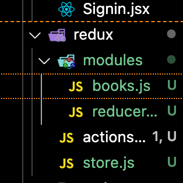
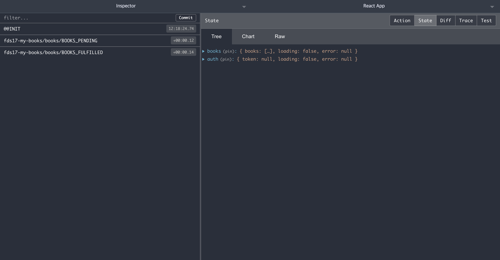
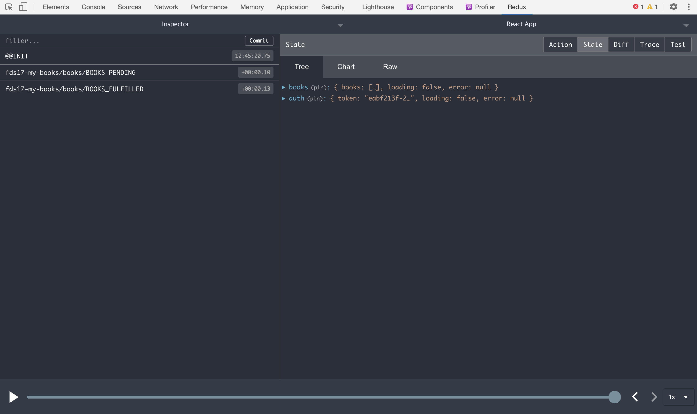
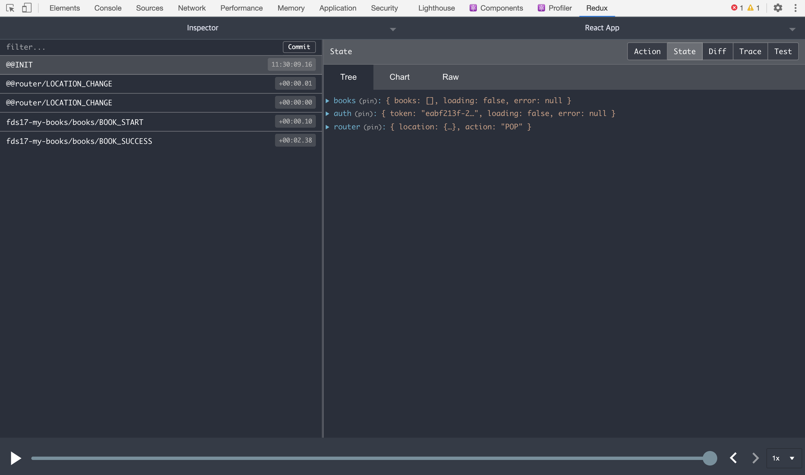
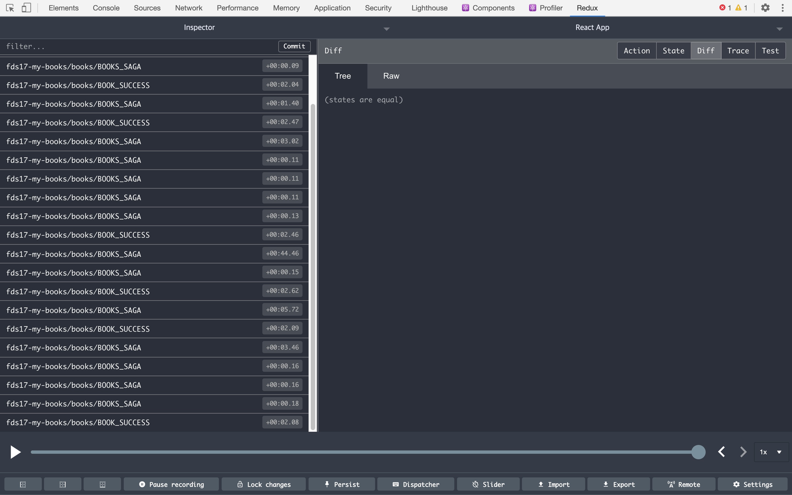
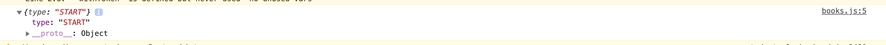
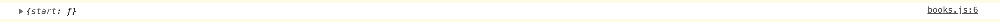

- 이전 Redux정리: [Redux](./Redux.md)

# Redux Advanced(2)

지금까지 배운건 기초에 가깝고 이제 부터 실전이다.

지금까지 한 BookList를 보자.

## Ducks Pattern

그전까지 작업을 할때 스테이트를 구상하고 제일 먼저 action을 가서 액션 타입을 추가하고 액션 생성 함수를 추가하고 reducer로 가서 작업을 하고 그다음에 reducer에 가서 작업을 하고 합쳐서 넘겼다. 

사용하다보니까 액션과 리듀서를 번갈아가면서 고치는 그런 상황이 되면서 아 이렇게 사용하니까 불편하다고 해서 

Ducks module pattern이 나왔다.

```js
// widgets.js

// Actions
const LOAD   = 'my-app/widgets/LOAD';
const CREATE = 'my-app/widgets/CREATE';
const UPDATE = 'my-app/widgets/UPDATE';
const REMOVE = 'my-app/widgets/REMOVE';

// Reducer
export default function reducer(state = {}, action = {}) {
  switch (action.type) {
    // do reducer stuff
    default: return state;
  }
}

// Action Creators
export function loadWidgets() {
  return { type: LOAD };
}

export function createWidget(widget) {
  return { type: CREATE, widget };
}

export function updateWidget(widget) {
  return { type: UPDATE, widget };
}

export function removeWidget(widget) {
  return { type: REMOVE, widget };
}

// side effects, only as applicable
// e.g. thunks, epics, etc
export function getWidget () {
  return dispatch => get('/widget').then(widget => dispatch(updateWidget(widget)))
```

이렇게가 한파일이다. 

일단 액션이 있고 리듀서가 있고 액션 creater가 있고 side effect를 일으키는 아래에 넣는다.

즉 books라고 하는 이름의 관심사를 한 파일로 모으고 그 파일을 모듈이라고 부르기 시작했다. 

모듈은 어떤게 있나면 

1. 무조건 export default가 있어야하는데 그 아이는 reducer이다.
2. export있어야하는데 action creators가 있어야한다.
3. action type의 이름은 app이름/reducer/ACTION_TYPE (우리꺼로 치면은 my books-books-BOOK_START 이런이름이 된다.)
   - 왜 이렇게 될까? 모듈이 많아지고 액션이 많아지면 액션 타입이 겹칠 수 있다. Ex) START이렇게 간단하게 지을 경우가 있다. 그런데 다른데에 잇으면 같은 액션 타입이 된다.
4. 액션 타입은 UPPER_SNAKE_CASE로 써라.

4가지 규칙을 지키는것이 ducks 패턴이라고 한다.

이렇게 하면 폴더의 구조가 달라진다.

src/redux
-create.js

src/redux/modules
-module1.js
-module2.js
...
-reducer.js(or index.js) : 합쳐주는 아이

이렇게 만들어서 사용한다.



파일을 이렇게 만든 후에 books.js에 가서 주석을 달아주자.

- books.js

```js
import { BOOKS_FULFILLED, BOOKS_PENDING, BOOKS_REJECTED, BOOK_FAIL } from "../actions";
import { BOOK_START } from "../actions";
import { BOOK_SUCCESS } from "../actions";

// action types

const initialState = {books: [], loading: false, error: null}; // 초기값 설정

export default function books(state = initialState, action) {
  switch (action.type) {
    case BOOK_SUCCESS:
      return {books: action.books, loading: false, error: null};
      case BOOKS_FULFILLED:
        return {books: action.payload, loading: false, error: null};
    case BOOK_START:
      case BOOKS_PENDING:
        return { ...state, loading: true, error: null };
    case BOOK_FAIL:
      return { ...state, loading: false, error: action.error };
      case BOOKS_REJECTED:
        return { ...state, loading: false, error: action.payload };
      default:
        return state;
  }
}
```

그리고 actions.js에 있는 액션 타입을 가져 오자.

- actions.js

```js
// action types
export const BOOK_SUCCESS = 'BOOK_SUCCESS';
export const BOOK_START = 'BOOK_START';
export const BOOK_FAIL = 'BOOK_FAIL';
export const BOOKS = 'BOOKS';
export const BOOKS_PENDING = 'BOOKS_PENDING';
export const BOOKS_FULFILLED = 'BOOKS_FULFILLED';
export const BOOKS_REJECTED = ' BOOKS_REJECTED';
```

이걸 가져오자.

- books.js

```js
// action types
export const BOOK_SUCCESS = 'BOOK_SUCCESS';
export const BOOK_START = 'BOOK_START';
export const BOOK_FAIL = 'BOOK_FAIL';
export const BOOKS = 'BOOKS';
export const BOOKS_PENDING = 'BOOKS_PENDING';
export const BOOKS_FULFILLED = 'BOOKS_FULFILLED';
export const BOOKS_REJECTED = ' BOOKS_REJECTED';

const initialState = {books: [], loading: false, error: null}; // 초기값 설정

export default function books(state = initialState, action) {
  switch (action.type) {
    case BOOK_SUCCESS:
      return {books: action.books, loading: false, error: null};
      case BOOKS_FULFILLED:
        return {books: action.payload, loading: false, error: null};
    case BOOK_START:
      case BOOKS_PENDING:
        return { ...state, loading: true, error: null };
    case BOOK_FAIL:
      return { ...state, loading: false, error: action.error };
      case BOOKS_REJECTED:
        return { ...state, loading: false, error: action.payload };
      default:
        return state;
  }
}
```

이렇게 가져온다. 그리고 actions.js에서 action create함수를 가져오자.

- actions.js

```js
// action creators
const bookSuccess = (books) => ({
  type: BOOK_SUCCESS,
  books,
})

// action creators
const bookStart = () => ({ // start할때는 없을 것이다.
  type: BOOK_START,
})

// action creators
const bookFail = (error) => ({
  type: BOOK_FAIL,
  error,
})
```

이걸 가져와서

- books.js

```js
// action types
export const BOOK_SUCCESS = 'BOOK_SUCCESS';
export const BOOK_START = 'BOOK_START';
export const BOOK_FAIL = 'BOOK_FAIL';
export const BOOKS = 'BOOKS';
export const BOOKS_PENDING = 'BOOKS_PENDING';
export const BOOKS_FULFILLED = 'BOOKS_FULFILLED';
export const BOOKS_REJECTED = ' BOOKS_REJECTED';

const initialState = {books: [], loading: false, error: null}; // 초기값 설정

export default function books(state = initialState, action) {
  switch (action.type) {
    case BOOK_SUCCESS:
      return {books: action.books, loading: false, error: null};
      case BOOKS_FULFILLED:
        return {books: action.payload, loading: false, error: null};
    case BOOK_START:
      case BOOKS_PENDING:
        return { ...state, loading: true, error: null };
    case BOOK_FAIL:
      return { ...state, loading: false, error: action.error };
      case BOOKS_REJECTED:
        return { ...state, loading: false, error: action.payload };
      default:
        return state;
  }
}

// action creators
const bookSuccess = (books) => ({
  type: BOOK_SUCCESS,
  books,
})

// action creators
const bookStart = () => ({ // start할때는 없을 것이다.
  type: BOOK_START,
})

// action creators
const bookFail = (error) => ({
  type: BOOK_FAIL,
  error,
})
```

얘네가 사용되는건 Thunk때문에 actions.js에서 가져오자.

- actions.js

```js
// thunk
export const getBooksThunk = (token) => async (dispatch, getState) => {
  // dispatch를 할 수 있다.
  try {
    // 서버에 책 리스트 다오.
    // this.setState({loading: true});
    dispatch(bookStart()); // 로딩이 돌기 시작

    await sleep(2000);

    const books = await BookService.getBooks(token);
    dispatch(bookSuccess(books));

  }catch (error) {
    dispatch(bookFail(error));
  }
}


export const getBooksPromise = (token) => ({
  type: BOOKS,
  payload: BookService.getBooks(token),
})
```

이걸

- books.js

```js
import BookService from "../../services/BookService";
import { sleep } from "../../utils";

// action types
export const BOOK_SUCCESS = 'BOOK_SUCCESS';
export const BOOK_START = 'BOOK_START';
export const BOOK_FAIL = 'BOOK_FAIL';
export const BOOKS = 'BOOKS';
export const BOOKS_PENDING = 'BOOKS_PENDING';
export const BOOKS_FULFILLED = 'BOOKS_FULFILLED';
export const BOOKS_REJECTED = ' BOOKS_REJECTED';

// initial state
const initialState = {books: [], loading: false, error: null}; // 초기값 설정

// reducer
export default function books(state = initialState, action) {
  switch (action.type) {
    case BOOK_SUCCESS:
      return {books: action.books, loading: false, error: null};
      case BOOKS_FULFILLED:
        return {books: action.payload, loading: false, error: null};
    case BOOK_START:
      case BOOKS_PENDING:
        return { ...state, loading: true, error: null };
    case BOOK_FAIL:
      return { ...state, loading: false, error: action.error };
      case BOOKS_REJECTED:
        return { ...state, loading: false, error: action.payload };
      default:
        return state;
  }
}

// action creators
const bookSuccess = (books) => ({
  type: BOOK_SUCCESS,
  books,
})


const bookStart = () => ({ // start할때는 없을 것이다.
  type: BOOK_START,
})


const bookFail = (error) => ({
  type: BOOK_FAIL,
  error,
})

// thunk
export const getBooksThunk = (token) => async (dispatch, getState) => {
  // dispatch를 할 수 있다.
  try {
    // 서버에 책 리스트 다오.
    // this.setState({loading: true});
    dispatch(bookStart()); // 로딩이 돌기 시작

    await sleep(2000);

    const books = await BookService.getBooks(token);
    dispatch(bookSuccess(books));

  }catch (error) {
    dispatch(bookFail(error));
  }
}


// promise
export const getBooksPromise = (token) => ({
  type: BOOKS,
  payload: BookService.getBooks(token),
})
```

이렇게 가져올 수 있다. 

이제 action type들을 namespace를 달아서 정리 해줘야한다.

- books.js

```js
// namespace
const namespace = 'fds17-my-books/books';

// action types
export const BOOK_SUCCESS = namespace + '/BOOK_SUCCESS';
export const BOOK_START = namespace + '/BOOK_START';
export const BOOK_FAIL = namespace + '/BOOK_FAIL';
export const BOOKS = namespace + '/BOOKS';
export const BOOKS_PENDING = namespace + '/BOOKS_PENDING';
export const BOOKS_FULFILLED = namespace + '/BOOKS_FULFILLED';
export const BOOKS_REJECTED = namespace + '/BOOKS_REJECTED';

```

이렇게 하면 하나의 모듈이 완성이 된다.

이제  이 모듈을 리듀서에서 합쳐야 한다. 원레 합쳐 잇으니 간단한 작업을 하면 된다.

이제 store.js 이름을 바꿔 주자. create로 바꾸자.

Ducks 패턴을 더쉽게 쓰는 방법이 redux-actions이다.

Signin.jsx에서도 api호출해서 로그인을 하고 잇으니 redux로 바꿀 것이다.

일단 구상을 해보자. 리덕스 안에 

```js
    const { email } = this.state;
    const password = this._password.current.state.value;
```

이메일넣고 패스워드 받아 이것은 컴포넌트 안에서 존재하는 방식이다. 이 스테이트는 컨트롤드 컴포넌트의 이메일 스테이트다. 

이런 부분 까지 리덕스를 옮기는 사람도 있다. 

만약에 로그인이 된다면  로그인 로직을 시작하면 로딩인지를 바꾸고 로딩을 끝내고 토큰을 받아서 저장했다. 로컬 스토리지에다가 

그러다 this.props.history를 해서 페이지를 옮겼다. React-router-dom에 있는 props로 받은 history아이이다. 

이 아이한테도 마치 books를 가져올때마냥 로딩 - 에러 토큰저장한다. 로컬스토리지에 저장하고 있는데 모든 애플리케이션 데이터를 하나의 근원으로 바꾸는게 나중에 사용하는게 편리하고 관리하는게 편리하다. 로컬스토리지에다만 박는게 아니고 리덕스한테도 박는다.

그래서 이런 역할을 하는 스테이트 관리 체계를 auth라고 하는 파일을 redux/modules 안에 만들자.

그리고 books.js 에 잇는 내용을 복사해서 붙여넣어서 아래처럼 만든다.

- auth.js

```js
// namespace
const namespace = 'fds17-my-books/auth';

// action types


// initial state
const initialState = {}; // 초기값 설정

// reducer
export default function auth(state = initialState, action) {
  switch (action.type) {
      default:
        return state;
  }
}

// action creators


// thunk


```

books.js에서 보면 

- books.js

```js
// action types
export const BOOK_SUCCESS = namespace + '/BOOK_SUCCESS';
export const BOOK_START = namespace + '/BOOK_START';
export const BOOK_FAIL = namespace + '/BOOK_FAIL';
export const BOOKS = namespace + '/BOOKS';
export const BOOKS_PENDING = namespace + '/BOOKS_PENDING';
export const BOOKS_FULFILLED = namespace + '/BOOKS_FULFILLED';
export const BOOKS_REJECTED = namespace + '/BOOKS_REJECTED';
```

앞에 BOOK_이렇게 붙었는데 이게 의미가 없어진다.

- auth.js

```js
// namespace
const namespace = 'fds17-my-books/auth';

// action types
const START = namespace + '/START';
const SUCCESS = namespace + '/SUCCESS';
const FAIL = namespace + '/FAIL';

```

이렇게 만들어 준다.

```js
import axios from "axios";


// namespace
const namespace = 'fds17-my-books/auth';

// action types
const START = namespace + '/START';
const SUCCESS = namespace + '/SUCCESS';
const FAIL = namespace + '/FAIL';


// initial state
const initialState = { token: null, loading: false, error: null }; // 초기값 설정

// reducer
export default function auth(state = initialState, action) {
  switch (action.type) {
    case START:
      return {token: null, loading: true, error: null}
    case SUCCESS:
      return {token: action.token, loading: false, error: null}
    case FAIL:
      return {token: null, loading: false, error: action.error}
    default:
        return state;
  }
}
			
// action creators
export const signinStart = () => ({
  type: START
});

export const signinSuccess = (token) => ({
  type: SUCCESS,
  token
})

export const signinFail = (error) => ({
  type: FAIL,
  error
})
```

만들고 이제 Thunk를 만들면 된다.

Thunk는

함수를 리턴하기 때문에

```js
export const signinThunk = () => (dispatch, getState) => {}
```

이렇게 작성하고 signin.jsx에서 아래 코드를 가져 온다.

```js
 try {
    // 호출 시작 => 로딩 시작
    dispatch(signinStart())
    const response = await axios.post('https://api.marktube.tv/v1/me', {
      email,
      password,
    });
    // sleep
    await sleep(1000);
    // 호출 완료 (정상)=> 로딩 끝
    this.setState({ loading: false })
    console.log(response.data);
    localStorage.setItem('token', response.data.token);
    // 페이지를 이동한다.
    this.props.history.push('/');
  } catch (error) {
    this.setState({ loading: false })
    // 호출 완료 (에러) => 로딩 끝
    console.log(error);
  }
```

이것을

- auth.js

```js
import axios from "axios";
import { sleep } from "../../utils";


// namespace
const namespace = 'fds17-my-books/auth';

// action types
const START = namespace + '/START';
const SUCCESS = namespace + '/SUCCESS';
const FAIL = namespace + '/FAIL';


// initial state
const initialState = { token: null, loading: false, error: null }; // 초기값 설정

// reducer
export default function auth(state = initialState, action) {
  switch (action.type) {
    case START:
      return {token: null, loading: true, error: null}
    case SUCCESS:
      return {token: action.token, loading: false, error: null}
    case FAIL:
      return {token: null, loading: false, error: action.error}
    default:
        return state;
  }
}

// action creators
export const signinStart = () => ({
  type: START
});

export const signinSuccess = (token) => ({
  type: SUCCESS,
  token
})

export const signinFail = (error) => ({
  type: FAIL,
  error
})
// thunk
export const signinThunk = (email, password) => async (dispatch, getState) => {
  try {
    // 호출 시작 => 로딩 시작
    dispatch(signinStart())
    const response = await axios.post('https://api.marktube.tv/v1/me', {
      email,
      password,
    });
    // sleep
    await sleep(1000);
    // 호출 완료 (정상)=> 로딩 끝
    const token = response.data.token;
    
    localStorage.setItem('token', token);
    dispatch(signinSuccess(token));
    // 페이지를 이동한다.
    // this.props.history.push('/');
  } catch (error) {
    // 호출 완료 (에러) => 로딩 끝
    console.log(error);
    dispatch(signinFail(error))
  }
}

```

이렇게 만든다. 이제 페이지를 넘겨야한다.

## react-router와 redux랑 함께 쓰기

login관련된 부분을 redux의 모듈로 만들어서 뺐다. 이걸 실제로 적용해 보자.

container를 하나 만들자. 뉴 파일해서 SigninContainer.jsx를 만들자.

- SigninContainer.jsx

```js
import React, { useCallback } from 'react';
import { useDispatch } from 'react-redux';
import Signin from '../components/Siginin';
import { signinThunk } from '../redux/modules/auth';

const SigninCoontainer = () => {
  const dispatch = useDispatch();
  const signin = useCallback((email, password) => {
    dispatch(signinThunk(email, password));
  }, [dispatch])
  return <Signin signin={signin}/>
}

export default SigninCoontainer;
```


이제 signin한테 signin 메서드를 넘겨주고 있다.

signin.jsx에서 클릭을 누르면

```js
  try {
    // 호출 시작 => 로딩 시작
    dispatch(signinStart())
    const response = await axios.post('https://api.marktube.tv/v1/me', {
      email,
      password,
    });
    // sleep
    await sleep(1000);
    // 호출 완료 (정상)=> 로딩 끝
    const token = response.data.token;
    
    localStorage.setItem('token', token);
    dispatch(signinSuccess(token));
    // 페이지를 이동한다.
    // this.props.history.push('/');
  } catch (error) {
    // 호출 완료 (에러) => 로딩 끝
    console.log(error);
    dispatch(signinFail(error))
  }
```

이게 실행 됐는데 이게 실행 안돼고 이제는 전부다 지우고 

- Component/Signin.jsx

```js
import { Row, Col, Input, Button } from 'antd';
import React from "react";
import styles from './Signin.module.css';
import axios from 'axios';
import { withRouter } from 'react-router-dom';
import { sleep } from '../utils';

class Signin extends React.Component {
  _password = React.createRef();

  state = {
    email: '',
    loading: false
  }
  render() {
    const { email, loading } = this.state;
    const isEmail = /^(([^<>()[\]\\.,;:\s@"]+(\.[^<>()[\]\\.,;:\s@"]+)*)|(".+"))@((\[[0-9]{1,3}\.[0-9]{1,3}\.[0-9]{1,3}\.[0-9]{1,3}\])|(([a-zA-Z\-0-9]+\.)+[a-zA-Z]{2,}))$/.test(
      email,
    )
    console.log(this._password);
    return (
      <form>
        <Row align="middle" className={styles.signin_row}>
          <Col span={24}>
            <Row className={styles.signin_contents}>
              <Col span={12}>
                
              </Col>
              <Col span={12}>
                <div className={styles.signin_title}>My Books</div>
                <div className={styles.signin_subtitle}>
                  Please Note Your Opinion
            </div>
                <div className={styles.signin_underline} />
                <div className={styles.email_title}>
                  Email
              <span className={styles.required}> *</span>
                </div>
                <div className={styles.input_area}>
                  <Input
                    placeholder="Email"
                    autoComplete="email"
                    name="email"
                    className={styles.input}
                    value={this.state.email}
                    onChange={this.change}
                  />

                </div>
                <div className={styles.password_title}>
                  Password
              <span className={styles.required}> *</span>
                </div>
                <div className={styles.input_area}>
                  <Input
                    type="password"
                    autoComplete="current-password"
                    className={styles.input}
                    ref={this._password}
                  />
                </div>
                <div className={styles.button_area}>
                  <Button
                    size="large"
                    loading={loading}
                    className={styles.button}
                    onClick={this.click}
                    disabled={!isEmail}
                  >
                    Sign In
              </Button>
                </div>
              </Col>
            </Row>
          </Col>
        </Row>
      </form>
    )
  };

  click = async () => {
    const { email } = this.state;
    const password = this._password.current.state.value;
    console.log("clicked", email, password);

    this.props.signin(email, password);

  }

  change = (e) => {
    this.setState({ email: e.target.value })
  }
}
export default withRouter(Signin);


```

이렇게  SigninContainer.jsx에서 준 메서드 프롭스를 써가지고 email과 password를 보낸다.

자 그럼이제 Signin page에서 연결된 아이는 SigninContainer여야한다.

- Pages/Signin.js

```js
import { Redirect } from "react-router-dom";
import SigninContainer from "../containers/SigninContainer";
// import Signin from "../components/Signin";
import withToken from "../hocs/withToken";

function SigninPage({token}) {
  // auth
  if (token !== null) {
    return <Redirect to="/" />;
  }
   // return <Signin />
  return <SigninContainer />
}

export default withToken(SigninPage);
```


이렇게 바꿔준다. 

로그인을 다시 해보면 token이 Local Storage에 들어올 것이다. 

이제 SigninContainer가서 loading을 넘겨 줄 것이다.

- SigninContainer.jsx

```js
import React, { useCallback } from 'react';
import { useDispatch, useSelector } from 'react-redux';
import Signin from '../components/Signin';
import { signinThunk } from '../redux/modules/auth';

const SigninContainer = () => {
  const loading = useSelector(state => {
    console.log(state)
  return  state.auth.loading
  });
  const dispatch = useDispatch();
  const signin = useCallback((email, password) => {
    dispatch(signinThunk(email, password));
  }, [dispatch])
  return <Signin loading={loading} signin={signin}/>
}

export default SigninContainer;
```


에러가 발생할 것이다. 리듀서를 연결하지 않았다.  합치지 않아서 일단 reducer.js에서

- reducer.js

```js
import {combineReducers} from 'redux';
import books from './books';
import auth from './auth';

const reducer = combineReducers({
  books,
  auth,
});

export default reducer;
```

이렇게 고치고 다시 SigninContainer가서 error도 혹시 발생할 수 있으니 보내야 한다.

```js
import React, { useCallback } from 'react';
import { useDispatch, useSelector } from 'react-redux';
import Signin from '../components/Signin';
import { signinThunk } from '../redux/modules/auth';

const SigninContainer = () => {
  const loading = useSelector(state => state.auth.loading);
  const error = useSelector(state => state.auth.error);
  const dispatch = useDispatch();
  const signin = useCallback((email, password) => {
    dispatch(signinThunk(email, password));
  }, [dispatch])
  return <Signin loading={loading} error={error} signin={signin}/>
}

export default SigninContainer;
```

이렇게 고치자 signin 을 누르면 loading이 뜰꺼 같지만 안된다. 

왜냐하면 이제 signin컴포넌트에 있는 state에 loading을 지우고 props에서 받아야한다.

state부분에서 loading을 빼고 props에서 아래와 같이 바꾸자.

- components/Signin.jsx

```js
import { Row, Col, Input, Button } from 'antd';
import React from "react";
import styles from './Signin.module.css';
import axios from 'axios';
import { withRouter } from 'react-router-dom';
import { sleep } from '../utils';

class Signin extends React.Component {
  _password = React.createRef();

  state = {
    email: '',
  }
  render() {
    const { email } = this.state;
    const { loading } = this.props;
    const isEmail = /^(([^<>()[\]\\.,;:\s@"]+(\.[^<>()[\]\\.,;:\s@"]+)*)|(".+"))@((\[[0-9]{1,3}\.[0-9]{1,3}\.[0-9]{1,3}\.[0-9]{1,3}\])|(([a-zA-Z\-0-9]+\.)+[a-zA-Z]{2,}))$/.test(
      email,
    )
    console.log(this._password);
    return (
      <form>
        <Row align="middle" className={styles.signin_row}>
          <Col span={24}>
            <Row className={styles.signin_contents}>
              <Col span={12}>
                
              </Col>
              <Col span={12}>
                <div className={styles.signin_title}>My Books</div>
                <div className={styles.signin_subtitle}>
                  Please Note Your Opinion
            </div>
                <div className={styles.signin_underline} />
                <div className={styles.email_title}>
                  Email
              <span className={styles.required}> *</span>
                </div>
                <div className={styles.input_area}>
                  <Input
                    placeholder="Email"
                    autoComplete="email"
                    name="email"
                    className={styles.input}
                    value={this.state.email}
                    onChange={this.change}
                  />

                </div>
                <div className={styles.password_title}>
                  Password
              <span className={styles.required}> *</span>
                </div>
                <div className={styles.input_area}>
                  <Input
                    type="password"
                    autoComplete="current-password"
                    className={styles.input}
                    ref={this._password}
                  />
                </div>
                <div className={styles.button_area}>
                  <Button
                    size="large"
                    loading={loading}
                    className={styles.button}
                    onClick={this.click}
                    disabled={!isEmail}
                  >
                    Sign In
              </Button>
                </div>
              </Col>
            </Row>
          </Col>
        </Row>
      </form>
    )
  };

  click = async () => {
    const { email } = this.state;
    const password = this._password.current.state.value;
    console.log("clicked", email, password);

    this.props.signin(email, password);

  }

  change = (e) => {
    this.setState({ email: e.target.value })
  }
}
export default withRouter(Signin);


```

이렇게 고치자.

이제 페이지를 옮겨야한다. 그런데 못 옮기고 있다. 왜 못옮기고 있을까? 옮기는 방법은 react-router가 제공하는 Link를 클릭하거나 history를 이용해서 옮겨야한다. 하지만

```js
this.props.signin(email, password);
```

얘가 비동기적인 일을 한다. 얘가 await걸릴 수 있는 일이 아니다. 

액션을 발생시키면 그 액션이 시작하고 좀 시간 지나고 SUCCESS가 오는 건데 이 뒤에다가 history를 이용해서 변경하면 얘가 진행중인데 나혼자 history 변경하는 상황이 된다.

지금 async가 잇지만 await를 돌릴 수 없는 상태다 원레 redux가 그런 아이이다.

이럴때는 2가지 방식으로 나뉘는데

첫 번째 방식은 history를 redux로 보내는 방식

두 번째 방식은 react-router하고 redux를 합쳐버리는 방식이 있다.

가장 쉬운 방법은 history를 넘겨주는 방법이다.

```js
this.props.signin(email, password, this.props.history);
```

어떻게 넘겨 준 거냐면 withRouter가 있으니까 this.props로 넘겨온 history를 넘겨준것이다. signinContainer.jsx로 가서 추가하자.

- SigninContainer.jsx

```js
import React, { useCallback } from 'react';
import { useDispatch, useSelector } from 'react-redux';
import Signin from '../components/Signin';
import { signinThunk } from '../redux/modules/auth';

const SigninContainer = () => {
  const loading = useSelector(state => state.auth.loading);
  const error = useSelector(state => state.auth.error);
  const dispatch = useDispatch();
  const signin = useCallback((email, password, history) => {
    dispatch(signinThunk(email, password, history));
  }, [dispatch])
  return <Signin loading={loading} error={error} signin={signin}/>
}

export default SigninContainer;
```

signin을 호출할 때 history를 추가하고 액션을 보낼때도 history를 보낸다. signinThunk 로 가서 

- auth.js

```js
// thunk
export const signinThunk = (email, password, history) => async (dispatch, getState) => {
  try {
    // 호출 시작 => 로딩 시작
    dispatch(signinStart())
    const response = await axios.post('https://api.marktube.tv/v1/me', {
      email,
      password,
    });
    // sleep
    await sleep(1000);
    // 호출 완료 (정상)=> 로딩 끝
    const token = response.data.token;
    
    localStorage.setItem('token', token);
    dispatch(signinSuccess(token));
    // 페이지를 이동한다.
    history.push('/');
  } catch (error) {
    dispatch(signinFail(error))
    // 호출 완료 (에러) => 로딩 끝
    console.log(error);
  }
}
```

이렇게 할 수 있다.

signincomponent에서 this.props.history를 넘겨 주고 signin 호출할 때 컨테이너에서 history받아다가 넘겨주고 Thunk (auth.js)에서 받아서 호출한다. 

이런 번거로운 일을 해야한다. 

Thunk에서 제공하는 기능이 하나 있다.

기능은 뭐냐면 Thunk 미들웨어를 생성할때 history를 내장할 수 있다.

Redux-Thunk 코드를 보자.

그냥 

```js
const thunk = createThunkMiddleware();
```

Thunk를 그냥 쓰면 createThunkMiddleware를 쓰면서 인자를 없이 쓰는 거다.

근데 만약에 

```js
thunk.withExtraArgument = createThunkMiddleware;
```

withExtraArgument이거를 사용하면 어떠나 이거는 createThunkMiddleware이 함수를 지칭하는 거라서

```js

function createThunkMiddleware(extraArgument) {
  return ({ dispatch, getState }) => (next) => (action) => {
    if (typeof action === 'function') {
      return action(dispatch, getState, extraArgument);
    }

    return next(action);
  };
}
```

이걸 준다. 이 withExtraArgument를 복사해서 create.js로 가서

- create.js

```js
import { applyMiddleware, createStore } from "redux";
import reducer from './modules/reducer';
import { composeWithDevTools } from "redux-devtools-extension";
import thunk from "redux-thunk";
import promise from 'redux-promise-middleware';
import {} from "history"; // 이 history는 react-router-dom을 설치하면 자동으로 생긴다.
// thunk.withExtraArgument() // Extra arguments를 넣을 수 있다.

const store = createStore(
          reducer, 
          composeWithDevTools(applyMiddleware(thunk.withExtraArgument(history), promise)));

export default store;


```

이 history는 react-router-dom을 설치하면 자동으로 준다.

history npm 가보자.

https://github.com/ReactTraining/history

```js
// Create your own history instance.
import { createBrowserHistory } from 'history';
let history = createBrowserHistory();

// ... or just import the browser history singleton instance.
import history from 'history/browser';

// Alternatively, if you're using hash history import
// the hash history singleton instance.
// import history from 'history/hash';

// Get the current location.
let location = history.location;

// Listen for changes to the current location.
let unlisten = history.listen(({ location, action }) => {
  console.log(action, location.pathname, location.state);
});

// Use push to push a new entry onto the history stack.
history.push('/home', { some: 'state' });

// Use replace to replace the current entry in the stack.
history.replace('/logged-in');

// Use back/forward to navigate one entry back or forward.
history.back();

// To stop listening, call the function returned from listen().
unlisten();
```

이렇게 사용할 수 있다.


- create.js

```js
import { applyMiddleware, createStore } from "redux";
import reducer from './modules/reducer';
import { composeWithDevTools } from "redux-devtools-extension";
import thunk from "redux-thunk";
import promise from 'redux-promise-middleware';
import { createBrowserHistory } from "history"; // 이 history는 react-router-dom을 설치하면 자동으로 생긴다.
// thunk.withExtraArgument() // Extra arguments를 넣을 수 있다.
const history = createBrowserHistory();

const store = createStore(
          reducer, 
          composeWithDevTools(applyMiddleware(thunk.withExtraArgument(history), promise)));

export default store;
```

이렇게 사용할 수 있다.

thunk만 쓰는게 아니라 thunk에 withExtraArgument에 history를 넣고 이 history는 history 모듈로 부터 가져와서 함수를 사용해서 하는 객체이다.

아까 설명할 때 routing을 처리한다 redux에서 history를 넣는 방식 두번째는 react-router-dom하고 history를 합치는 방식

history를 넣어주는 방식 중 두번째 방식인 처음에 thunk를 생성할때 넣어주는 방식이다. 

아직 안한건 redux랑 react-router-dom이랑 합치는 방식은 안했다. 

아까 한 방법 Signin.jsx 컴포넌트에서 

```js
    this.props.signin(email, password, this.props.history);
```

history를 보낼 필요가 없다. 그러니 지워주자.

- Signin.jsx 컴포넌트

```js
import { Row, Col, Input, Button } from 'antd';
import React from "react";
import styles from './Signin.module.css';

class Signin extends React.Component {
  _password = React.createRef();

  state = {
    email: '',
  }
  render() {
    const { email } = this.state;
    const { loading } = this.props;
    const isEmail = /^(([^<>()[\]\\.,;:\s@"]+(\.[^<>()[\]\\.,;:\s@"]+)*)|(".+"))@((\[[0-9]{1,3}\.[0-9]{1,3}\.[0-9]{1,3}\.[0-9]{1,3}\])|(([a-zA-Z\-0-9]+\.)+[a-zA-Z]{2,}))$/.test(
      email,
    )
    console.log(this._password);
    return (
      <form>
        <Row align="middle" className={styles.signin_row}>
          <Col span={24}>
            <Row className={styles.signin_contents}>
              <Col span={12}>
                
              </Col>
              <Col span={12}>
                <div className={styles.signin_title}>My Books</div>
                <div className={styles.signin_subtitle}>
                  Please Note Your Opinion
            </div>
                <div className={styles.signin_underline} />
                <div className={styles.email_title}>
                  Email
              <span className={styles.required}> *</span>
                </div>
                <div className={styles.input_area}>
                  <Input
                    placeholder="Email"
                    autoComplete="email"
                    name="email"
                    className={styles.input}
                    value={this.state.email}
                    onChange={this.change}
                  />

                </div>
                <div className={styles.password_title}>
                  Password
              <span className={styles.required}> *</span>
                </div>
                <div className={styles.input_area}>
                  <Input
                    type="password"
                    autoComplete="current-password"
                    className={styles.input}
                    ref={this._password}
                  />
                </div>
                <div className={styles.button_area}>
                  <Button
                    size="large"
                    loading={loading}
                    className={styles.button}
                    onClick={this.click}
                    disabled={!isEmail}
                  >
                    Sign In
              </Button>
                </div>
              </Col>
            </Row>
          </Col>
        </Row>
      </form>
    )
  };

  click = async () => {
    const { email } = this.state;
    const password = this._password.current.state.value;
    console.log("clicked", email, password);

    this.props.signin(email, password);

  }

  change = (e) => {
    this.setState({ email: e.target.value })
  }
}
export default Signin;


```

그리고 withRouter를 씌울 필요가 없어졌다.

이제 SigninContainer에서도 history를 보낼 필요 없다.

- SigninContainer.jsx

```js
import React, { useCallback } from 'react';
import { useDispatch, useSelector } from 'react-redux';
import Signin from '../components/Signin';
import { signinThunk } from '../redux/modules/auth';

const SigninContainer = () => {
  const loading = useSelector(state => state.auth.loading);
  const error = useSelector(state => state.auth.error);
  const dispatch = useDispatch();
  const signin = useCallback((email, password) => {
    dispatch(signinThunk(email, password));
  }, [dispatch])
  return <Signin loading={loading} error={error} signin={signin}/>
}

export default SigninContainer;
```

그리고  auth.js로 가서 signinThunk할때 어떻게 들어오나? 3번째 extraArgument가 들어온다.

- auth.js

```js
// thunk
export const signinThunk = (email, password) => async (dispatch, getState, history) => {
  try {
    // 호출 시작 => 로딩 시작
    dispatch(signinStart())
    const response = await axios.post('https://api.marktube.tv/v1/me', {
      email,
      password,
    });
    // sleep
    await sleep(1000);
    // 호출 완료 (정상)=> 로딩 끝
    const token = response.data.token;
    localStorage.setItem('token', token);
    dispatch(signinSuccess(token));
    // 페이지를 이동한다.
    console.log(history)
    history.push('/');
  } catch (error) {
    dispatch(signinFail(error))
    // 호출 완료 (에러) => 로딩 끝
    console.log(error);
  }
}

```

화면 이동이 안됌.. 페이지 이동 부분에서 

```js
    const response = await axios.post('https://api.marktube.tv/v1/me', {
      email,
      password,
    });
```

이 부분을 주의 깊게 볼 필요가 없다 그래서 services 에 AuthService.js를 만들어서 따로 관리하자.

- AuthService.js

```js
import axios from "axios";

export default class AuthService {
  static async login(email, password) {
    const response = await axios.post('https://api.marktube.tv/v1/me', {
      email,
      password,
    });
    return response.data.token;
  }
}
```

이렇게 하면  이제 앞으로 auth.js에서 axios를 직접 가지고 있을 필요 없고 AuthService를 가지다가 쓰 면 된다.

- auth.js

```js
// thunk
export const signinThunk = (email, password) => async (dispatch, getState, history) => {
  try {
    // 호출 시작 => 로딩 시작
    dispatch(signinStart())
    const token = await AuthService.login(email, password);
    // sleep
    await sleep(1000);
    // 호출 완료 (정상)=> 로딩 끝
    localStorage.setItem('token', token);
    dispatch(signinSuccess(token));
    // 페이지를 이동한다.
    console.log(history)
    history.push('/');
  } catch (error) {
    dispatch(signinFail(error))
    // 호출 완료 (에러) => 로딩 끝
    console.log(error);
  }
}
```

이렇게 코드가 짧아졌다.

이동이 안되는 이유가 한가지 빼먹었다.  history는 어디서 만든 history져? Create browser history라는 함수를 이용해서 아까  store만드는 쪽에서 만든 history를 넣었다. 

- create.js

```js
import { applyMiddleware, createStore } from "redux";
import reducer from './modules/reducer';
import { composeWithDevTools } from "redux-devtools-extension";
import thunk from "redux-thunk";
import promise from 'redux-promise-middleware';
import { createBrowserHistory } from "history"; // 이 history는 react-router-dom을 설치하면 자동으로 생긴다.
// thunk.withExtraArgument() // Extra arguments를 넣을 수 있다.
const history = createBrowserHistory();

const store = createStore(
          reducer, 
          composeWithDevTools(applyMiddleware(thunk.withExtraArgument(history), promise)));

export default store;
```

이 history를 여기서만 쓰는게 아니라 App.js에서도 쓰는데 이 <BrowserRouter> 가 history를 또 생성해서 쓴다.

우리가 만든 history를 BrowserRouter도 써야 한다.

- App.js

```js
import { ErrorBoundary } from "react-error-boundary";
import { BrowserRouter, Switch, Route } from "react-router-dom";

// Pages
import Error from './pages/Error';
import Signin from './pages/Signin';
import Home from './pages/Home';
import NotFound from './pages/NotFound';
import { Provider } from 'react-redux';

//redux

import store from "./redux/create";

function App() {
  return (
   <ErrorBoundary FallbackComponent={Error}>
     <Provider store={store}>
      <BrowserRouter history={}>
        <Switch>
          <Route path="/signin" component={Signin}/>
          <Route path="/" exact component={Home}/>
          <Route component={NotFound}/>
        </Switch>
     </BrowserRouter>
     </Provider>
   </ErrorBoundary>
  );
}

export default App;

```

이렇게 BrowserRouter에 history를 넣고 create에서 만든 history를 사용해야 하기 때문에 

- create.js

```js
import { applyMiddleware, createStore } from "redux";
import reducer from './modules/reducer';
import { composeWithDevTools } from "redux-devtools-extension";
import thunk from "redux-thunk";
import promise from 'redux-promise-middleware';
import { createBrowserHistory } from "history"; // 이 history는 react-router-dom을 설치하면 자동으로 생긴다.
// thunk.withExtraArgument() // Extra arguments를 넣을 수 있다.
export const history = createBrowserHistory();

const store = createStore(
          reducer, 
          composeWithDevTools(applyMiddleware(thunk.withExtraArgument(history), promise)));

export default store;


```

이렇게 하고 App.js 에서 

```js
import { ErrorBoundary } from "react-error-boundary";
import { BrowserRouter, Switch, Route } from "react-router-dom";

// Pages
import Error from './pages/Error';
import Signin from './pages/Signin';
import Home from './pages/Home';
import NotFound from './pages/NotFound';
import { Provider } from 'react-redux';

//redux

import store, { history } from "./redux/create";

function App() {
  return (
   <ErrorBoundary FallbackComponent={Error}>
     <Provider store={store}>
      <BrowserRouter history={history}>
        <Switch>
          <Route path="/signin" component={Signin}/>
          <Route path="/" exact component={Home}/>
          <Route component={NotFound}/>
        </Switch>
     </BrowserRouter>
     </Provider>
   </ErrorBoundary>
  );
}

export default App;

```

이렇게 바꾼다.

근데 만약에 안되면 이 BrowserRouter라는 이름 자체가 새로운 아이를 만들어서 사용하기 때문에 인자로 넣어서 해결이 안되는거다 그러면 이제 Router를 사용하자.

- app.js

```js
import { ErrorBoundary } from "react-error-boundary";
import { BrowserRouter, Switch, Route, Router } from "react-router-dom";

// Pages
import Error from './pages/Error';
import Signin from './pages/Signin';
import Home from './pages/Home';
import NotFound from './pages/NotFound';
import { Provider } from 'react-redux';

//redux

import store, { history } from "./redux/create";

function App() {
  return (
   <ErrorBoundary FallbackComponent={Error}>
     <Provider store={store}>
      <Router history={history}>
        <Switch>
          <Route path="/signin" component={Signin}/>
          <Route path="/" exact component={Home}/>
          <Route component={NotFound}/>
        </Switch>
     </Router>
     </Provider>
   </ErrorBoundary>
  );
}

export default App;

```

그러면 이동이 될 것이다.

>  BrowserRouter를 쓰면 기본적으로 걔가 createBrowserhistory를 해서 그 history를 사용하는데 우리가 만든 history를 store에서 만들고 왜 store에서 history에서 쓰는 이유가 thunk미들웨어에 withExtraArgument로 넣어주기 위해 만든 것이다.

## 다음 과정

로그인 창에서 로그인을 하면 API를 치고 나서 돌아온다. 지금 하는일이 

1단계로 localStorage로 넣고 있고
2단계로 redux로 넣고 있다.
3번째는 페이지를 push하고 있다.

3번째에 의해서 페이지가 새로운 페이지로 바뀐다. 경로가 /로 될꺼고 지금 로직에 의해서는 우리는 localStorage를 체크해서 token이 있는지 체크한다. 

loacalStorage는 브라우저에 저장해 놓은 데이터베이스 같은 거다. 그래서 우리의 앱은 redux로 관리를 하고 token 데이터를 localstorage로 부터 복원하는 작업을 하겠다. ls로 부터 redux에 가져와서 redux를 체크해서 토큰이 있는지를 보도록 한다.

우리가 redux의 데이터는 언제생기나? redux에 있는 state는 create하는 시점 곧 create.js에서

```js
const store = createStore(
          reducer, 
          composeWithDevTools(applyMiddleware(thunk.withExtraArgument(history), promise)));

```

최초값으로 생긴다. 각각의 세분화된 모듈에서 그 안에서 데이터가 생성이 될 거다. 최초라는 것은 이것이 불리는 시점에서 우리는 초기화를 한다는 거다. 그러므로 우리는 새로고침을 할 때마다 createStore가 발생한다. 새로고침할때 localStorage에서 token을 가져다가 redux에 데이터화 하면 된다.

위에 createStore에서 reducer와 인핸서 사이에 최초값이 있다. 최초값을 넣어주면 이 값에 의해서 생성할 수 있다.

```js
/*
{
books: {books:[], loading: false, error: null}
auth: {token: [], loading: false, error: null}
}

*/
```

이걸 2번째 인자로 넣어주면 된다. 근데 books.js에서 

- books.js

```js
// reducer
export default function books(state = initialState, action) {
  switch (action.type) {
    case BOOK_SUCCESS:
      return {books: action.books, loading: false, error: null};
```

중 state = initialState가 어떤 의미였나면 state가 undefined 일때라는 의미다.

Create.js에서

만약 

```js
const store = createStore(
          reducer, 
  				{},	
          composeWithDevTools(applyMiddleware(thunk.withExtraArgument(history), promise)));


```

이렇게 넣었다고 생각하면 달라지는게 없다. 이렇게 넣어도 undefined니까 초기값이 계속 된다.

그래서 선택적으로 세팅할 수 있다. 그래서 auth를 세팅하는 순간에 token만 넣는게 아니라 loading error도 넣어야 한다.

```js
import { applyMiddleware, createStore } from "redux";
import reducer from './modules/reducer';
import { composeWithDevTools } from "redux-devtools-extension";
import thunk from "redux-thunk";
import promise from 'redux-promise-middleware';
import { createBrowserHistory } from "history"; // 이 history는 react-router-dom을 설치하면 자동으로 생긴다.
// thunk.withExtraArgument() // Extra arguments를 넣을 수 있다.
export const history = createBrowserHistory();

const store = createStore(
          reducer, 
          {
            auth: {token:localStorage.getItem('token'), loading: false, error: null},
          },
          composeWithDevTools(applyMiddleware(thunk.withExtraArgument(history), promise)));

export default store;


```

저장을 안하고 전체 스테이트를 한번 보자.



우리는 분명이 토큰이 있다. 여기선 지금 localStorage에 있는 token을 쓰겠다는 거다. localStorage에 있는 token을 받아서 하면 어떻게 될까? 저장하고 보자.



auth에 token이 들어가 있다 앱이 실행될때 로컬 스토리지를 뒤져다가 토큰을 넣어주었다. 이럴때 위처럼 초기값을 넣어줄 수 있다.

이제 토큰을 로컬 스토리지에서 가져올 필요가 없다 하지만 아직 로컬 스토리지에서 가져오는 부분이 있다. 

withToken이다.

- withToken.js

```js

export default function withToken(Component) {
	const token = localStorage.getItem('token');
  function NewComponent(props) {
    return <Component {...props} token={token}/>;
  }
	NewComponent.displayName = `withToken(${Component.displayName})` 
  return NewComponent;
}


```

이제 리덕스 안에 있다. 이제 withToken을 통해 안 가져와도 된다. 일단 Home.jsx에가서 

- Home.jsx

```js
import { Redirect } from "react-router-dom";
import withToken from "../hocs/withToken";
import BookListContainer from '../containers/BookListContainer';

function Home() {
  if (token === null) {
    return <Redirect to="/signin" />
  }
  return (<BookListContainer token={token}/>)
}

export default Home;
```

로컬스토리지에 있는 부분을 지우고 나서 

```js
import { Redirect } from "react-router-dom";
import withToken from "../hocs/withToken";
import BookListContainer from '../containers/BookListContainer';

function Home() {
  const token = useSelector((state) => state.auth.token);
  if (token === null) {
    return <Redirect to="/signin" />
  }
  return (<BookListContainer />)
}

export default Home;
```

이렇게 가져 오면 된다.

그리고 BookListContainer에 가서 

- BookListContainer.jsx

```js

import { useCallback } from "react";
import { useDispatch, useSelector } from "react-redux";
import BookList from "../components/BookList";
import { getBooksPromise } from "../redux/modules/books";


export default function BookListContainer({ token }) {
  // redux 와의 연결고리
  const books = useSelector((state) => state.books.books); // useSelector를 가지고 가져올 수 있다.
  const loading = useSelector((state) => state.books.loading); 
  const error = useSelector((state) => state.books.error);

  const dispatch = useDispatch();

  const getBooks = useCallback(async () => {
    dispatch(getBooksPromise(token))
  }, [dispatch, token])

  
  return <BookList 
            books={books} 
            loading={loading} 
            error={error} 
            getBooks={getBooks}
          />
}
```

위에 token을 받아 오고 있는데 없어도 된다.

- BookListContainer.jsx

```js

import { useCallback } from "react";
import { useDispatch, useSelector } from "react-redux";
import BookList from "../components/BookList";
import { getBooksThunk } from "../redux/modules/books";


export default function BookListContainer() {
  // redux 와의 연결고리
  const books = useSelector((state) => state.books.books); // useSelector를 가지고 가져올 수 있다.
  const loading = useSelector((state) => state.books.loading); 
  const error = useSelector((state) => state.books.error);

  const dispatch = useDispatch();

  const getBooks = useCallback(async () => {
    dispatch(getBooksThunk())
  }, [dispatch])

  
  return <BookList 
            books={books} 
            loading={loading} 
            error={error} 
            getBooks={getBooks}
          />
}
```

이렇게 token을 안받고 있다. getBooksThunk가 있는 books.js로 가서

- books.js

```js
import BookService from "../../services/BookService";
import { sleep } from "../../utils";

// namespace
const namespace = 'fds17-my-books/books';

// action types
export const BOOK_SUCCESS = namespace + '/BOOK_SUCCESS';
export const BOOK_START = namespace + '/BOOK_START';
export const BOOK_FAIL = namespace + '/BOOK_FAIL';
export const BOOKS = namespace + '/BOOKS';
export const BOOKS_PENDING = namespace + '/BOOKS_PENDING';
export const BOOKS_FULFILLED = namespace + '/BOOKS_FULFILLED';
export const BOOKS_REJECTED = namespace + '/BOOKS_REJECTED';

// initial state
const initialState = {books: [], loading: false, error: null}; // 초기값 설정

// reducer
export default function books(state = initialState, action) {
  switch (action.type) {
    case BOOK_SUCCESS:
      return {books: action.books, loading: false, error: null};
      case BOOKS_FULFILLED:
        return {books: action.payload, loading: false, error: null};
    case BOOK_START:
      case BOOKS_PENDING:
        return { ...state, loading: true, error: null };
    case BOOK_FAIL:
      return { ...state, loading: false, error: action.error };
      case BOOKS_REJECTED:
        return { ...state, loading: false, error: action.payload };
      default:
        return state;
  }
}

// action creators
const bookSuccess = (books) => ({
  type: BOOK_SUCCESS,
  books,
})


const bookStart = () => ({ // start할때는 없을 것이다.
  type: BOOK_START,
})


const bookFail = (error) => ({
  type: BOOK_FAIL,
  error,
})

// thunk
export const getBooksThunk = () => async (dispatch, getState, history) => {
  // dispatch를 할 수 있다.
  try {
    // 서버에 책 리스트 다오.
    // this.setState({loading: true});
    dispatch(bookStart()); // 로딩이 돌기 시작

    await sleep(2000);
    // getState는 전체 스테이트
    const token = getState().auth.token;

    const books = await BookService.getBooks(token);
    dispatch(bookSuccess(books));

  }catch (error) {
    dispatch(bookFail(error));
  }
}


// promise
export const getBooksPromise = (token) => ({
  type: BOOKS,
  payload: BookService.getBooks(token),
})
```

여기서 thunk 에서 전체 스테이트중 auth에 토큰을 받아서 쓰는걸로 바꾸었다.

> 그냥 코드가 실행이 잘 되니까 문제 없겠지? 라고 생각하는 것 보다 다른 사람이 내 코드를 고칠때 어떻게 고쳐야할지 염두해서 써야한다. 

토큰은 로컬 스토리지에서 리덕스로 오기만 하고 토큰을 사용할 때는 컴포넌트까지 갈 필요 없다. 리덕스에서 서로 교환해서 쓸 수 있도록 하는 방식이다.

마찬가지로 pages/Signin.jsx도 바꾸자.

-  pages/Signin.jsx

```js
import { useSelector } from "react-redux";
import { Redirect } from "react-router-dom";
import SigninContainer from "../containers/SigninContainer";
// import Signin from "../components/Signin";


function SigninPage() {
  const token = useSelector((state) => state.auth.token);
  // auth
  if (token !== null) {
    return <Redirect to="/" />;
  }
   // return <Signin />
  return <SigninContainer />
}

export default SigninPage;
```

이렇게만 바꾸면 끝난다.

## react-router랑 redux를 쓰기

만약 history가 리덕스의 스테이트로 되어 있다면 

```js
['/', 'signin', '/about']
```

여기에다가 추가해 주면 되겠죠 reducer로 가서 라우팅을 하는 아이가 하나 더 들어가야한다. 그렇게 하고 이 아이를 조작 할수 있게

auth.js로 가서

```js
// thunk
export const signinThunk = (email, password) => async (dispatch, getState, history) => {
  try {
    // 호출 시작 => 로딩 시작
    dispatch(signinStart())
    const token = await AuthService.login(email, password);
    // const token = response.data.token;
    // sleep
    await sleep(1000);
    // 호출 완료 (정상)=> 로딩 끝
    localStorage.setItem('token', token);
    dispatch(signinSuccess(token));
    // 페이지를 이동한다.
    console.log(history)
    history.push('/');
    dispatch(라우팅을 변경하는 액션 생성자 함수를 실행)
  } catch (error) {
    dispatch(signinFail(error))
    // 호출 완료 (에러) => 로딩 끝
    console.log(error);
  }
}

```

dispatch는 리덕스의 스테이트를 변경해야하니까 

첫번째는 reducer를 라우터를 세팅해 줘야하고 두 번째는 페이지를 이동할때 dispatch하는 작업을 해야한다. 

그래서 설치하자.

```bash
npm install connected-react-router
```

우선은 설정해주자 reducerdp router라는 state를 combine 시킨다.

```js
// src/redux/modules/reducer.js

import { combineReducers } from 'redux';
import auth from './auth';
import books from './books';
import { connectRouter } from 'connected-react-router';

const reducer = history =>
  combineReducers({
    auth,
    books,
    router: connectRouter(history),
  });

export default reducer;
```

Reducer.js에서

- reducer.js

```js
import {combineReducers} from 'redux';
import books from './books';
import auth from './auth';
import { connectRouter } from 'connected-react-router';

const router = connectRouter()

const reducer = combineReducers({
  books,
  auth,
  router
});

export default reducer;
```

저 connectRouter에 들어가는건 create.js에서 만들어준 history가 들어올 것이다. history를 넣어주는 방법은 history를 export했으니 reducer에서 import해서 사용할 수 있다. 객체를 사용하는시점과 생성하는 시점을 명확하게 하기 위해 인자로 넣어줄 것이다.

Create.js에서 보자.

- create.js

```js
const store = createStore(
          reducer, 
          {
            auth: {token:localStorage.getItem('token'), loading: false, error: null},
          },
          composeWithDevTools(applyMiddleware(thunk.withExtraArgument(history), promise)));

export default store;
```

기존에는 첫번째 인자가 reducer다 기존에는 combinedreducer를 한걸 그대로 썼지만 얠 이렇게 해주겠다.

- create.js

```js
import { applyMiddleware, createStore } from "redux";
import reducer from './modules/reducer';
import { composeWithDevTools } from "redux-devtools-extension";
import thunk from "redux-thunk";
import promise from 'redux-promise-middleware';
import { createBrowserHistory } from "history"; // 이 history는 react-router-dom을 설치하면 자동으로 생긴다.
// thunk.withExtraArgument() // Extra arguments를 넣을 수 있다.
export const history = createBrowserHistory();

const store = createStore(
          reducer(history), 
          {
            auth: {token:localStorage.getItem('token'), loading: false, error: null},
          },
          composeWithDevTools(applyMiddleware(thunk.withExtraArgument(history), promise)));

export default store;


```

이렇게 사용하겠다 하고 이제 reducer.js에서

- reducer.js

```js
import {combineReducers} from 'redux';
import books from './books';
import auth from './auth';
import { connectRouter } from 'connected-react-router';


const reducer = (history) => combineReducers({
  books,
  auth,
  router: connectRouter(history),
});

export default reducer;
```

이렇게 하면 reducer를 실행하면 그 결과가 combineReducers가 나오는데 앞에서 생성한 history를 받아와서 history를 넣어줘서 실행하겠다 이다.

history는 언제 생성되나? 

```js
export const history = createBrowserHistory();
```

이때 생성이 된다. 이 createBrowserHistory는 언제 생성되나? Create.js가 처음으로 로딩될때 생성이 된다. 그게 언제냐면 app.js 에서 store나 history가 임포트 될때  이 로직이 실행되기 때문에 createBrowserHistory를 생성한다.. 이건 좋지 않는다. 모듈의 로딩 순서가 달라질 수 있어서 로딩의 생성시점이 달라진다. 보통 이렇기 때문에 모듈 밖으로 빼내는 방법은 좋지 않다. 

```js
export const history = createBrowserHistory();
```

이걸 직접 호출하는 방식이 더 좋다. 

// 1. 히스토리를 생성
// 2. 스토어를 생성

이렇게 하면 디펜던시가 생긴다. 

그러면 어떻게 해야하나 직접 history를 생성한다 어떻게 하나면 create.js 부분에서 

```js
export const history = createBrowserHistory();
```

이걸 짤라내서 app.js 에 넣는다.

- App.js

```js
import { ErrorBoundary } from "react-error-boundary";
import { Switch, Route, Router } from "react-router-dom";

// Pages
import Error from './pages/Error';
import Signin from './pages/Signin';
import Home from './pages/Home';
import NotFound from './pages/NotFound';
import { Provider } from 'react-redux';

//redux

import create from "./redux/create";
import { createBrowserHistory } from "history"; // 이 history는 react-router-dom을 설치하면 자동으로 생긴다.
// 1. 히스토리를 생성
const history = createBrowserHistory();

// 2. 스토어를 생성
const store = create(history);

function App() {
  return (
   <ErrorBoundary FallbackComponent={Error}>
     <Provider store={store}>
      <Router history={history}>
        <Switch>
          <Route path="/signin" component={Signin}/>
          <Route path="/" exact component={Home}/>
          <Route component={NotFound}/>
        </Switch>
     </Router>
     </Provider>
   </ErrorBoundary>
  );
}

export default App;

```

순서상 이게 맞다. 그래서 store라는 객체를 받았으면 이제 바뀐다.

- create.js

```js
import { applyMiddleware, createStore } from "redux";
import reducer from './modules/reducer';
import { composeWithDevTools } from "redux-devtools-extension";
import thunk from "redux-thunk";
import promise from 'redux-promise-middleware';
import { createBrowserHistory } from "history"; // 이 history는 react-router-dom을 설치하면 자동으로 생긴다.
// thunk.withExtraArgument() // Extra arguments를 넣을 수 있다.

const create = (history) => createStore(
          reducer(history), 
          {
            auth: {token:localStorage.getItem('token'), loading: false, error: null},
          },
          composeWithDevTools(applyMiddleware(thunk.withExtraArgument(history), promise)));

export default create;


```

이렇게 사용한다. DI를 이해하자.

## store에 routerMiddleware를 추가

routerMiddleware(history)를 추가

- Create.js

```js
import { applyMiddleware, createStore } from "redux";
import reducer from './modules/reducer';
import { composeWithDevTools } from "redux-devtools-extension";
import thunk from "redux-thunk";
import promise from 'redux-promise-middleware';
import { createBrowserHistory } from "history"; // 이 history는 react-router-dom을 설치하면 자동으로 생긴다.
import { routerMiddleware } from "connected-react-router";
// thunk.withExtraArgument() // Extra arguments를 넣을 수 있다.

const create = (history) => createStore(
          reducer(history), 
          {
            auth: {token:localStorage.getItem('token'), loading: false, error: null},
          },
          composeWithDevTools(applyMiddleware(thunk.withExtraArgument(history), promise, routerMiddleware(history))));

export default create;
```

이렇게 실행해 준다.

그 다음은 이제 App.js에서 Router를 이제 ConnectedRouter를 쓰자.

- App.js

```js
import { ErrorBoundary } from "react-error-boundary";
import { Switch, Route, Router } from "react-router-dom";

// Pages
import Error from './pages/Error';
import Signin from './pages/Signin';
import Home from './pages/Home';
import NotFound from './pages/NotFound';
import { Provider } from 'react-redux';

//redux

import create from "./redux/create";
import { createBrowserHistory } from "history"; // 이 history는 react-router-dom을 설치하면 자동으로 생긴다.
import { ConnectedRouter } from "connected-react-router";
// 1. 히스토리를 생성
const history = createBrowserHistory();

// 2. 스토어를 생성
const store = create(history);

function App() {
  return (
   <ErrorBoundary FallbackComponent={Error}>
     <Provider store={store}>
      <ConnectedRouter history={history}>
        <Switch>
          <Route path="/signin" component={Signin}/>
          <Route path="/" exact component={Home}/>
          <Route component={NotFound}/>
        </Switch>
     </ConnectedRouter>
     </Provider>
   </ErrorBoundary>
  );
}

export default App;

```

이렇게 보면 redux dev tools 보면



router가 초기값으로 생겼다.  그리고 이렇게 바꿔보자 페이지를 이동했던 auth.js에 가서 

- Auth.js

```js
import axios from "axios";
import { push } from "connected-react-router";
import AuthService from "../../services/AuthService";
import { sleep } from "../../utils";


// namespace
const namespace = 'fds17-my-books/auth';

// action types
const START = namespace + '/START';
const SUCCESS = namespace + '/SUCCESS';
const FAIL = namespace + '/FAIL';


// initial state
const initialState = { token: null, loading: false, error: null }; // 초기값 설정

// reducer
export default function auth(state = initialState, action) {
  switch (action.type) {
    case START:
      return {token: null, loading: true, error: null}
    case SUCCESS:
      return {token: action.token, loading: false, error: null}
    case FAIL:
      return {token: null, loading: false, error: action.error}
    default:
        return state;
  }
}

// action creators
export const signinStart = () => ({
  type: START
});

export const signinSuccess = (token) => ({
  type: SUCCESS,
  token
})

export const signinFail = (error) => ({
  type: FAIL,
  error
})
// thunk
export const signinThunk = (email, password) => async (dispatch, getState, history) => {
  try {
    // 호출 시작 => 로딩 시작
    dispatch(signinStart())
    const token = await AuthService.login(email, password);
    // const token = response.data.token;
    // sleep
    await sleep(1000);
    // 호출 완료 (정상)=> 로딩 끝
    localStorage.setItem('token', token);
    dispatch(signinSuccess(token));
    // 페이지를 이동한다.

    // history.push('/'); extraarguments에서 온 history
    dispatch(push('/')) // push는 액션 생성 함수
  } catch (error) {
    dispatch(signinFail(error))
    // 호출 완료 (에러) => 로딩 끝
    console.log(error);
  }
}

```

Home.jsx에서 Redirect에서 자동으로 react-router-dom이 연결되었기 때문에 모든 path의 변경이 redux-dev-tool로 갈수 있다. 장점은 dispatch가 있으면 어느 곳이든 페이지를 넘길 수 있다. 

connected-react-router github https://github.com/supasate/connected-react-router

## redux-saga

여기서도 dispatch할 수 있다.

설치하자.

```bash
npm i redux-saga
```

## 리덕스 사가

- 미들웨어 이다. 
- 제너레이터 객체를 만들어 내는 제네레이터 생성함수를 이용한다. 그 함수를 이용한다.
- 리덕스 사가 미들웨어를 설정하고
- 내가 만든 사가 함수를 등록한 후 
- 사가 미들웨어를 실행한다.
- 그리고 등록된 사가 함수를 실행할 액션을 디스패치하면 된다.

일단 create.js로 가자

- Create.js

```js
import { applyMiddleware, createStore } from "redux";
import reducer from './modules/reducer';
import { composeWithDevTools } from "redux-devtools-extension";
import thunk from "redux-thunk";
import promise from 'redux-promise-middleware';
import { routerMiddleware } from "connected-react-router";
import createSagaMiddleware from 'redux-saga';
// thunk.withExtraArgument() // Extra arguments를 넣을 수 있다.

const create = (history) => {
      const sagaMiddleware = createSagaMiddleware();
      return createStore(
          reducer(history), 
          {
            auth: {
              token:localStorage.getItem('token'),
              loading: false,
              error: null},
          },
          composeWithDevTools(applyMiddleware(
            thunk.withExtraArgument(history),
           promise, 
           routerMiddleware(history),
          sagaMiddleware)));
        }
export default create;


```

이렇게 하자.


리덕스에서 thunk 다음으로 높은 레벨의 비동기 작업을 할 수 있다.

thunk함수를 대체해서 만들기 때문에 books.js에서 thunk밑에 만들자.

- books.js

```js
// saga
function* getBooksSaga(action) {

}
```

인자를 action을 받는다 action 말고는 받지 않는다. 이 다음에 로직이 들어간다. 완성하기 전에 로직을 시작 되게 하는 액션 생성 함수를 만들자. 이 밑에다가 

```js
export const getBooksSagaStart = () => ({type: })
```

이 아이는 평범하게 type이 있는 액션이다. 이제 타입을 설정해야 하는데 우리가 설정한 타입은 위에 있었다.

```js
// namespace
const namespace = 'fds17-my-books/books';

// action types
export const BOOK_SUCCESS = namespace + '/BOOK_SUCCESS';
export const BOOK_START = namespace + '/BOOK_START';
export const BOOK_FAIL = namespace + '/BOOK_FAIL';
export const BOOKS = namespace + '/BOOKS';
export const BOOKS_PENDING = namespace + '/BOOKS_PENDING';
export const BOOKS_FULFILLED = namespace + '/BOOKS_FULFILLED';
export const BOOKS_REJECTED = namespace + '/BOOKS_REJECTED';
```

이렇게 있는 것 처럼 및에다가 만들어 주자.

```js
const BOOKS_SAGA = namespace + '/BOOKS_SAGA';

// promise
export const getBooksPromise = (token) => ({
  type: BOOKS,
  payload: BookService.getBooks(token),
})

// saga
function* getBooksSaga(action) {
  // 로직
}

export const getBooksSagaStart = () => ({type: BOOKS_SAGA});
```

이렇게 만 하고 별도로 아무것도 하지 않을 것이다.

getBooksSagaStart함수는 이 액션 생성 함수를 실행하는 함수를 dispatch하면 

```js
// saga
function* getBooksSaga(action) {
  // 로직
}	
```

이 로직을 타게 할 것이다.

그래서 getBooksSagaStart가 발생하면 getBooksSaga가 실행한다는 연결고리가 필요하다. 그게 등록이다.그래서 이렇게 한다.

books라고 하는 이 안에 있는 모든 Saga를 몰아서 처리할 것이다.

```js
export function* booksSaga() {
  yield takeEvery();
}

```

takeEvery를 사용할 건데 이 함수는 

```js
import { takeEvery } from 'redux-saga/effects';
```

여기서 가져온다.


이렇게 써졌는데 getBooksSagaStart에 액션이 dispatch되면 getBooksSaga가 실행되겠다고 했다. 그래서 

```js
export function* booksSaga() {
  yield takeEvery(BOOKS_SAGA, getBooksSaga);
}
```

이렇게 들어온다.

- 전체 books.js

```js
import BookService from "../../services/BookService";
import { sleep } from "../../utils";
import { takeEvery } from 'redux-saga/effects';
// namespace
const namespace = 'fds17-my-books/books';

// action types
export const BOOK_SUCCESS = namespace + '/BOOK_SUCCESS';
export const BOOK_START = namespace + '/BOOK_START';
export const BOOK_FAIL = namespace + '/BOOK_FAIL';
export const BOOKS = namespace + '/BOOKS';
export const BOOKS_PENDING = namespace + '/BOOKS_PENDING';
export const BOOKS_FULFILLED = namespace + '/BOOKS_FULFILLED';
export const BOOKS_REJECTED = namespace + '/BOOKS_REJECTED';

// initial state
const initialState = {books: [], loading: false, error: null}; // 초기값 설정

// reducer
export default function books(state = initialState, action) {
  switch (action.type) {
    case BOOK_SUCCESS:
      return {books: action.books, loading: false, error: null};
      case BOOKS_FULFILLED:
        return {books: action.payload, loading: false, error: null};
    case BOOK_START:
      case BOOKS_PENDING:
        return { ...state, loading: true, error: null };
    case BOOK_FAIL:
      return { ...state, loading: false, error: action.error };
      case BOOKS_REJECTED:
        return { ...state, loading: false, error: action.payload };
      default:
        return state;
  }
}

// action creators
const bookSuccess = (books) => ({
  type: BOOK_SUCCESS,
  books,
})


const bookStart = () => ({ // start할때는 없을 것이다.
  type: BOOK_START,
})


const bookFail = (error) => ({
  type: BOOK_FAIL,
  error,
})

// thunk
export const getBooksThunk = () => async (dispatch, getState, history) => {
  // dispatch를 할 수 있다.
  try {
    // 서버에 책 리스트 다오.
    // this.setState({loading: true});
    dispatch(bookStart()); // 로딩이 돌기 시작

    await sleep(2000);
    // getState는 전체 스테이트
    const token = getState().auth.token;

    const books = await BookService.getBooks(token);
    dispatch(bookSuccess(books));

  }catch (error) {
    dispatch(bookFail(error));
  }
}

const BOOKS_SAGA = namespace + '/BOOKS_SAGA';

// promise
export const getBooksPromise = (token) => ({
  type: BOOKS,
  payload: BookService.getBooks(token),
})

// saga
function* getBooksSaga(action) {
  // 로직
}

export const getBooksSagaStart = () => ({type: BOOKS_SAGA});

export function* booksSaga() {
  yield takeEvery(BOOKS_SAGA, getBooksSaga);
}
```

이제 getBooksSaga 이걸 잘 만들어서 우리의 sideEffect로직을 잘 처리해야한다.

이 로직은 사실 로직 자체는

```js
 try {
    // 서버에 책 리스트 다오.
    // this.setState({loading: true});
    dispatch(bookStart()); // 로딩이 돌기 시작

    await sleep(2000);
    // getState는 전체 스테이트
    const token = getState().auth.token;

    const books = await BookService.getBooks(token);
    dispatch(bookSuccess(books));

  }catch (error) {
    dispatch(bookFail(error));
  }
```

얘랑 별 다를게 없다. 얘를 복사해서 가져와서 문법만 달라진다.

만약에 Thunk를 쓰면 만약에 우리들이 같은 request를 동시에 여러번 날렸다. 새로고침 버튼을 연속 세번을 눌렸다. request를 보내서 다시 처음부터 받아오겠다는 거다. 그러면 몇 번째 꺼만 처리 되나요? 맨 마지막 꺼만 처리하면 된다. 그렇게 하려면 Thunk로 어떻게 할까? 조건을 걸면 되는데 어떻게 걸면 되나? 맨 처음 꺼만 하고 싶을때는? 생각보다 복잡하다. A랑 B랑 동시에 request를 보냈는데 A를 완료 되어야 B를 진행한다면 어떻게 해야 하나? 

그래서 보통 Thunk나 promise하는 일은 어떤 일을 하나면 비동기 로직 하나에만 특화된 기능이다. 그게 아니라 병렬적으로 처리하거나 여러개의 액션들이 선호관계가 있다는가 보낸 액션을 나는 그만 처리하겠다는 건가 request를 보냈는데 페이지를 옮겼다는가 보낸거는 항상 unmount할때 회수 해야 한다. sideEffect발생하는 케이스에 대해서 병렬적으로 한 레이어 위에서 관리하려면 saga를 쓰지 않아서 어렵다. 

그래서 saga에서 여러가지 effect를 준다. 

takeEvery: 매번 처리
takeLatest: 가장 최근 것만
takeLeading: 처음 출발한 것만 처리한다.

이렇게 비동기 적인 로직들을 한 레이어 위에서 관리한다고 싶으면 사가로 가고 그럴 필요 없으면 thunk로만 끝나는 프로젝트면 사가를 할 필요가 없다. 비동기 로직을 비동기 로직끼리 관리를 한다면 Thunk로는 도저히 안된다.

이제 books.js에 saga를 고치자.

dispatch를 yield put 이렇게 바꿔주면 된다.

```js
    await sleep(2000);
```

이거랑 똑같은 역할을 하는 Effect가 있다. 그 이름이 ((effect를 하려면 무조건 yield를 앞에 써야한다.))

```js
yield delay(2000);
```

그리고 effect중에 call을 쓸 것이다.

call의 첫번째 인자로는 프로미스로 리턴하는 함수의 이름을 적고 그 함수에 들어가는 인자를 넣는다.

```js
   const books = yield call(BookService.getBooks, getState().auth.token); 
```

getState는 결국은 리덕스에 있는 데이터를 끌어오는 행위인데 이거는 원레 getBooksThunk에 2번째 인자 함수였다. getState가 아니고 이렇게 하면 된다.

```js
   const token = yield select(state => state.auth.token);
```

이렇게 하면 쉽게 token을 가져올 수 있다.

```js
// saga
function* getBooksSaga() {
  // 로직
  try {
    yield put(bookStart);
    // dispatch(bookStart()); // 로딩이 돌기 시작
    yield delay(2000);
    // await sleep(2000);
    // getState는 전체 스테이트
    
    // const books = await BookService.getBooks(getState().auth.token);
    const token = yield select(state => state.auth.token);
    const books = yield call(BookService.getBooks, token); 
    
    // dispatch(bookSuccess(books));
    yield put(bookSuccess(books));

  }catch (error) {
    // dispatch(bookFail(error));
    yield put(bookFail(error));
  }
}
```

이렇게 하면 된다. 

즉 어떻게 되나? 

```js
export const getBooksSagaStart = () => ({type: BOOKS_SAGA});
```

BOOKS_SAGA라는 타입에 액션이 발행되면 dispatch되면 

```js
// saga
function* getBooksSaga() {
  // 로직
  try {
    yield put(bookStart);
    // dispatch(bookStart()); // 로딩이 돌기 시작
    yield delay(2000);
    // await sleep(2000);
    // getState는 전체 스테이트
    
    // const books = await BookService.getBooks(getState().auth.token);
    const token = yield select(state => state.auth.token);
    const books = yield call(BookService.getBooks, token); 
    
    // dispatch(bookSuccess(books));
    yield put(bookSuccess(books));

  }catch (error) {
    // dispatch(bookFail(error));
    yield put(bookFail(error));
  }
}
```

이 로직이 시작된다.

구성이 살짝 다른거고 여기에 핵심이 있는게 아니라 

```js
export function* booksSaga() {
  yield takeEvery(BOOKS_SAGA, getBooksSaga);
}
```

여기에 핵심이 있다. 이 아이를 어떻게 쓸꺼나? 얘를 booksSaga니까 reducer.js에서 combineReducers해준 것 처럼 결국 booksSaga랑 authSaga랑 모아서 그 아이를 export해줘야한다.

이때까지 전체 books.js

- books.js

```js
import BookService from "../../services/BookService";
import { sleep } from "../../utils";
import { call, delay, put, select, takeEvery } from 'redux-saga/effects';
// namespace
const namespace = 'fds17-my-books/books';

// action types
export const BOOK_SUCCESS = namespace + '/BOOK_SUCCESS';
export const BOOK_START = namespace + '/BOOK_START';
export const BOOK_FAIL = namespace + '/BOOK_FAIL';
export const BOOKS = namespace + '/BOOKS';
export const BOOKS_PENDING = namespace + '/BOOKS_PENDING';
export const BOOKS_FULFILLED = namespace + '/BOOKS_FULFILLED';
export const BOOKS_REJECTED = namespace + '/BOOKS_REJECTED';

// initial state
const initialState = {books: [], loading: false, error: null}; // 초기값 설정

// reducer
export default function books(state = initialState, action) {
  switch (action.type) {
    case BOOK_SUCCESS:
      return {books: action.books, loading: false, error: null};
      case BOOKS_FULFILLED:
        return {books: action.payload, loading: false, error: null};
    case BOOK_START:
      case BOOKS_PENDING:
        return { ...state, loading: true, error: null };
    case BOOK_FAIL:
      return { ...state, loading: false, error: action.error };
      case BOOKS_REJECTED:
        return { ...state, loading: false, error: action.payload };
      default:
        return state;
  }
}

// action creators
const bookSuccess = (books) => ({
  type: BOOK_SUCCESS,
  books,
})


const bookStart = () => ({ // start할때는 없을 것이다.
  type: BOOK_START,
})


const bookFail = (error) => ({
  type: BOOK_FAIL,
  error,
})

// thunk
export const getBooksThunk = () => async (dispatch, getState, history) => {
  // dispatch를 할 수 있다.
  try {
    // 서버에 책 리스트 다오.
    // this.setState({loading: true});
    dispatch(bookStart()); // 로딩이 돌기 시작

    await sleep(2000);
    // getState는 전체 스테이트
    const token = getState().auth.token;

    const books = await BookService.getBooks(token);
    dispatch(bookSuccess(books));

  }catch (error) {
    dispatch(bookFail(error));
  }
}

const BOOKS_SAGA = namespace + '/BOOKS_SAGA';

// promise
export const getBooksPromise = (token) => ({
  type: BOOKS,
  payload: BookService.getBooks(token),
})

// saga
function* getBooksSaga() {
  // 로직
  try {
    yield put(bookStart);
    // dispatch(bookStart()); // 로딩이 돌기 시작
    yield delay(2000);
    // await sleep(2000);
    // getState는 전체 스테이트
    
    // const books = await BookService.getBooks(getState().auth.token);
    const token = yield select(state => state.auth.token);
    const books = yield call(BookService.getBooks, token); 
    
    // dispatch(bookSuccess(books));
    yield put(bookSuccess(books));

  }catch (error) {
    // dispatch(bookFail(error));
    yield put(bookFail(error));
  }
}

export const getBooksSagaStart = () => ({type: BOOKS_SAGA});

export function* booksSaga() {
  yield takeEvery(BOOKS_SAGA, getBooksSaga);
}
```


redux/modules에 파일 하나 만들고 saga 파일을 만든다.

```js
import { all } from "redux-saga/effects";

export default function* rootSaga() {
  yield all([])  
}
```

all을 한다. 이 배열에는 

```js
import { all } from "redux-saga/effects";
import { booksSaga } from "./books";

export default function* rootSaga() {
  yield all([booksSaga()])  
}
```

이렇게 하면은 booksSaga에 들어있는 아이는 전부타 rootSaga에 등록해야한다. 이게 끝이 아니고 roortSaga를 마지막에 실행해야한다. 이걸 어디로 가져가나? create.js에서 sagaMiddleware만들고 이걸 스토어를 만들고 리턴하는데 이 직후에 해야한다.

- create.js

```js
import { applyMiddleware, createStore } from "redux";
import reducer from './modules/reducer';
import { composeWithDevTools } from "redux-devtools-extension";
import thunk from "redux-thunk";
import promise from 'redux-promise-middleware';
import { routerMiddleware } from "connected-react-router";
import createSagaMiddleware from 'redux-saga';
import rootSaga from "./modules/saga";
// thunk.withExtraArgument() // Extra arguments를 넣을 수 있다.

const create = (history) => {
      const sagaMiddleware = createSagaMiddleware();
      const store =  createStore(
          reducer(history), 
          {
            auth: {
              token:localStorage.getItem('token'),
              loading: false,
              error: null},
          },
          composeWithDevTools(applyMiddleware(
            thunk.withExtraArgument(history),
           promise, 
           routerMiddleware(history),
          sagaMiddleware
          )
        )
      )
    sagaMiddleware.run(rootSaga);

    return store;
};
export default create;

```


이렇게 항상 이렇게 하는거고 

saga.js는 만든 saga들을 (booksSaga) 모아주는 역할을 하는 거다. 또하나 authSaga도 있으니 authSaga도 만들자.

- auth.js

```js
// saga

export function* authSaga() {
  
}
```

이렇게 아무것도 없는 대표 authSaga를 만들고 얘를 saga.js에서 

- saga.js

```js
import { all } from "redux-saga/effects";
import { authSaga } from "./auth";
import { booksSaga } from "./books";

export default function* rootSaga() {
  yield all([booksSaga(), authSaga()])  
}
```

이렇게 모아준다.

Auth.js도 로그인을 실행하는 아이 로그인을 수행하는 로직이 있다. 일단은 한번 booksSaga를 실행해 보자.

BookListContainer에서 

- BookListContainer.jsx

```js
  const getBooks = useCallback(async () => {
    dispatch(getBooksThunk());
  }, [dispatch])
```

이렇게 했었다. 이렇게 하면 Thunk가 실행 했다. 이제 바꾸자.

- BookListContainer.jsx

```js

import { useCallback } from "react";
import { useDispatch, useSelector } from "react-redux";
import BookList from "../components/BookList";
import { getBooksSagaStart } from "../redux/modules/books";


export default function BookListContainer() {
  // redux 와의 연결고리
  const books = useSelector((state) => state.books.books); // useSelector를 가지고 가져올 수 있다.
  const loading = useSelector((state) => state.books.loading); 
  const error = useSelector((state) => state.books.error);

  const dispatch = useDispatch();

  const getBooks = useCallback(async () => {
    dispatch(getBooksSagaStart());
  }, [dispatch])

  
  return <BookList 
            books={books} 
            loading={loading} 
            error={error} 
            getBooks={getBooks}
          />
}
```

잘 되는지 확인해 보자. BookList.jsx 컴포넌트로 가보자.

```js
    return (
      <div>
        <h1>Book List {loading && <LoadingOutlined />}</h1>
        <p><button onClick={getBooks}>reload</button></p>
        {books.length === 0 && <p>데이터가 없습니다.</p>}
        {books.length !== 0 && books.map((book) => {
          return <BookItem {...book} />
        })}
      </div>
    );
```

이렇게 reload하는 버튼을 만들고 테스트 해보자. 

그리고 books.js에서 booksSaga에서 takeLeading을 써 보자.

그리고 화면에서 reload버튼을 연속 3번을 눌려도



SUCCESS는 한번만 온다. 출발은 똑같이 출발하는데 첫번째것이 들어온 것이다.

이제 auth쪽 바꿔 보자.

다시 auth.js가서

- auth.js

```js
// saga
const SIGNIN_SAGA = namespace + '/SIGNIN_SAGA';

export const signinSagaStart = () => ({type: SIGNIN_SAGA});

export function* signinSaga() {

}
export function* authSaga() {
  yield takeEvery(SIGNIN_SAGA, signinSaga);
}
```

```js
export const signinSagaStart = () => ({type: SIGNIN_SAGA});
```

이 부분이 중요하다 액션을 그냥 발생시키면 안되고 signinThunk도 마찬가지로 인자로 들어오는 email과 password가 들어온다.

그래서 signinSagaStart도 인자 email과 password를  받고 payload를 쓴다.

```js
// saga
const SIGNIN_SAGA = namespace + '/SIGNIN_SAGA';

export const signinSagaStart = (email, password) => ({type: SIGNIN_SAGA, payload: { email, password }});

export function* signinSaga() {

}
export function* authSaga() {
  yield takeEvery(SIGNIN_SAGA, signinSaga);
}
```

이게 어떻게 되나면 signinSagaStart 액션이 발생하면 signinSaga로직이 시작되는건데 

```js
payload: { email, password }});
```

이 내용이 전달 되야지 로직이 진행된다. 그러니까 들어오는게 action이다.

```js
// saga
const SIGNIN_SAGA = namespace + '/SIGNIN_SAGA';

export const signinSagaStart = (email, password) => ({type: SIGNIN_SAGA, payload: { email, password }});

export function* signinSaga(action) {

}
export function* authSaga() {
  yield takeEvery(SIGNIN_SAGA, signinSaga);
}
```

그 다음에 아래 로직을 그대로 가져가서 문법만 바꾸자.

```js
 try {
    // 호출 시작 => 로딩 시작
    dispatch(signinStart())
    const token = await AuthService.login(email, password);
    // const token = response.data.token;
    // sleep
    await sleep(1000);
    // 호출 완료 (정상)=> 로딩 끝
    localStorage.setItem('token', token);
    dispatch(signinSuccess(token));
    // 페이지를 이동한다.

    // history.push('/'); extraarguments에서 온 history
    dispatch(push('/')) // push는 액션 생성 함수
  } catch (error) {
    dispatch(signinFail(error))
    // 호출 완료 (에러) => 로딩 끝
    console.log(error);
  }
```

connectedReactDom하고 saga랑 잘 맞는 다는 한 이유가 이렇게 사가의 일원으로 들어온다.

```js
    // history.push('/'); extraarguments에서 온 history
    // dispatch(push('/')) // push는 액션 생성 함수
    yield put(push('/'));
```


```js
// saga
const SIGNIN_SAGA = namespace + '/SIGNIN_SAGA';

export const signinSagaStart = (email, password) => ({type: SIGNIN_SAGA, payload: { email, password }});

export function* signinSaga(action) {
  try {
    // 호출 시작 => 로딩 시작
    // dispatch(signinStart())
    yield put(signinStart())

    const { email, password } = action.payload
    // const token = await AuthService.login(email, password);
    const token = yield call(AuthService.login,email, password) 
    // const token = response.data.token;
    // sleep
    // await sleep(1000);
    yield delay(2000);
    // 호출 완료 (정상)=> 로딩 끝
    localStorage.setItem('token', token); // side Effect 발생하는 아이
    // dispatch(signinSuccess(token));
    yield put(signinSuccess(token));
    // 페이지를 이동한다.

    // history.push('/'); extraarguments에서 온 history
    // dispatch(push('/')) // push는 액션 생성 함수
    yield put(push('/'));
  } catch (error) {
    // dispatch(signinFail(error))
    yield put(signinFail(error));
    // 호출 완료 (에러) => 로딩 끝
    console.log(error);
  }
}
export function* authSaga() {
  yield takeEvery(SIGNIN_SAGA, signinSaga);
}
```

이렇게 하면 정리가 끝났다. 이제 실행하는 아이한테 가자.

지금 이 같이한 이유는 액션으로 들어오는 인자들을 어떻게 활용하는게 보여주는게 saga와의 차이다. 

- 전체 auth.js

```js
import axios from "axios";
import { push } from "connected-react-router";
import { call, delay, put, takeEvery } from "redux-saga/effects";
import AuthService from "../../services/AuthService";
import { sleep } from "../../utils";


// namespace
const namespace = 'fds17-my-books/auth';

// action types
const START = namespace + '/START';
const SUCCESS = namespace + '/SUCCESS';
const FAIL = namespace + '/FAIL';


// initial state
const initialState = { token: null, loading: false, error: null }; // 초기값 설정

// reducer
export default function auth(state = initialState, action) {
  switch (action.type) {
    case START:
      return {token: null, loading: true, error: null}
    case SUCCESS:
      return {token: action.token, loading: false, error: null}
    case FAIL:
      return {token: null, loading: false, error: action.error}
    default:
        return state;
  }
}

// action creators
export const signinStart = () => ({
  type: START
});

export const signinSuccess = (token) => ({
  type: SUCCESS,
  token
})

export const signinFail = (error) => ({
  type: FAIL,
  error
})
// thunk
export const signinThunk = (email, password) => async (dispatch, getState, history) => {
  try {
    // 호출 시작 => 로딩 시작
    dispatch(signinStart())
    const token = await AuthService.login(email, password);
    // const token = response.data.token;
    // sleep
    await sleep(1000);
    // 호출 완료 (정상)=> 로딩 끝
    localStorage.setItem('token', token);
    dispatch(signinSuccess(token));
    // 페이지를 이동한다.

    // history.push('/'); extraarguments에서 온 history
    dispatch(push('/')) // push는 액션 생성 함수
  } catch (error) {
    dispatch(signinFail(error))
    // 호출 완료 (에러) => 로딩 끝
    console.log(error);
  }
}

// saga
const SIGNIN_SAGA = namespace + '/SIGNIN_SAGA';

export const signinSagaStart = (email, password) => ({type: SIGNIN_SAGA, payload: { email, password }});

export function* signinSaga(action) {
  try {
    // 호출 시작 => 로딩 시작
    // dispatch(signinStart())
    yield put(signinStart())

    const { email, password } = action.payload
    // const token = await AuthService.login(email, password);
    const token = yield call(AuthService.login,email, password) 
    // const token = response.data.token;
    // sleep
    // await sleep(1000);
    yield delay(2000);
    // 호출 완료 (정상)=> 로딩 끝
    localStorage.setItem('token', token); // side Effect 발생하는 아이
    // dispatch(signinSuccess(token));
    yield put(signinSuccess(token));
    // 페이지를 이동한다.

    // history.push('/'); extraarguments에서 온 history
    // dispatch(push('/')) // push는 액션 생성 함수
    yield put(push('/'));
  } catch (error) {
    // dispatch(signinFail(error))
    yield put(signinFail(error));
    // 호출 완료 (에러) => 로딩 끝
    console.log(error);
  }
}
export function* authSaga() {
  yield takeEvery(SIGNIN_SAGA, signinSaga);
}

```


signinContainer.js 로 가자.

- signinContainer.js

```js
 const signin = useCallback((email, password) => {
    dispatch(signinThunk(email, password));
  }, [dispatch])
```

얘만 바뀌면 된다.

```js
import React, { useCallback } from 'react';
import { useDispatch, useSelector } from 'react-redux';
import Signin from '../components/Signin';
import { signinSagaStart } from '../redux/modules/auth';

const SigninContainer = () => {
  const loading = useSelector(state => state.auth.loading);
  const error = useSelector(state => state.auth.error);
  const dispatch = useDispatch();
  const signin = useCallback((email, password) => {
    dispatch(signinSagaStart(email, password));
  }, [dispatch])
  return <Signin loading={loading} error={error} signin={signin}/>
}

export default SigninContainer;
```

이렇게 바뀌었다. 

이제 좀 정리하면 auth에 있는 thunk를 지우자.

- auth.js

```js
import { push } from "connected-react-router";
import { call, delay, put, takeEvery } from "redux-saga/effects";
import AuthService from "../../services/AuthService";


// namespace
const namespace = 'fds17-my-books/auth';

// action types
const START = namespace + '/START';
const SUCCESS = namespace + '/SUCCESS';
const FAIL = namespace + '/FAIL';


// initial state
const initialState = { token: null, loading: false, error: null }; // 초기값 설정

// reducer
export default function auth(state = initialState, action) {
  switch (action.type) {
    case START:
      return {token: null, loading: true, error: null}
    case SUCCESS:
      return {token: action.token, loading: false, error: null}
    case FAIL:
      return {token: null, loading: false, error: action.error}
    default:
        return state;
  }
}

// action creators
export const signinStart = () => ({
  type: START
});

export const signinSuccess = (token) => ({
  type: SUCCESS,
  token
})

export const signinFail = (error) => ({
  type: FAIL,
  error
})

// saga
const SIGNIN_SAGA = namespace + '/SIGNIN_SAGA';

export const signinSagaStart = (email, password) => ({type: SIGNIN_SAGA, payload: { email, password }});

export function* signinSaga(action) {
  try {
    // 호출 시작 => 로딩 시작
    // dispatch(signinStart())
    yield put(signinStart())

    const { email, password } = action.payload;
    // const token = await AuthService.login(email, password);
    const token = yield call(AuthService.login, email, password) 
    // const token = response.data.token;
    // sleep
    // await sleep(1000);
    yield delay(2000);
    // 호출 완료 (정상)=> 로딩 끝
    localStorage.setItem('token', token); // side Effect 발생하는 아이
    // dispatch(signinSuccess(token));
    yield put(signinSuccess(token));
    // 페이지를 이동한다.

    // history.push('/'); extraarguments에서 온 history
    // dispatch(push('/')) // push는 액션 생성 함수
    yield put(push('/'));
  } catch (error) {
    // dispatch(signinFail(error))
    // 호출 완료 (에러) => 로딩 끝
    console.log(error);
    yield put(signinFail(error));
  }
}
export function* authSaga() {
  yield takeEvery(SIGNIN_SAGA, signinSaga);
}

// export const getAuthSagaStart = () => ({type: BOOKS_SAGA});

// export function* booksSaga() {
//   yield takeEvery(BOOKS_SAGA, getBooksSaga);
// }
```

books.js에서도 promise thunk 필요없다.

- books.js

```js
import BookService from "../../services/BookService";
import { call, delay, put, select, takeEvery } from 'redux-saga/effects';
// namespace
const namespace = 'fds17-my-books/books';

// action types
export const BOOK_SUCCESS = namespace + '/BOOK_SUCCESS';
export const BOOK_START = namespace + '/BOOK_START';
export const BOOK_FAIL = namespace + '/BOOK_FAIL';
export const BOOKS = namespace + '/BOOKS';
export const BOOKS_PENDING = namespace + '/BOOKS_PENDING';
export const BOOKS_FULFILLED = namespace + '/BOOKS_FULFILLED';
export const BOOKS_REJECTED = namespace + '/BOOKS_REJECTED';

// initial state
const initialState = {books: [], loading: false, error: null}; // 초기값 설정

// reducer
export default function books(state = initialState, action) {
  switch (action.type) {
    case BOOK_SUCCESS:
      return {books: action.books, loading: false, error: null};
      case BOOKS_FULFILLED:
        return {books: action.payload, loading: false, error: null};
    case BOOK_START:
      case BOOKS_PENDING:
        return { ...state, loading: true, error: null };
    case BOOK_FAIL:
      return { ...state, loading: false, error: action.error };
      case BOOKS_REJECTED:
        return { ...state, loading: false, error: action.payload };
      default:
        return state;
  }
}

// action creators
const bookSuccess = (books) => ({
  type: BOOK_SUCCESS,
  books,
})


const bookStart = () => ({ // start할때는 없을 것이다.
  type: BOOK_START,
})


const bookFail = (error) => ({
  type: BOOK_FAIL,
  error,
})


const BOOKS_SAGA = namespace + '/BOOKS_SAGA';

// saga
function* getBooksSaga() {
  // 로직
  try {
    yield put(bookStart());
    // dispatch(bookStart()); // 로딩이 돌기 시작
    yield delay(2000);
    // await sleep(2000);
    // getState는 전체 스테이트
    
    // const books = await BookService.getBooks(getState().auth.token);
    const token = yield select(state => state.auth.token);
    const books = yield call(BookService.getBooks, token); 
    
    // dispatch(bookSuccess(books));
    yield put(bookSuccess(books));

  }catch (error) {
    // dispatch(bookFail(error));
    yield put(bookFail(error));
  }
}

export const getBooksSagaStart = () => ({type: BOOKS_SAGA});

export function* booksSaga() {
  yield takeEvery(BOOKS_SAGA, getBooksSaga);
}
```

자 create.js에서 promise 안쓰고 withExtraThunk도 없애자.

- create.js

```js
import { applyMiddleware, createStore } from "redux";
import reducer from './modules/reducer';
import { composeWithDevTools } from "redux-devtools-extension";
import { routerMiddleware } from "connected-react-router";
import createSagaMiddleware from 'redux-saga';
import rootSaga from "./modules/saga";

const create = (history) => {
      const sagaMiddleware = createSagaMiddleware();
      const store =  createStore(
          reducer(history), 
          {
            auth: {
              token:localStorage.getItem('token'),
              loading: false,
              error: null},
          },
          composeWithDevTools(applyMiddleware(
           routerMiddleware(history),
          sagaMiddleware
          )
        )
      )
    sagaMiddleware.run(rootSaga);

    return store;
};
export default create;
```

>  redux-saga는 라이브러리를 비동기나 side effects 어플리케이션을 모두 처리 하게 목표를 하고 있다.
>
> 외부에서 API를 호출하는건 외부에서 데이터가 바뀔 수도 있어서 사이드이펙트다. 즉 파일 입출력하고 브라우저 캐시도 사이드 이펙트이다. 인풋과 아웃풋이 일정하지 않으면 사이드 이펙트이다.

## redux-actions

보면 진작 이걸 쓸껄 편리한 라이브러리이다. 

우선은 설치하자.

```bash
npm i redux-actions
```

우리가 지금 만질꺼는 모듈 하나하나이다. auth라는 모듈 books라는 모듈 

어떻게 만질까? 라이브러리로 바꿀 것이다.

이 라이브러리가 제공하는 함수는 5가지다.

- createAction => 액션 만드는 것 얘의 결과는 액션 생성 함수들이다. (액션이 숨겨져 있다.)
- createActions 
- handleAction => 액션을 처리하는 것 액션을 다루는 거 reducer이다.
- handleActions
- combineActions

코드로 잠깐 보면은 

```js
import { createAction } from 'redux-actions';

const start = createAction('START');
const success = createAction('SUCCESS', books => ({ books }));
const fail = createAction('FAIL');

console.log(start());
console.log(success(['book']));
console.log(fail(new Error()));
```

이렇게 있다. 직접 해 보자.

Books.js 에서 

- books.js

```js
import { createAction } from "redux=actions";

console.log(createAction('START'));
```

이렇게 콘솔로 뭐가 나오는지 보자.

이름이 START인 function이다. 그래서 얘를 빼고 실행해 보자.

```js
const start = createAction('START');
console.log(start());
```

그러면 콘솔에는



이렇게 나온다. 얘는 뭘까 액션 생성 함수이다. 만약 또 적으면

```js
const start = createAction('START');
console.log(start('hello'));
```

이렇게 쓰면 action이 START인 페이로드가 hello가 콘솔에 나온다. hello를 넣는데 페이로드로 들어가기 싫으면 함수를 넣어준다.

```js
const start = createAction('START', (message) => ({message}));
console.log(start('hello'));
```

type은 START인데 payload가 message: "hello"가 된다. payload를 버릴 수 없다. 페이로드를 사용하는 솔루션이다.

그래서 이게 액션 하나만 쓰는 거여서 createActions로 해보자.

```js
const what = createActions('START');
console.log(what);
```

이렇게 해보면 콘솔에는 



함수 이름이 문자열의 소문자로 객체로 만들어 진다. what이 이런거다.

```js
const {start,success, fail} = createActions('START', 'success', 'FAIL');
console.log(start, success, fail);
```

이렇게 하면 3개다 함수이다

얘를 뒤로 옮기자.


- books.js

```js
import BookService from "../../services/BookService";
import { call, delay, put, select, takeEvery } from 'redux-saga/effects';
import { createActions } from "redux-actions";

// namespace
const namespace = 'fds17-my-books/books';

// action types
export const BOOK_SUCCESS = namespace + '/BOOK_SUCCESS';
export const BOOK_START = namespace + '/BOOK_START';
export const BOOK_FAIL = namespace + '/BOOK_FAIL';
export const BOOKS = namespace + '/BOOKS';
export const BOOKS_PENDING = namespace + '/BOOKS_PENDING';
export const BOOKS_FULFILLED = namespace + '/BOOKS_FULFILLED';
export const BOOKS_REJECTED = namespace + '/BOOKS_REJECTED';

const {start,success, fail} = createActions('START', 'SUCCESS', 'FAIL');
console.log(start, success, fail);

// initial state
const initialState = {books: [], loading: false, error: null}; // 초기값 설정

// reducer
export default function books(state = initialState, action) {
  switch (action.type) {
    case BOOK_SUCCESS:
      return {books: action.books, loading: false, error: null};
      case BOOKS_FULFILLED:
        return {books: action.payload, loading: false, error: null};
    case BOOK_START:
      case BOOKS_PENDING:
        return { ...state, loading: true, error: null };
    case BOOK_FAIL:
      return { ...state, loading: false, error: action.error };
      case BOOKS_REJECTED:
        return { ...state, loading: false, error: action.payload };
      default:
        return state;
  }
}

// action creators
const bookSuccess = (books) => ({
  type: BOOK_SUCCESS,
  books,
})


const bookStart = () => ({ // start할때는 없을 것이다.
  type: BOOK_START,
})


const bookFail = (error) => ({
  type: BOOK_FAIL,
  error,
})


const BOOKS_SAGA = namespace + '/BOOKS_SAGA';

// saga
function* getBooksSaga() {
  // 로직
  try {
    yield put(bookStart());
    // dispatch(bookStart()); // 로딩이 돌기 시작
    yield delay(2000);
    // await sleep(2000);
    // getState는 전체 스테이트
    
    // const books = await BookService.getBooks(getState().auth.token);
    const token = yield select(state => state.auth.token);
    const books = yield call(BookService.getBooks, token); 
    
    // dispatch(bookSuccess(books));
    yield put(bookSuccess(books));

  }catch (error) {
    // dispatch(bookFail(error));
    yield put(bookFail(error));
  }
}

export const getBooksSagaStart = () => ({type: BOOKS_SAGA});

export function* booksSaga() {
  yield takeEvery(BOOKS_SAGA, getBooksSaga);
}
```

그리고 'START', 'SUCCESS', 'FAIL'의 설정을 할 수 있다. 

```js
// namespace
const prefix = 'fds17-my-books/books';

const {start,success, fail} = createActions('START', 'SUCCESS', 'FAIL', { prefix });
console.log(start(), success(), fail());
```

이렇게 하고 

```js
// action types
export const BOOK_SUCCESS = namespace + '/BOOK_SUCCESS';
export const BOOK_START = namespace + '/BOOK_START';
export const BOOK_FAIL = namespace + '/BOOK_FAIL';
export const BOOKS = namespace + '/BOOKS';
export const BOOKS_PENDING = namespace + '/BOOKS_PENDING';
export const BOOKS_FULFILLED = namespace + '/BOOKS_FULFILLED';
export const BOOKS_REJECTED = namespace + '/BOOKS_REJECTED';
```

이건 지워도 된다.

그리고 액션 create 가 필요 없으니 지우자.

```js
// action creators
const bookSuccess = (books) => ({
  type: BOOK_SUCCESS,
  books,
})


const bookStart = () => ({ // start할때는 없을 것이다.
  type: BOOK_START,
})


const bookFail = (error) => ({
  type: BOOK_FAIL,
  error,
})
```

액션 create를 하는 아이는 아래있는 아이로 대체 했다.

```js
const {start,success, fail} = createActions('START', 'SUCCESS', 'FAIL', { prefix });
```

그리고 수정할게 

```js

// reducer
export default function books(state = initialState, action) {
  switch (action.type) {
    case BOOK_SUCCESS:
      return {books: action.books, loading: false, error: null};
    case BOOK_START:
        return { ...state, loading: true, error: null };
    case BOOK_FAIL:
      return { ...state, loading: false, error: action.error };
      default:
        return state;
  }
}


const BOOKS_SAGA = prefix + '/BOOKS_SAGA';

// saga
function* getBooksSaga() {
  // 로직
  try {
    yield put(start());
    // dispatch(bookStart()); // 로딩이 돌기 시작
    yield delay(2000);
    // await sleep(2000);
    // getState는 전체 스테이트
    
    // const books = await BookService.getBooks(getState().auth.token);
    const token = yield select(state => state.auth.token);
    const books = yield call(BookService.getBooks, token); 
    
    // dispatch(bookSuccess(books));
    yield put(success(books));

  }catch (error) {
    // dispatch(bookFail(error));
    yield put(fail(error));
  }
}
```

이렇게 수정하면 된다. 그리고 이 아래있는 코드를 handleactions로 바꾸면 된다.

```js
// reducer
export default function books(state = initialState, action) {
  switch (action.type) {
    case BOOK_SUCCESS:
      return {books: action.books, loading: false, error: null};
    case BOOK_START:
        return { ...state, loading: true, error: null };
    case BOOK_FAIL:
      return { ...state, loading: false, error: action.error };
      default:
        return state;
  }
}

```

어떻게 바뀌는지 보자.

- books.js

```js
import BookService from "../../services/BookService";
import { call, delay, put, select, takeEvery } from 'redux-saga/effects';
import { createActions, handleActions } from "redux-actions";

// namespace
const prefix = 'fds17-my-books/books';

const {start,success, fail} = createActions('START', 'SUCCESS', 'FAIL', { prefix });

// initial state
const initialState = {books: [], loading: false, error: null}; // 초기값 설정

// reducer
const books = handleActions({
  START: (state, action) => ({...state, loading: true, error: null}),
  SUCCESS: (state, action) => ({books: action.payload, loading: false, error: null}),
  FAIL: (state, action) => ({...state, loading: false, error: action.payload}),
}, initialState, {prefix})
export default books;
```

이제 saga만 바꾸면 된다. 사가도 createAction으로 만들기도 한다.
saga쪽은 액션만 만든다.

```js
export const getBooksSagaStart = createAction(BOOKS_SAGA);
// export const getBooksSagaStart = () => ({type: BOOKS_SAGA});
```


전체 books.js

```js
import BookService from "../../services/BookService";
import { call, delay, put, select, takeEvery } from 'redux-saga/effects';
import { createAction, createActions, handleActions } from "redux-actions";

// namespace
const prefix = 'fds17-my-books/books';

const {start,success, fail} = createActions('START', 'SUCCESS', 'FAIL', { prefix });

// initial state
const initialState = {books: [], loading: false, error: null}; // 초기값 설정

// reducer
const books = handleActions({
  START: (state, action) => ({...state, loading: true, error: null}),
  SUCCESS: (state, action) => ({books: action.payload, loading: false, error: null}),
  FAIL: (state, action) => ({...state, loading: false, error: action.payload}),
}, initialState, {prefix})
export default books;


const BOOKS_SAGA = prefix + '/BOOKS_SAGA';

// saga
function* getBooksSaga() {
  // 로직
  try {
    yield put(start());
    // dispatch(bookStart()); // 로딩이 돌기 시작
    yield delay(2000);
    // await sleep(2000);
    // getState는 전체 스테이트
    
    // const books = await BookService.getBooks(getState().auth.token);
    const token = yield select(state => state.auth.token);
    const books = yield call(BookService.getBooks, token); 
    
    // dispatch(bookSuccess(books));
    yield put(success(books));

  }catch (error) {
    // dispatch(bookFail(error));
    yield put(fail(error));
  }
}

export const getBooksSagaStart = createAction(BOOKS_SAGA);
// export const getBooksSagaStart = () => ({type: BOOKS_SAGA});

export function* booksSaga() {
  yield takeEvery(BOOKS_SAGA, getBooksSaga);
}
```

자 이제 auth.js에도 하자.

- auth.js

```js
import { push } from "connected-react-router";
import { createActions, handleActions } from "redux-actions";
import { call, delay, put, takeEvery } from "redux-saga/effects";
import AuthService from "../../services/AuthService";

// namespace
const prefix = 'fds17-my-books/auth';

// action types
const {start, success, fail} = createActions('START', 'SUCCESS', 'FAIL', { prefix });

// initial state
const initialState = { token: null, loading: false, error: null }; // 초기값 설정

// reducer
const auth = handleActions(
  {
  START: () => ({token: null, loading: true, error: null}),
  SUCCESS: (state, action) => ({
    token: action.payload, 
    loading: false, 
    error: null}),
  FAIL: (state, action) => ({
    token: null, 
    loading: false, 
    error: action.payload
  }),
}, 
initialState, 
{ prefix },
);

export default auth;

// saga
const SIGNIN_SAGA = prefix + '/SIGNIN_SAGA';
export const signinSagaStart = (email, password) => ({
  type: SIGNIN_SAGA, 
  payload: { email, password },
});

export function* signinSaga(action) {
  try {
    // 호출 시작 => 로딩 시작
    // dispatch(signinStart())
    yield put(start())

    const { email, password } = action.payload;
    // const token = await AuthService.login(email, password);
    const token = yield call(AuthService.login, email, password) 
    // const token = response.data.token;
    // sleep
    // await sleep(1000);
    yield delay(2000);
    // 호출 완료 (정상)=> 로딩 끝
    localStorage.setItem('token', token); // side Effect 발생하는 아이
    // dispatch(signinSuccess(token));
    yield put(success(token));
    // 페이지를 이동한다.

    // history.push('/'); extraarguments에서 온 history
    // dispatch(push('/')) // push는 액션 생성 함수
    yield put(push('/'));
  } catch (error) {
    // dispatch(signinFail(error))
    // 호출 완료 (에러) => 로딩 끝
    console.log(error);
    yield put(fail(error));
  }
}
export function* authSaga() {
  yield takeEvery(SIGNIN_SAGA, signinSaga);
}

// export const getAuthSagaStart = () => ({type: BOOKS_SAGA});

// export function* booksSaga() {
//   yield takeEvery(BOOKS_SAGA, getBooksSaga);
// }
```


이렇게 고칠 수 있다. 이렇게 정형화된 패턴이 만들어 지고 있다. 

