## SPA 프로젝트 배포

next.js는 node서버라고 보는게 더 맞는 구성이다. 지금 같은 경우에는 SPA프로젝트다. 

npm start로 배포하면 안된다. 개발모드이다. 개발모드는 프로덕션 모드에서 단점들이 보이고 에러 트랙킹이 전부다 표현이 된다. 일반 사람들이 보면 취약하게 보일 수도 있다. 미니파이하고 어글리파이도 안되어 있어서 소스코드를 분석하여 굉장이 용이하다.

프로젝트 아무거나 만든거로 해보자.

>  npm ci 를 안 쓰면 로컬에서 작업하던 서버에 배포하기 어렵다 npm install로 설치하는 순간에  마이너 버전 10.16.3인데 뒤에를 올려 버린다.  
> Ex) ~ 1.0.2는 최신 패치 버전을 설치 
>
> 그렇다는 거는 새로운 버전이 나오면 실제 버전은 올라간다는 거다. 로컬에서 설치하다가 서버에 올려서 했는데 npm i 하면 버전이 올라갈 수 있다. 그래서 npm ci를 사용해서 lock.json으로 한다.


npm run build를 해보자.

npm run build

- production 모드로 빌드되어, 'build'폴더에 파일 생성
  - 이렇게 만들어진 파일들을 웹서버를 통해 사용자가 접근할 수 있도록 처리
- Build/static 폴더 안에 js, css 파일들이 생성
  - 파일 이름에 hash 값이 붙는다.

Build 폴더 안에 소스코드들이 유저 컴퓨터에 도착하는 파일들이다. 


Static 폴더로 가면 막 4f15 이런게 붙을 것이다 왜 생길까?

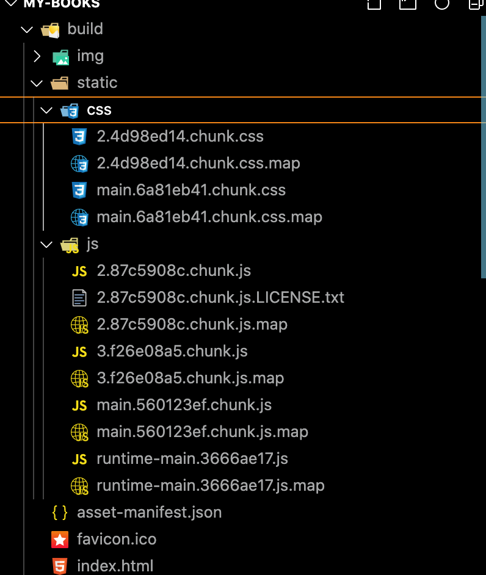

우리의 브라우저는 우리들 모르게 많은 정보를 가지고 있다. 보통 한번 페이지에 소스코드는 이름이 똑같은 경우 캐싱을 해 놓은다.

자 그러면 우리가 배포를 했다. 수정을 하고 배포를 하면 이름이 똑같을 텐데 브라우저 입장에서는 서버에서 내려오는 건데 아까 받았던 파일인가 보다 이름 기반으로 생각을 하게 된다. 그래서 새로운 소스코드로 빌드를 다시 하게 되서 변경이 되면 무조건 파일 이름을 변경 시켜 준다. 그래야지 새로 배포된 곳에서는 새로운 소스 코드를 볼수 있으니까 캐시를 무시하게 된다. 

그런 테크닉을 가지고 있다. 

## SPA Deploy 특징

- 모든 요청을 서버에 하고 받아오는 형태가 아님
- 라우팅 경로에 상관없이 리액트 앱을 받아 실행
- 라우팅은 받아온 리액트 앱을 실행 후 적용
- Static 파일을 제외한 모든 요청을 index.html 로 응답해 주도록 작업


serve -s build 패키지

- httpsL//github.com/zeit/serve

npx serve -s build

하면 서버가 뜬다.

이 페키지를 만든 회사가 vercel로 이름이 바뀌었다.


## AWS S3에 React Wep App 배포하기

AWS에 로그인 하자.

S3으로 가자 S3은 심플 스토리지 약자이다. 구글 드라이브같이 파일을 저장할 수 있다.

버킷 만들기를 누르고 버킷 이름이 같으면 안된다. 

그리고 버킷 만들기를 하고 만든거에 들어간다. 그리고 파일 업로드가 있을 것이다.

웹파일 서버처럼 사용할 수 있게 도와준다. 파일을 올려두면 그 파일을 url로 접근할 수 있다. 그런 기능을 S3에서 제공한다.

객체를 올려야하는데 사실은 하나하나가 파일이다. 객체는 파일 하나를 의미한다.

해당 디랙토리에서 open build 를 하면 build 폴더 안에 다 올려야한다.

해당 파일들을 다 드래그 한다.(build폴더를 올리는게 아니라 그 안에 파일을 올리는 거다.)

이제 업로드를 하자. 그리고 다시 가보면 다 들어 와 있다.

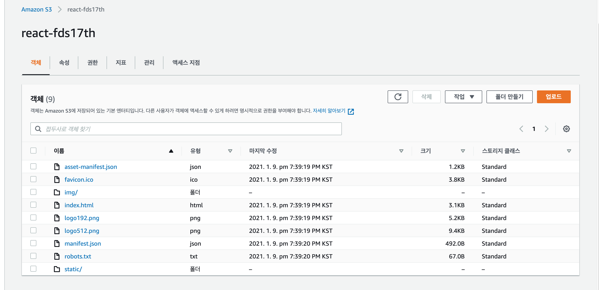

이제 얘를 파일을 주는 웹 서버로 만들어 주자. 속성으로 들어가서  정적 웹 사이트 호스팅을 눌려서 편집한다.

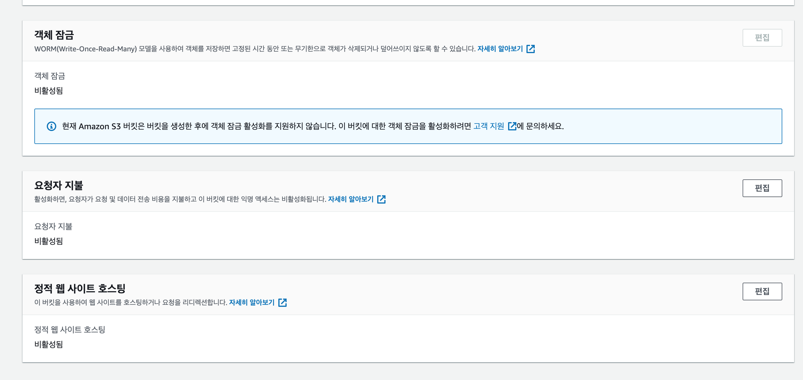

편집을 눌려서

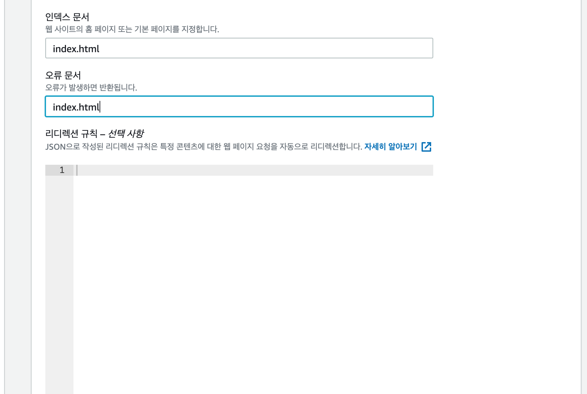

이렇게 편집하면 엔드포인트가 나온다.

눌려서 확인하면 나올줄 알았지만 403 에러가 발생한다.

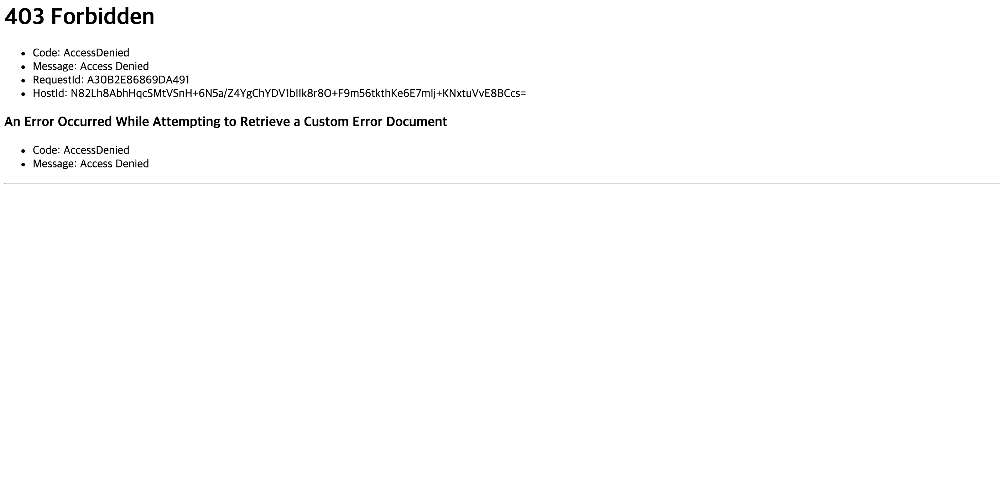

우리가 볼수 있는건 로그인을 했기 때문에 보여지게 된다. 즉 이것들은 로그인을 안하면 볼 수 없는 404에러를 보여준다. 그래서 권한을 설정하자.

퍼블릭 엑세스를 차단 한 설정이 켜져 있다.

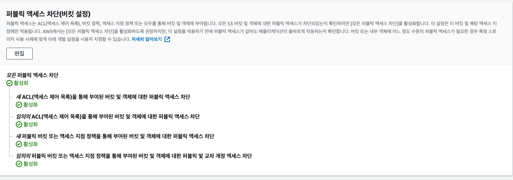

이걸 차단하는 설정을 꺼야한다. 편집을 눌려서 체크 해제한다. 체크 해제 할때 보안에 문제가 있지만 우리는 웹 사이트로 쓸꺼기 때문에 그냥 확인을 누르자.

이제 차단 해제를 하고 사이트로 갔는데 않됀다.  한가지 더 해줘야한다. 어떤 객체들을 퍼블릭하게 열어 줄 것인지 bucket 정책을 써 줘야한다.

```js
{
  "Version": "2012-10-17",
  "Statement": [
    {
      "Sid": "PublicReadGetObject",
      "Effect": "Allow",
	  "Principal": "*",
      "Action": [
        "s3:GetObject"
      ],
      "Resource": [
        "arn:aws:s3:::react-fds17th/*"
      ]
    }
  ]
}
```

GetObject 파일을 줘 액션을 어떤 리소스에서 Allo(허락)할 거다.


```js
 "Resource": [
        "arn:aws:s3:::react-fds17th/*"
      ]
```

이건 우리의 버킷 이름을 ::: 뒤에 써줘야한다.

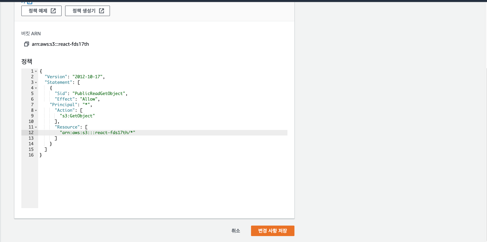

그러면 홈페이지가 잘 틀어진다.

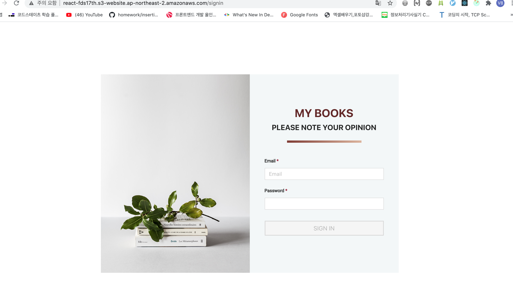

도메인과 도메인을 발급받은 인증서를 가지고 앞에 한 레이어를 더 붙여줘야한다. https로 막아준다.

그 서비스가 무엇이냐면 cloudfront이다. cloudfront의 역할은 뭐죠? cdn의 역할이다. cdn이 뭔지 아시나요? cdn은 지구라고 생각 하면 서울에 있다. 서울에 사니까 인터넷을 키고 조금만 가면 된다 빠르다. 유럽에 사는 사람이 우리의 사이트로 들어올려면 멀다. CDN 네트웍스 기능이 우리를 오리진이라 불리고 유럽 근처의 복사본을 둔다. 작업을 다 하고 서울에 배포를 하고 클라우드프론트를 키면 오리지날을 복사본을 유럽에 둔다. 그래서 유럽에서 우리로 올필요 없이 복사본을 접근 한다. 


## nodex.js express로 React Wep App 배포하기 

serve로 띄우는 게 node.js로 띄우는 게 맞는건데 파일 서버로 만들어서 node.js로 제공하는거고 express는 그게 아니고 웹 프레임워크이다. 

제일 널리 알려진 노드js의 API를 만들때 사용하는 간단한 리엑트 않쓰고 간단한 웹페이지 만들때도 웹 애플리케이션을 만드는 가장 대표적인 아이다.

(좀 올드하다. )

요즘에는 nestJs를 쓴다. 이름부터가 progressive하다. 

그래서 express로 한번 해보자.

```bash
npm i express
```

를 설치하자.

설치하고 프로젝트 루트에다가 만드는 거다. (src에다 만드는게 아니라.)

- server.js

```js
const express = require('express');
```

얘는 express를 require한다. 요즘에 않쓰는데 왜냐하면 import를 쓰고 있었는데 왜 쓸까? 얘는 실행을 누가해주는 거나면 node가 실행해 주기 때문에 node의 문법으로 해야한다. app을 생성하자.

```js
const express = require('express');

const app = express();

app.listen(9000);
```

지금 아무것도 않하고 express로 웹서버를 하나 만들고 9000번으로 포트를 열어서 받아들이겠다 한건데  이 사이에다 

우리는 build라는 아이 폴더를 파일로 serving 하겠다 라는 느낌으로 한번 진행 하려면 middleware라는 것을 사용해야한다.

```js
__dirname: 현재 실행하는 디렉토리 이름 (전역 변수 같은 이름)
```

- server.js

```js
const express = require('express');
const path = require('path');
const app = express();

// 어떤 경로로 요청이 오면 어떤걸 줄거다.

app.use(express.static(path.join(__dirname, 'build')));

app.get('/', (req, res) => {
  res.sendFile(path.join(__dirname, 'build', 'index.html'));
})
// app.


app.listen(9000);
```

이렇게 주겠다 하는 거다.

자 이제 실행을 해보자.

```bash
node server.js
```


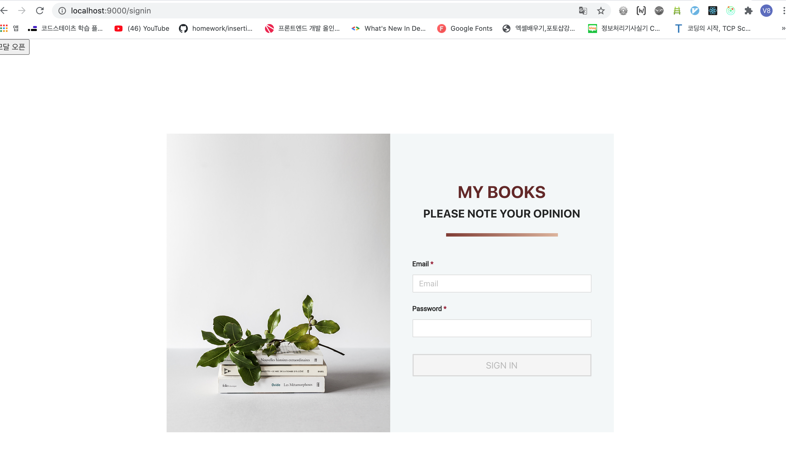 

잘 나오지만 다른 경로로 해보면 않나온다. 그래서 

```js
const express = require('express');
const path = require('path');
const app = express();

// 어떤 경로로 요청이 오면 어떤걸 줄거다.

app.use(express.static(path.join(__dirname, 'build')));

app.get('*', (req, res) => {
  res.sendFile(path.join(__dirname, 'build', 'index.html'));
})
// app.


app.listen(9000);
```

하면 된다.

## 서버사이드 렌더링 이해하기

얘는 프로젝트 수준에 따라서 서버사이드 수준의 차이가 크다.

이해를 해보도록 하자. 

react안에는 ReactDOMServer 가 있다.


```js
import ReactDOMServer from 'react-dom/server';
// Common JS
var ReactDOMServer = require('react-dom/server');
```

이걸 받아서 메서드들이 있다. 

renderToString() , renderToStaticMarkup(), renderToNodeStream(), renderToStaticNodeStream() 이 있다.

서버사이드 렌더링을 직접한다 Node server를 따로 서버사이드용 노드 서버 풀을 운영한다.

이제 require를 해보자.

```js
const express = require('express');
const path = require('path');
const ReactDOMServer = require('react-dom/server');

const app = express();

console.log(ReactDOMServer)

// 어떤 경로로 요청이 오면 어떤걸 줄거다.

app.use(express.static(path.join(__dirname, 'build')));

app.get('*', (req, res) => {
  res.sendFile(path.join(__dirname, 'build', 'index.html'));
})
// app.


app.listen(9000);
```

이렇게 하고 실행 해 보자.


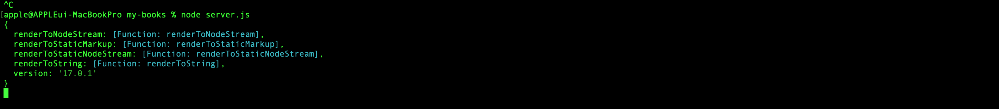

이 안에는 여러가지 함수가 있다.

```js
const express = require('express');
const path = require('path');
const ReactDOMServer = require('react-dom/server');

const app = express();

console.log(ReactDOMServer.renderToString);

// 어떤 경로로 요청이 오면 어떤걸 줄거다.

app.use(express.static(path.join(__dirname, 'build')));

app.get('*', (req, res) => {
  res.sendFile(path.join(__dirname, 'build', 'index.html'));
})
// app.


app.listen(9000);
```

얘를 찍어보면 함수가 나온다. 이 함수는 무엇을 하는 함수냐면 React 컴포넌트를 받아다가 String으로 만들어준다.

```js
const React = require('react');

console.log(ReactDOMServer.renderToString(<button>hello</button>));
```

이렇게 하면 노드에서는 < 를 읽을 수 없다. 이거는 jsx는 바로 실행할 수 없고 바벨을 통해야 한다. 그래서 일단 임시로 React.createElement()를 이용하자.

```js
console.log(ReactDOMServer.renderToString(React.createElement('button', null, 'hello')));
```

이렇게 하고 다시 실행하면

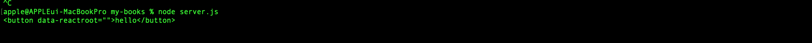

이렇게 string으로 나온다.컴포넌트를 랜더를 해서 스트링으로 바꿨다.

이 스트링은 어따가 써야하나 서버랜더링 기본은 

```js
const express = require('express');
const path = require('path');
const ReactDOMServer = require('react-dom/server');
const React = require('react');
const app = express();


// 어떤 경로로 요청이 오면 어떤걸 줄거다.

app.use(express.static(path.join(__dirname, 'build')));

app.get('*', (req, res) => {
  const string = ReactDOMServer.renderToString(
    React.createElement('button', null, 'hello')
    );
  res.sendFile(path.join(__dirname, 'build', 'index.html'));
})
// app.


app.listen(9000);
```

 이 string은 어디다 둬야하나

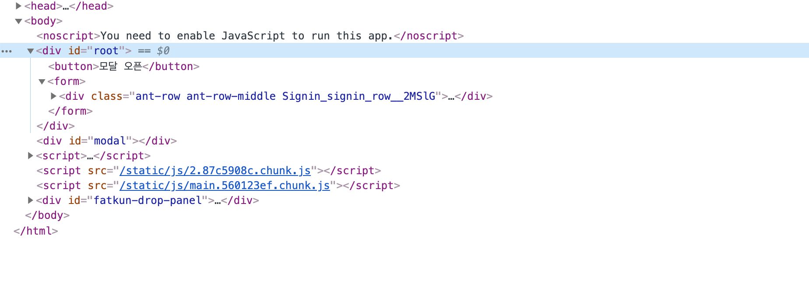

body안에 root안에 원레는 들어와야한다. 요 아이를 renderToString에서 root안에 있는걸 가져와야한다. 새로고침할때 react가 넣어주기 전에 보면 

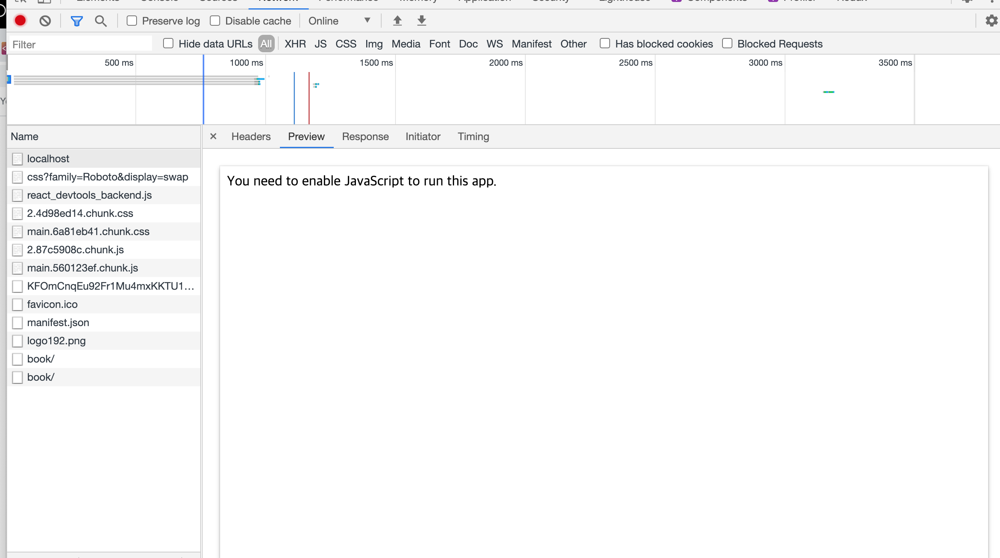

이렇게 생겼다. 저 부분 안에다가 react가 렌더를 해주는게 목표인데 SSR은 저 부분에 이미 그림이 그려져서 내려와야 한다. Index.html을 읽어야한다.


```js
const express = require('express');
const path = require('path');
const fs = require('fs');
const ReactDOMServer = require('react-dom/server');
const React = require('react');
const app = express();


// 어떤 경로로 요청이 오면 어떤걸 줄거다.

app.use(express.static(path.join(__dirname, 'build')));

app.get('*', (req, res) => {
  const string = ReactDOMServer.renderToString(
    React.createElement('button', null, 'hello')
    );
  const indexPath = path.join(__dirname, 'build', 'index.html');
  const index = fs.readFileSync(indexPath).toString();// string을 뽑아야 한다. 버퍼이다. 그래서 스트링으로 바꿔야한다.
    // index는 index.html(리엑트가 만들어 준거 말고 오기전에 온 html)
    
  res.send(index.replace('<div id="root"></div>', `<div id="root">${string}</div>`));
})
// app.


app.listen(9000);
```

이렇게 만든다. 어떻게 달라지나면

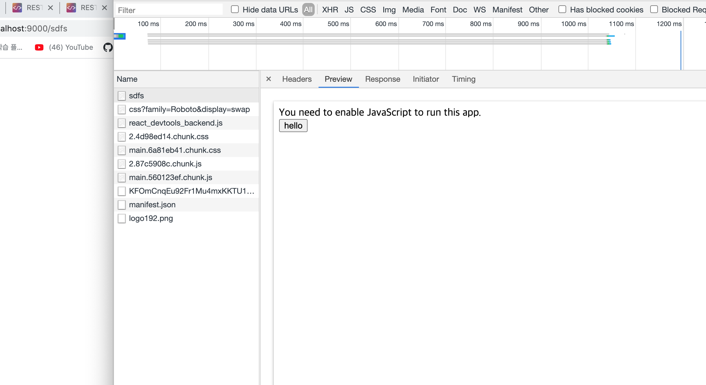

이렇게 만들어 온다. 

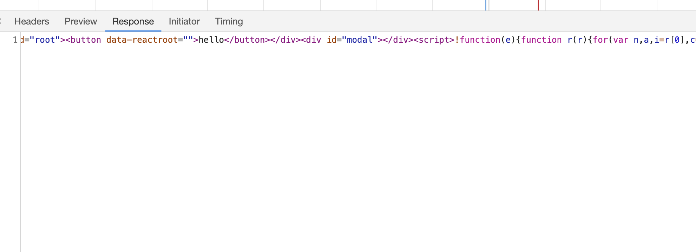

이때 data-reactroot가 하는일은 서버사이드 렌더링을 한 다음에 이렇게 끼어서 내렸지만 preview는 위지만 결과물은


얘다 그 이유는 그 사이에 


얘는 서버에서 내려오자마자의 모습이고 리엑트가 실행 되고 아래로 바뀌었다.


바뀔때 App을 넣었을 때 비슷하게 생겼을 것이다. 그래서 비슷하게 생긴 아이와 리엑트가 나온 아이를 비교해서 실제로 다른 아이만 클라이언트에서 바꿔준다. 그런때 사용하는게 reactroot를 이용해서 아이디값이 박혀서 나온다. 만약 그 아이디와 클라이언트의 아이디가 같으면 안 바꾸고 다르면 바꾸어 준다.


성능의 조금이라도 우위를 주기 위해 불필요하게 재 렌더링을 않하려고 한다.

문제가 많다. 

여기서 리덕스를 쓴다면 어떻게 될까? 이건 가정해서 고민을 해보자. 리덕스를 쓴다면 그림을 그려지는 아이는 리덕스의 데이터로 booklist 페이지를 서버사이드 렌더링을 하고 싶으면 api를 호출 해야한다. 책 리스트를 받아오는 api 그 다음에는 그 아이로 renderToString을 해야 하고 그다음에 renderToString할때 사용했던 redux store를 initalState에 api 호출해서 나온 결과로 걔를 그냥 내려주면 initatialState가 없다. 그래서 서버에서 만든 initialState를 클라이언트에 보내준다.


어떻게 서버에서 클라이언트로 넣어 줄까요?? 

```js
const express = require('express');
const path = require('path');
const fs = require('fs');
const ReactDOMServer = require('react-dom/server');
const React = require('react');
const app = express();


// 어떤 경로로 요청이 오면 어떤걸 줄거다.

app.use(express.static(path.join(__dirname, 'build')));

app.get('*', (req, res) => {
  const string = ReactDOMServer.renderToString(
    React.createElement('button', null, 'hello')
    );
  const indexPath = path.join(__dirname, 'build', 'index.html');
  const index = fs.readFileSync(indexPath).toString();// string을 뽑아야 한다. 버퍼이다. 그래서 스트링으로 바꿔야한다.
    // index는 index.html(리엑트가 만들어 준거 말고 오기전에 온 html)
    
    // api 호출
    // 그 아이로 renderToString
    // redux store를 만들어준다. initialState에 api 호출해서 나온 결과로
    // 서버에서 만든 initialState를 클라이언트에 보내준다.

    const state = {
      books: [{ name: '책 이름' }]
    }

  res.send(index.replace('<div id="root"></div>', `<div id="root">${string}</div><script>window.__INITIAL_STATE__= JSON.parse('${JSON.stringify(state)}');</script>`));
})
// app.


app.listen(9000);
```

이렇게 했다.

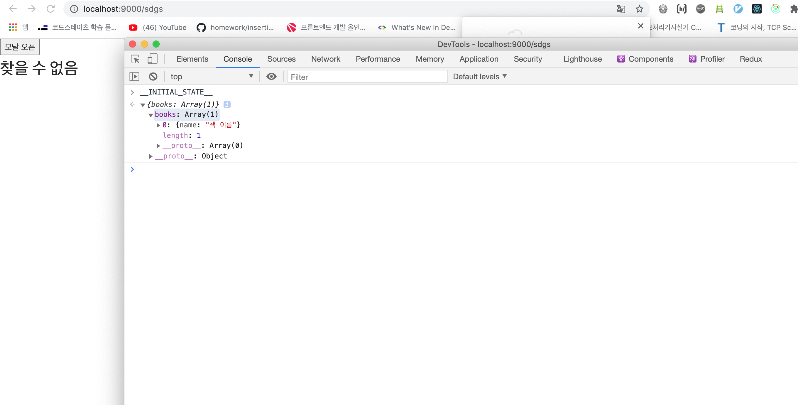

이렇게 들어온다. 그러면 이렇게 하면 어떻게 해야하나

```js
createStore(reducer, __INITIAL_STATE__)
```

이렇게 한다.

