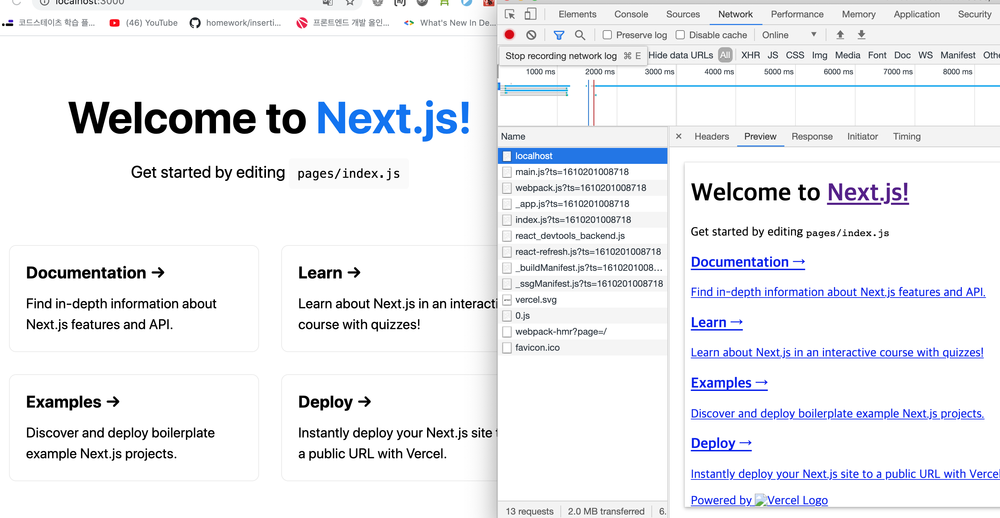
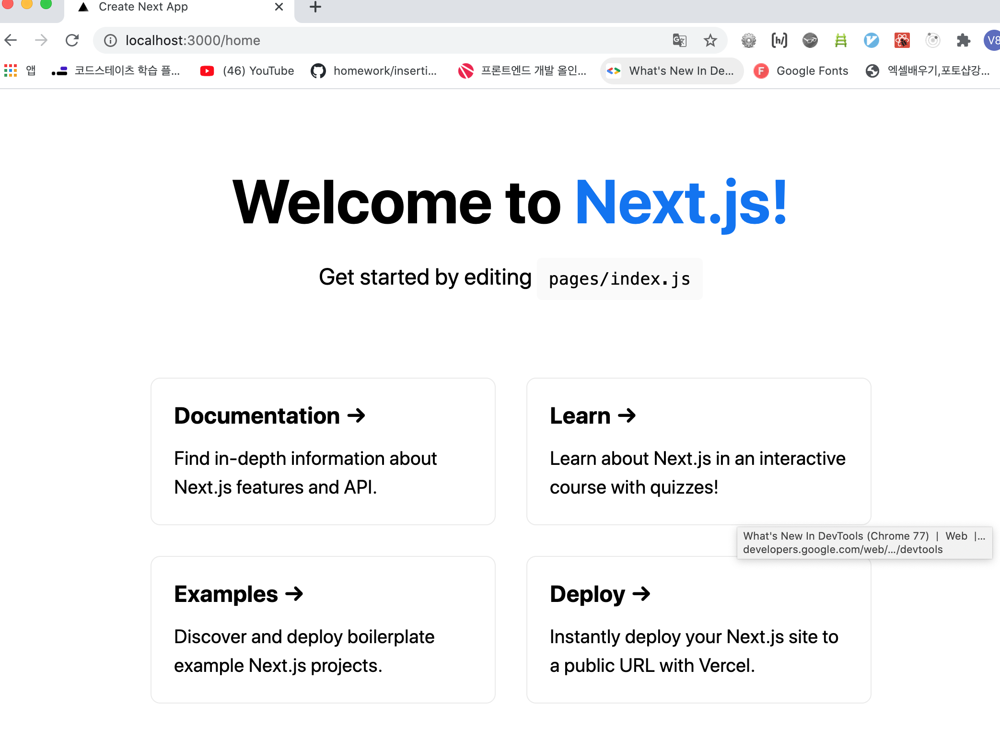
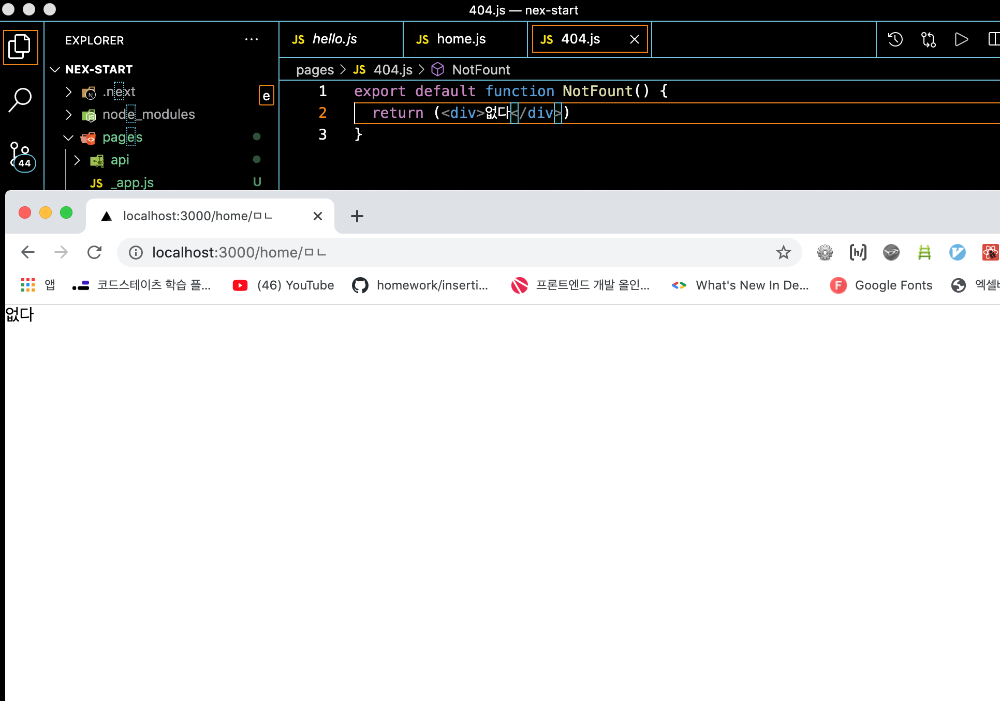

# Next.js

간단하게 해보자.

```bash
npx create-next-app
```

이걸 설치하면 된다.(이름을 설정하고 엔터)

들어가서 

이상태에서 npm run dev를 하자.



이렇게 서버사이드 렌더링이 되고 있다.

만약 index pages 폴더안에 index.js에서 복사해서 새로운 파일 home.js라고 만들고 붙여 넣기 하자.

- home.js

```js
import Head from 'next/head'
import styles from '../styles/Home.module.css'

export default function Home() {
  return (
    <div className={styles.container}>
      <Head>
        <title>Create Next App</title>
        <link rel="icon" href="/favicon.ico" />
      </Head>

      <main className={styles.main}>
        <h1 className={styles.title}>
          Welcome to <a href="https://nextjs.org">Next.js!</a>
        </h1>

        <p className={styles.description}>
          Get started by editing{' '}
          <code className={styles.code}>pages/index.js</code>
        </p>

        <div className={styles.grid}>
          <a href="https://nextjs.org/docs" className={styles.card}>
            <h3>Documentation &rarr;</h3>
            <p>Find in-depth information about Next.js features and API.</p>
          </a>

          <a href="https://nextjs.org/learn" className={styles.card}>
            <h3>Learn &rarr;</h3>
            <p>Learn about Next.js in an interactive course with quizzes!</p>
          </a>

          <a
            href="https://github.com/vercel/next.js/tree/master/examples"
            className={styles.card}
          >
            <h3>Examples &rarr;</h3>
            <p>Discover and deploy boilerplate example Next.js projects.</p>
          </a>

          <a
            href="https://vercel.com/import?filter=next.js&utm_source=create-next-app&utm_medium=default-template&utm_campaign=create-next-app"
            className={styles.card}
          >
            <h3>Deploy &rarr;</h3>
            <p>
              Instantly deploy your Next.js site to a public URL with Vercel.
            </p>
          </a>
        </div>
      </main>

      <footer className={styles.footer}>
        <a
          href="https://vercel.com?utm_source=create-next-app&utm_medium=default-template&utm_campaign=create-next-app"
          target="_blank"
          rel="noopener noreferrer"
        >
          Powered by{' '}
          
        </a>
      </footer>
    </div>
  )
}
```



이렇게 나온다. (와우..)

만약 이상한 글자를 url뒤에 적는다면 404에러가 발생한다.그러면 한번 새로운 파일해서 404.js를 만들어 보자.



이렇게 없다라고 나온다. 만약 저런 주소로 만들고 싶으면 pages안에 폴더를 만들고 해당 이름폴더를 만든다.


이렇게 그림이 그려지고 서버사이드 렌더링도 된다. 얘를 배포할때 정적인 페이지로만 html을 떨궈줄 때도 있다.