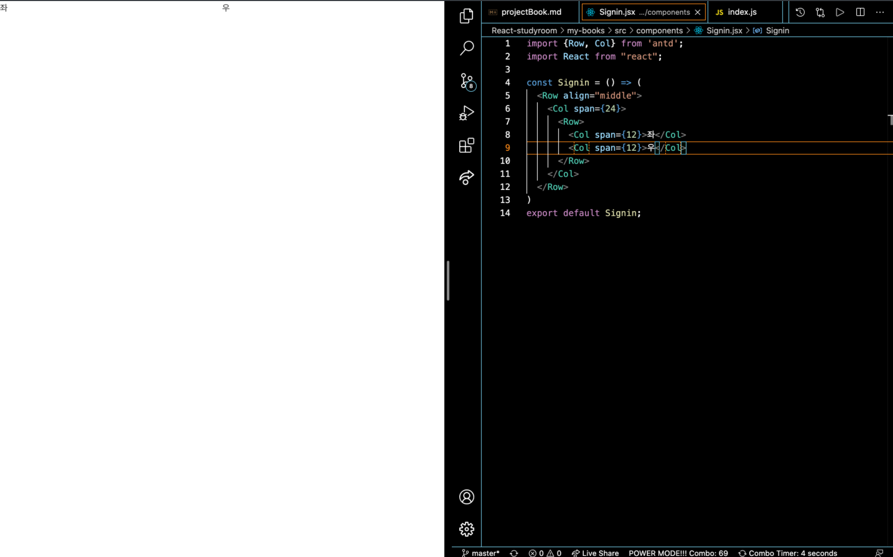
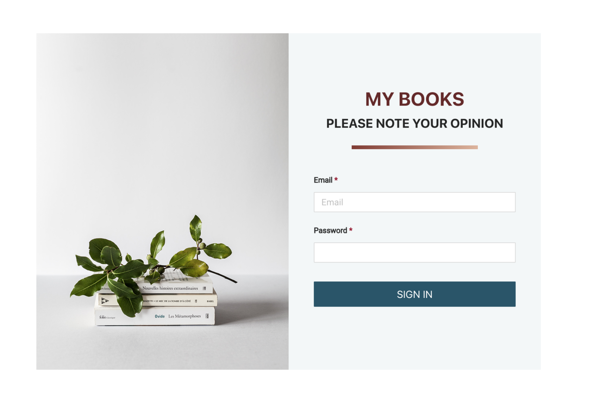
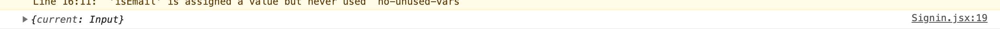
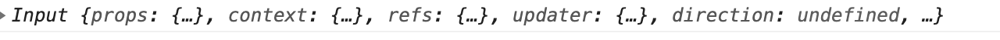

## 서적 프로젝트

npx create-react-app my-book

을 해서 react app을 설치한다.

그 후

.nvmrc 파일을 만든 후 사용할 버전을 지정하고 터미널에 nvm use를 하면 적용이 된다.
그 후 router와 error-boundary와 antd 를 설치 하자.

```
npm i react-router-dom react-error-boundary antd
```

그리고 index.html폰트를 지정하자.

```html
    <title>React App</title>
    <link
    href="https://fonts.googleapis.com/css?family=Roboto&display=swap"
    rel="stylesheet"
  />
  </head>
```

초기 App.js Route 설정 및 ErrorBoundary

```js
import logo from "./logo.svg";
import "./App.css";
import { ErrorBoundary } from "react-error-boundary";
import { BrowserRouter, Switch, Route } from "react-router-dom";

function App() {
	return (
		<ErrorBoundary FallbackComponent={Error}>
			<BrowserRouter>
				<Switch>
					<Route path='/sighin' />
					<Route path='/home' />
					<Route />
				</Switch>
			</BrowserRouter>
		</ErrorBoundary>
	);
}

export default App;
```

위 처럼 에러 바운더리에 에러객체의 이름인 Error를 쓰고 싶으면 pages폴더에 따로 만들어서 import 하면 된다.

```js
import logo from "./logo.svg";
import "./App.css";
import { ErrorBoundary } from "react-error-boundary";
import { BrowserRouter, Switch, Route } from "react-router-dom";

// Pages
import Error from "./pages/Error";
import Signin from "./pages/Signin";
import Home from "./pages/Home";
import NotFound from "./pages/NotFound";

function App() {
	return (
		<ErrorBoundary FallbackComponent={Error}>
			<BrowserRouter>
				<Switch>
					<Route path='/sighin' component={Signin} />
					<Route path='/home' component={Home} />
					<Route component={NotFound} />
				</Switch>
			</BrowserRouter>
		</ErrorBoundary>
	);
}

export default App;
```

pages 폴더를 만들어서 pages에 해당하는 컴포넌트를 만들자.

Home.jsx

```js
export default function Error() {
	return (
		<div>
			<h1>홈</h1>
		</div>
	);
}
```

Signin.jsx

```js
export default function Signin() {
	return (
		<div>
			<h1>Signin</h1>
		</div>
	);
}
```

Error.jsx

```js
export default function Error() {
	return (
		<div>
			<h1>에러</h1>
		</div>
	);
}
```

NotFound.jsx

```js
export default function NotFound() {
	return (
		<div>
			<h1>찾을 수 없음</h1>
		</div>
	);
}
```

그리고 뒤에 경로를 이상한거 치면 홈이 나오는 불상사를 피하기 위해 exact를 추가하자.
전에도 말했듯이 Switch는 제일 위 부터 검사한다. 즉 제일 작은 부분 부터 검사를 한다.

```js
import "./App.css";
import { ErrorBoundary } from "react-error-boundary";
import { BrowserRouter, Switch, Route } from "react-router-dom";

// Pages
import Error from "./pages/Error";
import Signin from "./pages/Signin";
import Home from "./pages/Home";
import NotFound from "./pages/NotFound";

function App() {
	return (
		<ErrorBoundary FallbackComponent={Error}>
			<BrowserRouter>
				<Switch>
					<Route path='/sighin' component={Signin} />
					<Route path='/' exact component={Home} />
					<Route component={NotFound} />
				</Switch>
			</BrowserRouter>
		</ErrorBoundary>
	);
}

export default App;
```

## Signin 컴포넌트 꾸미기

Signin page에 직접 element를 사용하지 않고 Signin으로 하는 component로 옮긴다.

Signin.jsx

```js
export default function Signin() {
	return <Signin />;
}
```

그리고 components 폴더를 만들고 그 안에서 컴포넌트의 디자인을 만들 것이다.

```js
import { Row, Col } from "antd";
import React from "react";

const Signin = () => {
	return (
		<Row align='middle'>
			<Col>hello</Col>
		</Row>
	);
};
export default Signin;
```

이렇게 antd 레이아웃을 가져와서 만들자.



```js
import { Row, Col } from "antd";
import React from "react";

const Signin = () => (
	<Row align='middle'>
		<Col span={24}>
			<Row>
				<Col span={12}>좌</Col>
				<Col span={12}>우</Col>
			</Row>
		</Col>
	</Row>
);
export default Signin;
```

이런 식으로 좌 우를 분활 해서 레이아웃을 만들자.

> public폴더에 있는 Roboto.txt 파일은 나중에 실무가서 중요한 파일이다.
> 이것은 구글에 검색을 할 시에 회사나 링크가 나올 것이다.
> 구글에서 검색 로봇이 사이트를 계속 뒤진다. 어느 사이트를 뒤지나? 그것이 Roboto.txt에서 뒤진다.

## image 넣기

이미지를 넣고 싶으면 public에 이미지를 넣자

```js
import { Row, Col } from "antd";
import React from "react";

const Signin = () => (
	<Row style={{ height: "100vh" }} align='middle'>
		<Col span={24}>
			<Row>
				<Col
					span={12}
					style={{
						width: 800,
					}}
				>
					
				</Col>
				<Col span={12}>
					<div>My Books</div>
					<div>Please Note Your Opinion</div>
				</Col>
			</Row>
		</Col>
	</Row>
);
export default Signin;
```

components폴더에

그리고 Signin.module.css를 추가하자.

```css
.signin_row {
	height: 100vh;
}

.signin_title {
	text-align: center;
	font-size: 30px;
	font-weight: bold;
	color: #642828;
	text-transform: uppercase;
	margin-top: 80px;
}

.signin_subtitle {
	text-align: center;
	font-size: 20px;
	font-weight: bold;
	text-transform: uppercase;
}

.signin_underline {
	width: 200px;
	height: 6px;
	margin: 20px auto 0 auto;
	background: linear-gradient(to right, #803b32, #ddb49b);
}

.signin_contents {
	margin-top: 50px;
	background-color: #f3f7f8;
	margin-left: auto;
	margin-right: auto;
	width: 800px;
}

.signin_bg {
	width: 100%;
}

.email_title {
	font-family: Roboto;
	font-size: 12px;
	font-weight: bold;
	margin-top: 40px;
	text-align: left;
	padding-left: 40px;
}

.password_title {
	font-family: Roboto;
	font-size: 12px;
	font-weight: bold;
	margin-top: 10px;
	text-align: left;
	padding-left: 40px;
}

.required {
	color: #971931;
}

.input_area {
	padding-top: 10px;
	padding-bottom: 10px;
	padding-left: 40px;
	padding-right: 40px;
}

.input {
	width: 100%;
	border-radius: 1px;
	border-width: 1px;
	font-family: Roboto;
}

.button_area {
	text-align: center;
	padding-left: 40px;
	padding-right: 40px;
	margin-top: 20px;
}

.button {
	border-color: #28546a;
	background-color: #28546a;
	text-transform: uppercase;
	border-radius: 1px;
	border-width: 2px;
	color: white;
	width: 100%;
}

.button:hover {
	background-color: #28546a;
	color: white;
}
```

그리고 components에 있는 Signin.jsx에 import를 해서 가져 와 보자.

```js
import { Row, Col } from "antd";
import React from "react";
import styles from "./Signin.module.css";

console.log(styles);
const Signin = () => (
	<Row align='middle' className={styles.signin_row}>
		<Col span={24}>
			<Row>
				<Col span={12} className={styles.signin_contents}>
					
				</Col>
				<Col span={12}>
					<div className={styles.signin_title}>My Books</div>
					<div className={styles.signin_subtitle}>Please Note Your Opinion</div>
				</Col>
			</Row>
		</Col>
	</Row>
);
export default Signin;
```

styles 콘솔에는

```js
{signin_row: "Signin_signin_row__2MSlG", signin_title: "Signin_signin_title__Q5bMW", signin_subtitle: "Signin_signin_subtitle__36Jj2", signin_underline: "Signin_signin_underline__2mWLl", signin_contents: "Signin_signin_contents__1W233", …}
```

이렇게 이름이 지정된다.

```js
import { Row, Col, Input, Button } from "antd";
import React from "react";
import styles from "./Signin.module.css";

console.log(styles);
const Signin = () => (
	<form>
		<Row align='middle' className={styles.signin_row}>
			<Col span={24}>
				<Row className={styles.signin_contents}>
					<Col span={12}>
						
					</Col>
					<Col span={12}>
						<div className={styles.signin_title}>My Books</div>
						<div className={styles.signin_subtitle}>
							Please Note Your Opinion
						</div>
						<div className={styles.signin_underline} />
						<div className={styles.email_title}>
							Email
							<span className={styles.required}> *</span>
						</div>
						<div className={styles.input_area}>
							<Input
								placeholder='Email'
								autoComplete='email'
								name='email'
								className={styles.input}
							/>
						</div>
						<div className={styles.password_title}>
							Password
							<span className={styles.required}> *</span>
						</div>
						<div className={styles.input_area}>
							<Input
								type='password'
								autoComplete='current-password'
								className={styles.input}
							/>
						</div>
						<div className={styles.button_area}>
							<Button size='large' className={styles.button}>
								Sign In
							</Button>
						</div>
					</Col>
				</Row>
			</Col>
		</Row>
	</form>
);
export default Signin;
```

이렇게 만든다.


버튼에 click이벤트를 넣자.

```js
import { Row, Col, Input, Button } from "antd";
import React from "react";
import styles from "./Signin.module.css";

console.log(styles);
const Signin = () => {
	return (
		<form>
			<Row align='middle' className={styles.signin_row}>
				<Col span={24}>
					<Row className={styles.signin_contents}>
						<Col span={12}>
							
						</Col>
						<Col span={12}>
							<div className={styles.signin_title}>My Books</div>
							<div className={styles.signin_subtitle}>
								Please Note Your Opinion
							</div>
							<div className={styles.signin_underline} />
							<div className={styles.email_title}>
								Email
								<span className={styles.required}> *</span>
							</div>
							<div className={styles.input_area}>
								<Input
									placeholder='Email'
									autoComplete='email'
									name='email'
									className={styles.input}
								/>
							</div>
							<div className={styles.password_title}>
								Password
								<span className={styles.required}> *</span>
							</div>
							<div className={styles.input_area}>
								<Input
									type='password'
									autoComplete='current-password'
									className={styles.input}
								/>
							</div>
							<div className={styles.button_area}>
								<Button size='large' className={styles.button} onClick={click}>
									Sign In
								</Button>
							</div>
						</Col>
					</Row>
				</Col>
			</Row>
		</form>
	);
	function click() {}
};
export default Signin;
```

버튼 컴포넌트에 onClick이라는 프롭스를 넘겨준 것이다.

배경색을 지정하려면 위 처럼 styles.signin_contents 이것을 추가하자.

class 로 만들어 보자.

```js
import { Row, Col, Input, Button } from "antd";
import React from "react";
import styles from "./Signin.module.css";

console.log(styles);

class Signin extends React.Component {
	render() {
		return (
			<form>
				<Row align='middle' className={styles.signin_row}>
					<Col span={24}>
						<Row className={styles.signin_contents}>
							<Col span={12}>
								
							</Col>
							<Col span={12}>
								<div className={styles.signin_title}>My Books</div>
								<div className={styles.signin_subtitle}>
									Please Note Your Opinion
								</div>
								<div className={styles.signin_underline} />
								<div className={styles.email_title}>
									Email
									<span className={styles.required}> *</span>
								</div>
								<div className={styles.input_area}>
									{/* <Input
                placeholder="Email"
                autoComplete="email"
                name="email"
                className={styles.input}
              /> */}
									<input type='text' />
								</div>
								<div className={styles.password_title}>
									Password
									<span className={styles.required}> *</span>
								</div>
								<div className={styles.input_area}>
									<Input
										type='password'
										autoComplete='current-password'
										className={styles.input}
									/>
								</div>
								<div className={styles.button_area}>
									<Button
										size='large'
										className={styles.button}
										onClick={this.click}
									>
										Sign In
									</Button>
								</div>
							</Col>
						</Row>
					</Col>
				</Row>
			</form>
		);
	}
	click = () => {
		console.log("dd");
	};
}
export default Signin;
```

state에 email을 기본 값으로 하자.

만약 클래스에 초기값을 설정하면 렌더되면서 input에 value에 this.state.email 을 넣고 콘솔로 가면 onChange가 없다고 에러가 발생한다. 그러면 onChange를 써야한다.

```js
import { Row, Col, Input, Button } from "antd";
import React from "react";
import styles from "./Signin.module.css";

console.log(styles);

class Signin extends React.Component {
	state = {
		email: "",
	};
	render() {
		return (
			<form>
				<Row align='middle' className={styles.signin_row}>
					<Col span={24}>
						<Row className={styles.signin_contents}>
							<Col span={12}>
								
							</Col>
							<Col span={12}>
								<div className={styles.signin_title}>My Books</div>
								<div className={styles.signin_subtitle}>
									Please Note Your Opinion
								</div>
								<div className={styles.signin_underline} />
								<div className={styles.email_title}>
									Email
									<span className={styles.required}> *</span>
								</div>
								<div className={styles.input_area}>
									{/* <Input
                placeholder="Email"
                autoComplete="email"
                name="email"
                className={styles.input}
              /> */}
									<input
										type='text'
										value={this.state.email}
										onChange={this.change}
									/>
								</div>
								<div className={styles.password_title}>
									Password
									<span className={styles.required}> *</span>
								</div>
								<div className={styles.input_area}>
									<Input
										type='password'
										autoComplete='current-password'
										className={styles.input}
									/>
								</div>
								<div className={styles.button_area}>
									<Button
										size='large'
										className={styles.button}
										onClick={this.click}
									>
										Sign In
									</Button>
								</div>
							</Col>
						</Row>
					</Col>
				</Row>
			</form>
		);
	}
	click = () => {
		console.log("dd");
	};
	change = () => {
		console.log("change");
	};
}
export default Signin;
```

하지만 input에 변화가 없을 것이다; 그럴때 change 함수에 this.setState로 해서 상태를 바꿔줘야한다.

```js
import { Row, Col, Input, Button } from "antd";
import React from "react";
import styles from "./Signin.module.css";

console.log(styles);

class Signin extends React.Component {
	state = {
		email: "",
	};
	render() {
		return (
			<form>
				<Row align='middle' className={styles.signin_row}>
					<Col span={24}>
						<Row className={styles.signin_contents}>
							<Col span={12}>
								
							</Col>
							<Col span={12}>
								<div className={styles.signin_title}>My Books</div>
								<div className={styles.signin_subtitle}>
									Please Note Your Opinion
								</div>
								<div className={styles.signin_underline} />
								<div className={styles.email_title}>
									Email
									<span className={styles.required}> *</span>
								</div>
								<div className={styles.input_area}>
									{/* <Input
                placeholder="Email"
                autoComplete="email"
                name="email"
                className={styles.input}
              /> */}
									<input
										type='text'
										value={this.state.email}
										onChange={this.change}
									/>
								</div>
								<div className={styles.password_title}>
									Password
									<span className={styles.required}> *</span>
								</div>
								<div className={styles.input_area}>
									<Input
										type='password'
										autoComplete='current-password'
										className={styles.input}
									/>
								</div>
								<div className={styles.button_area}>
									<Button
										size='large'
										className={styles.button}
										onClick={this.click}
									>
										Sign In
									</Button>
								</div>
							</Col>
						</Row>
					</Col>
				</Row>
			</form>
		);
	}
	click = () => {
		console.log("dd");
	};
	change = (e) => {
		this.setState({ email: e.target.value });
	};
}
export default Signin;
```

이메일이 맞는지 아닌지 확인해야한다. 이때 정규 표현식을 사용하는게 낫다.

```js
import { Row, Col, Input, Button } from "antd";
import React from "react";
import styles from "./Signin.module.css";

console.log(styles);

class Signin extends React.Component {
	state = {
		email: "",
		loading: false,
	};
	render() {
		const { email, loading } = this.state;
		const isEmail = /^(([^<>()[\]\\.,;:\s@"]+(\.[^<>()[\]\\.,;:\s@"]+)*)|(".+"))@((\[[0-9]{1,3}\.[0-9]{1,3}\.[0-9]{1,3}\.[0-9]{1,3}\])|(([a-zA-Z\-0-9]+\.)+[a-zA-Z]{2,}))$/.test(
			email
		);
		return (
			<form>
				<Row align='middle' className={styles.signin_row}>
					<Col span={24}>
						<Row className={styles.signin_contents}>
							<Col span={12}>
								
							</Col>
							<Col span={12}>
								<div className={styles.signin_title}>My Books</div>
								<div className={styles.signin_subtitle}>
									Please Note Your Opinion
								</div>
								<div className={styles.signin_underline} />
								<div className={styles.email_title}>
									Email
									<span className={styles.required}> *</span>
								</div>
								<div className={styles.input_area}>
									{/* <Input
                placeholder="Email"
                autoComplete="email"
                name="email"
                className={styles.input}
              /> */}
									<input
										type='text'
										value={this.state.email}
										onChange={this.change}
									/>
									{isEmail ? "이메일 맞음" : "이메일 아님"}
								</div>
								<div className={styles.password_title}>
									Password
									<span className={styles.required}> *</span>
								</div>
								<div className={styles.input_area}>
									<Input
										type='password'
										autoComplete='current-password'
										className={styles.input}
									/>
								</div>
								<div className={styles.button_area}>
									<Button
										size='large'
										className={styles.button}
										onClick={this.click}
									>
										Sign In
									</Button>
								</div>
							</Col>
						</Row>
					</Col>
				</Row>
			</form>
		);
	}
	click = () => {
		console.log("dd");
	};
	change = (e) => {
		this.setState({ email: e.target.value });
	};
}
export default Signin;
```


## unControlled component

언컨트롤드 컴포넌트도 해보자.

이메일말고 패스워드를 가지고 언 컨트롤드 컴포넌트 방식으로 해보자.

- Signin.jsx

```js
import { Row, Col, Input, Button } from "antd";
import React from "react";
import styles from "./Signin.module.css";

console.log(styles);

class Signin extends React.Component {
	state = {
		email: "",
		loading: false,
	};
	render() {
		const { email, loading } = this.state;
		const isEmail = /^(([^<>()[\]\\.,;:\s@"]+(\.[^<>()[\]\\.,;:\s@"]+)*)|(".+"))@((\[[0-9]{1,3}\.[0-9]{1,3}\.[0-9]{1,3}\.[0-9]{1,3}\])|(([a-zA-Z\-0-9]+\.)+[a-zA-Z]{2,}))$/.test(
			email
		);
		return (
			<form>
				<Row align='middle' className={styles.signin_row}>
					<Col span={24}>
						<Row className={styles.signin_contents}>
							<Col span={12}>
								
							</Col>
							<Col span={12}>
								<div className={styles.signin_title}>My Books</div>
								<div className={styles.signin_subtitle}>
									Please Note Your Opinion
								</div>
								<div className={styles.signin_underline} />
								<div className={styles.email_title}>
									Email
									<span className={styles.required}> *</span>
								</div>
								<div className={styles.input_area}>
									{/* <Input
                placeholder="Email"
                autoComplete="email"
                name="email"
                className={styles.input}
              /> */}
									<input
										type='text'
										value={this.state.email}
										onChange={this.change}
									/>
									{isEmail ? "이메일 맞음" : "이메일 아님"}
								</div>
								<div className={styles.password_title}>
									Password
									<span className={styles.required}> *</span>
								</div>
								<div className={styles.input_area}>
								     {/* <Input
                type="password"
                autoComplete="current-password"
                className={styles.input}
              /> */}
              <input type="password"/>
								</div>
								<div className={styles.button_area}>
									<Button
										size='large'
										className={styles.button}
										onClick={this.click}
									>
										Sign In
									</Button>
								</div>
							</Col>
						</Row>
					</Col>
				</Row>
			</form>
		);
	}
	click = () => {
	    console.log('clicked', this.state.email);
	};
	change = (e) => {
		this.setState({ email: e.target.value });
	};
}
export default Signin;
```

input type passowrd에다가 id를 달아주자.

```js
   <input type="password" id="password"/>
```

우리는 Sign in 버튼을 누를 때 이메일이 뜨고 있다. 우리가 보통 이메일을 획득해서 사용하려고 하는거고 패스워드를 획들해서 사용하는 거다. 

this.click에서 

```js
  click = () => {
    const password = document.querySelector('#passowrd');
    console.log('clicked', this.state.email, password.value);
  }
```

이렇게 하면 하는게 불가능하지 않는다. 하지만 리엑트에서 지양하지 않는다.

그래서 리엑트에서 이렇게 한 방식을 비슷하게 하는 방식을 제공한다.

Signin이라는 컴포넌트가 마운트(새로 생성될때)   _password = React.createRef(); 이걸 실행한다.

콘솔로 찍어 보면 current로 null 값이 박힌 객체가 나온다.

이걸 어디다가 할당해 주냐면 

```js
<input type="password" ref={this._password}/>
```

 이렇게 넣어준다

this._password안에  input이라는 아이가 담겨 있다. 

React.createRef()로 만든 객체에다가 ref=특정돔을 할당하면 실제 DOM의 참조를 그 객체의 current에다가 집어 넣는다. 사용할때는

```js
  click = () => {
    const password = this._password.current.value;
    console.log('clicked', this.state.email, password);
  }

```

이렇게 사용을 한다.

document으로 부터 직접 querySelector해서 DOM을 얻어낸 행위는 리엑트의 패러다임에 어긋난다.

리엑트의 패러다임은 props나 state에 통해서 랜더를 했을 때 그 모습이 계속 한 방향으로 흐른다. 데이터가 변하면 데이터가 변하는 방식

createRef가 하는 일은 렌더가 될때 랜더된 아이들 중에 DOM을 기억해야 할 아이를 기억하게 하는 아이이다.

뭐할때 쓰나요? 데이터를 직접적으로 제어할 필요가 없다면(변경이 하나하나 될게 아니라면 reference를 쓴다.)

데이터를 관리해야 할때만 controlled를 쓴다.

예를들어 password에다가 마우스를 올리면 focus가 가고 싶게 하고 싶으면 onMounseOver

```js
 <input type="password" ref={this._password} onMouseOver={this._onMouseOver}/>
```

```js
_onMouseOver = (e) => {
    e.target.focus();
  }
```

이렇게 하면 될 텐데 이게 아니라 email input에 마우스 오버시 패스워드가 포커스 할때는 어떻게 해야 하나?

그래서 mouseOver를 email쪽에 달고 

```js
<input type="text" value={this.state.email}
                onChange={this.change}
                onMouseOver={this._onMouseOver}
              />
```

```js
  _onMouseOver = (e) => {
    this._password.current.focus();
  }
```

이런 식으로 다른 DOM에 Element요소에 직접 이벤트를 쏘고 싶을때 reference를 쥐고 해야한다.

많이 사용하는 곳이 있다. reference를 만들고 이벤트를 할당할 수 있다. 

createRef는 클래스 컴포넌트에서만 사용할 수 있다. 

컨트롤드 컴포넌트는 

```js
import React from 'react';

export default class Controlled extends React.Component {
  state = { value: '' };

  render() {
    return (
      <div>
        <input />
      </div>
    );
  }
}
```

이렇게 하고 input에 value로 this.state.value로 한 다음에 onChange에 this.setState로 state를 set한다.

## Hoc

src폴더에 hocs 폴더를 만들고 그 안에 withToken.js를 만들자.

- withToken.js

```js
export default function withToken(component) {

  function NewComponent() {
    return (
      <div>NewComponent</div>
    );
  }

  return NewComponent;
}
```

일단 이렇게 하자.

새로운 컴포넌트로 만들어서 리턴 해 줄 것이다.

컴포넌트를 하나 만들자.

```js
function Pepero() {
  return (<div>나는 Pepero</div>)
}

function withToken(Component) {

  function NewComponent() {
    return (
      <div>NewComponent</div>
    );
  }

  return NewComponent;
}

const Giftbox = withToken(Pepero);
```

우리는 Giftbox를 사용하면 된다. Pepero를 사용한 적이 없다. 그래서 Pepero를 사용해 보자.

```js
function Pepero() {
  return (<div>나는 Pepero</div>)
}

function withToken(Component) {

  function NewComponent() {
    return <Component />;
  }

  return NewComponent;
}

const Giftbox = withToken(Pepero);
```

withToken을 통해서 나온 Pepero가 컴포넌트 안으로 들어가니까 실질적으로 Pepero이다.

이 <Component/>한테 token={token}을 담아 주고 싶다. 그러면 토큰을 만들어 보자.

```js
function Pepero(props) {
  return (<div>나는 Pepero {props.token}</div>)
}

function withToken(Component) {
	const token = localStorage.getItem('token');
  function NewComponent() {
    return <Component token={token}/>;
  }

  return NewComponent;
}

const Giftbox = withToken(Pepero);
```

이렇게 만들어 놓으면 Pepero를 그냥 사용할떄는 그냥 사용하면 되지만 withToken을 지나간 Pepero는 withToken으로써 이 Pepero를 인자로 넣어서 만든 Giftbox는 그 안에 token이 안에 넣어져서 그 토큰을 Pepero한테 넣어준다.

withToken을 사용한 어느 컴포넌트면 token이 들어간 프롭스를 사용할 수 있다.

withRouter 입장에서 사용해 보자.

```js
function withRouter(Component) {
  const NewComponent = () => {
    return <Component history={history} location={location} match={match} />;
  }
  return NewComponent;

}

export default withRouter(LoginButton);
```

import해서 쓰면 withRouter로 새로 만든 컴포넌트로 사용이 된다.

패턴이라는 것은 문법적으로 제한이 없지만 규칙이 있다. 

이 규칙은 hoc를 만드는 사람한테 중요하다. withRouter를 쓰면서 


### hoc 만드는 법

- Use HOCs For cross-sutting concerns(횡단 관심사) - 횡단(옆으로 긴 줄) 예를들어서 constructor 거치고 componentDidMount 거치고 render 거치면서 로직을 작성하는 것 페이지에서 하는 일이 허가된 사용자니? 안된 사용자니? 체크한다. 이걸 인증이라고 한다. 맞는 사람이니 메일 자료를 서버에서 읽어서 줘야한다. 그래서 받은 후에 그려질 것이다.  보낸 편지함으로 페이지로 넘겨가면 다시 인증을 확인 할 것이다. 페이지마다 인증을 할 것이다. 공통점은 순서가 똑같다. 인증할 때는 인증하고 데이터 가져오는 행위가 있다.  이런것들의 공통점을 묶어서 관심사들
- 기존 컴포넌트는 훼손하면 안된다.
- Pass Unrelated Props Through to the Wrapped Component(관련 없는 프롭스를 통과 시켜 줘) => 원본 컴포넌트한테 프롭이 가는게 아니라 랩핑 컴포넌트한테 간다. 프롭스는 withToken에서 사용하는 관련 없는 로직이다. 그냥 넣으주는 것이다.

```js
function Pepero(props) {
  return (<div>나는 Pepero {props.token} {props.children}</div>)
}

function withToken(Component) {
	const token = localStorage.getItem('token');
  function NewComponent(props) {
    return <Component {...props} token={token}/>;
  }

  return NewComponent;
}

export default withToken(Pepero);
```

이렇게 넣어주면 props.children이 표현이 된다.


- Maximizing Composability -> 상속 안쓰면 되는 거다.
- Wrap the Display Name for Easy Debugging (쉬운 디버깅을 위해서 컴포넌트에 display name을 꼭 달아줘라 )

예를 들어

```js
function Pepero(props) {
  return (<div>나는 Pepero {props.token} {props.children}</div>)
}

function withToken(Component) {
	const token = localStorage.getItem('token');
  function NewComponent(props) {
    return <Component {...props} token={token}/>;
  }
	NewComponent.displayName = `${Component.displayName} <= withToken` 
  return NewComponent;
}

export default withToken(Pepero);
```


### 주의할 점

- HOC는 render 메서드에 사용하지 마라.

만약 

```js
function DoNotUse() {
  const NewC = withToken(Pepero)
  return <NewC>오래오맛</NewC>
}
```

이렇게 하지 쓰지 말라. 

- static Methods Must Be Copied Over 

static 메서드는 예를 들어 이런 거다.

```js
Pepero.test = () => {};
```

withToken(Pepero)는 .test라는 아이가 없다.

그때는 항상 카피를 해야 한다.

```js
// Define a static method
WrappedComponent.staticMethod = function() {/*...*/}
// Now apply a HOC
const EnhancedComponent = enhance(WrappedComponent);

// The enhanced component has no static method
typeof EnhancedComponent.staticMethod === 'undefined' // true
```

이렇게 undefined가 나온다. 그러면 어떻게 해야 하나 enhance라는 hoc안에서 WrappedComponent를 복사해야한다.

```js
function enhance(WrappedComponent) {
  class Enhance extends React.Component {/*...*/}
  // Must know exactly which method(s) to copy :(
  Enhance.staticMethod = WrappedComponent.staticMethod;
  return Enhance;
}
```

그래서 자동으로 해주는 아이가 있다.

```js
import hoistNonReactStatic from 'hoist-non-react-statics';
function enhance() {
  class Enhance extends React.Component {/*...*/}
  hoistNonReactStatic(Enhance, WrappedComponent);
  return Enhance;
}
```


hoistStatics(C, Component)

Component에 C의 선물상자를 복사한 것이다.


마지막으로 

- Refs Aren't Passed Through Refs는 Passed Through이 안되기 때문에 forwardRef를 사용해라.

타입이 여러가지 있다.

1. withRouter

함수(빼빼로) => 선물세트

1. createFragmentContainer(

   Component: ReactComponentClass,

   fragmentSpec: {[string: GraphQLTaggedNode], 

   }): ReactComponentClass;

   함수(빼빼로, 빼뺴로를 설정할 설정 객체 {포장지: 리본}) => 리본 달린 선물 세트

   createFragmentContainer(PePero, {}) => 새로운 컨테이너

2. function connect(mapStateToProps? , mapDispatchToProps? , mergeProps?, options?)

   함수(설정1 {포장지}, 설정2 {색}, 설정3 {크기}, 설정4 {..}) => HOC 함수

   HOC함수(빼빼로) => 선물세트

   Connect({}?, {}?, {}?, {}?)(Pepero) => 선물 세트

## Login 요청하기

로그인이 되면이 되었으면 확인 결과가 와야한다. 

로그인 결과를 받게 되면 로그인 된 사람이야를 이용해서 다른 서버로 요청을 해야한다.

껍데기는 브라우저에 있고 데이터만 요청하는 방식으로 바뀌었다. 그에 맞게 로그인 시스템도 바뀌었다.

서버한테만 데이터만 물어봐야한다. 그래서 토큰의 유효성을 가지고 검새해서 문제있으면 처리해 주는 형식으로 한다.

우리는 아까까지 state를 input 태그에 넣고 있었다. 그래서 input을 지우자. 원래 썼던 antd 있는 디자인을 쓰자.

- Signin.jsx

```js
import {Row, Col, Input, Button} from 'antd';
import React from "react";
import styles from './Signin.module.css';

console.log(styles);

class Signin extends React.Component {
  _password = React.createRef();

  state = {
    email: '',
    loading: false
  }
  render() {
    const {email, loading} = this.state;
    const isEmail =  /^(([^<>()[\]\\.,;:\s@"]+(\.[^<>()[\]\\.,;:\s@"]+)*)|(".+"))@((\[[0-9]{1,3}\.[0-9]{1,3}\.[0-9]{1,3}\.[0-9]{1,3}\])|(([a-zA-Z\-0-9]+\.)+[a-zA-Z]{2,}))$/.test(
      email,
    )
    console.log(this._password);
  return  (
    <form>
    <Row align="middle" className={styles.signin_row}>
      <Col span={24}>
        <Row className={styles.signin_contents}>
          <Col span={12}>
            
          </Col>
          <Col span={12}>
            <div className={styles.signin_title}>My Books</div>
            <div className={styles.signin_subtitle}>
              Please Note Your Opinion
            </div>
            <div className={styles.signin_underline} />
            <div className={styles.email_title}>
              Email
              <span className={styles.required}> *</span>
            </div>
            <div className={styles.input_area}>
              <Input
                placeholder="Email"
                autoComplete="email"
                name="email"
                className={styles.input}
                value={this.state.email}
                onChange={this.change}
              />

            </div>
            <div className={styles.password_title}>
              Password
              <span className={styles.required}> *</span>
            </div>
            <div className={styles.input_area}>
              <Input
                type="password"
                autoComplete="current-password"
                className={styles.input}
                ref={this._password}
              />
            </div>
            <div className={styles.button_area}>
              <Button
                size="large"
                className={styles.button}
                onClick={this.click}
              >
                Sign In
              </Button>
            </div>
          </Col>
        </Row>
      </Col>
    </Row>
  </form>
)
};
  _onMouseOver = (e) => {
    this._password.current.focus();
  }
  click = () => {
    const password = this._password.current.value;
    console.log('clicked', this.state.email, password);
  }

  change = (e) => {
    this.setState({email: e.target.value})
  }
}
export default Signin;
```

그러면 Signin button을 누르면



이렇게 current의 antd의 Input이 나온다. 그래서 한번 this._password.current를 찍어보자.

```js
  click = () => {
    const password = this._password.current;
    console.log('clicked', this.state.email, password);
  }
```



이 안에 input이 존재한다. 컴포넌트에 ref를 달아줬기 때문에 사용법이 약간 틀리다. 그래서 아래와 같이 하면 된다.

```js
  click = () => {
    const password = this._password.current.input.value;
    console.log('clicked', this.state.email, password);
  }
```

그러면 이메일하고 비밀번호가 잘 나올 것이다.

이제 isEmail이 true이면 그때 활성화 하는 것 까지 해보자.

```js
<Button 
		size="large"
    className={styles.button}
    onClick={this.click}
    disabled={!isEmail}
>
```

이렇게 하면 이메일 형식이 아닐때 활성화가 안될 것이다.

이제 서버에다가 이메일 패스워드 보내서 인증된 사용자 인지 체크 해야 한다.

## axios

리엑트는 랜더를 제외하고 아무짓도 안해준다.

리엑트를 서버로 어떻게 요청할까? 그것은 브라우저의 내장함수를 이용해야한다. 브라우저에서 API를 호출할 때 에는 

fetch함수나 XMLHttprequest를 사용 (XMLHttprequest는 전통적이고 힙하고 구리다.)

fetch는 프로미스를 반환해줘서 async, await를 사용할 수 있다. 하지만 IE에서는 지원하지 않는다. 그래서 axios라는 아이를 사용할 것이다. 

- Promise based HTTP client for the browser and Node.js

브라우저에서는 XMLHttpRequests로 구현되어 있고 node.js에서는 http requests라는 모듈이 있다. 현재 서버환경에서 요청하는 거면 http requests 라이브러리로 호출하면 돼고 브라우저가 요청하면 XMLHttpRequests로 호출하면 된다.

그 안에 Promise로 되어 있다.

모든 브라우저가 서포터 하고 있다.

우리 프로젝트에 axios를 설치하자

```ba
npm i axios
```

우선은 axios를 가져와서 작업을 하자.


```js
import {Row, Col, Input, Button} from 'antd';
import React from "react";
import styles from './Signin.module.css';
import axios from 'axios';

class Signin extends React.Component {
  _password = React.createRef();

  state = {
    email: '',
    loading: false
  }
  render() {
    const {email, loading} = this.state;
    const isEmail =  /^(([^<>()[\]\\.,;:\s@"]+(\.[^<>()[\]\\.,;:\s@"]+)*)|(".+"))@((\[[0-9]{1,3}\.[0-9]{1,3}\.[0-9]{1,3}\.[0-9]{1,3}\])|(([a-zA-Z\-0-9]+\.)+[a-zA-Z]{2,}))$/.test(
      email,
    )
    console.log(this._password);
  return  (
    <form>
    <Row align="middle" className={styles.signin_row}>
      <Col span={24}>
        <Row className={styles.signin_contents}>
          <Col span={12}>
            
          </Col>
          <Col span={12}>
            <div className={styles.signin_title}>My Books</div>
            <div className={styles.signin_subtitle}>
              Please Note Your Opinion
            </div>
            <div className={styles.signin_underline} />
            <div className={styles.email_title}>
              Email
              <span className={styles.required}> *</span>
            </div>
            <div className={styles.input_area}>
              <Input
                placeholder="Email"
                autoComplete="email"
                name="email"
                className={styles.input}
                value={this.state.email}
                onChange={this.change}
              />

            </div>
            <div className={styles.password_title}>
              Password
              <span className={styles.required}> *</span>
            </div>
            <div className={styles.input_area}>
              <Input
                type="password"
                autoComplete="current-password"
                className={styles.input}
                ref={this._password}
              />
            </div>
            <div className={styles.button_area}>
              <Button
                size="large"
                className={styles.button}
                onClick={this.click}
                disabled={!isEmail}
              >
                Sign In
              </Button>
            </div>
          </Col>
        </Row>
      </Col>
    </Row>
  </form>
)
};

  click = async () => {
    const {email} = this.state;
    const password = this._password.current;
    console.log("clicked", email, password);

    // 이제 서버로 보내야한다.
    // const p = axios.port('https://api.marktube.tv/v1/me', {
    //   email,
    //   password,
    // })
    // p.then((response) => {
    //   console.log(response);
    // }).catch((error) => {
    //   console.log(error);
    // });
    try {
    // 호출 시작 => 로딩 시작
    const response = await axios.port('https://api.marktube.tv/v1/me', {
      email,
      password,
    });
    // 호출 완료 (정상)=> 로딩 끝
      console.log(response);
  } catch(error){
    // 호출 완료 (에러) => 로딩 끝
    console.log(error);
  }
  }

  change = (e) => {
    this.setState({email: e.target.value})
  }
}
export default Signin;
```

